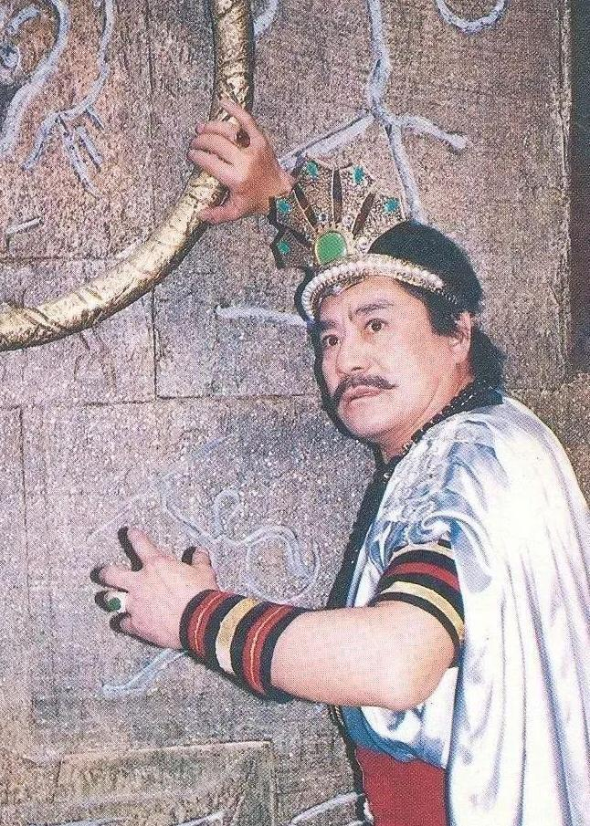

# 媒体：《封神榜》纣王饰演者达奇去世

9月29日，据大澳网报道，著名旅澳华裔电影表演艺术家达奇先生，于2023年9月28日晚上9点58分在墨尔本的医院，因心肺衰竭去世，享年90岁。

资料显示，1990年，达奇曾在古装剧《封神榜》中饰演纣王一角。

9月29日晚，#封神榜纣王饰演者去世#话题登上社交平台热搜榜第一，网友纷纷表示悼念，有许多网友表示，达奇饰演的纣王是“最经典的纣王”，“无可替代”。

文字 | 记者 刘媛元

责编 | 邵梓恒

