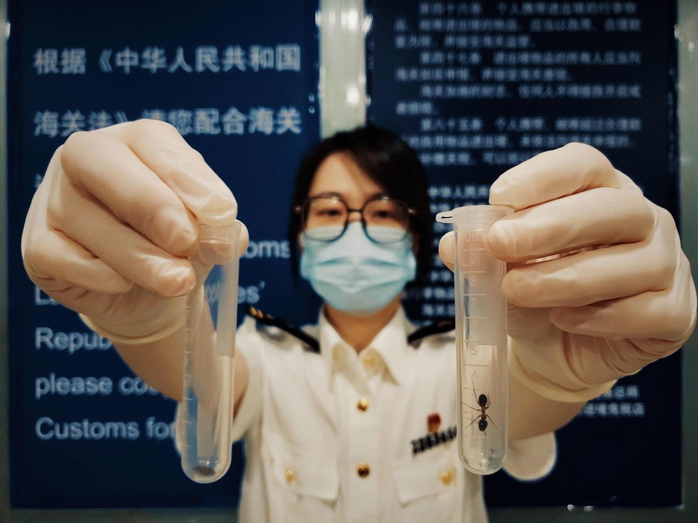
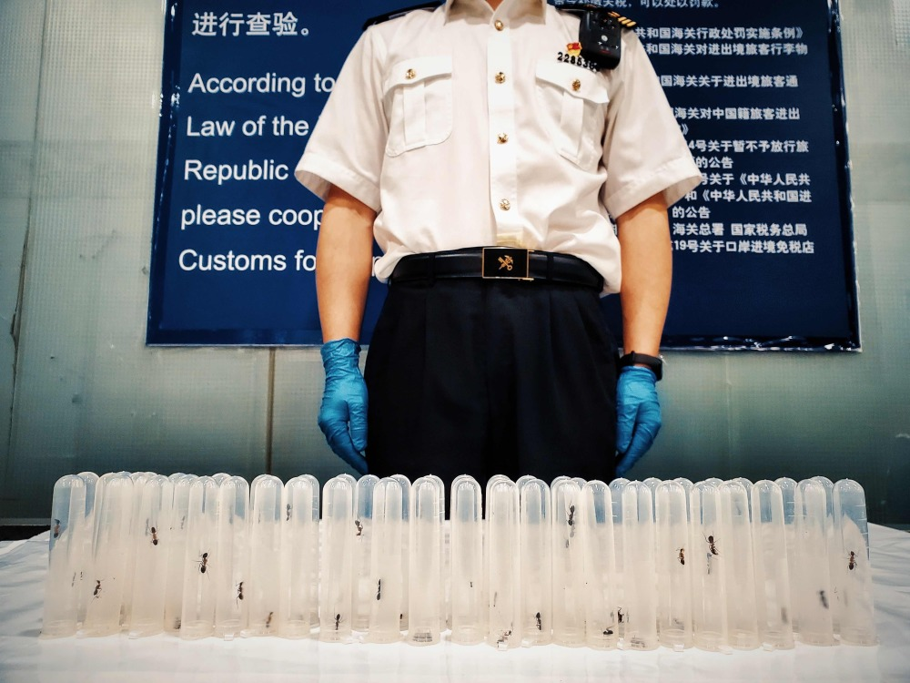

# 水果入境检出活体昆虫49只，被上海浦东机场海关依法销毁

_上海浦东国际机场海关在入境旅客携带水果中截获活体昆虫49只。上海海关供图_

近日，上海浦东国际机场海关关员在对一架次入境航班开展监管时，发现一名旅客携带的手提行李机检图像异常，存在携带动植物及其产品的嫌疑。现场关员随即实施拦截，经过彻查，发现其包装袋内有山竹、龙功果等水果，且水果内有活体昆虫爬动。经捕捉清点，共捕获疑似蚂蚁、鼠妇等各类活体昆虫49只。经鉴定，截获的蚂蚁品种为杂色弓背蚁、平和弓背蚁。目前，截获的水果与活体昆虫已按规定被依法销毁。

 _上海浦东国际机场海关在入境旅客携带水果中截获活体昆虫49只。上海海关供图_

