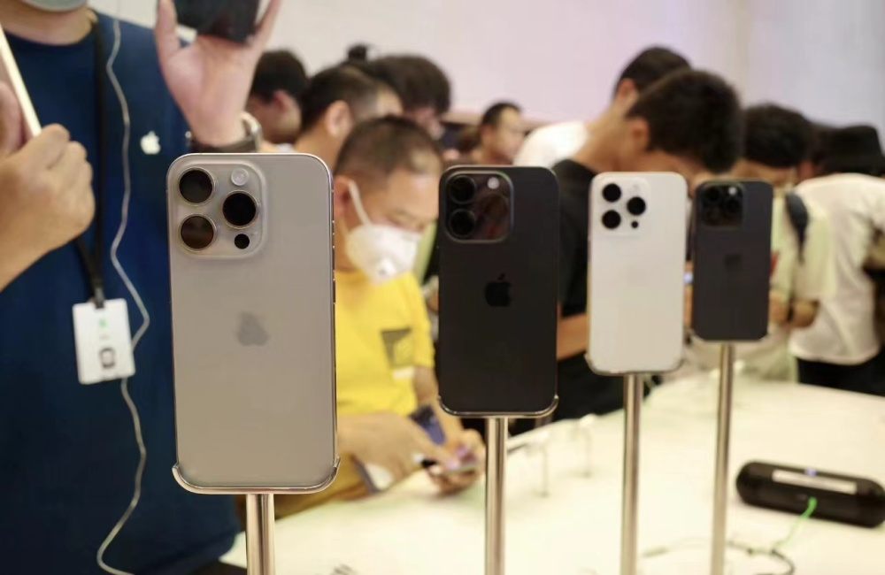

# 用户抱怨iPhone 15 Pro“烫得握不住”？航空级钛金属也有缺点

随着越来越多的用户拿到苹果iPhone 15系列机型，相关的使用问题也逐渐暴露出来。用户对新款iPhone 15 Pro和Pro
Max机型过热的抱怨较多，还有用户在苹果iPhone的官方社区论坛上声称，钛金属壳太热导致无法握住。

一位用户在苹果官方论坛上写道：“我买了新款iPhone 15 Pro，它太热了，烫得拿不动。我可以把它长时间放着充电吗？”
该问题得到了上百位用户“我也是”（me too）的点击。

在社交平台X和Reddit上也有关于苹果iPhone 15 Pro系列过热的用户投诉。苹果论坛上还有人晒出手机边上的温度计显示温度为44摄氏度。

苹果公司方面尚未对手机过热的问题作出官方回应，也未在官方论坛对用户的问题进行公开反馈。

不过该公司的客户支持页面指出，设备在进行首次设置、无线充电或用户使用图形密集型或处理器密集型应用程序（例如游戏）时可能会变热。

其实不仅仅是iPhone 15 Pro有过热的问题，iPhone 14 Pro及Pro Max也有类似的过热情况。iPhone 15
Pro系列外壳使用的是钛金属，相较于iPhone 14
Pro的不锈钢金属而言更加轻薄，尽管两者在导热方面的性质类似，但由于钛金属的材质更轻，吸热也更少，这导致iPhone 15
Pro用户对散热不良的感受可能更为显著。

根据苹果官方网站介绍，iPhone 15 Pro和iPhone 15 Pro
Max，采用质地坚固和轻盈的航空级钛金属打造，带来苹果有史以来最轻盈的Pro机型。这也成为该公司在推广今年新款iPhone Pro机型的一个大卖点。

天风国际证券分析师郭明錤在X平台上特别指出：“iPhone 15
Pro系列的过热问题与台积电的3纳米芯片制程无关。”他表示，过热问题很可能是“苹果为了手机重量更轻而对散热系统设计作出的妥协，比如散热面积更小，采用钛合金影响散热效果”。

郭明錤认为，苹果可能会通过软件更新来解决这个问题，但除非是通过调降处理器的效能，否则对散热效果的改善可能有限。他还表示，如果散热问题不得到解决，可能会影响iPhone
Pro的销售。

iPhone维修网站iFixit公司的测试显示，采用钛合金外壳的iPhone 15 Pro与不锈钢外壳的iPhone 14
Pro在导热方面的性能都不如iPhone 14和iPhone 15基本型号使用的铝合金材料，但苹果可以通过降低手机处理器的峰值性能，来减少手机产生的热量。

CCS Insight首席分析师本·伍德（Ben
Wood）认为，即便苹果进行软件更新限制处理器的峰值性能，绝大多数手机用户是不会注意到这些性能的变化。他还表示，从过去的惯例来看，过热问题将不会导致苹果手机的召回。

苹果的高端iPhone Pro机型是近年来该公司维持手机高毛利的主要产品系列。市场预测也显示，Pro机型的需求从iPhone
14发布起就大幅增长，出货量甚至超过了基本款，尤其是在中国、印度等新兴市场的增速迅猛。

第一财经记者查询苹果公司中国官网发现，iPhone 15 Pro的发货周期较上周有所缩短，目前下单，预计发货日期为2-3周；但iPhone 15 Pro
Max的预计发货日期更长，为5-6周。相比之下，iPhone 15基本款则无需等待。

券商韦德布什表示，苹果iPhone 15系列的早期预订订单大部分来自iPhone 15 Pro以及iPhone 15 Pro
Max，这对苹果是一个利好，因为Pro系列的平均售价（ASP）更高，有利于提升公司的利润率。该公司预计苹果iPhone
15系列的ASP将在925美元左右，较去年同期高出约100美元，其中Pro Max机型涨价9%，也是5年来首次涨价。

