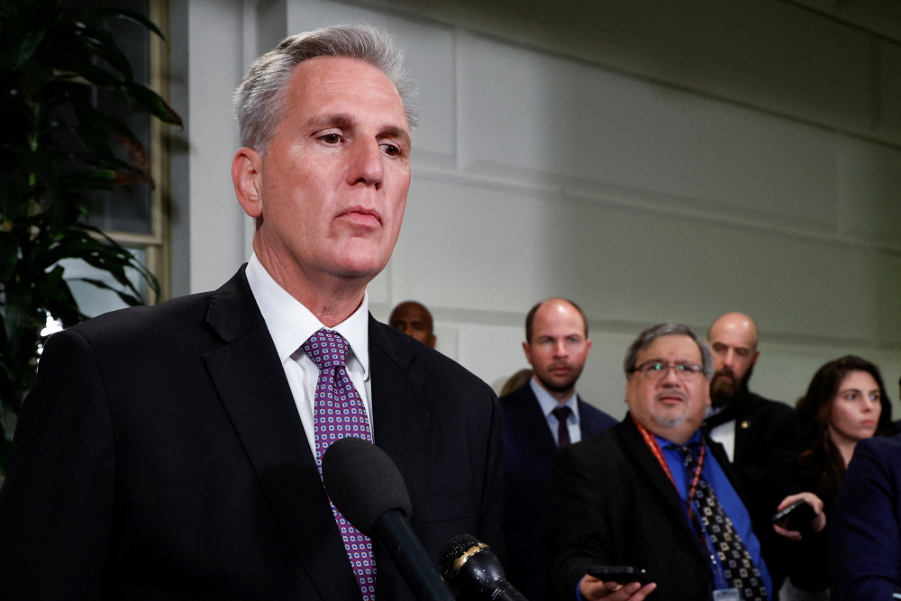

# 美众议院议长麦卡锡提案被否决 外媒：美政府停摆“几无悬念”

**参考消息网9月30日报道**
据新加坡《联合早报》网站9月30日报道，美国众议院议长麦卡锡提出让政府在10月1日停摆大限之后保持运作一个月的计划，遭强硬派共和党人否决，美国联邦机构从10月1日开始局部停摆几乎没有悬念。

综合路透社和彭博社报道，麦卡锡的提案包括削减支出，并实施移民和边境安全限制，这些是共和党的优先事项，但在民主党占多数的参议院，提案获得通过的机会微乎其微。

报道说，众议院9月29日以232票对198票的表决结果，否决将政府资助延长30天以避免政府关门的法案。其中，21名共和党人加入反对这项法案的民主党阵营，对麦卡锡来说颇为尴尬。

此次投票失利，可能会推迟与总统拜登和民主党掌控的参议院就解决方案进行的最终谈判。

这也让民主党人可以更方便地把政府关门归咎于共和党引发的混乱局面。

报道指出，随着投资者聚焦于高利率、油价上涨、劳工罢工和消费者支出放缓，金融市场基本上没有理会日益上升的政府关门风险。但这场冲突引发对美国政府功能失调的担忧，贝莱德公司总裁拉里·芬克痛批美国政客任由政府停摆，“荒谬”“非理性”，破坏了美国在投资者心目中的地位。

芬克29日在柏林全球对话会议上说：“你们能想象客户跑到银行说，我不会还房贷吗？我的意思是，这不就是我们正在做的吗？这是荒谬的，这是不对的。”

除非美国国会在10月1日新财年开始前通过权宜支出法案，否则美国政府很快就会再次陷入停摆。

另据报道，美国白宫经济顾问莱尔·布雷纳德说，若美国联邦政府在10月1日新财年开启时停摆，对富有韧性且通货膨胀趋缓的美国经济来说是“不必要的风险”。

路透社报道说，布雷纳德29日告诉美国消费者新闻与商业频道，避免政府资金断裂的决定“完全掌握在众议院，特别是众议院共和党人手中”，经济面临的风险包括现役军人停薪、空中交通延误，以及美国穷人无法获得政府福利。

她认为，政府停摆会给政府雇员带来损失，因为他们将被要求在没有工资的情况下为美国人民提供“基本服务”。

美国2023财年将于9月30日结束，如果届时没有任何财政预算方案，美国政府将面临停摆。据了解，美国国会新财年全面支出法案包含12项拨款计划，为政府各个机构提供资金，但出台法案过程耗时。因此，国会通常会先通过一项临时拨款法案，以维持政府机构继续运转。

