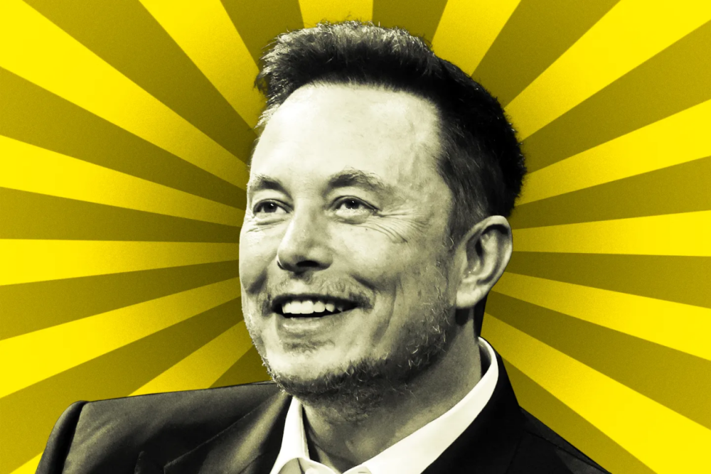
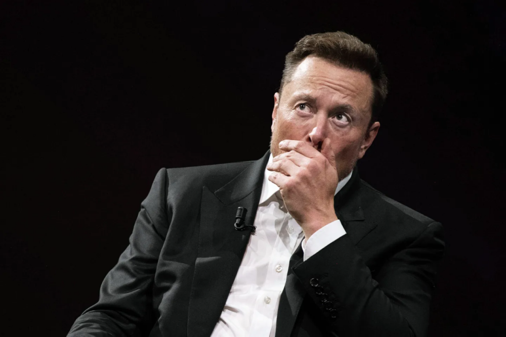

# 马斯克真能拯救世界？不要继续被他骗了，看看他给地球带来的污染吧

**划重点：**

  * _1_ 马斯克从小就对超级英雄非常迷恋，长大后他极力将自己塑造成漫画人物，让人们相信他有能力单枪匹马拯救世界！
  * _2_ 马斯克向来以超级环保者自居，他帮助拉开了电动汽车时代的序幕，努力帮助推广太阳能电池板等可持续发展能源。
  * _3_ 然而，马斯克是世界上碳排放最高的人之一，他经常乘坐私人飞机，去年排碳约2000吨，是美国人均年排放量的130倍。
  * _4_ 马斯克并没有带领我们朝着减少旅行或更多乘坐公共交通的方向，发射火箭可能是任何对地球大气造成污染的最糟糕行动。

地球正面临着迫在眉睫的威胁，除非我们做出改变，否则我们所熟悉的生活方式将无以为继。那我们该怎么办?大多数人会说，我们必须竭尽所能，通过限制人类活动的有害影响来防止这种惨淡的局面。环保主义者指出：“我们没有第二个地球。”

然而，如果问亿万富翁埃隆·马斯克(Elon
Musk)这个问题，你可能会得到截然不同的答案。2021年SpaceX火箭发射进入轨道时，马斯克就曾说：“我不想人类只作为单一星球物种，而是成为多星球物种。”他补充说，他对SpaceX在不久的将来将人类送上火星充满信心。

这种心态类似于氪星科学家、DC漫画中超人之父乔·艾尔（Jor-
El）的想法：当你生存的星球发生爆炸时，把你的后代送入太空舱，以确保你的物种在银河系其他地方能够继续繁衍。事实上，马斯克似乎从来没有放弃他童年时对超级英雄的迷恋，这些人可以进行星际穿梭。

**01 在超级英雄身上寻求寄托 自认为单枪匹马就能拯救人类**

马斯克在南非比勒陀利亚长大，他在一部纪录片中说：“我读了所有我能找到的漫画，甚至包括书店里允许我读的漫画。”在这些故事中，超级英雄们战胜了地球上和更遥远地方的邪恶力量，人类有能力和其他物种隔着遥远的星系对峙。

我们今天所知道的马斯克是个成功的企业家，人们对他的态度有爱有恨，他正把自己塑造成上述虚构人物的化身：一个相信自己有能力单枪匹马就能拯救人类的人。他的超级英雄哲学使他与环保主义者意见相左，环保主义者相信集体的力量可以解决人类最大的挑战，而不是任何一个“伟人”的力量。

这是解开关于马斯克一个根本难题的一条线索：一个在电动汽车、太阳能和能源储存方面为推动绿色转型做出如此巨大贡献的人，为什么会受到环保人士的痛斥?为什么气候活动人士放弃了马斯克收购的社交媒体平台，并在他们的抗议活动中嘲笑他?马斯克到底有多支持环保?找出这些问题的答案，可能需要一次穿越时空的旅行。

马斯克出生的1971年，同样是人类的一个转折点。几十年后，全球足迹网络(Global Footprint
Network)的科学家们计算出，这是人类首次超出地球生物承载力的第一年。在美国，人们对雾霾、酸雨和供水污染的认识正在提高。1970年被设定为地球日，美国环境保护局成立，并通过了《清洁空气法》。

但在年轻的马斯克看来，环境问题并不是头等大事。传记作家沃尔特·艾萨克森(Walter
Isaacson)在他最近的《埃隆·马斯克传》中写道，小时候，马斯克被父亲送去过几个“生存集中营”，在那里他不得不为获得食物而战斗，有一次他瘦了9斤。还有一次，他在学校被恶霸欺负得很厉害，以至于住进了医院。

小马斯克在他最喜欢的超级英雄身上找到了解脱，找到了灵感的源泉。他后来接受采访时说:“我的意思是，他们反穿着内裤或紧身铁衣，总是试图拯救世界。”

马斯克也从科幻小说中寻求哲学指导。他告诉艾萨克森和其他人，他成长过程中最喜欢的书之一是《银河系漫游指南》(The Hitchhiker's Guide to
The
Galaxy)，这本书在他8岁时出版。这个具有讽刺意味的故事讲述了唯一一个在地球毁灭后幸存下来的人，以及他在外太空的旅行经历。马斯克在接受采访时回忆道，他从这本书中得到的收获之一是“宇宙就是答案”。

尽管暂时被限制在地球上，但马斯克对新世界，更具体地说是对美国着迷。17岁时，马斯克从南非种族隔离时代的动荡中脱身而出，进入加拿大女王大学就读，当时他母亲有个亲戚就住在那里。马斯克表示，他做出这个决定的部分原因是为了避免在南非军队中服兵役。“谁想在法西斯军队服役?”他说。

马斯克随后转到美国，在宾夕法尼亚大学和沃顿商学院攻读学位，并结束了在斯坦福大学的学术生涯。他被斯坦福大学的博士课程录取，但中途退学，开始创业。

马斯克从未失去过超级英雄心态。正如OpenAI首席执行官萨姆·奥特曼(Sam Altman)最近接受《纽约客》专访中告诉罗南·法罗(Ronan
Farrow)的那样:“马斯克迫切希望拯救世界，但前提是他得能成为拯救它的人。”

**02 马斯克是个超级环保者？去年排碳是美国普通人130倍**

看看马斯克在开发电力和可再生能源技术方面的记录，当然有理由相信，马斯克不仅证明了自己是环保人士，还是个超级环保者。

美国环保署交通与空气质量办公室前主任马戈·奥格（Margo
Oge）在接受《财富》杂志采访时表示:“马斯克应该被载入史册，因为他帮助交通运输行业从化石燃料转向零排放电气化。如果没有他，我们就不会取得今天的成就，也不会有数万亿美元资金投资于交通脱碳。”

但在深入研究这些成就之前，让我们先考虑一下马斯克的“绿色”到底意味着什么。从字面意义上讲，马斯克似乎不喜欢绿色。从他的第一家互联网创业公司Zip2，到特斯拉庞大的总部和工厂，马斯克的首选色调始终是单色的：他的办公室内部和工厂外部都使用白色，周围的高速公路和停车场都是黑色的，他制造的汽车是银灰色、深红色或蓝色的，他也不追求其他科技园区拥有的绿树成荫的人行道、原生草地和灌木丛。马斯克追求的只是秩序、效率和可预测性。

马斯克也不是要在环保方面“以身作则”。他是世界上碳排放最高的人之一，这主要是因为他乘坐私人飞机往返于洛杉矶、奥斯汀、旧金山湾区和其他公司办事处所在地之间。最近的一项研究发现，马斯克的喷气式飞机燃烧后留下的燃料痕迹是巨大的，估计去年约有2000吨二氧化碳，约为美国人均年排放量的130倍。

然而，值得注意的是，马斯克在他的亿万富翁同行中仍然只是中度的碳排放者。微软联合创始人比尔·盖茨（Bill
Gates）的碳排放量更高，谷歌联合创始人谢尔盖·布林(Sergey Brin)、拉里•佩奇(Larry Page)以及甲骨文创始人拉里·埃里森(Larry
Ellison)等科技巨头也是如此。在这些人中，游艇排放是罪魁祸首，而马斯克表示他没有时间沉溺于游艇。

在人口增长问题上，马斯克也不赞同大多数环保主义者的观点。去年，他在推特上表示：“低出生率导致的人口崩溃对文明的威胁要比全球变暖大得多。”马斯克告诉他的传记作者阿什莉·万斯(Ashlee
Vance)，当“真正聪明的女人没有或只有一个孩子”时，他会感到特别恼火。这种逻辑可能会让许多人感到惊讶，但马斯克本人就是这样生活的。据报道，他和三个女人生了11个孩子。

如果从效率的角度来看，马斯克对绿色的主张似乎会更有说服力:生产可再生和可持续性发展能源，不会带来开采和消费化石燃料带来的混乱、麻烦和高昂成本。他在特斯拉《总体规划》中提出的宏伟愿景避开了环境焦虑，没有提到气候变化迫在眉睫的威胁，也没有提到采取行动减少人类影响的必要性。

相反，他的计划是务实的，有大量数据佐证，并直接切入工程逻辑，表明化石燃料的问题不仅仅在于它们有害，而且效率低下，容易产生浪费。报告中写道:“可持续能源经济在技术上是可行的，与继续目前不可持续的能源经济相比，它需要更少的投资和更少的物质开采。”

**03 电动汽车真的环保吗？靠一己之改变了人类发展方向**

但实际上，正是旗下公司的技术创新给了马斯克绿色吹嘘的权利，尤其是他在全电动汽车方面所做的事情。2003年特斯拉刚成立时，以及2004年初马斯克投资并成为该公司董事长时，这一领域的前景并不被看好。上世纪90年代，几家公司曾试验过电动汽车和混合动力汽车，但此后汽车行业几乎认定电动汽车无法实现。2008年，当特斯拉推出首款全电动汽车Roadster时，底特律三巨头对此不屑一顾，硅谷媒体则一通嘲笑。2007年，甚至在特斯拉Roadster发布之前，科技行业八卦网站Valleywag就把人们期待已久的特斯拉Roadster列为当年“最失败”的车型。

2012年，特斯拉推出了首款面向大众市场的电动汽车，豪华车型Model
S跑车，每次充满电后可以行驶超过320公里，这让情况开始发生变化。突然之间，大规模生产电动汽车的抽象承诺变成了现实，科幻小说成真了。

在接下来的几年里，特斯拉又增加了几款电动汽车，在全球范围内增加了产量，并在令人感到震惊的转变中成为世界上市值最高的汽车公司，让马斯克成为世界上最富有的人。在马斯克拉开电动汽车时代序幕之后，包括通用汽车、大众汽车、沃尔沃和梅赛德斯在内的汽车巨头，都跟随特斯拉走上了推广电动汽车的道路，尽管他们需要很多年才能实现这一转变。

还有特斯拉能源公司，它是2006年由马斯克的两个表兄弟以SolarCity的名字创立。该公司为美国数十万客户带来了太阳能革命，并帮助可再生能源成为主流。它通过出租(而不是出售)太阳能电池板，向从个人房主到大型企业的所有客户提供太阳能电池板，并通过将租赁重新包装为债券向投资者提供大规模购买的贷款。虽然马斯克不是这家公司的创始人，但他成为了该公司最大的投资者，并因提出了这种商业模式而受到赞誉。2016年，马斯克收购了该公司，并将其与特斯拉相关业务合并为特斯拉能源公司。

通过让绿色科技成为商业上可行的现实，马斯克成为了汽车行业及其他行业其他人效仿的灯塔。马斯克的巨大成功激励了一代企业家。充电公司FreeWire的首席执行官兼创始人阿尔卡迪·索西诺夫（Arcady
Sosinov）承认：“马斯克是我进入这个行业的最大动力。”

波音公司首席可持续发展官克里斯·雷蒙德(Chris
Raymond)表示，航空业正在等待马斯克到来的时刻。他说：“这将是一个激动人心的时刻。现在，越来越多的人被这个行业所吸引，就像马斯克一样。”

不管你是否认同对马斯克进行“伟人式”的历史解读，他都几乎成了最佳例证，说明了一个人可以通过做些什么来改变我们这个物种的发展方向。尽管马斯克经常违反政府规定(比如管理SpaceX发射的安全规定)，但法罗在《纽约客》中表示，马斯克本人已经成为了一种准政府人物，比如将美国宇航员运送到国际空间站。

**04 可持续能源、殖民火星都是幌子？**

正是出于这个原因，我们有必要研究一下马斯克的心态，也就是一直激励着他的信念。如果马斯克改变了我们社会的方向，那么我们将走向何方?

我们并没有朝着减少旅行或更多乘坐公共交通的方向前进。全球汽车销量预计将在2023年反弹至疫情前的水平，而在美国，2019年(可获得人口普查数据的最近一年)，乘坐公共交通工具上下班的人口比例仍停留在可怜的5%，85%的人乘坐汽车、卡车或面包车上下班。对于马斯克和特斯拉来说，理想的移动方案仍然是美国人钟爱的个人机动车辆，尽管增加了电动传动系统。

虽然特斯拉的电动汽车目前以环保绿色汽车自居，它们在使用寿命期间排放的二氧化碳比燃油汽车少得多，但它们并不比步行、骑自行车或乘坐公共交通工具更环保。环保人士还指出，用于制造电动汽车的材料的提取本身就会造成巨大的破坏，而且电动汽车的绿色环保程度取决于它所使用的电网的能源来源。

十年前，马斯克似乎考虑带领他的隧道施工公司The Boring
Company进入公共交通领域，当时他在考虑创造一种“超级高铁”，一种地下悬浮超音速列车，可以960公里的时速将数百名乘客从一个城市运送到另一个城市。然而，多年来，这个想法似乎已经失败了。现在，The
Boring
Company已经将重点转移到超高速个人车辆旅行上，而不是停靠在车站的高速客运列车。该公司在其网站上解释说，这个内部绰号为“隧道中的特斯拉”的Loop项目将是“一个快速公共交通系统，更像是地下高速公路，而不是地铁系统”。

如果你对绿色未来的愿景是拥有更少汽车和停车位的步行城市，那么特斯拉并没有引领这一目标。单独的电动汽车可能不会像燃油车那样排放那么多的二氧化碳，但它们仍然笨重、危险、效率低下，而且它们的扩散分散了对城市景观和交通方式进行更彻底转变的需要。

即使电动汽车可能成为打造清洁交通的灵丹妙药，马斯克也不赞成目前让电动汽车更快上路的激励措施。他反对乔·拜登(Joe
Biden)总统的《2021年通货膨胀削减法案》和其他法律，这些法律向电动汽车行业注入了数十亿美元的税收抵免和补贴，尽管他的公司已经获得了数十亿美元的纳税人贷款、补贴和政府合同。

这种对政府投资的抵制让前环保署局长奥格感到困惑，他在1994年至2012年期间负责领到该机构的交通和空气质量办公室。她说：“在2018年，我会说‘马斯克为保护环境做了这么多，他真的很注重环保，他相信绿色投资。’但现在，我不知道他相信什么了，我不知道我们说的是不是我记忆中奥巴马时代的那个人。”她认为，也许马斯克已经成为了“自由市场的领导者”。

此外，马斯克还雄心勃勃地想通过他的火箭公司SpaceX让人类成为多行星物种。在马斯克的脑海中有一颗“B星球”:马斯克曾说过，他真的想搬到火星上去。他去年向英国《金融时报》表示：“特别是如果我老了，我会这么做。何乐而不为？”马斯克并不是唯一一个拥有超人抱负的亿万富翁，但SpaceX是第一家成功将航天器送入轨道并将其送返地球的私营公司，也是第一家发射载人航天器与国际空间站对接的公司。

当然，马斯克的星际野心正在对地球造成严重的环境破坏:发射火箭可能是任何对地球大气造成污染的最糟糕行动。尽管它们的发射数量有限，迄今为止使它们免受适用于其他运输方式的监管限制。SpaceX的猎鹰9号火箭在不到3分钟的时间里排放的二氧化碳，比一辆普通汽车25年排放的二氧化碳还要多。

《没有B星球》一书的作者迈克·伯纳斯-李（Mike Berners-
Lee）在接受《财富》杂志采访时表示:“就环境影响而言，很难想象有比太空发射更不环保、更不负责任的行为方式了。”

伯纳斯-李也对前往火星的想法嗤之以鼻。他说：“你还不如住在铀矿底下，这是一种消磨时间的可怕方式。”

至于在遥远的星系中寻找另一颗宜居行星，伯纳斯-
李指出，研究表明，最有可能的候选行星至少在4光年之外。即使在最乐观的情况下，这也意味着需要大约40年的太空旅行，而且也不能保证成功。

伯纳斯-李说:“任何亿万富翁把多余的钱浪费在这种荒谬的自我放纵的爱好上，都是极其自私的。这说明他们根本不关心人性。”

**05 一个超级英雄无法拯救全人类！**

这给我们带来了什么?综上所述，马斯克有多支持环保？我想说的是：在一个长期停留在20世纪技术的世界里，马斯克的到来就像一道绿色闪电。他改变了能源和交通现状，证明了一个更环保的未来是可能的，比任何人之前想象的都要简单。但马斯克是否会被生活在22世纪或以后的人视为一股环保力量，仍是一个悬而未决的问题。

人们很容易想象，小时候看漫画的马斯克长大后会变成什么样。从某种意义上说，他是一个活生生的证据，证明了一个企业家在资本主义经济中可以取得多大的成就，以及在纯粹的意志力面前几乎没有什么障碍。无论是发射火箭还是大规模生产平价电动汽车，马斯克这位天才工程师都把不可能变成了可能。马斯克这位英雄企业家几次站在破产的边缘，但几乎同样多的时候，他要么通过超凡的职业道德，要么把最后数百万美元投入到看似不可能的登月计划中，其中许多项目都获得了丰厚的回报。

但让我们明确一点:马斯克并没有拯救世界。考虑到能源经济转型所面临的巨大挑战，到目前为止，他在绿色科技方面的成就仍只起到了很小的作用。尽管马斯克做出了贡献，但全球二氧化碳排放量仍在以惊人的速度增长。化石燃料的开采和燃烧仍在加速进行。气温已经比20世纪的平均水平上升了大约1摄氏度，而且还在继续上升。前所未有的风暴肆虐，世界各地的森林还在被烧毁。

当然，马斯克大胆地做了以前没有人做过的事情，而且有几次他从失败的深渊中夺取了胜利。但他与超人和钢铁侠的比较也就到此为止了，毕竟超级英雄还可以扭曲现实，穿越时空，并使用魔法超越物理上的可能。而这些马斯克都做不到。

也许正是我们，作为一个社会，我们需要放弃任何超级英雄或技术创新改变气候变化现状的幻想。为了解决人类面临的危机，技术创新是必要的，但还不够。个人和集体的选择、政府政策和国际协议构成了拼图的其他部分。

每个人都有缺点，不管他们多么有创造力或远见卓识。马斯克也不例外。即使他是一个完美无瑕的超级英雄，我们也需要不止一个超人来实现绿色转型。我们需要一个拥有更多超级英雄的宇宙。或者更好的是，整个人类物种都致力于实现这个目标。（文/金鹿）

