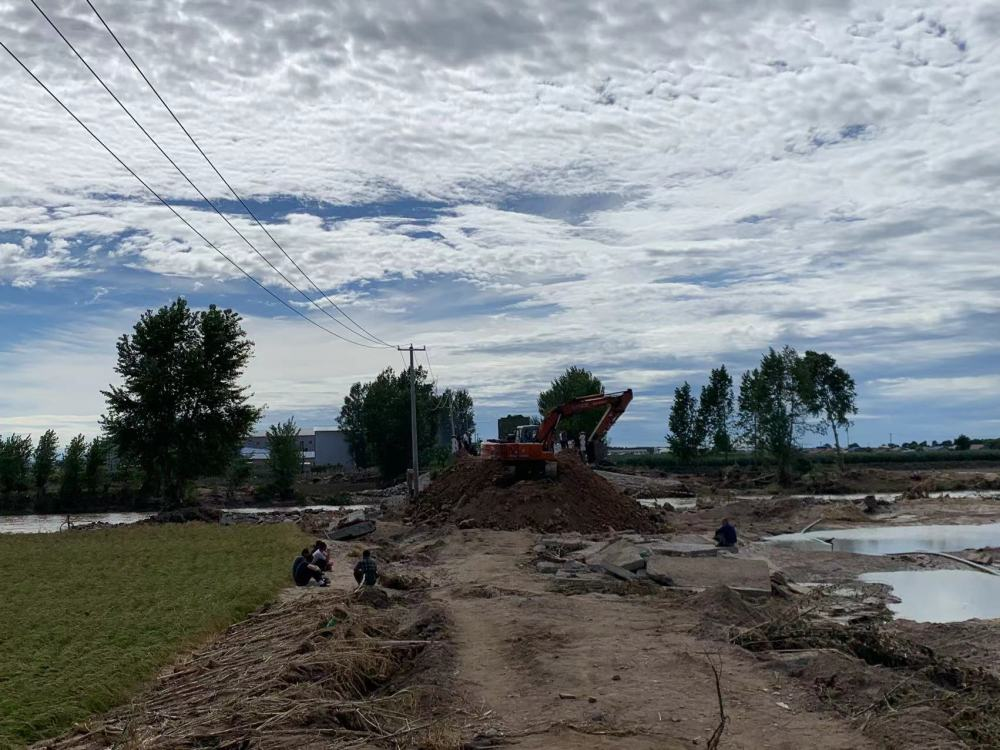
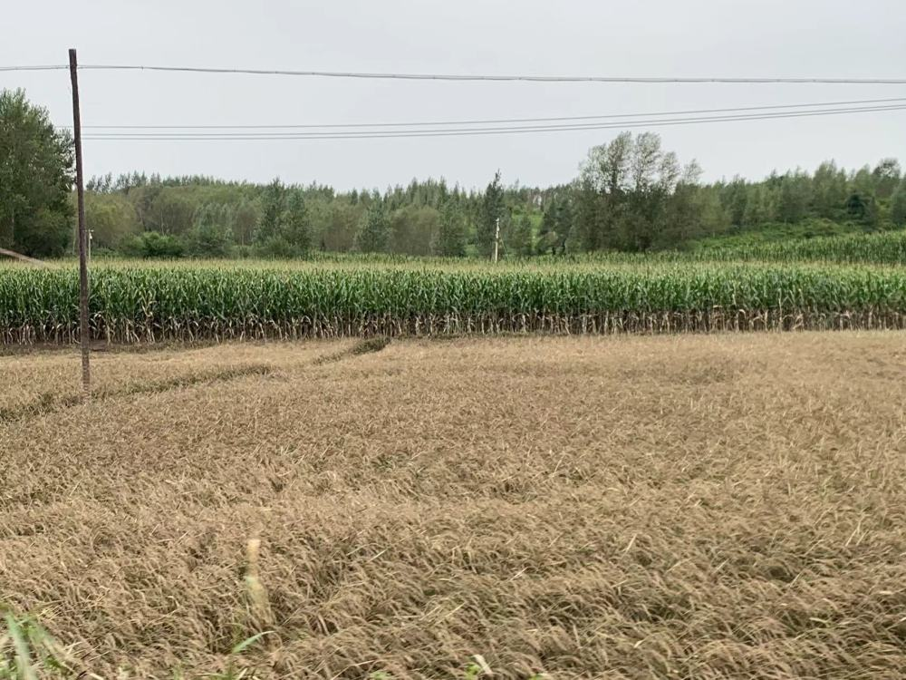
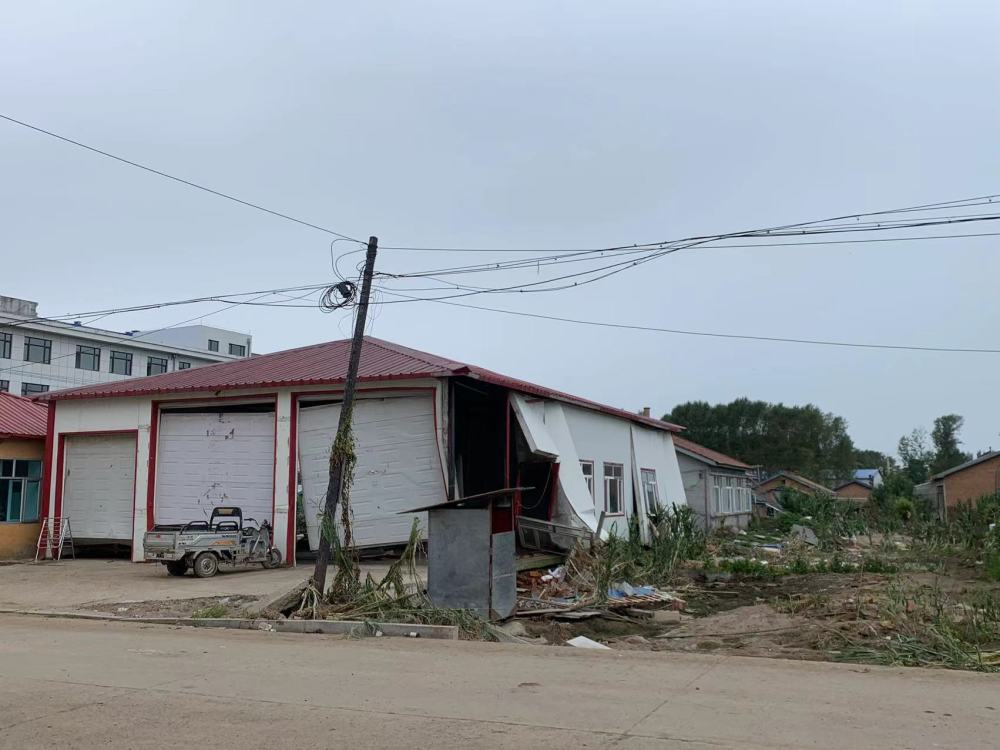
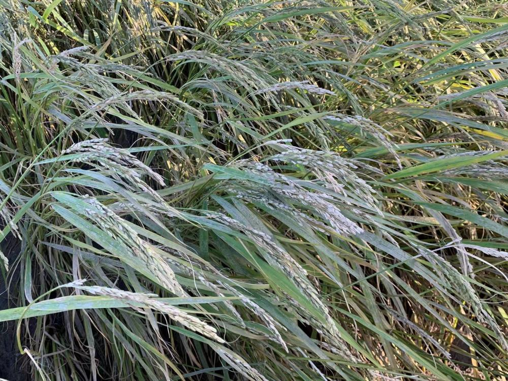
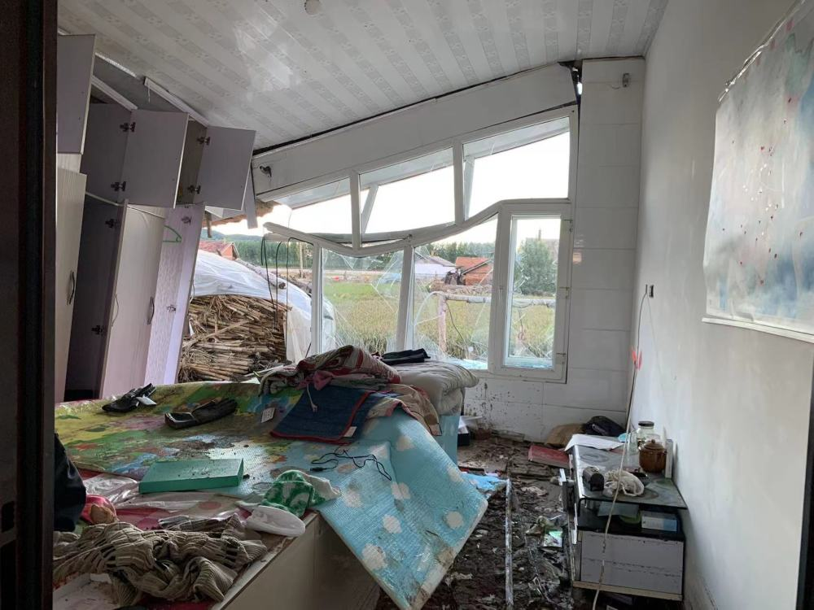
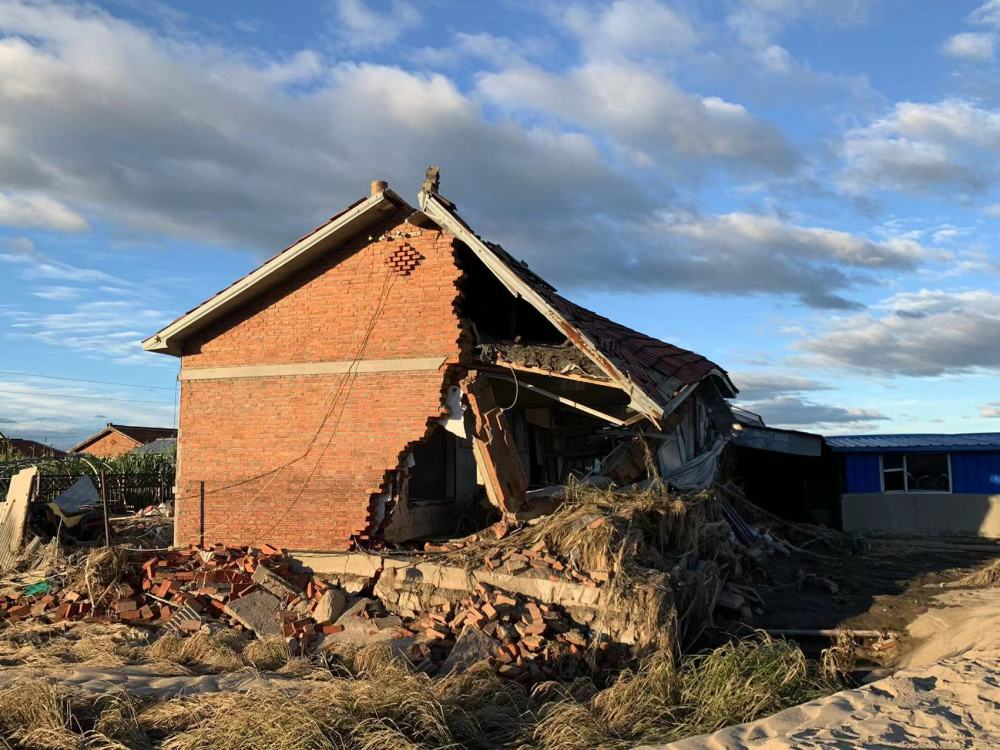
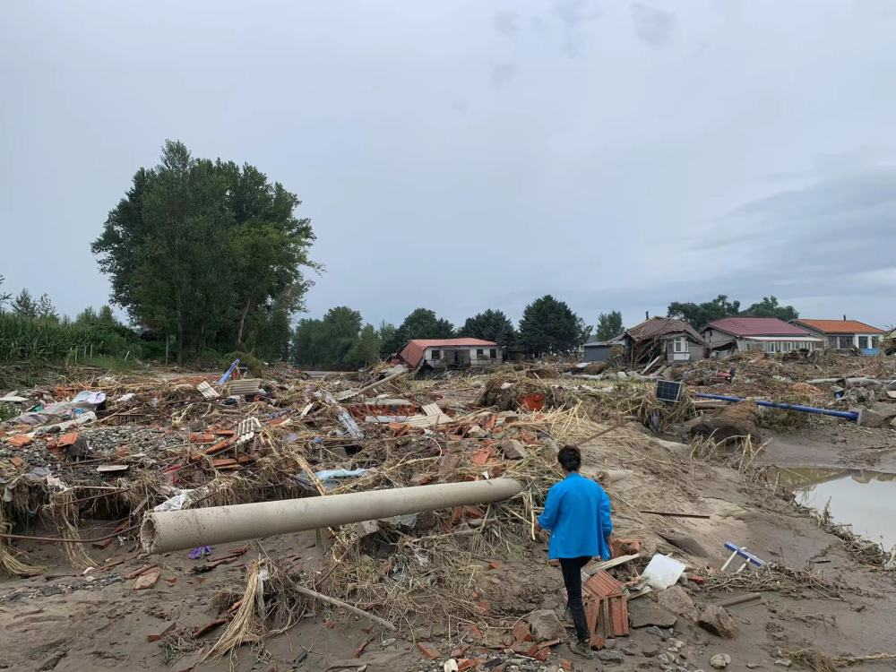

# 黑龙江五常经历暴雨后：稻米又到秋收季，村民称“比设想中有盼头”

秋分到了，在黑龙江省五常市，这是一年中最重要的时节，水稻开镰收割。

大米是五常众所周知的金字招牌。2022年，五常大米收入110多亿元，稻米产业经济效益全国第一。今年，五常大米的品牌价值攀至713.10亿元。但和往年不同，受台风“杜苏芮”影响，刚过去的夏天，五常经历了一场罕见洪灾，当地水稻种植面积约250万亩，超过100万亩稻田不同程度受灾。

五常洪灾后，界面新闻曾实地探访受灾乡镇，不少农户在灾后困于无助，认为彻底失去了今年的收成。秋收季节，五常还是五常。

龙凤山镇的鲁凤英说，这个秋天"比她设想中有盼头"，她发现自己仍有半数农田可收割，正急迫地寻找买家。向阳镇的王海燕打算让稻米加工企业收割家里长势良好的稻田，她说，一亩地产量一千二三百斤，收购价在3200到3500元不等。“算下来，收购价格比去年稍高了一点。”2022年的水稻收购价相比往年已是较高，均价为2.6元/斤。

五常大米的盛誉，让它相比周边其他受灾市县更多地受到媒体关注，随着积水退去，他们在8月中旬后渐渐远离公众的视线。人们曾经担心这场洪涝灾害甚至波及到自己的餐桌，但实际上，五常水稻的种植面积在全国稻谷播种面积中所占比重甚小，不到0.6%。这种担心也很快消散。国家统计局8月23日披露的数据显示，今年仅是全国早稻总产量就有2833.7万吨（566.7亿斤），比2022年增加21.5万吨（4.3亿斤）。

对于五常的农户来说，罕见暴雨带来的洪水灾害发生了，他们承受而后接受它。时光流转，秋收春种，一切如常。

**1.**

一个月前，鲁凤英从地里摘回来两株稻子，一株枯黄，稻粒空瘪，开着口，一株沾满泥，稻穗摸着干硬。“投里10多万，一点儿得不着。”稻子扔地下，跟土是一个色。“今年难活了。”鲁凤英说。

杨军光着膀子在院里拾掇，“稻秆淹了没事，穗儿别挨淹就行。”他比划着，他的稻穗全淹了，“淹得时间还长，挂上泥挂上水锈，阳光照不进去，它就不灌浆。”灌浆是水稻生长中最重要的环节，胚胎完成发育，米粒在颖壳中长成。杨军嘴上长泡，急的，但没招。原本洒药、追肥的时节，他天天往村口河沿去，看被冲垮的桥重新垫好。不少人都在那看桥，前一天，桥下河里还飘猪。

 _村民们在等被冲垮的桥修好。高佳摄_

鲁凤英和杨军是黑龙江省五常市龙凤山镇常堡村人，两口子50多岁，今年8月，他们第一次经历水灾。几年前，地里也淹过一次，那是因为部分田地低洼，靠着牤牛河，那次的损失可以承受。这回，他们承包的70大亩约170公亩地，整个在水里泡了五六天，“淹完了。”

雨是8月2日开始下的。台风“杜苏芮”残余环流携水汽北上，8月2日9点到3日8点，黑龙江省气象台连续发了8次暴雨红色预警。这种最严重级别的暴雨预警，意味着3小时内降雨将达100毫米以上。100毫米和五常整个6月份的降雨量大概相当。

8月2日夜里，常堡村要求村民转移，鲁凤英没走。雨势变大的时候，她拿了10多升的塑料桶，放在房檐下接雨水，3日一早，桶里水满了，她还是很难预测随着雨水而来的危险。

五常市东南半边高，西北低。从地图上看，它像一条从哈尔滨游往长白山的鱼，尾巴扫过松嫩平原，鱼脊融入山林。山林适度遮挡了东南风，松嫩平原的暖流从西部直接灌入，五常就形成浅山高平原盆地小气候。这里日照时间长，活动积温高，昼夜温差大，因此能长出中国最好的水稻。

水是自然赐予的另一项礼物。拉林河和它的支流牤牛河贯穿全境，充沛优质的地表水给五常的250万亩稻田提供了自流灌溉的可能。

常堡村在龙凤山脚下，沿着牤牛河支流展开。发源于长白山支脉张广才岭的牤牛河，上游是黑龙江省的暴雨中心之一。1958年，河流中游开始修建龙凤山水库，水库规模当时为全省最大。

8月2日晚上，有不少人都没离开常堡村。一名70岁老人说，他没见过牤牛河发水灾，因此并不担心。根据公开资料，1991年7月，牤牛河流域普降暴雨，龙凤山水库发生了历史上第1位大洪水，降雨产流量3.81亿立方米，库水位达到226.74m。至于那次水库的泄量，已无法查知具体数据，但资料显示“该水库发挥了重要的拦洪效益，对下游防洪和保护人民生命财产起到了重要作用”。

 _洪水冲倒的稻田。高佳摄_

雨没有要停的意思。五常市防汛抗旱指挥部办公室发布消息，龙凤山水库8月3日2时30分加大泄流。3日下午，黑龙江省气象台又连续发布5个暴雨红色预警信号。鲁凤英眼瞅着水从门前路面涨到房子墙跟，3日晚饭后，她和丈夫决定开农用车赶去她的娘家，夜里，他们又连跑两个屯子投奔亲戚，仍然是不放心，8月4日中午开车上了山。

龙凤山水库泄流从500-600立方米/秒增至1200-1800立方米/秒。常堡的人几乎全部撤离，农用车在山上排队，人们晚上在车斗搭帐篷睡觉。

8月6日，杨军划橡胶圈回到屯子，7日，水消了，鲁凤英去看她的田，不光水田，旱田也淹完了。“草啊、树啊把苞米全冲倒了，堆着跟山似的。”她在屋里躺了几天，想不出补救的办法。杨军说，等把地里收拾完，秋天俩人上外地打工，明年10多万的本钱还得挣。鲁凤英说行，“就指这点地，（不管）咋的也得年年种。”

**2.**

“房子和地，就跟生命一样。”向阳镇建国村的王海燕40多岁，她想说明事情的严重程度。“就是生命。”她说。

王海燕家种了8垧约120公亩地，一半绝收。这方面，街坊邻居情况都差不多，让她难过的是，她的房子地势低，水差10公分就淹到窗户顶，又因为淹得时间长，去年刚装修的房子，现在底部开裂了。

向阳镇在向阳山下，拉林河边，和吉林省舒兰市的金马镇隔河相望。拉林河是松花江大支流，也从长白山张广才岭发源，是黑吉两省界河。它和它的支流牤牛河从高山奔腾至五常市北相交，交汇处被五常本地人认为是最优质的大米产区。

河面宽，水流慢——向阳山脚下，在河边居住的村民对拉林河是这样的印象。雨水让安静的河边小镇变得混乱。8月3日凌晨4点，王海燕接到亲戚电话。“水可大了，要进屯子了！”电话里说，“得给我孩子和媳妇拉你家去！”

亲戚住在2公里外拉林河南，把他们接来过了一晌，8月3日中午，王海燕看见本村微信群里的消息，几百米外水电站院里，水也涨到人的小腿。

_拉林河边的稻田。高佳摄_

8月3日晚9点39分，建国村的微信群里，村支书发出关于磨盘山水库泄洪的通知。磨盘山水库是目前五常境内最大的水库，建在拉林河干流上游。水库兴建于2003年，承担着哈尔滨市300多万人的饮用水供水任务，兼顾防洪、灌溉等功能。

长久以来，王海燕还有她的邻居们和磨盘山水库之间的关系非常简单——在水稻播种、插秧的季节，水库保障他们的田地灌溉。这是她第一次把水库和洪水联系到一块。村支书在群里说：“所有村民，磨盘山还在泄洪，今晚睡觉都精神一点，今晚是关键一晚，必要时准备好撤离，希望大家打好十二分精神，千万千万！”

躲避洪水对建国村村民来说是完全陌生的体验。10点24分，村支书嘱咐：“各大伙都准备准备，把有用的东西或者带的东西，准备好喽。咱们一旦要撤离的话，咱们拿了就走。”11点09分，群里来了一声短促地通知：“撤离！”

晚上11点56分，村民吴建林离开家，把媳妇孩子送上了向阳镇东北面的东山。4日凌晨，他返回向阳镇收拾农机具，街上的水没过人的膝盖。“还没等收拾完，这水就来了劲了，我忙跑到路边学校楼上去。”他说：“没到半俩小时，这街里就沦陷了。”

据《黑龙江日报》报道，8月3日晚11时30分，磨盘山水库水位达到318.57米（汛限水位317米），入库流量2330立方米/秒，达到水库超100年一遇洪水（2100立方米/秒）标准。8月4日早5时，水库水位超汛限3.5米，入库流量3522立方米/秒，7时30分，水库防汛指挥部决定实施建库以来的首次敞泄（提起闸门自由放流），最大泄量为1100立方米/秒。

8月4日早上，水涨得最高。吴建林看见邻居家用彩钢棚搭的车库被冲得倒向一边，他那辆2.8吨重的农用车，原本停在路上，等水褪了，发现断成两截，车尾被甩到5米外的泥坑里。

_向阳镇街上，被水冲歪的车库。高佳摄_

**3.**

“我是农民我骄傲，我为国家种水稻。”吴建林又叫大林，黑瘦，个头不高，有典型的东北人的乐观，“种水稻真刺激，看看我这张脸，30多岁的脸，看上去有点像50了。”

大林农忙时种地，农闲时捕鱼。为了宣传自家的五常大米，他拍短视频记录春种秋收的过程。阳光、温度、水都有不确定性，每一季稻谷，成长中也总会经历些“磨难”。比如，去年插秧的时候，拉林河没水了。今年该播种育苗了，温度却异常低。

今年播种在4月20日前后，五常的气温接近0度。稻苗挨冻发黄，大林跟着上火，“宁可我感个小冒，别让它出点啥事儿。”捱到天气转暖，5月中旬终于能插秧，大林开始“带月荷锄归”。进了6月，水稻长势喜人，大林放下心，高兴地赞美拉林河：“就咱们这个水源呐，有多少人羡慕不已，取之不断，用之不绝。”按往年记录，接下来稻子开始拔节，7月底能长到人腰那么高，绿得发亮。8月一抽穗，绿意里添点黄色，从高处看，稻田就像一块柔软的蛋糕。

如果跟去年一样，9月底，整个五常会迎来丰收。2022年9月25日，大林拍摄了自己挥镰割稻的场景，脸上的笑从头挂到尾，“我真是当农民这块料啊。”他感叹。但今年6月以后，大林的视频没再更新。

暴雨过后，大林花了几天时间清理完房子里十几公分厚的淤泥。“乡镇里都上水，何况地了？田始终在低洼处，家家都如此。”他说：“向阳街里有两个做买卖的，剩下基本上都靠农田维持生活。这一淹，3年都缓不过来。”

前些年，村里大聪的六七亩地糟了淹，大林记得，不早不晚，也在最关键的杨花抽穗期。往年一亩稻田能产粮1000来斤，“淹完之后，他雇直收打了三袋稻子，400斤，都不够直收费用钱。”

 _洪水泄后，稻子上挂着泥，稻穗呈灰白色。高佳摄_

100米外的王海燕家地处低洼窄巷，被水浸泡了一周，俩水泵抽了三天，门前水才泄完。洪水过后，跟她有知心话的，是60多岁的邻居大姨王琴，抽水由两家协作完成。

“剩一旮红布没舍得扔，让我系大门上了。”王琴向海燕倾诉：“被子淹得实在不能要，扔了，衣服还能洗，都没扔。”王琴丈夫70岁，在别人田里帮工，一年挣一万多块钱。

她家里放的350斤大米被淹完了，天热，泡过水的米，手一摸跟面似的。人们对水灾没有统一的度量，大家同时觉得，生活被摧毁的程度已经到了自己接受范围的底线。“我们是受灾最严重的。”王海燕和王琴说。

另一边，在牤牛河沿岸，洪水过去一周，天气晴朗，河边浅滩的沙地又细又软，蔡家街屯的村民刘力文说，沙地下就有他的田，用手拨开，能看见稻穗。

刘力文40多岁，一米八几的个子，穿一件跟他身形不搭的带卡通图案的短袖。他家的田在牤牛河边，房子也是河景房，最近四五年盖起来的周正的三室，大约80平。现在，房顶的左半边凹陷下去，房子从视觉上失去了坚固性，变得像一个随时可能垮掉的乐高玩具。

刘力文不把这场水灾看作天灾，“这是水库泄洪冲的。”他说。他所在的蔡家街屯，跟龙凤山水库直线距离不到1公里，是洪水抵达的第一站，牤牛河在这里决口，泥沙淤积，垫高的河床让它改了道。

紧挨河岸的房子已经被水冲得不成形。在刘力文家，满地污泥带来腐败气味，面朝稻田和牤牛河的侧间卧室——这是他父母的房间，横梁压向地面，房顶下塌，墙壁被挤成梯形，玻璃全碎了。

_刘力文家卧室。高佳摄_

“我爸我妈都哭完了。”刘力文说：“一家三代人就这一个房，一辈子拼命地干活，拼命地打工，刚把债务还完，现在大水一冲，房子完了，地也没了。”

他听到消息从南方打工的地方赶回来，家里的水还没退。洗衣机、电视，很多家电被冲跑了。他把冰箱搬出来，身上这件短袖也是抢救出来的。“热水器也该拆。”他还想着，但正在开裂的房子阻止了他。

**4.**

台风已经频繁造访东北地区，但人们对热带海洋产生的气旋深入寒冷的北境仍然感到讶异。

据统计，从1949年到2019年，进入东北地区的台风有40个。其中，在辽宁直接登陆的有13个，“二手台风”（先登陆其他地区，而后移入东北）更多。用气象学的时间尺度衡量，影响东北地区的台风可以看作是持续不断的。中国气象局台风与海洋气象预报中心高级工程师聂高臻说，从历史数据看，平均每年影响东北的台风有1.2个。

黑龙江省气象台的研究员任丽在论文《近60年黑龙江省台风暴雨统计及环流特征分析》中写道，“2010年后，黑龙江省造成暴雨的台风个数增加，2015年之后，台风暴雨强度持续增强，2020年达到最强。”2020年8月底至9月上旬，“巴威”“美莎克”“海神”三个台风接连北上，都抵达东北地区，制造明显风雨，它造成的农业损失可谓惨重，仅黑龙江省，据统计，强降雨导致政策性种植险受灾面积达到2930万亩，相当于当年全省粮食播种面积的14%左右。

五常在这些猛烈风暴中幸运地未受太大影响，2023年的台风“杜苏芮”则将成为当地人最记忆深刻的台风之一。水稻是五常的标志，也是这个典型农业大市发展的重中之重。官方数据显示，五常每年大米产量约70万吨，农业生产总值占全市生产总值的40%以上。

“杜苏芮”过境后，截至8月9日16时，五常统计水稻、玉米、大豆等农作物过水面积约为151万亩。当地水稻种植面积约250万亩，超过100万亩稻田不同程度受灾。

_龙凤山水库下，人们划着橡胶圈捞鱼。高佳摄_

暴雨过后，不少人划着橡胶圈在牤牛河里捞鱼，蔡家街屯的村民说：“龙凤山水库里养着鱼，怕跑鱼，没提前泄洪。”不少村民认为，此次洪水造成农业损失惨重和水库的泄洪调度有关。

界面新闻以村民的身份致电五常市龙凤山水库调度控制中心主任刘义坤，刘义坤否认了上述说法。“建水库的目的绝不是用来发电、养鱼的，它是调洪调蓄，尽最大努力减少下游灾害的。”他强调五常人民经历了一场天灾。“我不是给我们水库开脱。”他说：“这是百年不遇的，按照专家说法，是接近500年一遇的洪水。”

龙凤山水库的库容是1.93亿立方米，刘义坤提供了两项数据：“在这场雨（注：指8月2日开始的强降雨）来之前，我们已经（把水位）降到汛限水位以下60公分。但上面来了6亿立方水，就是（水库）全装满也装不下。如果没有这两个水库（龙凤山水库和磨盘山水库），山洪下来的破坏力最少是现在的一倍。”

近10年间，五常也曾在2013年和2017年两次成为暴雨中心，两场强降雨导致农作物受灾面积分别达到48万亩和45万亩。对暴雨气象而言，这种间隔期也称得上短暂，但对人来说，还是漫长得可以把它遗忘。

河海大学水利水电学院教授冉启华告诉界面新闻，水库的设计标准决定了它能调节多少洪水。“比如，2013年的那场洪水超过了龙凤山水库的调节能力，除非我们对水库和下游堤防工程都进行加高，否则，一旦2017年的雨跟2013年差不多大，成灾就是必然的。”

也就是说，为使大坝持续达到防洪的有效性，经历大洪水后，就要相应把大坝和河道堤防工程加高。但在目前气候变暖、北方降雨变多成为客观现实的情况下，这是个难解的问题。“这些基础设施需要大量的投资。”冉启华说：“每一项工程设计，其实都是在做一种权衡，在投资和能够防御的风险之间做权衡。”

_牤牛河边被冲毁的房屋。高佳摄_

**5.**

关于提前泄洪，根据《黑龙江日报》报道，在强降雨来临之前，磨盘山水库于8月1日8时开始预泄腾库，腾空防洪库容0.38亿立方米。磨盘山水库设计库容为5.23亿立方米。

“从理论上讲，上游来水时，提前泄洪相当于把一个又短又高的洪峰拉成一个又长又扁的洪峰。”冉启华解释道：“这样下游就可能减少损失。”

“两个水库此次的防洪调度都是拿汛限水位做评判标准。”他说：“汛限水位并不是指水库能够拦的最高的水位，它指在洪水到来之前，水库应该腾空的库容。暴雨之前，水库的水位要低于汛限水位，才能有足够的库容来应对洪水。”

水库以汛限水位做调度标准，意味着它在为后面可能发生的更大洪水留库容。在冉启华看来，“两个水库的泄洪动作，已经是在水库库容允许的范围之内，尽可能把洪峰给拖长了。”

8月17日，中国水利发布的一篇相关文章中介绍，在五常遭遇的这场洪水中，龙凤山、磨盘山等56座水库有序泄洪，磨盘山水库、龙凤山水库分别削峰86%和39.7%。

“对下游村民来说，大家当然希望水库能够少泄水，多拦水。但这很难做到，两个水库库容都不大，来水量太大。”冉启华说。

五常市副市长、市河湖长制办公室主任申洁提供了另一项数据。“当天（磨盘山）水库一个小时来量就达到3000立方米/秒，如果水库泄洪不是那么及时的话，可能五常都没了。”

“天灾面前谁都没有办法。”申洁同样提到“百年一遇”：“咱们哪有一次洪水这么严重？没有过。”

“百年一遇”在水文学领域有一个更专业的名字——重现期。它指某个强度的降水或洪峰重复出现一次的平均时间间隔，根据大量实测资料通过计算而得到。

“‘百年一遇’连续出现两年、三年是有可能的。”冉启华解释道：“比如扔硬币，数字朝上的概率是1/2，但当我们真的扔硬币时，连续出现5次甚至10次数字朝上的情况，也是有可能的。”一个比较典型的案例是，1998年和1999年，长江流域都遭遇了超百年一遇的大洪水。

“但原来所说的百年一遇，放到现在来统计，可能只能称75年、50年一遇。”冉启华说：“气候变化导致水文频率发生变化，百年一遇的统计规律也发生变化，原有的水利工程设施，设计标准放到现在看，可能就偏低了。”

“如果我们还要维持百年一遇的防洪标准，有些基础设施就要修缮，比如大坝要加高，排水能力要增强。”冉启华还提到，近年发生在北方的多起罕见水灾提醒我们，在从前的水文频率条件下，发生洪水概率非常小的地方，如今随着洪水发生的频率提高，可能也需要兴建水库。

**6.**

灾害呈现在人的面前是具体且没有道理的。在向阳镇街上的居民基本完成清淤工作时，3公里外的小河里屯仍然布满残垣。

小河里屯又叫小河里岛，由拉林河水冲击而成，是在河道中自然形成的一片滩地，远看过去，村庄像一艘在水上停泊的船。

小河里屯是向阳镇受灾最严重的村屯之一，向阳镇镇长寇靖宇介绍，屯里有56所房屋经过水，整个屯的老百姓都受灾了。

_小河里屯受灾严重的村子西头。高佳摄_

8月12日，何方容绕着小河里屯走了一圈，路上堆满了被污泥包裹着的日常用品。何方容说：“电视上看过别人受灾，也没成想轮到自己头上。”小河里屯近年发展旅游，各家各户院子都装上一样的围栏，两侧种着明艳的花，雨后不说围栏，连路灯都被冲倒了。

“以前每次涨水，村民都进行自救。”2016年返乡创业的村民王佳良说：“但这次水太大，铲车钩机全搁河堤上护，也护不住。”

“河堤被冲开了，河边房子被连根拔起，连个草刺儿都不剩。”何方容说：“最近四五年，我们上报了几次，说让上面给我们修河堤。”她说：“土都发塇（注：方言，意为松软，松散），再不修怕出事。多位领导来看过，但一直没修，腾（注：意为拖延）到现在。”

屯子西头受灾最严重，河堤决口，河水冲进村庄。很难想象周边房屋和道路原本的样子，软绵绵的沙地和细长发黑的树干、红砖瓦、碎石和苞米秸秆混在一起，一个灶台孤零零地杵着，背后是整块塌落的墙壁。

何方容走上砖石碎瓦堆起的土坡，站在上面能看清拉林河流去的方向。“原先这就是个房子。”她指着脚下：“现在变成大河了，啥也不剩。”

_房屋已不复存在，灶台兀立着。高佳摄_

房子的主人，是个70多岁的老头。“他家老伴没了，儿子和孙子在外打工，就这老头在家。”何方容说：“冲得啥都没有了，就剩一个老头。”

灾后，王佳良召集村民捐献了自家的“缸”，各种型号的缸整齐排在村广场。大号的缸，是东北人过冬用来腌酸菜的；小一号的，用来做大豆酱；再小一号，腌辣白菜、黄瓜、蒜茄子；最小的是蒜缸子。“这些缸都是家庭必备的，一套缸就是一个家庭。”他说：“房屋倒塌之后，我们想留住村庄的文化。”

小河里岛附近的水流仍然湍急，这水要注进松花江。8月10日，哈尔滨市松花江边，钓鱼的人扎堆。河堤上伸出来一块平台，钓鱼爱好者们先前都在平台上搭竿，那几天水没过平台，上面不敢站人。

五常撤水，水还在涨。“风浪越大鱼越多。”一位钓鱼的人早上三四点就蹲江边，钓了四五斤鱼，正午之前全卖了。他于是决定第二天来得更早点。

（应受访者要求，除刘义坤、冉启华、申洁、王佳良外，文中人物为化名。）

