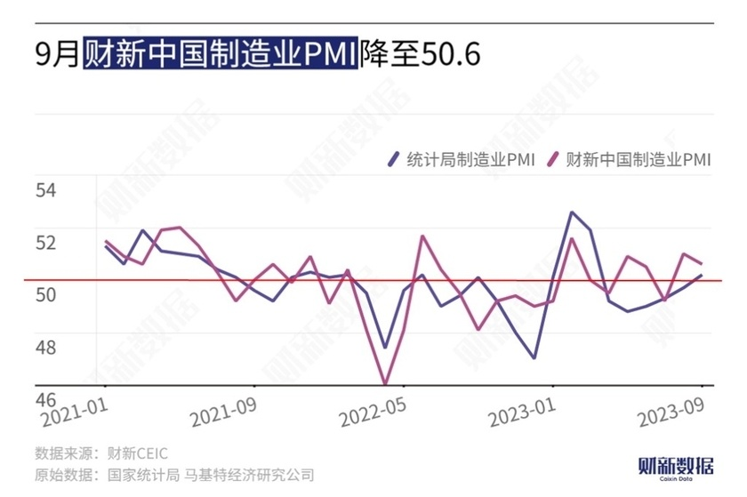

# 9月财新中国制造业PMI为50.6 微降0.4个百分点 服务业PMI再创年内新低

**划重点：**

  * _1_ 9月财新中国制造业采购经理指数（PMI）录得50.6，较8月微降0.4个百分点，近五个月来第四次处于荣枯线上方，显示制造业景气度持续恢复。
  * _2_ 9月服务业景气度连续第九个月高于临界点，但再创年内新低。

【财新网】9月中国制造业景气度延续恢复态势，供求双双扩张，但全球经济低迷，拖累了业界整体增长预期。

10月1日公布的2023年9月财新中国制造业采购经理指数（PMI）录得50.6，较8月微降0.4个百分点，近五个月来第四次处于荣枯线上方，显示制造业景气度持续恢复。

这一走势与国家统计局PMI并不一致。此前国家统计局公布的2023年9月制造业PMI录得50.2，高于8月0.5个百分点，4月以来首次升至扩张区间。（详见：[时隔5个月，中国PMI重回扩张区间，意味着什么？](https://new.qq.com/rain/a/20230930A0556N00)）

从财新中国制造业PMI分项指数看，9月制造业供给和需求同步扩张。此前高温天气对部分企业造成不利影响，9月生产回补，生产指数在扩张区间上升，新订单指数在扩张区间下降，新出口订单指数仍然低于荣枯线，但也有回升，显示新订单总量的增长主要靠内需改善带动。

制造业就业在8月显著改善后，9月再次下降，过去七个月内第六次位于收缩区间。据调查企业反映，削减成本、人员自愿离职后没有填补空缺，是用工重现收缩的重要原因。消费品、投资品、中间品生产企业用工情况均有所恶化，其中以投资品为甚。

生产需求上升，带动采购进一步扩张，原材料库存增加。受部分地区恶劣天气的影响，物流情况稍有恶化，这也影响了部分产品的交付，导致产成品库存略有上升。

9月工业金属、化工品、原油等原材料价格上涨，推动制造业成本上升，制造业购进价格指数录得今年2月以来新高。得益于市场需求较好，制造业企业得以将高成本向下游传递，制造业出厂价格结束连续六个月的下跌，9月指数站上荣枯线。

虽然业界对未来一年的生产前景持增长预期，但制造业生产经营指数录得2022年10月以来新低。乐观心态与需求预期改善、新产品开发和新设备投资等因素有关；对前景的忧虑，主要源于外需疲弱。

财新智库高级经济学家王喆表示，9月制造业景气度继续维持缓慢恢复态势。供求双双扩张，价格指数上涨，采购量和原材料库存稳步增加，不过外需疲弱，就业承压，企业家乐观情绪也降至低点。过去几月政策密集出台，宏观经济呈现企稳迹象，不过修复基础仍不稳固，国内需求依然不足，外部不确定因素依然较多，就业市场压力仍然偏大。下一阶段，前期各项稳经济政策落地见效情况应是关注重点，稳就业、增收入等关键环节或需进一步加力。

**9月财新中国服务业PMI录得50.2 再创年内新低**

【财新网】9月服务业景气度连续第九个月高于临界点，但再创年内新低。服务业供求扩张速度明显放缓，外需有所改善，就业“弱改善”，企业家整体乐观程度有限。

10月1日公布的2023年9月财新中国通用服务业经营活动指数（服务业PMI）录得50.2，较前月回落1.6个百分点，已经连续九个月位于扩张区间，不过连续两个月刷新年内新低。

同时公布的2023年9月财新中国制造业PMI录得50.6，较8月小幅下降0.4个百分点，近五个月第四次录得荣枯线上。两大行业景气度均在扩张区间内下降，拖累当月财新中国综合PMI下降0.8个百分点至50.9，为年内最低，显示经济延续扩张态势但动能放缓。

这一走势与国家统计局PMI并不一致。此前国家统计局公布的2023年9月制造业PMI录得50.2，高于8月0.5个百分点，4月以来首次升至扩张区间；服务业商务活动指数为50.9，结束五个月连降，较8月上升0.4个百分点。两大行业景气度回升，共同提振9月综合PMI产出指数上升0.7个百分点至52。

从分项数据看，服务业供求扩张速度明显放缓。9月服务业经营活动指数和新订单指数连续九个月高于荣枯线，但均录得近九个月新低。海外游客数量增多，海外订单微增，新出口订单指数经历8月的微降后，9月出现回升。部分企业反映，整体需求比预期疲弱。

与市场供求的缓慢扩张保持一致，企业也放缓了用工扩张的步伐。服务业就业指数连续八个月高于荣枯线，但录得2月以来新低。9月产能仍在扩张中，积压工作量继续上升但增速并不显著。

价格方面，9月服务业经营成本小幅上涨，企业普遍表示与用工和燃料成本上涨有关。为应对经营成本上升，企业上调销售价格，把部分增加的成本传导至客户，收费价格指数略高于荣枯线。

9月服务业界的信心度进一步减弱，服务业经营预期指数录得2022年12月以来新低，连续三个月微降。部分企业担心市况转弱，影响销售。

财新智库高级经济学家王喆表示，9月中国制造业和服务业景气度均在扩张区间下降，后者降速更为明显，就业市场受制造业拖累，综合就业指数四个月来首次收缩。过去几月间，中央各项旨在促消费、扩投资、稳预期的政策密集出台，各项重要经济指标出现边际改善，宏观经济呈现企稳迹象，不过经济恢复基础仍不稳固，国内需求依然不足，外部不确定因素依然较多，就业市场压力仍然偏大。下一阶段，前期各项稳经济政策落地见效情况应是关注重点，稳就业、增收入等关键环节或需进一步加力。此外，房地产市场供求关系已发生重大变化，相关调控措施的放松对市场促进效果已较为有限，对居民可支配收入的挤压以及相关风险更值得关注。

