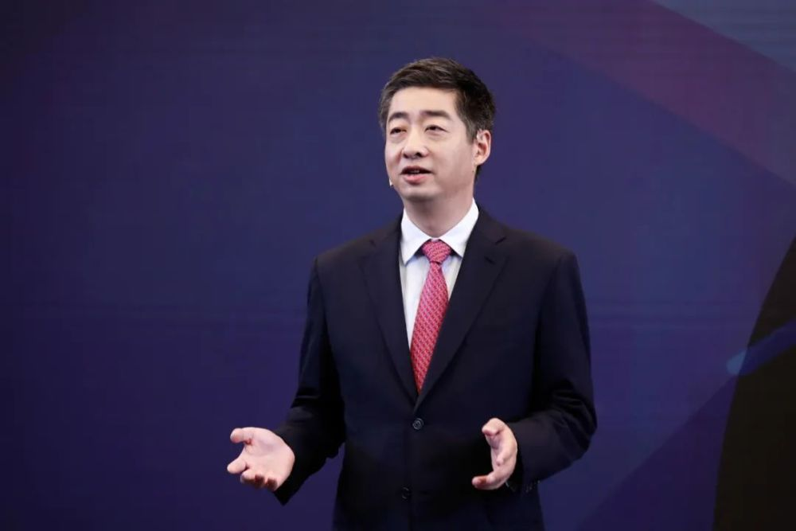
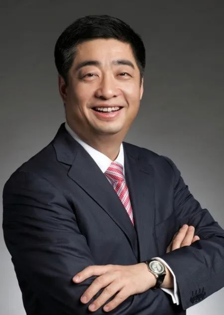

# 华为官宣！今日起，胡厚崑接替孟晚舟当值轮值董事长

作者 | 冰川松鼠

来源 | 蓝血研究（lanxueyanjiu)

根据华为轮值董事长制度，
**2023年10月1日～2024年3月31日期间由胡厚崑先生当值轮值董事长。轮值董事长在当值期间是公司最高领袖，主持公司董事会及董事会常务委员会。**

这意味着，孟晚舟首次轮值董事长的半年任期结束，她在9月30日结束轮值董事长当值期。

胡厚崑先生简历如下：

现任华为公司副董事长、轮值董事长、公司常务董事会成员、全球网络安全与用户隐私保护委员会主席。拥有超过30年的ICT行业经验，在华为战略方向制定及全球市场拓展中发挥了重要的作用。

胡厚崑于1990年加入华为，历任公司中国市场部总裁、拉美地区部总裁、全球销售部总裁、美国华为董事长、销售与服务总裁、战略与Marketing总裁等职务。在此过程中，帮助华为建立了全球销售和服务网络，并在推动华为全球化变革中扮演了关键角色。

2011年10月至2018年3月，担任华为轮值CEO，负责公司业务持续发展与内部管理优化。曾担任华为人力资源管理委员会主任，负责公司领导力与组织发展。

多年来，积极推动通过技术创新，促进联接、包容性增长和社会进步。现任APEC工商咨询理事会代表，世界经济论坛国际工商理事会及数字通信行业工作委员会成员。

胡厚崑毕业于华中理工大学，获理科学士学位，并持有中欧国际工商学院EMBA学位。

**正确的价值观和干部队伍**

**引领华为走向长久成功**

文 | 胡厚崑

一、我们应该在这个最好的时代，超越对手，超越自己，成为伟大的公司。

信息产业的发展正在进入一个全新的阶段，信息技术对社会的全方位改造意味着一切旧的都将成为新的，这个过程正向我们展示出无限的机会；过去20多年来华为在发展中积累的知识、技术、产品、人才以及客户基础形成了很强的发展后劲；过去10年来的行业演变使得行业的集中度越来越高，这使华为客观上已经处在行业领导者的有利位置。我们要抓住这个也许是我们的一生中不会再有的机遇，将所积累的巨大能量释放出来，为行业的发展作出领袖型贡献，使华为成为一个有愿景，有坚持，能够团结全球优秀人才共同奋斗、共同创造、共同分享，并对人类社会的发展有贡献的伟大公司。

二、超越对手首先要超越自己，去除组织惰性才能焕发活力，正确的价值观和强有力的干部队伍才能引领公司走向长期成功。

我们就像在攀登珠穆朗玛峰，越接近顶峰的位置也面临着越大的威胁与障碍。外部看，日益复杂的商业环境，颠覆性的技术创新与商业模式等都暗藏威胁；内部看，伴随成功而日渐增长的组织惰性正在侵蚀着组织的活力，这种组织惰性来自于思想和行为上对过去成功的过度依赖，是组织行为陷入了舒适区的结果。这种组织惰性正在让华为从一头快速奔跑反应灵敏的“猎豹”慢慢地变成一头行动越来越迟缓的“大象”，在快速变化的信息产业，“大”不是最大的障碍，“慢”却是致命的缺陷，就像塞伦盖蒂草原上动物之间的弱肉强食一样，慢的后果往往是被快的对手吃掉，这样的故事每天都在发生。不能有效地去除组织惰性，我们就无法焕发出活力，就失去了实现超越的根本动力，更无法应对快速变化的环境。

我们要清醒地认识到公司业务运作的环境已经发生了显著的变化，这些变化既带给了我们更多的机会也意味着更广泛的竞争与威胁，这些变化更对我们商业理念、战略眼光和管理能力提出了前所未有的要求。随着业务范围从过去单一的运营商业务拓宽到了消费者业务和企业业务，我们如何在多元化的业务结构之下真正掌握不同业务的经营之道；业务运营模式正在逐步由国际化转向全球化，我们如何用全球化的视野有效地整合资源打造新的价值链，营造有利于长期发展的商业生态环境，并在每一个本地市场都成为对当地社会卓有贡献的企业公民；当我们正在从行业的跟随者变成领导者，我们如何让长远的战略追求不受身边五彩缤纷的短期利益的干扰，如何让我们的发展不仅仅被竞争驱动而更多地被愿景牵引；又如何从简单关注规模的粗放式发展模式转向规模和利润并重的有效增长模式；随着越来越多优秀的人才加入我们的队伍，员工的国籍、年龄、文化背景等也越来越多元化，尤其是更多新生代的员工加入我们的队伍，他们注重个人价值实现，胸怀大志但未必一贫如洗，如何让他们在华为这个平台上获得充分施展才华的机会，为公司的成功作出贡献，也让他们的付出获得丰厚的回报。这些，都是摆在我们面前的课题。

华为取得今天的成功，得益于在过去20多年中所形成的正确价值观、文化和在奋斗中成长起来的干部队伍；面向未来，华为要实现超越成为行业领袖，也同样需要正确的价值观和强有力的核心团队的引领才能走向长久的成功。

我们有必要及时审视现有的核心价值观和人力资源管理的指导思想，不断丰富，使其与时俱进。近年来，在任总的发起和推动下，公司通过不断自我批判和探索，逐步形成了一系列新的方向性的人力资源管理指导思想，概括起来主要有以下几个方面：

● 大胆坚持华为的核心价值观，在全球化的背景下正确诠释这些价值观，使其得到广泛认同，并在此基础上有效践行。

●
基于“人才金字塔”模型，更清晰地定义干部选拔的原则、标准和途径，强调干部须具备基层成功实践经验、对高级干部的全球化视野和跨文化、跨领域业务管理经验提出新的要求、强调从基层破格提拔并在实践中磨砺年轻干部，选拔富有奋斗激情的干部，从而形成人才倍出的干部梯队，满足业务发展对干部质量、数量的需求。

● 克服传统的呈金字塔型层层设置的组织中由于决策权力层层向上收敛而导致响应速度缓慢的弊端，大胆改变业务指挥的决策重心和权力分配机制以正确定位不同层级组织对
“战争、战役、战斗”的指挥责任，真正让听得见炮声的人来呼唤炮火，让最清楚战场形势的主管指挥作战，从而提高整个组织对机会、威胁的响应速度。

●
物质激励与精神激励并重，用尊重、信任、机会、荣誉激发员工的责任心和使命感；推动全球化薪酬结构改革，提高整体薪酬水平的市场竞争力，将激励机制从基于上级评定的“分配制”逐步转向“获取分享制”，强调打破平衡、拉开差距，改变过去过于强调均衡的激励体系，使各级组织和员工从关注分配转变为关注如何将饼做得更大，多挣多得、多劳多得。

我们必须将这些指导思想落实于具体人力资源政策和实践，这些工作主要围绕人力资源管理的四个主要结构性要素（价值观与文化、干部与人才、组织、激励）展开，从而引领公司始终走在正确的道路上。

1、在业务全球化发展的背景下，大胆坚持、正确诠释、有效传播核心价值观，让价值观认同成为引领组织前行的灵魂。

在实现战略目标的过程中一定会面对各种风险和挫折，面对挑战，一个团队百折不挠、持续前行的精神动力来源于团队是否有共同的愿景、坚定的信念、共同认同和践行的价值观及开放包容的文化氛围。

公司近年来总结了二十多年来的管理哲学和成功经验，形成了一系列的管理纲要，尤其明确了对“以客户为中心，以奋斗者为本、持续艰苦奋斗、自我批判”的核心价值观和文化的阐述，这些价值观和文化通过高级管理研讨班、两报和心声社区的开放研讨、管理问题的反思发酵等多种形式，已经在公司核心骨干人群中深入人心，形成了公司不断前行的坚强的价值认同和精神力量。

围绕新的业务发展特点和管理要求，我们要清醒地认识到“过去的成功经验不一定是未来前进的可靠向导”，核心价值观和文化也要根据全球化多业务的发展特点，进行与时俱进的诠释，使其更有穿透力，更易于被员工认同和理解，从而最终真正体现到组织和员工的行为中；我们更注意文化建设中的包容性和开放性，团结一切可以团结的力量，使个人与公司相互成就，形成一种英雄不问出处、共同奋斗、共同创造、共同分享的“合伙人”、“同路人”文化。

我们重视将核心价值观和文化真正根植于各项人力资源管理的制度中，更要认识到价值观传承和践行首先是组织的带头人要认同和践行。行动胜过语言，榜样胜于说教，只有各级管理者以身作则，自己成为核心价值观的践行者，核心价值观才能潜移默化地在组织中生根、发芽。

2、坚持干部选拔制和干部在成功实践中成长的原则，大力提拔和磨练具备基层成功实践经验的年轻干部、加强专家队伍建设，让想干、能干、干得好的人才成为焕发组织活力的源泉。

“猛将必发于卒伍、宰相必取于州郡”，坚持贯彻以责任结果为基础的“赛马文化”，其核心理念是“以责任心、使命感和绩效选拔干部，用发展机会激励和培养人才”。“快马是自己跑出来的”，要强调管理者必须具备基层成功实践经验；“让想跑的马有机会跑，让能跑的马跑得快”，给绩优的员工、管理者尤其是年轻的优秀基层管理者更多承担责任、展示才华的机会；“让跑得快的马跑得更远”，针对多业务全球化形势下领导力的短板，坚持员工对自我发展负责，在从实践到理论再到实践的循环中成长的原则下，给一定层级绩效优秀又有强烈个人发展意愿的干部提供之字型发展的机会，让他们具备跨领域、跨文化的管理经验和能力。

在一个庞大的组织中让优秀人才脱颖而出、发挥出能量，并不是一件容易的事，因此要有特别的制度安排，高级干部要善于发现好苗子，在幼苗破土时要给予关怀和支持，但在其成长阶段要允许他们在实践中经历风雨磨砺，优胜劣汰而不要拔苗助长。

我们需要培养、引进大量的业务专家来管理越来越复杂的业务，各级行政长官只有敢于承认自己“有所不知”，才能真正对专家赋权，只有对专家赋权，使他们真正在业务决策中发挥作用，组织才能获得赋能；同时专家也必须深入项目、深入基层实践，勇于担责，真正发挥专业价值。

要广纳天下英才为我所用，获取人才要视野开阔，不仅仅要从公司内部发现、培养优秀人才，也要关注公司以外的优秀人才。

优秀人才要能找得到，还要能用得好；用得好，才能留得住。主管胸怀宽广才能用好人才，听得进不同意见才能鼓励下属畅所欲言、集思广益，妒贤忌能的结果一定是有才之士纷纷离去。人才使用中要用心做好人与岗的匹配工作，既要坚持围绕岗位要求选拔和配备合适的人员，也要关注员工个人的能力经验特点和发展意愿，让员工在合适的岗位上人尽其才、才尽其用，内部人才市场要在这个过程中发挥积极的作用。

要承认不同人才在组织中的不同价值贡献，各类人员存在的问题和面对的挑战也各不相同，为此，不能简单、机械、教条地用一套人力资源方法去解决各自不同的问题。公司近期逐步形成的人才金字塔管理思路和机制，就是要根据不同类人群的特点和管理问题，针对性地制定“选、用、留、育、管”政策和解决方案，从而使不同人才的问题得到针对性解决，充分发挥他们的作用。

只有落实好以上政策和措施，我们才有可能吸引、留住更多优秀人才让他们尽情发挥，把华为打造成组织追求和个人价值共赢的事业平台,让人才成为华为事业壮大的发动机。

3、以“班长的战争”的运作方式应对复杂而快速变化的市场环境，在合理制衡的基础上，赋予基层组织指挥的权力，按照责任贡献提升一线岗位的职级，使组织运作更灵活机动、成本更低。

在全球化和多业务的环境下，经营的环境越来越复杂，市场情况瞬息万变、商业机会繁多但稍纵即逝。传统的金字塔型组织结构、逐级向上收敛的决策模式不利于捕捉机会，更不利于对市场变化做出及时反应。要将传统的由高级长官指挥作战的方式转变为“班长的战争”，但这绝不是班长们的孤军奋战，要依靠强大的信息网络，前方后方一同作战，在这种新的作战方式之下，“元帅们”远隔千里运筹帷幄，把握战争的格局；“将军”和他的参谋们制定战略，储备调配资源；而“班长们”则要能准确判断，及时反应，调动资源，灵活机动地解决战斗。这种作战方式不仅仅要求上级指挥官对战略方向的正确把握，还要求平台部门对于一线作战组织有效的支持，更要求对一线的班长们的信任与授权，与此同时，它也要求明天的班长们具备今天团长、师长、甚至将军的视野与判断力，这些都是我们在变革组织运作方式时必须解决好的问题。

为了实现“班长的战争”，我们要适应信息化社会的发展，对现有组织的金字塔型的组织结构和组织运作方式进行适度优化，一方面要改革责权分配机制，在合理制衡、有效监督的基础上，对合格的一线指挥官基于其岗位责任，充分信任，大胆授权，使责权真正对等，使整个组织的运行重心更低；另一方面要根据责任、业务难度和贡献正确评估岗位价值（职级），提高他们的待遇，使“少将连长”“少将班长”成为支撑新形势下组织运作的重要干部政策，提高一线指挥官群体的能力，吸引更多资深、有成功实践经验的人才长期在一线工作。

还要赋予一线作战部门对组织结构进行灵活选择的权力，要相信“兵无常势、水无常形”，鼓励一线作战部门根据市场形势的变化在组织结构方面进行大胆尝试；机关部门要学习如何在一线组织灵活多变的情况下做好业务支持，鼓励一线部门的功能与上级部门对齐但组织结构不必向上对齐，在满足业务管理专业化需要的同时，支持一线组织的灵活设置和综合化。通过调整权力分配、简化KPI管理、大部制、裁剪冗余部门等手段对机关平台部门的组织复杂度进行控制。

任何组织都是有成本的，对组织规模要坚持围绕投入产出进行自我管理的管控原则，建立组织规模随盈利能力而不是收入规模扩张的边界，项目资源也要按市场化原则进行配置，各级管理者要学会结合业务特点，灵活地调整人员结构，用组织规模的弹性应对人力成本的刚性所带来的组织成本居高不下的威胁。

每一个管理者应该清楚地知道自己作为组织的设计者、运行者、拥有者的责任，组织管理和人员管理、流程管理一样，是管理者的天责。

4、物质激励与非物质激励并重，落实“获取分享”制，增加薪酬弹性，敢于拉开回报差距，将员工的利益同组织和个人的贡献产出更合理地衔接，提高激励的有效性。

激励要关注被激励者的需求、感受和在激励之下的行为表现，了解需求是有效激励的基础，否则就会无的放矢。

要真正重视金钱以外的精神激励方式。尊重、倾听、沟通、理解是最基本的也可能是最低成本的激励，一块奖牌所带来的荣誉感往往会比一笔奖金所带来的激励效果更持久，给予机会、关心个人发展往往比金钱更能激励有成就欲望和使命感的员工，欣赏不同意见、鼓励尝试、容忍失误、不过度问责是非常重要的激励手段，因为那代表着信任。要用心摸索和积极实践各种不同形式的非物质激励手段。

将自下而上的“获取、分享制”作为物质激励的根本原则，使任何组织与个人的物质回报都来自于其创造的价值和业绩，使激励政策的作用首先体现在最基层的业务单元。公司现行的各项激励政策过于强调“均衡”，要敢于打破平衡，拉开差距，给各级“火车头”加满油。

提高工资、奖金等短期激励手段的市场定位水平，增强对优秀人才获取和保留的竞争力。丰富长期激励手段（逐步在全公司范围内实施TUP）,
消除“一劳永逸、少劳多获”的弊端，使长期激励覆盖到所有华为员工，将共同奋斗、共同创造、共同分享的文化落到实处。

公司在过去二十年中摸索建立了相对均衡的人力资源政策和管理结构，如适应自上而下业务运作的金字塔型组织结构、比较注重均衡管理的职级与薪酬管理体系等，这些机制帮助了公司在高速发展过程中快速地形成规范的管理以及适应当时业务管理实际的作战队形，对公司过去的发展和成功做出了不可磨灭的贡献。然而，当我们置身于变化之中，我们又必须主动扬弃过去，积极超越自我，才能保持组织活力，适应环境变化进而引领行业发展。公司正处于发展的关键时期，我们在实现目标的过程中的每一点改变，都意味着组织本身的蜕变，蜕变的过程是痛苦的，因为它需要决心、思考与行动，但蜕变的结果是美丽的，因为我们知道蜕变之后就是更好的、充满活力的成长。

