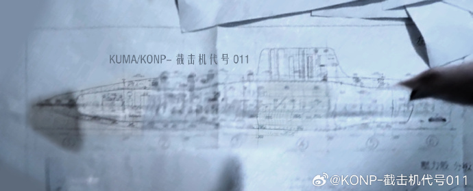
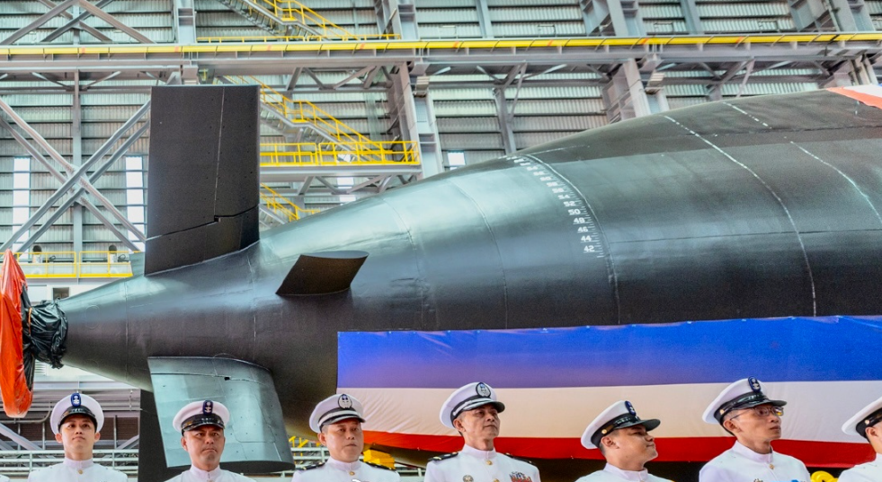
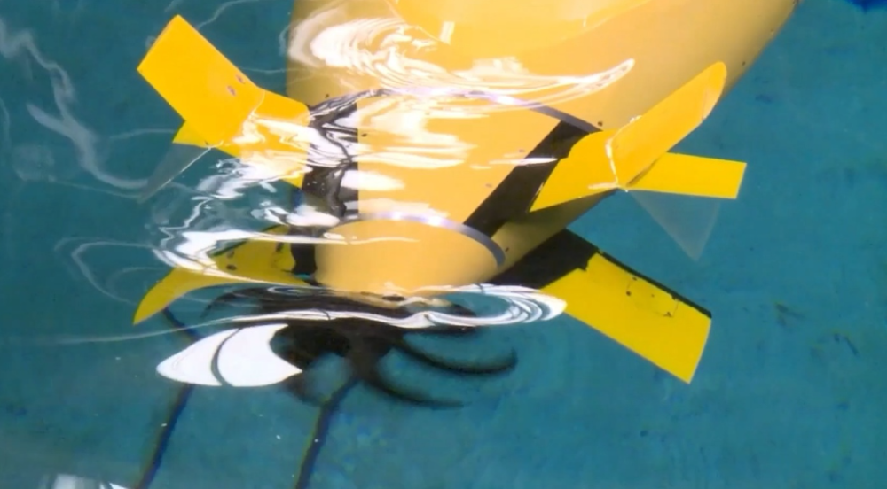
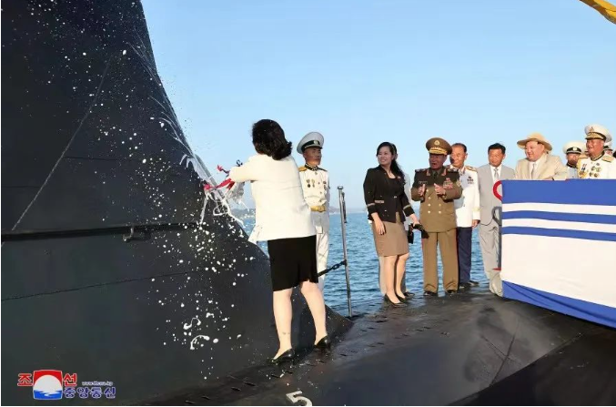
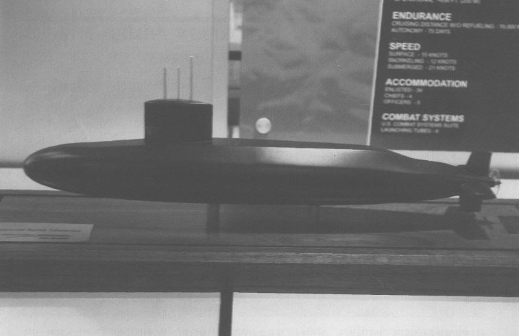
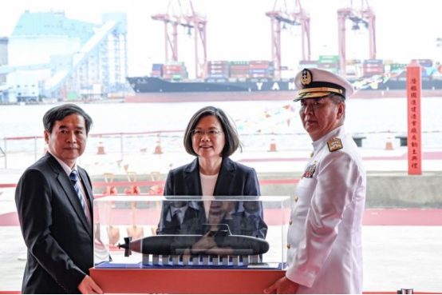
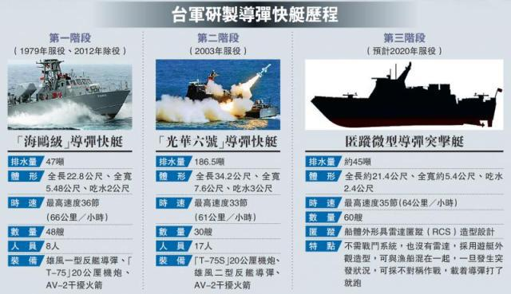
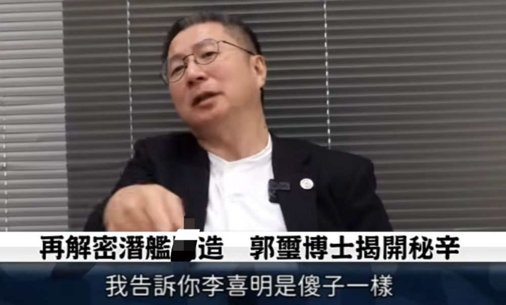
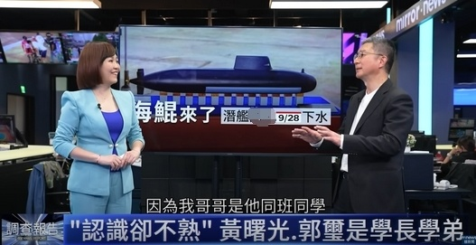

# 台军首艘“自造柴电潜艇”下水，媒体：用自力更生的方式作秀

**【文/观察者网专栏作者 王世纯】**

本周，台湾首艘自造柴电潜艇在台船高雄厂区举行原型艇下水命名仪式。与此前媒体爆料内容一致，命名典礼上证实了该艇“海鲲”的艇名与舷号“711”。

作为所谓台军“自制防御潜舰”（IDS）的首艘原型艇，该艇下水仪式得到了台伪当局的极大重视。台湾地区领导人蔡英文出席下水仪式并进行“掷瓶礼”，此外台防务部门负责人邱国正、台“海军司令”唐华和台船董事长郑文隆等高官和企业代表出席了仪式并发表了讲话。尽管“下水仪式没有水”，但仪式现场播放了原型舰缩时建造影片，也披露缩比模型水动力试验、耐压壳体原型爆震等实验过程，展示了项目的严肃性。

_就这么个玩意儿_

**设计合理的原型舰**

作为人民海空军未来祖国统一战争需要面对的敌对水下力量，我们还是要客观分析一下“海鲲”号的性能。从台岛方面发布的视频和相关介绍资料来看，该艇为常规构型的柴电动力潜艇，使用铅酸蓄电池组，水下排水量2500吨左右，配备X型艉舵，艇长70米，耐压壳体直径宣称8米，略大于目前台军列装的“剑鱼”型潜艇，壳体采用HSLA-80高强度耐压钢制成。台船方面宣称该艇的工作潜深和安全潜深比之前的引进荷兰的“剑龙”级（荷兰称为剑鱼级，swordfish）潜艇各多出50米以上。

在武备方面，“海鲲”号潜艇配备有6具533毫米鱼雷发射管，可发射美制MK48 MOD6
AT式533毫米鱼雷，潜射“鱼叉”反舰导弹（UGM-84）。该艇鱼雷/导弹携带总量为24枚，其中鱼雷管中预装6枚。同时，该艇还具备布设水雷的能力，并携带有美国洛克希德·马丁公司研制的艇载综合战斗管理系统。在“海鲲”号的艇艏装备有被动截获声呐阵列，舰艏鱼雷发射器下方安装有数字化主动声呐阵列，在舰艏侧面安装了舷侧声呐阵列，单从武器系统和声学系统上接近了目前西方世界柴电潜艇主流水平。

具体到艇体设计上，“海鲲”号相较于荷兰“剑鱼”级潜艇也有一定的延续性。“海鲲”号在舱室设计上基本延续“剑龙”级潜艇，为水滴线型艇体，3个舱室结构，但根据已有使用经验进行了一定的创新。根据台岛方面发布的视频，“海鲲”号采用了以双壳体为主要结构的单、双混合壳体。这一点基本和“剑龙”级潜艇一样，其舰艏、舰艉为双壳，舰体中段则为单壳设计。其中潜艇指挥舱、生活舱为扩大容积，采用了单壳体舱段。一般来讲，单壳体方便减少排水量从而实现增速减阻，双壳体方便增加储备浮力，同时，新时代双壳体潜艇在静音设备布置上更有优势。台军“海鲲”号继续沿用单双壳体布置，其技术逻辑和荷兰从“旗鱼”级到“海象”级是一样的（荷兰剑鱼级潜艇改良自旗鱼级）。“剑鱼”级只有11%的储备浮力曾饱受诟病，目前尚不清楚“海鲲”级是否会对此进行一定的改善。

 _借用微博@KONP-截击机代号11的一张图_

在推进系统上，“海鲲”级采用了X型艉舵，和瑞典西约特兰级、哥特兰级；荷兰海象级、海鳝级常规潜艇和日本苍龙型潜艇等类似，具有一定的欧洲风格。X型艉舵的优势是四个舵面都参加潜艇机动的运动，每个舵面可以同时提供水平和垂直的矢量舵效，即便有一两个舵面损坏潜艇仍然能够正常工作。此外，X型艉舵4个舵面布置在潜艇尾部的对角线上，因此在不超出艇身尺寸的情况下，舵面可以做得更长，增强舵效同时方便潜艇坐底。此外X型舵还可以一定程度上折射敌主动声呐声波，拥有一定的声学隐身性。不过，在X型艉舵前方，该艇还设置了一对水平舵。这种字面意义上“画蛇添足”的配置充分说明了该艇的实验性质。毕竟X型艉舵的缺点之一就是控制系统复杂，需要为4个操纵面分别独立设置操纵装置。尽管可以猜测“海鲲”的控制系统来自欧洲乃至日本的成熟舰控系统，但作为同时拥有重大军事试验用途和政治意义两种属性的“原型艇”，“海鲲”进行这种万事求稳的设计并不奇怪。

X型艉舵以外，在螺旋桨推进系统上，尽管台军对其严格保密，但其水动力缩比模型和设计图纸基本透露该艇采用了七叶大侧斜螺旋桨，达到了世界主流潜艇的平均配置。不过，考虑到台船宣称七叶大侧斜螺旋桨是“自己开发”，“海鲲”的桨叶配置究竟如何还需要等待其下水以后才能观察。此外，该艇继续沿用了围壳舵——常规艇艇艏空间寸土寸金。台军在对舰艇声呐的布置上又追求甚高，这种设计是自然而然的。

可以看出，尽管“海鲲”号潜艇是台岛自行建造的第一款常规动力作战潜艇，但台湾潜艇工业从业者的目标并不低，其“自造潜艇”的纸面性能仍瞄准的是2008年左右国际主流潜艇水平。但是考虑到“海鲲”与“海虎”之间的延续性，也许台岛内部“台湾新型潜艇性能比现役‘剑龙’级潜艇进步约8到10年”的说法更加贴近“海鲲”号实际指标。不过，正如我们直播中吐槽的那样，自上世纪60年代人类潜艇设计普遍进入“水滴形”时代以后，常规动力潜艇的先进性往往就不再能通过外形观察出来——毕竟单看外形，091型核潜艇的水动力设计水平也很先进。

具体到“海鲲”号上，首先，潜艇指挥塔照片就可以透露出台船焊接工艺不成熟的信息。“海鲲”号指挥台外壳凸起明显、外形严重不平整。台船造舰团队对于这一现象倒也不避讳，直接表示因为围壳采用薄板设计，不平整隆起是所谓“瘦马现象”，一般水面舰也有此状况。“瘦马现象”从学术上来说叫做“薄板船体焊接变形”。在焊接军舰内部支撑的时候，船体表面会出现形状凹凸变形，看上去就像一匹老马一样。“瘦马现象”几乎在现代军舰中都会出现，影响因素包括焊接工艺、制造管理、焊后校正等。当然，对于“海鲲”号来讲，这种“瘦马”现象，显然是船体应力处理出现问题。在焊接工艺有所欠缺的基础上，其指挥台外壳上的消音瓦片布置，包括指挥塔和艇体过渡部分处理，以及至关重要的指挥塔声学处理都无从谈起。

_“海鲲”号指挥台照片_

_工艺水平可对比被称为“拉皮”的朝鲜某型潜艇_

当然，目前这个状态下的“海鲲”也不只是指挥围壳缺乏消音瓦，整个艇体目前看也没有消音设施安装的痕迹。现代搜潜反潜作战就是比较纯粹的斗兽棋，失去声学优势的潜艇往往只能通过坐底伏击的办法被动去期待“奇迹”。总的来说，“海鲲”号即便在明年4月份“正式下水”前安装完鱼雷武器系统，舰艏声呐和其他当下缺装的系统，这艘潜艇的实际作战能力也有限，很难称得上是什么拥有现代化作战能力的潜艇。

然而这些问题并不是该艇在战斗力上最值得质疑的部分，想要搞清楚“海鲲”级潜艇的效能和未来，我们还要从这艘艇的命运说起……

**用自力更生的方式作秀**

台湾地区领导层如此重视这艘潜艇并不奇怪。对于台湾海军来讲，潜艇部队有着独特的地位，“256战队”麾下虽然长期只有“狮豹龙虎”四条艇，但该部队出身的军官能晋升到海军领导层，比如李喜明和黄曙光。但凡涉及采购或者建造潜艇的议题也会立刻引发伪国防部、伪立法院和伪政府极度关注，并且就此争吵不休。潜艇部队的特殊地位可能来源于台军潜艇部队充满着坎坷成军之路。

在台岛潜艇部队不甚久远的历史上，台岛“外购潜艇”基本上代表了敲诈、延宕和地缘政治局势带来的无奈，而“自造潜艇”则是台湾薄弱的造船工业某种不切实际或者单纯为了打气的自吹自擂。在外购潜艇事宜上，台湾岛上下都明白，采购荷兰“海龙”和“海虎”两艘荷兰潜艇是各种机缘巧合作用下的结果——哪怕是1983年，刚刚和西方缓和关系的大陆方面都有能力阻止荷兰政府出售后续潜艇。也因此，进入90年代以后，台湾岛内基本上把所有外购潜艇的希望都放在了对美军备采购上。

_2003年台船展示的“国造潜艇”，倒不如说更像某种无能狂怒_

当然，这样做的结果是陈水扁时期“从美国购买的8艘常规潜艇案”的反复波折。2001年，美国批准向台湾出售8艘常规动力潜艇，但美方早已关闭了常规潜艇的生产线，要求台岛掏30亿美元腰包研制常规潜艇的要求也变成了某种不切实际的空谈。这一时期，台湾“中国造船公司”提出要自行建造潜艇外壳。随后为了和美方“讨价还价”，台湾不断散布风声，要购买什么德国造209型潜艇、俄罗斯“基洛”级潜艇乃至以色列“海豚”级潜艇。当然，这些空对空的风声最终就成了“笑谈”，到小布什任期结束的2008年前，美国方面基本中断了台岛对外采购潜艇之路。

本来到了马英九时代，美国人都解决不了的潜艇问题，台湾海军按理说也自然不应该继续惦记。当然，正如“海虎”和“海龙”一样，台湾海军的潜艇之路还是遇到一点小小的机缘巧合。马英九蔡英文交接之际，李喜明，黄曙光两位台湾海军潜艇部队出身的高级军官先后担任台湾海军司令，随后这两位潜艇部队出身的高官又因为沈一鸣之死连续担任台军伪参谋总长，打破了台军“军种司令不得连续担任参谋总长”的惯例。

作为潜艇战队的队长，黄曙光上将一直自诩说“台岛潜艇之父”，在发展潜艇一事上十分热忱。而蔡英文作为一个妄图以武拒统的台独头子，正好需要一些切实可行的军备发展以笼络人心，充当政绩。瞌睡递枕头的情况下，2016年7月7日，绿营控制的台岛当局全面启动“国舰国造”计划，其中就包括“潜艇自造”计划。

**人齐，开造**

当然，有了“潜艇自造”计划并不代表这一计划就一帆风顺了。在蔡英文任期内，李喜明和黄曙光在海军新建项目资源分配的问题上矛盾扩大化。李喜明支持的“微型导弹快艇”项目和“新一代导弹巡防舰”，以及“沱江舰”量产型更加有可行性。相比之下，“潜舰自造”项目是字面意义上白手起家，“台船”方面除了吹嘘能够自产HY-80钢的情况下，毫无舰艇制造经验——厂区要扩建，设备要外购。对比之下，台船在潜艇项目并不受欢迎，台船总公司在立项早期甚至抱怨过潜艇项目组“空耗时间吃干饭”潜艇项目内的技术人员也不断地谋求跳槽，总设计组不少人陷入抑郁，整个潜艇项目就像台军其他不切实际的自研武器项目一样似乎要进入垃圾时间。

但是黄曙光这个人多少带点“有志者，事竟成”的莽劲儿，在他的推动下，整个台造潜艇还真就出现了一些转机。首先是台军在“海鲲”舰的制造上真的进行了项目规划——台军在搞“潜艇自造”项目时，曾经将所有分系统进行了划分，“绿区”系统是台湾能自造的，“黄区”系统是自造有难度的，“红区”系统是造不了必须采买的。划分之后，台军就只计划自制艇载液压系统，耐压壳和螺旋桨，这三个系统分别外包给了协聚德公司、铭荣元公司和宏昇公司。

而在军种资源抢夺上，李喜明任期内接二连三的弊案——尤其是庆父案——也让“潜舰岛造”有了资源分配上的话语权。无论是“导弹巡防舰”方案上的翻来覆去的修改，还是“参谋总长”李喜明不受欢迎的“微型导弹快艇”专案，都在明里暗里帮助“潜舰岛造”上位。而严德发和邱国正时代大量的陆空军军备采购进一步挤压了本就地位不断下降的台岛海军资源。最后，沈一鸣命运的“一摔”为黄曙光扫清了“潜舰岛造”案最后的一个障碍。无论如何，在蔡英文第二任期即将接近时，“潜舰岛造”几乎是台湾海军在武备革新上唯一的稻草。

_郭玺事后评价如上_

无论如何，黄曙光终于获得了足够多的资源去推进潜艇建设。首先是人事调整，他因此规划培养时任海军舰队指挥部指挥官，曾任海军副参谋长、后勤处长等职高嘉滨中将为IDS全案的接班人。而在潜艇的海外子系统获取上，黄曙光则把目光放到了他的学弟，一名名叫“郭玺”的海军学校毕业生身上。

郭玺第一次出名还是在2018年，岛内媒体近日发现“自制潜艇”设计方，台湾造船国际（台船）的“设计技术顾问”，居然是一家从没人听说过的“加福龙有限公司”（Gavron
Limited，简称GL）。其合同金额高达6亿新台币，而台船设计阶段的总预算也不过25亿新台币。细查之下，这家注册于伊比利亚半岛南端的英国领地直布罗陀的公司越看越不正经——尽管这家公司找来的人都是“洋面孔”，但是除了有着不成功潜艇设计经验的西班牙设计师Juan
Herrero Valero和英国退役潜艇指挥官，准将Mike
Walliker以外，其他成员——包括郭玺本人都没有潜艇设计经验。整个公司透露着一股子“庆富集团”的诈骗感。

不过这一次，GL公司和“台湾传统故事”不一样——他们还真找了不少人帮助台船造潜艇。来自美、英等7个国家的国防潜艇厂商和专业技术人员提供技术、零件与人力援助，暗中帮助台当局打造自制潜艇。这些技术转移以及技术人员的派遣都获得了相关国家政府的许可。这帮人以高雄左营海军基地以及台湾国际造船股份有限公司为中心进行工作。除了美国以外，台船甚至利用关系情报网络，从韩国挖来不少搞过“孙元一”型潜艇的工程师来台。最终到2020年，有大概250名外籍工程师参与潜艇自造项目。由于外籍工程师太多，台船造船厂附近的外国人一度让当地居民都“见怪不怪”——当地居民曾经反映说，但凡是台船宿舍附近的韩式烤肉店，里头全是说韩语的“外来人才”。此外，日本三菱和川崎重工的退休工程师组成的一个团队据说也参与了台湾自造潜艇的设计方案投标——而根据路透社的报道，台船公司寻找顾问和技术人员时，甚至找到印度的头上，有不少印度潜艇工业设计人员和造船工人抵台参与工作。

当然，即便地缘形势朝着对台造潜艇有利的方向发展，台岛的潜艇计划也遇到了不少挫折。德国、荷兰和日本在考虑再三后，都拒绝参与台当局的自造潜艇计划。而荷兰外交部直接表示，根据1984年与北京达成的协议，政府不会批准任何新的军事装备出口许可证。韩国工程师因为遭受“外来压力”而辞职回国，当时有韩国政府的情报人员直接赴台湾，亲手将这些人接回韩国。而德国一家重要的设备供应商原本已经进入备货程序，但最后一刻，这笔交易被其母公司取消。德方毁约后，台军方要求每个项目都要找2到3个“B方案”备用，而郭玺本人也在前几天的采访节目中大骂德国人“不靠谱”，“为了大陆业务不管我们”。

但最终，“海鲲”号的成型，还是离不开美国人在潜艇作战系统上大开绿灯。进入2018年以后，随着中美关系出现转向，美国方面也开始大打台湾牌。美国几乎是公开支持台湾的潜艇建设，其中洛克希德马丁公司提供“红区”装备“数字化潜艇综合指挥系统”，L3哈里斯公司负责潜艇武器系统组件整合，雷神公司批准提供数字声呐等关键技术。这些作战系统的装配与调整，也经由美国工程师基本调试。无论如何，“海鲲”壳子里的东西搞定以后，随着台船“投资甚巨”的新厂区投入使用。台湾方面在“海鲲”号上需要做的事情就是把自己折腾的出来的潜艇耐压壳和舱室焊起来就行。简单来说，8米级别的耐压壳甚至不用数字化大型卷扬机，台船分段焊接的方法也基本上赶上了节点。

总而言之，“海鲲”号在经历过跌跌撞撞以后，以一个“看起来应该能用”的状态下下水了。自蔡英文就任以来，岛内军工项目一地鸡毛者多，顺利成事者少。“海鲲”号能按照一个基本的时间节点完成项目推进，在岛内军工体系里头属于十分罕见的一件事。而在东北亚当下的地缘政治环境下以及台岛内部的政军工业体系下，“海鲲”号潜艇能以进展到今天这个地步，确实带有一些微妙的传奇和励志色彩。笔者的主要关注方向是伊朗、朝鲜乃至也门安萨尔安拉运动（胡赛）等自力更生的势力，而台湾省的这艘“自制潜舰”的项目，多少让人看出了一点上述势力一己之力“手搓”武器的影子——相较于台湾其他那些半途而废的项目，“海鲲”舰目前看还算是“有始有终”。

但影子终究就是影子，作为一个“特事特办”的项目，台伪当局抓住了当前全球地缘形势的机会，黄曙光和郭玺等人搞来尽可能多的西方设计人员和子系统，但这并不意味着这个项目会一帆风顺，生成战斗力。当下，全世界拥有潜艇柴油机总机产业的国家极少，仅有德国MTU、日本川崎、法国皮尔斯蒂克和我国拥有作战潜艇用柴油机制造能力，其他瑞典、荷兰等曾经拥有柴油机产业的柴电潜艇生产国已经放弃了这一产业，美国也很早之前就没有现代化柴油机产业了。

在这样的情况下，台岛制造“海鲲”的动力来源无非三种：第一，来自美国的走私网络。美帝利用其间谍物流网络，向台岛走私一套MTU乃至皮尔斯蒂克潜艇用主机，帮助台船获得了制造“海鲲”的动力系统能力。当然，这种走私过程即便做得再隐秘，也是极其容易溯源的。

第二，台岛方面通过走私渠道，从欧洲或者日本的废弃潜艇上获得了退役的柴油机，这种柴油机的工况堪忧，会极大地影响“海鲲”舰的作战效能，但确实能保障台岛获得一套基本的潜艇动力。

第三，这艘潜艇上根本没有柴油机或缺装柴油机。

无论如何，对于缺乏动力系统自产能力的台湾而言，未来的“海鲲”级潜艇上一定会面临更多的“动力卡脖子”问题——不管是MTU还是皮尔斯蒂克，这些公司在大陆的业务规模会促使他们仔细思考介入台海局势的利弊。而二手发动机也并非什么非常容易获取，或者说难以溯源的资源。即便台岛短暂获得了二手潜艇发动机，也不可能把这当成什么长久之计。而且，台湾海军可能并不愿意将老旧不可靠的发动机作为“头等大事”予以投资。

无论如何，“海鲲”对于台岛而言是一个里程碑，标志着台湾在研发生产潜艇的能力上取得了进步，向着拥有“自研潜艇”能力又迈进了结实的一大步。但这对于以武拒统有用吗？台岛在“海鲲”项目上花费的经费已经达到500亿新台币之巨——折合114亿人民币。这个数字可以采购半个旅的歼-10C，或者一整个装备99A和04A的数字化合成旅，但现在台湾却只能收获一艘没有现代化作战能力的试验艇。显而易见的是，投资这种武器，在军事资源分配角度上来讲绝对是一场灾难。

但军事上意义有限的武器往往能在政治上获得更大的意义。作为蔡英文大力宣扬的重点军工建设项目，这艘潜艇在经历过7年的坎坷以后，终于一个“全须全尾”的状态展示在世人面前，确实是一件能引发支持者兴奋度的事情。这种大型军备项目带来的政治宣示意义自不必说，笔者的一个负责搜潜攻潜专业的朋友说得好——台伪就算把这100亿多去造了一两个打击旅，三四个征召旅又如何？台岛自己已经控制不了自己的命运，但对于黄曙光、郭玺这几个人来讲，能利用手头的资源，完成自己毕生的夙愿，实实在在建造一艘“实打实”的潜艇，多少也是一个不错的选择。

**本文系观察者网独家稿件，文章内容纯属作者个人观点，不代表平台观点，未经授权，不得转载，否则将追究法律责任。**

