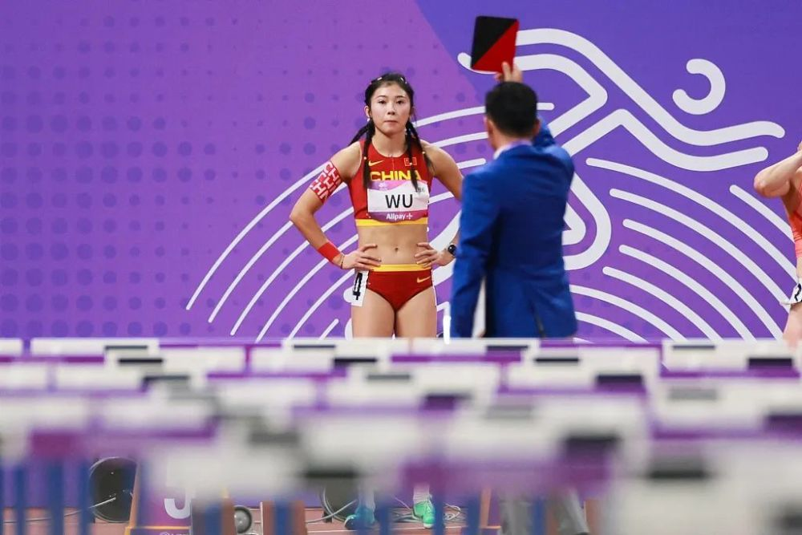

# 吴艳妮，没赢也可以狂

对于吴艳妮来说，没有什么比在国庆节当天丢掉那枚自己心心念念的亚运金牌更遗憾的事情了。

在刚刚结束的亚运会女子100米栏决赛中，吴艳妮陷入抢跑危机后，以12秒77的成绩第二个冲过终点，但成绩被取消，最终另一名中国选手林雨薇获得金牌。

在9月30日进行的预赛中，作为个人成绩最好的选手，吴艳妮一路领先，虽然在冲线前减速，仍跑出了12秒80的好成绩，最终以小组第一晋级决赛，没人会否认，她就是亚运金牌最有力的争夺者。

从大运会到亚运会，吴艳妮一直活在风口浪尖上，人们谈到她总是回避不了两个词“颜值”和“显眼包”，吴艳妮“人来疯”的性格，让不少人对其颇有微词。

“运动员还是要更多的专注在赛场上，而非场外。”

“她太张扬了，一点也不谦虚。”

“一名运动员，满脑子想的都是怎么能红。”

但事实上，吴艳妮没有做过任何出格的事，在训练比赛中也从来是认真对待，就像她自己在社交媒体上所说的那样，“我一直是在做自己。”

_在亚运会100米栏决赛中，吴艳妮一度陷入抢跑危机 图/视觉中国_

**“人来疯”**

2015年第一届全国青运会冠军、2016年全国青年锦标赛冠军、2017年第十三届全运会季军、2018年全国锦标赛冠军、2020、2021年全国田径锦标赛冠军、2021年第十四届全运会亚军、2023年成都大运会亚军……

年轻的吴艳妮逐渐成长为中国田坛100米栏名将，在大运会的比赛中，吴艳妮跑出12秒76的个人最好成绩，同时拿到了巴黎奥运会的参赛资格。

中国体育爱好者对田径比赛的跨栏项目是有美好记忆的，2004年刘翔在雅典奥运会上夺得男子110米栏冠军，成为首位获得田径项目奥运金牌的中国男子运动员，刘翔为中国体育创造了历史，也书写了奇迹。2008年北京奥运会上，因伤退赛的刘翔，也给人们带来了无尽的遗憾。

在刘翔退役后，男子110米栏项目虽然仍出现了谢文骏、朱胜龙等优秀的运动员，但远远没有达到刘翔的知名度和影响力。

直到吴艳妮、夏思凝等一批优秀的年轻女子跨栏运动员出现，跨栏项目的热度陡然提升。

吴艳妮身体条件好，基本功扎实，发展潜力大，属于比赛型选手。在教练和队友眼中，吴艳妮属于“人来疯”，越是大赛，她越是兴奋，发挥越突出，心理素质非常稳定。

虽然吴艳妮在赛场上获得不少成就，在仍然遭到一些质疑。

大运会比赛前指天的动作，被众多网友嘲笑；右臂大面积的文身，更是被指责带坏了众多喜爱田径的青少年。

面对争议，吴艳妮并没有选择沉默，而是回应称“我觉得自己的动作很帅很飒，也很适合我，这个动作代表剑指巴黎。”

针对于手臂上的文身，吴艳妮在面对央视采访时解释称，是表明了自己对于冠军的追求以及对自己表露出来的自信。

即便如此，一些人仍然认为，吴艳妮在场外高调的性格，是为了成为网红赚快钱。对此，吴艳妮更是在直播中回应，“我不差钱”。

吴艳妮所言非虚，在成都大运会女子100米栏比赛中摘得银牌后，一汽奔腾便迅速宣布将赞助中国田径队，并让吴艳妮成为该品牌的代言人。随后，咖啡品牌瑞幸也以最快的速度聘请她成为品牌代言人。

 _吴艳妮参加杭州亚运会100米栏预赛 图/视觉中国_

**刻板偏见**

事实上，一些人对于吴艳妮的吐槽，更多来自于人们对于中国运动员的某种刻板偏见，在女子运动员中尤甚。

在一部分人眼中，职业运动员还是那个“四肢发达，头脑简单”的刻板形象，除了在赛场上努力比赛外，场外沉默寡言，说话磕磕巴巴，仿佛这就应该是职业运动员的样子。

但事实上，体育不可能脱离社会变化而孤立发展，运动员的性格和风格，必然会因为时代的变化而发生转变。

之所以曾经一些运动员给人们留下了一些刻板印象，是源自于曾经那个年代的体育人才培养模式。部分年轻人因为被认为有体育天赋而被发掘，早早离开家庭，脱离教育，进入集体生活，相对于社会中的年轻人来说，他们的生活封闭而枯燥。

这必然会让一部分运动员，在个性呈现和语言沟通表达上出现一定程度的障碍。再加上国人对于体育的价值观，向来是“成王败寇”，所以大量人们眼中的“失败者”更是“失语者”。

在没有互联网，没有社交媒体的年代，他们远离媒体的报道，完全没有发声的平台。

如今的体育人和曾经相比，有了很大程度的变化，他们和这个发展前行的社会密切相关，甚至没有一丝一毫的隔阂，运动员是一个职业，但并不代表全部，他们理应有自己的生活，理应有自己的个性。

最初人们看到刘翔、姚明等运动员可以面对媒体侃侃而谈的时候，还是惊讶大于认可的，但如今，已经没有人会觉得那是另类，那是张扬。

可是部分人仍对女性运动员存有刻板偏见，吴艳妮之前，被质疑最多的女运动员大概是傅园慧，那是一个可爱的姑娘，被做成了表情包。很快有人站出来吐槽她，“成绩不行，天天卖乖。”人们攻击她，指责她缺少运动天赋，只能依靠搞怪出圈。

吴艳妮也是如此，她的走红其实是多方面因素促成的，一方面自己的成绩足够出色，在各项比赛中崭露头角，增加了曝光度；其次是因为前文所说，国人对于跨栏项目的情结。

最后则是更为复杂的因素。相比起娱乐圈，如今人们更希望体育界可以涌现更优质的偶像，他们更阳光、更积极向上，也更励志。当人们用审视娱乐圈的视角去审视运动员的时候，外貌出众的吴艳妮自然就被放大了。

看脸的时候是按照当下娱乐圈的标准，评价的时候又用了上世纪评价运动员的刻板印象来衡量，就这样，吴艳妮成为了矛盾综合体。

好在，吴艳妮压根不在乎这些。

_吴艳妮参加杭州亚运会开幕式 图/中新图片 中新社记者 史春阳 摄_

**强大自我，对于运动员有好处**

对于职业运动员来说，强大的自我，或许对于他们取得更好的成绩，去追求更高的目标，有更大的好处。

对于运动员来说，为自己制定的目标，显然是要永远高于自己的能力，才能成为促进自己不断向前的动力。

相比起制定更远大目标来说，直接认为自己已经是最好的那一个，从心理上来说更容易接近胜利。

在竞技体育层面，参与者都是天赋异禀之人，但天赋依然存在差异，这其中的根本便是人种差异。这种差异并非后天努力就可以弥补的。

比如身高、弹跳、爆发力、灵活性，这些指标在不同人种之间，存在巨大差异，造成了在一些运动上，某些人种通过科学训练很难完成突破，这其中包括篮球、包括游泳，也包括田径。

在这样的情况下，运动员的超强自我，可以让自己有持续努力的动力，在相同的竞赛规则下，尽量去弥补人种造成的先天差距。从这个角度上看，吴艳妮的超强自我，对于运动员本身来说，只有好处，没有坏处。

从国际田联公布的运动员世界排名来看，按照积分，吴艳妮暂列女子100米栏项目的第50名，今年的各项田径比赛中，已经有7名选手先后打开了12秒40的大关，相比之下，职业生涯最好成绩12秒76的吴艳妮，和世界顶尖运动员相比，差距十分明显，从目前看，吴艳妮绝无可能在明年巴黎奥运会重现刘翔在雅典奥运会时的壮举。

但那又如何？她已经是这个年龄段，国内这个项目中最好的几名女子选手之一了，她能站在巴黎奥运会的田径赛场上，已经足够证明中国田径的进步和努力。何必用唯成绩论去苛责一个中国田径运动员？

至于性格，人们要接受，每个人的性格都是不一样的，这和他/她是何性别，从事何等工作毫无关系。运动员早就不再是部分人眼中曾经的那个样子，他们是运动员，更是年轻人，年轻人充满活力，这同样是好事情。

没拿到冠军，又能怎样？当运动员成为公众人物后，也注定要接受审视和点评，并且无处躲藏，这也是这个时代必然的产物。

或许对于吴艳妮来说，这些根本就不叫事，我们巴黎见。

作者：胡克非

