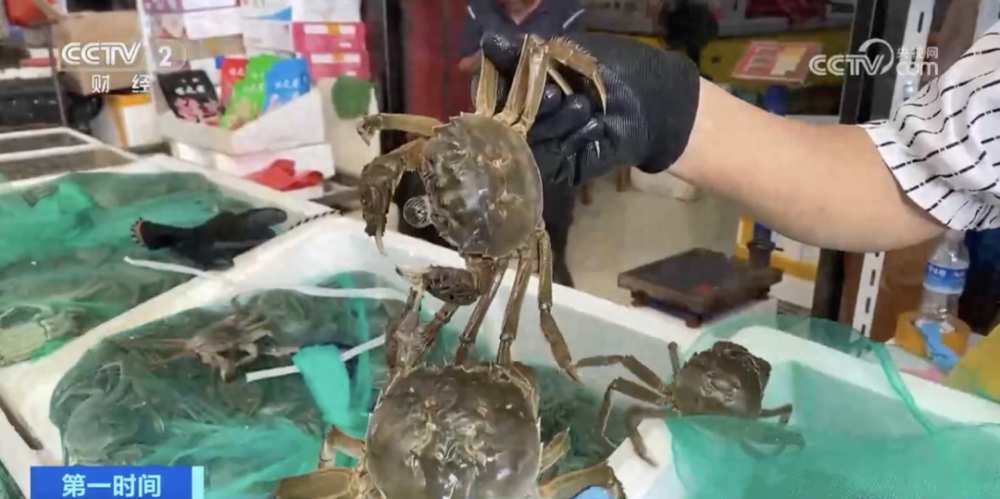

# 大闸蟹价格近乎腰斩，有商户一天卖出5000斤

眼下正值大闸蟹集中上市的时期，在河南郑州的各大海鲜批发市场，今年大闸蟹的价格较去年同期下降将近一半，品质也好于往年。

上午十点，记者在河南郑州北郊一家大型海鲜批发市场看到，每个海鲜摊位前都挤满了挑选海鲜的消费者。眼下，市场里最抢手的就是大闸蟹，双节期间，大闸蟹的销量一路走高，九月初刚上市时，有商户每天才卖几百斤，现在最高一天能卖5000斤。

市场商户告诉记者，由于今年大闸蟹产地养殖面积扩大，加上螃蟹大丰收，供应充足，价格较去年同期下降超40%。

河南郑州某海鲜批发市场商户
董卫峰：比去年基本上要便宜一半，去年2.5两母蟹最高峰时卖到一百二十元一斤，像今年最高峰时最多卖到六十五元一斤。3两母蟹去年最高卖到一百四五十元一斤，今年价格始终在七十多元一斤。

记者走访发现，除了大闸蟹，其他如梭子蟹、罗氏虾、基围虾、石斑鱼以及鲍鱼等海鲜的价格则比较稳定，与去年同期持平。

来源：央视财经

