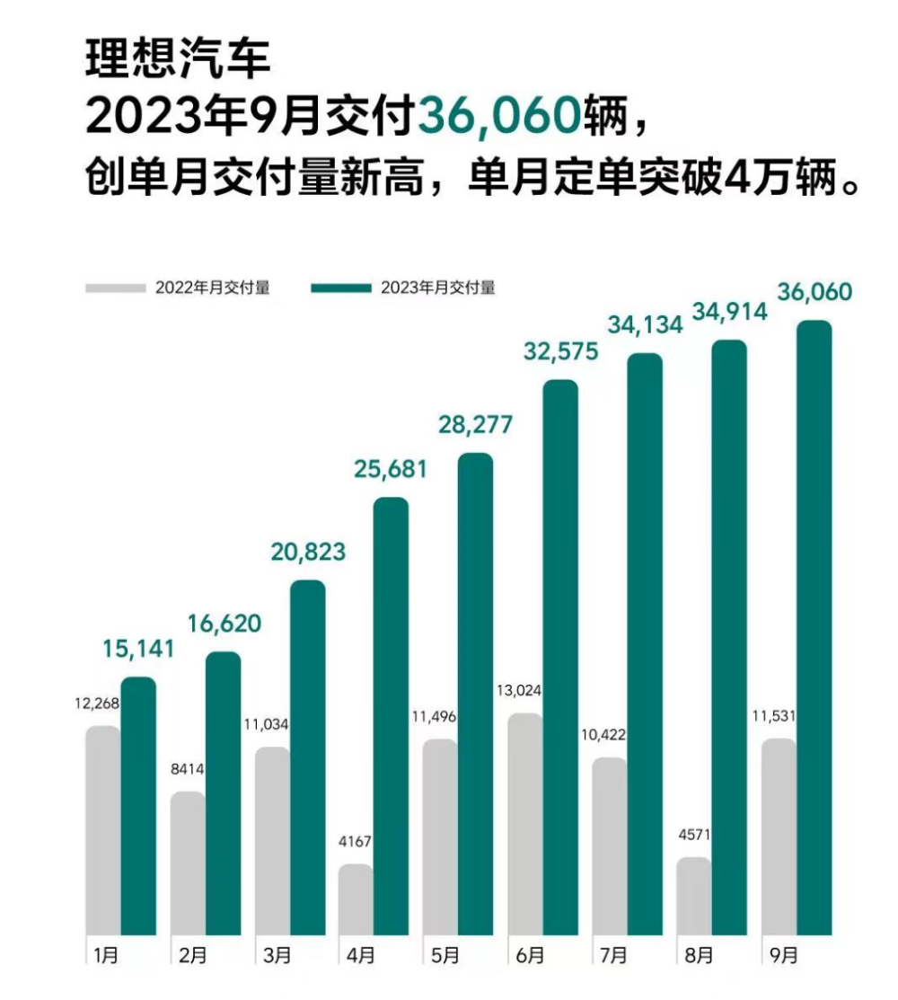
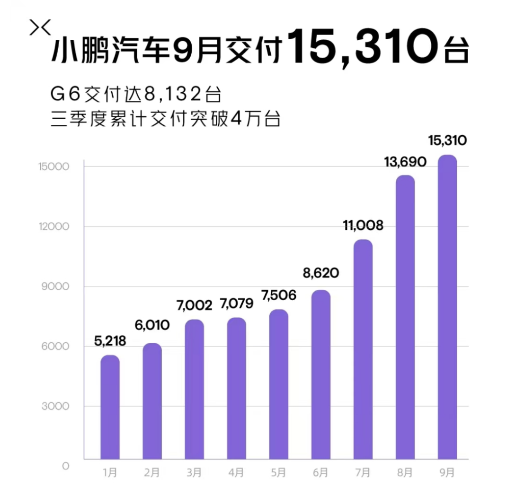
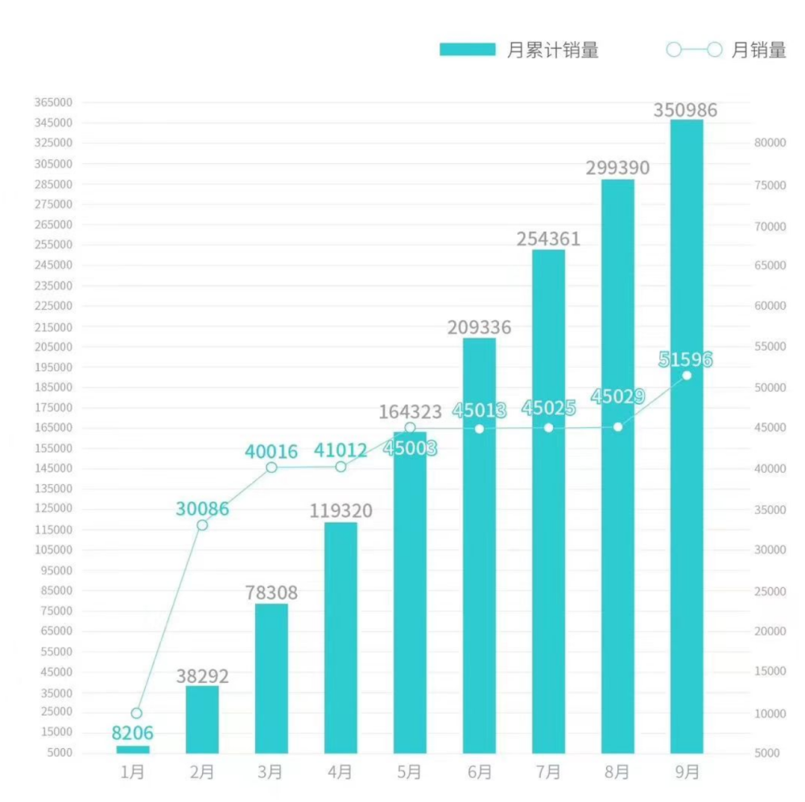
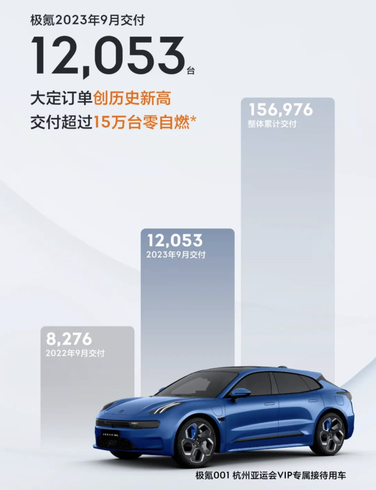
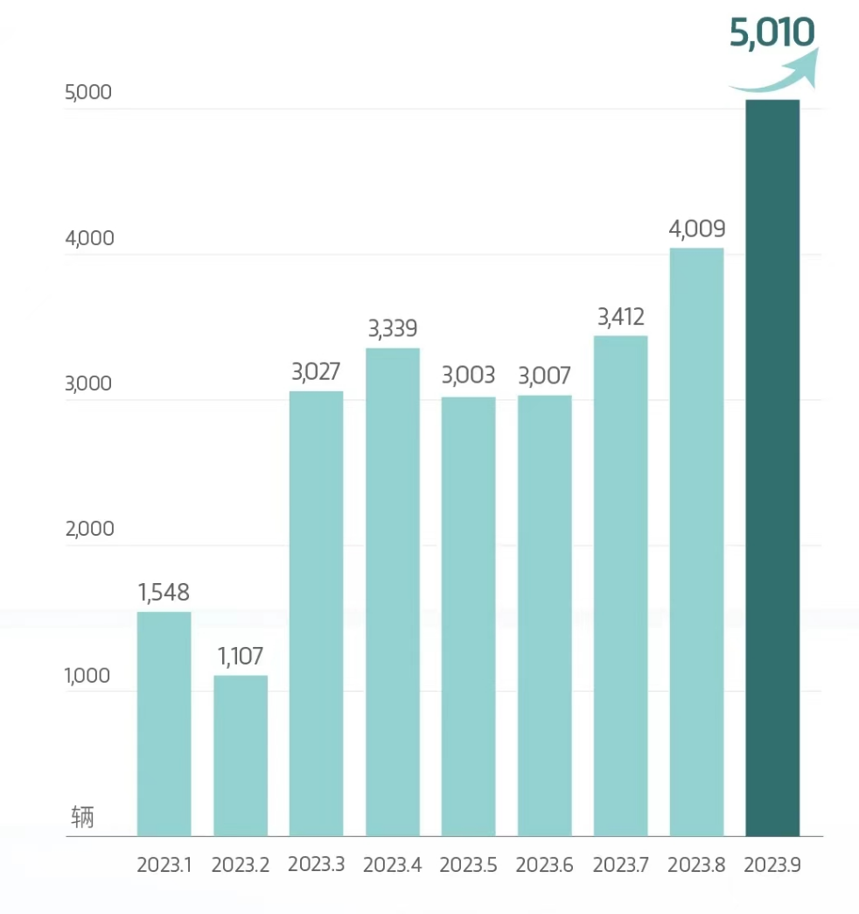

# 新能源车企9月销量出炉：理想交付36060辆，小鹏汽车环比增长12%

腾讯汽车10月1日讯
各大汽车厂商陆续公布9月交付数据，其中理想汽车9月共计交付新车36060辆，同比增长212.7%，创单月交付量新高。小鹏汽车2023年9月交付15310辆汽车，环比增长12%，2023年第三季度总交付量超过40000辆。广汽埃安9月交付新车51596辆，同比增长72%。岚图汽车9月交付新车5010辆，同比上涨99%。

**理想汽车2023年9月交付36060辆，创单月交付量新高**

2023年9月，理想汽车共计交付新车36060辆，同比增长212.7%，创单月交付量新高。截至2023年9月30日，理想汽车第三季度累计交付量为105108辆，同比增长296.3%，全年累计交付量已经达到244225辆。

**小鹏汽车2023年9月交付15310辆汽车，其中G6交付量达8132台**

小鹏汽车2023年9月交付15310辆汽车，环比增长12%；2023年第三季度总交付量超过40000辆，三季度累计交付环比增长72%，单季交付4万里程碑达成。9月小鹏G6交付量达8132台，累计交付量达19381台。

**广汽埃安9月交付新车51596辆 同比增长72%**

广汽埃安公布2023年9月交付新车51596辆，同比增长72%；1-9月累计销量350986辆，同比增长93%。

**零跑汽车9月交付量15800台 环比增长30%**

零跑汽车官方发布消息称，9月，零跑汽车交付量达到15800台，创历史新高，三季度累计交付44325台，环比增长30%，月均交付近1.5万台。

**极氪汽车：9月交付12053台，上年同期为8276台**

极氪汽车官微宣布，9月交付12053台，上年同期交付量则为8276台；整体累计交付量为156976台。

**岚图汽车9月交付5010辆，同比增长99%**

岚图汽车9月交付首次突破5000辆，达到5010辆，同比增长99%；1-9月累计销量较同期增长102%。岚图汽车还表示，9月岚图汽车国内新增6家岚图空间、1家全功能用户中心，覆盖4个城市；截至2023年9月，累计为用户充电超9887万度，减少碳排放超30907吨。

