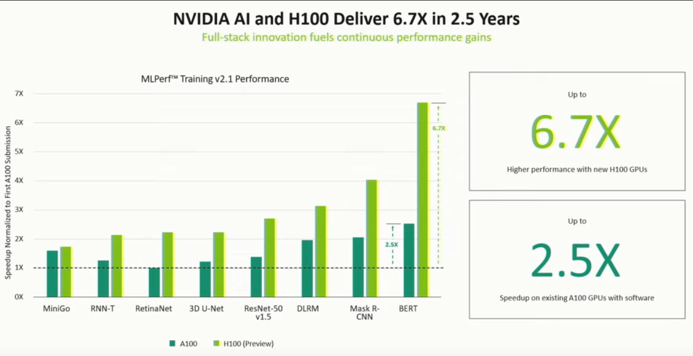

# 英伟达发文介绍“黄氏定律”，GPU 推理性能十年提升 1000 倍

IT之家 10 月 1 日消息，正当人们争论摩尔定律在 2020 年代是否会放缓、是否仍然适用、甚至已死的时候，英伟达发文宣布了“黄氏定律（Huang's
Law）”。

据英伟达一篇最新博客称，在过去十年中，英伟达 GPU 人工智能处理能力增长了 1000
倍。“黄氏定律”意味着在“单芯片推理性能”中看到的加速不会逐渐消失，而是会继续出现。

文中表示，英伟达首席科学家 Bill Dally
所描述的“后摩尔定律时代计算机性能如何实现的结构性转变”主要基于人类的聪明才智。这一特征似乎难以建立一条定律，但 Dally
认为，下面的图表标志着“黄氏定律”的开始。

IT之家查询发现，“黄氏定律”并非英伟达自己的首创说法。IEEE Spectrum
第一个提出以黄仁勋命名定律，“黄氏定律”后来因《华尔街日报》的一篇专栏而广为人知。

根据 Dally 最近在 Hot Chips 2023 会议上的演讲，上图显示过去十年 GPU AI 推理性能增长了 1000 倍。Dally
表示，有趣的是，与摩尔定律不同，工艺缩小对黄氏定律的进展几乎没有影响。

Dally 回忆起如何通过改变英伟达 GPU 底层数字处理来实现 16 倍的增长。使用 Transformer 引擎的 Nvidia Hopper
架构的到来带来了另一个巨大的推动。据称，Hopper 使用 8 位和 16 位浮点与整数数学的动态组合，实现了 12.5 倍的性能飞跃，并且节省了能源。

Dally 还称，尽管摩尔定律的收益不断减少，但他相信“黄氏定律”仍将继续存在。

