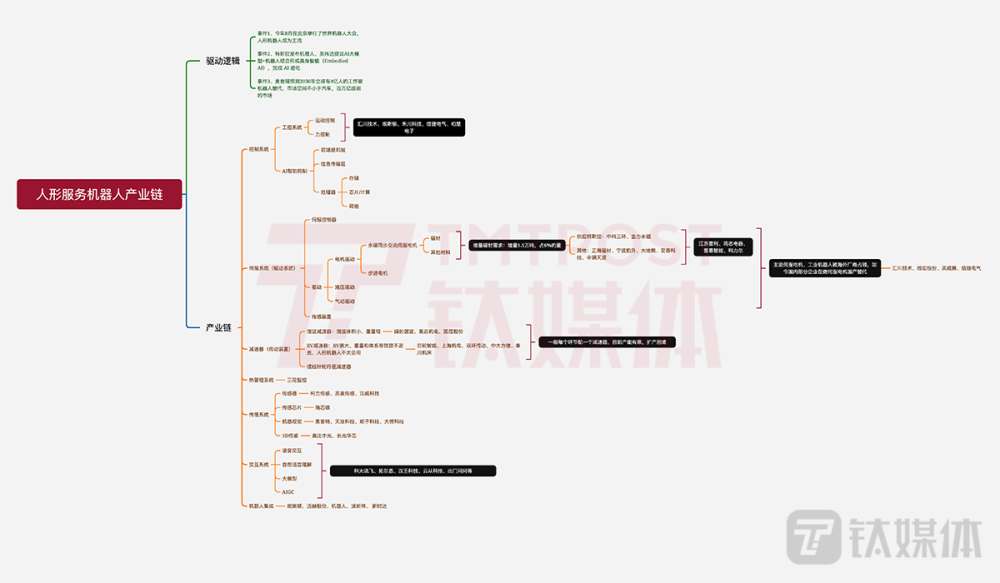
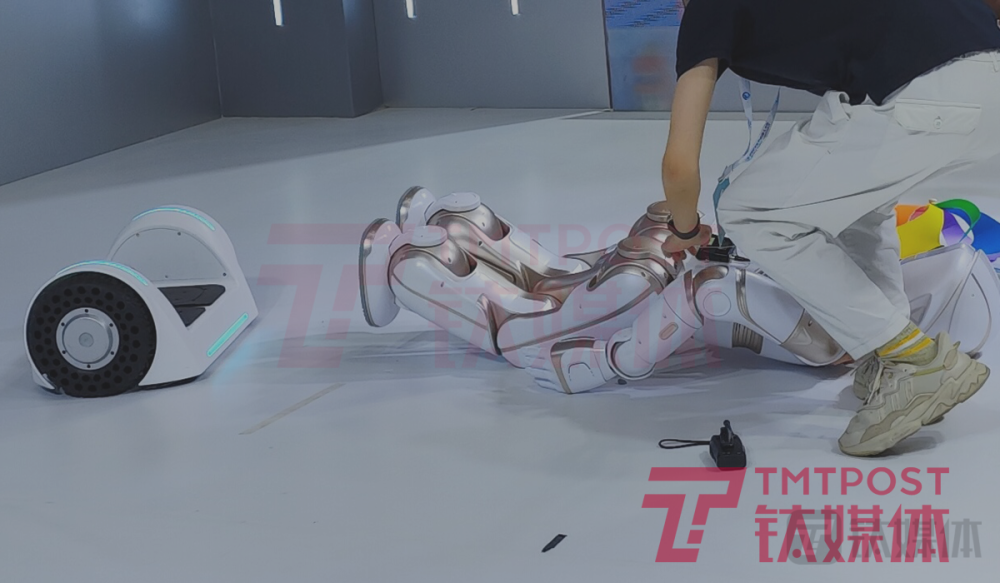
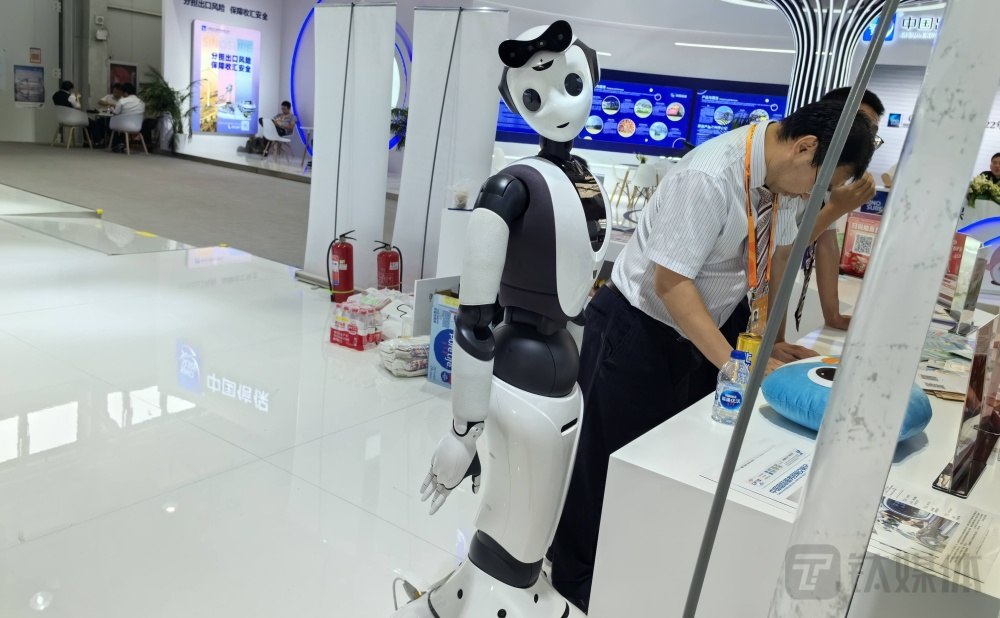
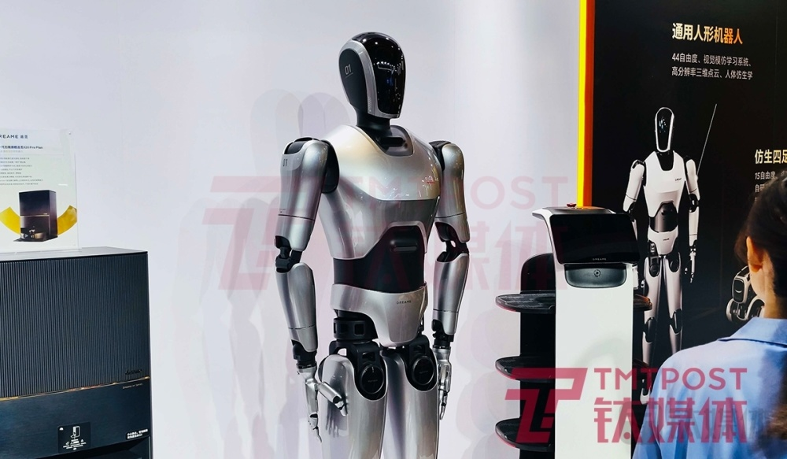

# 马斯克遇难题：未来10年内，人形机器人行业难以大规模商业落地

 _由人工智能技术生成的马斯克与虚拟机器人之间亲密图像（图片来源：X/@danielmarven）_

随着以ChatGPT为代表的 AI 大模型技术加速革新，特斯拉旗下人形机器人也迎来“进化”。

**9月末，** 埃隆·马斯克（Elon
Musk）创立的特斯拉发布视频，展示其研发的最新“擎天柱”（Optimus）人形机器人，能够执行多种任务，包括视觉分类积木和简单瑜伽动作等，还称其神经网络已经完成了端到端的训练。

马斯克随后评价称，上述进展是一个重要的“Progress（进步）”。

对此，追觅科技创新机器人业务产品总监刘宇龙 告诉钛媒体App：“上述进展已经存在于理论层面，而特斯拉把学术研究转化为工程，并向着产品化更进一步。”

_特斯拉Optimus做瑜伽动作的动图（图片来源：特斯拉官方账号）_

早前马斯克已经表示，人形机器人Optimus最终价格可能低于2万美元，预计3-5年内量产。一旦产品成熟，量产数量可能将达到100亿-200亿台——超过了地球人口的数倍，市场或超电动车达百亿美金级规模。“未来，地球上机器人的数量将超过人类，每个人都将拥有一个机器人。”

实际上，借助 AI
大模型，人形机器人市场近期十分火爆。二级市场，年初至今，人形机器人概念股平均上涨13.74%，跑赢同期上证指数，昊志机电等多只个股累计涨幅超50%；投融资方面，腾讯、百度、比亚迪、软银愿景基金、高瓴、蓝驰创投等数十家头部企业和机构入局，优必选、追觅、傅利叶智能、星动纪元等多家涉足相关技术的公司已累计完成超过50亿元融资。

**然而，目前人形机器人行业仍面临大规模商业化难题。**
尽管中国每年生产数千台硬件产品，但都未实现大规模量产和商业落地，多在实验室研发和测试。业内预测，可能需要未来20-30年后，人形机器人才能进入家庭。

蓝驰创投合伙人曹巍则直言，人形机器人企业真正形成量产规模，至少需要10年的一个周期。

如今，“世界首富”马斯克正遭遇一道难题：无论是 AI 大模型，还是“具身智能”概念，也很难实现人形机器人行业规模化落地。

基础技术薄弱，人形机器人落地面临四大挑战

人形机器人是一种旨在模仿人类外观和行为的机器人，尤其特指具有和人类相似肌体的种类，更多应用于服务、工业、军事类场景领域，如替代人类做物流分拣工作、国防军事、生活生产、家政服务等。

自1970年代起，人形机器人技术逐步落地。日本早稻田大学曾于1972年发布首个全尺寸人形智能机器人WABOT-1，尽管当时技术能力仍比较弱，但它可以透过人工嘴以日语与人交流，随后WABOT二代可演奏风琴、阅读乐谱等，使人们看到仿生机器人替代“人类”的可能性。

2001年，美国麻省理工学院曾研发出号称世界上第一个有类似人类感情的机器人。2016年，美国波士顿动力公司发布双足机器人Atlas，具有极强的平衡性和越障能力，能够承担危险环境搜救任务。如今，市场已逐步将人形机器人从科学幻想到实验室，再到产业当中。

**事实上，人形机器人作为机器人的最高级形态，是衡量科技创新和高端制造业水平的重要标识。**

**从产业链来看，** 人形机器人上下游十分复杂，包括控制、伺服、传感、交互等供应系统，涉及数百家零部件厂商。钛媒体App简单梳理了一张思维导图：

 _人形机器人产业链整理（来源：钛媒体App）_

另据Markets and Markets预计，预计到2027年，全球人形机器人市场规模达173亿美元，复合增长率为63.5%，市场发展广阔。

**然而，作为新兴科技产物，尽管中国机器人产业链齐全、应用规模广泛，但目前国内市场上诞生的人形机器人，技术层面上还停留在新产品对外发布阶段，商业层面上还未实现大规模量产和商业落地，而且企业自身亏损严重。**

**钛媒体App经过多个企业、行业走访交流发展，要想人形机器人商业化落地，目前主要面临四大挑战：**
企业研发高亏损严重，基础技术能力薄弱、从而产品力弱造成市场需求减少，算力能力需求大，以及机器人数据安全体系不足。

**首先是人形机器人造血难、研发高、亏损严重。**

**“** 人形机器人是 AI 领域中最烧钱的产业，可能资本市场投入100个亿在短期内也很难会有产品和技术产生。”澎湃新闻引述的一位行业人士这样表示。

今年2月，人形机器人公司优必选科技向港交所提交的招股书显示，2020年-2022年9月的33个月内，优必选总净亏损额高达24.03亿元，同期研发总支出达12.7亿元，
**相当于优必选每赚1块钱其中超过一半要放研发当中。** 造血能力弱、高额亏损、研发投入高，是人形机器人行业的常态。

另一家由软银资本投资的国内人形机器人公司“达闼科技”，于2019年向美国证券交易委员会（SEC）提交的招股书显示，该公司2018年净亏损达到1.57亿美元，而在2017年，这一数字仅为
4770 万美元，同期毛利润640万美元，运营亏损达7240万美元。而2018年该公司研发支出达5410万美元，比上一年增长138.5％，甚至超出了毛利润。

一个关键点在于，这些人形机器人企业大都是政企领域，回款长、客户依赖性较强。

其中，优必选招股书显示，临平开发建设为优必选2020年至2022年的前五大客户，贡献收入分别为1.24亿元、6315.9万元、4921.4万元，占比分别16.8%、7.7%、9.3%，三年累计实现销售金额超2亿元。而达闼2018年的前六大客户占总收入的97％，集中度很高。

“为改进和完善我们对营运资金的管理并缩短现金周转周期，我们将继续利用我们的既定地位与客户及供应商进行谈判，以获得更具吸引力的合同条款，并实施更严格的信贷期限审查及批准程序。未来，我们计划与更多信用状况良好的客户建立关系，亦期望以更有效的方式收回我们的贸易应收款项并且实施相关措施。”优必选在招股书中给出改进意见。

那么，优必选的盈利点之一在哪呢？答案是政府补助。招股书显示，2020财年、2021财年、2022财年及2023年前四个月，公司确认政府补贴金额分别为6620万、5950万、2660万、880万元。

优必选认为政府补助的风险点在于，政府补贴的时间、金额及条件由政府部门全权酌情决定，如果停止补贴或减少补贴等，则或会对公司业务、财务状况、经营业绩及前景造成不利影响。

长期来看，整个人形机器人行业没有一个盈利模式，高昂的研发投入和人员投入，使得企业长期亏损，而且这个情况会长期存在。

**其次，国内人形机器人的基础技术能力薄弱，只依靠现有的软件算法和产业链支持，无法提升产品的创新能力。**

今年8月举行的2023世界机器人大会上，共有160家国内外机器人企业参展，带来了近600件展品。其中有超过20款人形机器人产品或模型在现场展示，引发关注，现场人群挤到水泄不通。

然而，钛媒体App编辑在本届机器人大会上看到的一个小插曲：8月17日中午12点30分左右，某国内企业展示的人形机器人产品在展区突然从滑轮上摔倒，部分零部件散落地上。事发仅几秒，现场人员迅速将其扶起并推往后台。

这不是人形机器人第一次摔倒。两年前上海世界人工智能大会上，一款人形机器人在公开表演期间走路不稳随后倒下。而更多的人形机器人产品，目前基本属于PPT、视频展示或测试，很少能对外公开演示一小时以上。

因此在今年世界机器人大会上，很多人形机器人企业为防止出现意外，并没有演示设备长时间走路，而最终现场展览的人形机器人，要么静态、PPT图片或只有上半身有动作，要么通过滑轮、平地等方式行走最多100米距离。

一位行业人士告诉钛媒体App，目前国内的人形机器人技术还远远达不到量产应用标准，主要是基础技术薄弱、工程化难度较大，至多属于短程测试，
**人形机器人的表演性质大于实用性质。**

“人形机器人企业目前只做表演，这说明离应用还很远。大家幻想人形机器人无所不能且通用，但实际上我们连专用都达不到。各家展示的人形机器人基本没什么区别，没有新的创新能力，这就是中国人形机器人行业现状。”某家人形机器人公司负责人在世界机器人大会的一场闭门圆桌中表示。

他直言，现在行业里出现了一个怪现象：一个人做报告，1000人拍照片；一个机器人参展，所有同行来观展、模仿，没有人打算再做全新的创新技术路径。

国际机器人联合会在一份报告曾提到，尽管中国机器人密度超美国，但在人形机器人领域，美国的基础技术实力强于其他国家和地区。

而这种基础技术薄弱，导致产品竞争力不强，市场对人形机器人期待值降低。多位行业人士告诉钛媒体App，目前企业将人形机器人以“免费代售”形式捆绑其他公司产品现象比较普遍，更多是演示、简单的导览工作，而非真正的实用创新。

_某银行在2023年服贸会期间展示了一台人形机器人，但设备却没有正常供电，基本都是人工在介绍（来源：钛媒体App编辑拍摄）_

一位供应商企业负责人告诉钛媒体App，其公司采购了人形机器人，并内部测试了一段时间，但发现无法实际应用到工厂中解决劳动力短缺问题，因此，最终公司不得不选择与机器人企业协商退货事宜。

**第三，人形机器人的算力能力需求大。**

2000年图灵奖获得者、中国科学院院士、清华大学交叉信息研究院院长姚期智在演讲中表示，计算能力的挑战非常重要，即使谷歌研发的Robotics
Transformer模型，要做到机器人控制的话，只能达到三个赫兹的水平，和通用人形机器人需要的500个赫兹差的很远，距离实际需要的控制水平仍有许多事情要做。

从动态角度看，人形机器人需要实时控制系统，所有的伺服关节也要同步运动，传感器的数据也要同步采集，从而保证算法的输入和输出都始终处于一个节拍，从而保证算法的性能。所以，实时算法急需高算力的支撑，让系统在一定的时间周期内完成计算。

优必选北研所高级算法工程师董浩曾提到，在算力层面，机器人控制系统可以为开发者提供最多三个主控板卡，每个板卡可以选择Arm、DSP和X86不同的硬件平台来进行配置，以满足不同场景下的算力需求。

位置、姿态、速度和力，都是人形机器人需要高算力能力的重要原因。而人形机器人未来的目标是要走进千家万户，这就要求必须具备对复杂环境的适应性算法，包括走路时对地面的适应性、手臂工作时对障碍物的适应性、机器人在人机交互、人机协同时的适应性。这些复杂算法都对控制器的算力提出了巨大的挑战。

**最后，机器人在数据安全能力和体系上都存在不足。**

2023年世界机器人大会上，姚期智提到，机器人的发展需要收集很多数据，其中也面临很多安全隐私等方面问题。

美国加州大学洛杉矶分校教授、RoMeLa实验室创始人Dennis
Hong则表示，此前其研发的人形机器人因为数据安全问题造成了意外事件。因此，其团队目前在机器人扭力控制方面加大了很多安全层，比如说振动、加速、扭矩等，如果出现危险团队会立刻断电，防止人形机器人不受控制。

而随着ChatGPT引发大模型热潮，公众比较担心聊天机器人ChatGPT的恶意利用，可能带来的数据安全问题，例如利用自然语言编写能力编写恶意软件逃避防病毒软件检测；利用对话功能冒充真实的人或者组织骗取他人信息；企业员工使用ChatGPT进行辅助工作泄露商业机密等。

“在机器人的实际应用中，家庭场景最具挑战性。而马斯克的人形机器人首选应用在工厂和办公室，因其环境稳定。但家庭环境的非标准化需求，对人形机器人的硬软件要求更高。”有行业人士公开表示。短期内过度追捧人形机器人对行业发展不利，因为人形机器人是一个长期投入的赛道，不是炒作就能解决的。

曹巍则认为，国内目前还不能说已经来到了人形机器人的时代，更为合适的是通用机器人的时代。即便通用机器人虽然不一定具备人形，但未来这类机器人或能够解决各类不同的任务。

政策支持加码，人形机器人寻路

**“作为AI大模型爆发元年，2023年对机器人产业是一个遇见‘iPhone时刻’的奇点。”刘宇龙告诉钛媒体App。**

自2023年起，随着以ChatGPT为代表的 AI 大模型风靡全球，人形机器人产业加速，多家企业公布通用人形机器人产品。

今年3月，机器人公司追觅公布了其研发的通用人形机器人产品，实现了高度仿生，身高178cm，体重56kg，全身共44个自由度，可以完成单腿站立，同时集成了AI大模型，具备高质量的对话沟通能力。

今年8月，曾拥有百万年薪的华为“天才少年”稚晖君（彭志辉），联合成立了智元机器人公司，并发布了其最新首款具身智能的通用人形机器人远征
A1，身高175cm，体重53kg，最高步速可达7km/h，全身49个自由度，可以执行双足行走、智能任务、人机互动等，并采用上下肢分体的模块化设计，成本价不到20万元，预计明年快速切入商业化落地。

“人形机器人行业现正受到两大影响：一是AI的快速发展使机器人能理解并执行人的指令；二是关键部件成本的迅速下降。这预示着行业正处于一个大规模商业化的转折点。”智元公司高管对钛媒体App表示，目前其本体的国产化率能够达到80%-90%以上。除了一些个别芯片之外，基本上都是用国产零组件，应用于汽车工业领域等。

值得注意的是，智元公司提到的“具身智能”（Embodied
AI），是指一种基于物理身体进行感知和行动的智能系统，核心是利用本体、小脑和大脑三部分，通过智能体与环境的交互获取信息、理解问题、做出决策并实现行动，从而产生智能行为和适应性。今年一场半导体会议上，英伟达CEO黄仁勋表示，AI
的下一个浪潮将是具身智能，随后这一概念就引发了众多关注。

“在AI大模型快速发展的当下，人形机器人可作为优质载体，提升自身的‘自主功能’，实现 AI '具身化'。现在机器人上的许多关键技术节点已经突破了，加上 AI
大模型技术，我相信能够更好地提升机器人的产品智能化体验。例如能让人形机器人的智能交互变得更加‘像人’，这都会极大加速机器人的商业化落地进程。”刘宇龙表示。

刘宇龙对钛媒体App表示，很多机器人公司已不局限于搭建机器人身体与小脑，更亲自做场景下的应用。任务完成度也可评估机器人的设计和制造。借助大模型的语义理解和视觉模仿学习，人形机器人能如自主拉花咖啡等技能。结合高功率密度电机、深度相机等关键部件和高精度算法，实现精确的眼手协调配合。

“在我们看来，机器人能自主完成咖啡拉花，显示其作为硬件平台，已从实验室走向人类生活的应用。若基于追觅人形机器人已有的优秀本体，我们每年开发3个应用场景，5年可达15个。开发者进一步开发这些场景，通用人形机器人的应用将迅速扩展。”刘宇龙表示，目前追觅科技每年研发费占比超过10%，研发投入始终高于同行，其中1/3投入在本领域的产品迭代，1/3投入产品创新，1/3投入到新领域创新。

除了追觅和智元机器人，一些原有深耕四足机器人的企业也开始瞄准人形机器人赛道，比如宇树科技。

“我个人早几年不看好人形机器人这个事情，因为我一直觉得目前人类的控制技术完全没办法驾驭人形机器人这么复杂的机器人形态，”宇树科技创始人王兴兴在机器人大会上讲到，“去年底由于通用性
AI 进展远超我个人预期，我们开始立项做通用人形机器人。”

曹巍认为，人形机器人的投入使用以及科学生态圈的打造离不开政府的支持。当下，中国已经成为全球最大的机器人消费国，而且有非常明确的人形机器人政策指引和政策落地。在人口增长放缓、老龄化比例上升的当下，AI
机器人有望帮助人类解决关键性问题。他直言，从整个科学生态圈的视角来看，未来中国一定会诞生伟大的人形机器人公司。

**当前，中国正加大推进人形机器人产业发展，北京、深圳、上海先后发布产业支持政策。**

5月31日，深圳发布《深圳市加快推动人工智能高质量发展高水平应用行动方案（2023-2024年）》提出，孵化高度智能化的生产机器人，加快组建广东省人形机器人制造业创新中心；6月15日，上海市印发《上海市推动制造业高质量发展三年行动计划（2023-2025年）》，瞄准人工智能技术前沿，构建通用大模型，面向垂直领域发展产业生态，建设国际算法创新基地，加快人形机器人创新发展。

6月28日，北京市印发《北京经济技术开发区机器人产业高质量发展三年行动计划（2023-2025年）》，称打造对标国际领先人形机器人产品，支持企业和高校院所开展人形机器人整机产品、关键零部件攻关和工程化，加快建设北京市人形机器人产业创新中心。预计到2025年，北京机器人研发投入年复合增长率达50%以上，搭建50个机器人应用场景示范项目，规上工业企业机器人密度达到360台/万人，产值规模达到100亿元。

曹巍在9月6日的一场线上直播中表示，当下创业者需要寻找人形机器人的窗口期，趁市场比较热，尽可能多地筹集资金。尤其人形机器人行业具有一定的周期性，未来会突然爆发产生商业价值。但目前来看，市场产生了过高的预期，因此现在比较热的时间点下，创业者需要多储备资金，然后等着“过冬”。

刘宇龙表示，目前机器人行业正在形成类似智能手机的生态，形成标准化的产业链，在这过程中，会催生对于关节模组、灵巧手等关键执行部件以符合人形机器人需求的控制大脑等多类零部件的需求，毫无疑问会成为下一个商业化风口。他强调，企业应该以机器人的技术和能力，解决行业痛点和效率，机器人价值才能得到指数级的提升。

吉林大学唐敖庆讲座教授任雷认为，人形机器人的关注度呈周期性变化，有时由技术驱动，有时受其他因素影响。而马斯克此次发布的“擎天柱”对当前的热潮起了关键作用。

2023世界机器人大会一场主题论坛上，国家工业和信息化部副部长徐晓兰表示，通用 AI
技术取得突破性的进展，为人形机器人的创新发展提供了重要的驱动，人类正在迎来人形机器人与通用 AI
融合发展的热潮。“面向安防、制造、公共服务和特种应用等场景的需求，将推动重点行业应用落地，带动技术产品迭代升级，鼓励重点行业和地方政府探索开放应用场景，拓展新模式、新服务和新业态。”

徐晓兰强调，下一步工信部将坚持顶层设计，通过指导产业创新发展、整机带动、软硬协同和生态构建，来推动中国人形机器人技术和产业的高水平发展。

**（本文首发钛媒体App，作者｜林志佳）**

