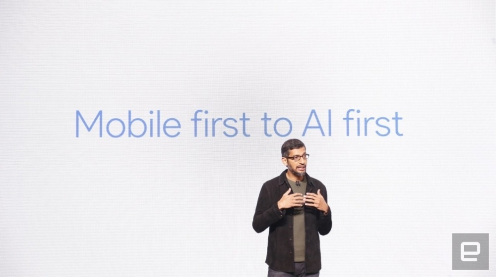
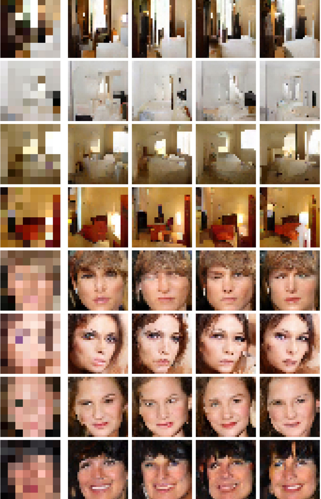
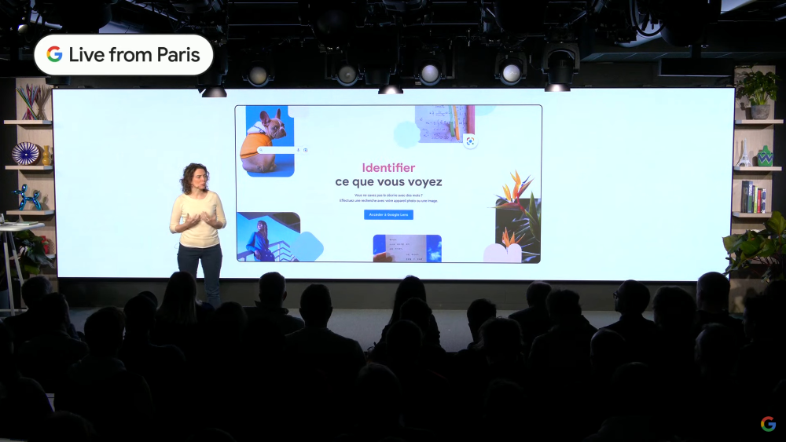
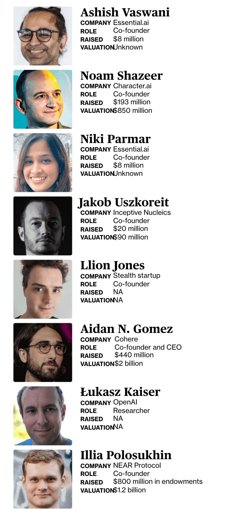
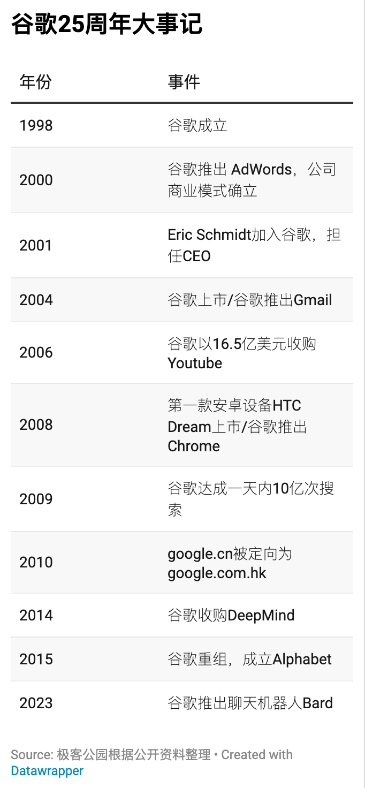

# 谷歌25周年：因大公司病而落后于OpenAI，被打醒后全力押注AI

作者｜Moonshot、 汤一涛

编辑｜靖宇

前情提要：

除了社交媒体领域，Google 在 21 世纪前两个十年，凭借搜索技术一直独步于硅谷。搜索所带来的丰厚广告收入，让两位尝试人可以安心在 Google X
实验室的创新项目上马放南山，大玩特玩。

直到去年由 OpenAI 的 ChatGPT 引发的又一次 AI 浪潮席卷全球，并被认为将吞噬搜索技术的时候，Google 才真的急了。

讽刺的是，2014 年前后的 AI 第一波浪潮，正是 Google 掀起的，而那恰恰成了 OpenAI 崛起的催化剂。

**「起了个大早，赶了个晚集」，这句俗语，就像是 Google 在AI时代的缩影** 。

不同于此前那些摆到台前的服务和产品们，Google 在人工智能上的研究，似乎多的是技术，少了些应用。在我们回顾近十年 Google 在 AI
上的投入和成果，梳理了这家公司同 AI 的关系后，似乎能觉察到为什么当下 Google 在 AI 时代，身处了一个不上不下的尴尬局面。

Google Brain

正如多年前的佩奇和布林相遇在斯坦福大学的一个研究项目里，因 PageRank 过于突出，二人独立出来成立 Google。

**2011 年，杰夫·迪恩、格雷·科拉多、吴恩达三人参与了斯坦福大学和 Google 的联合研究项目 Google X，其中一个子项目叫 Google
Brain** ，他们的目标是研究深度学习和神经网络，以改进谷歌产品和服务的性能。他们坚信，人工的「神经网络」，能像婴儿一样主动去建立对世界的认知。

很快，Google Brain 展现出了惊人的效益和成功，Google X 前负责人埃里克·泰勒曾透露， **Google Brain
当时赚到的钱超过了整个 Google X 部门的成本** 。

于是 2011 年，Google Brain 独立成为 Google 的人工智能项目。

第二年，Google Brain 就展现出了它在计算机视觉领域的应用潜力，杰夫·迪恩和吴恩达向由 16000 台电脑集群组成的人工神经网络，展示了十万个
YouTube 视频，一周后， **在从未被「告知」什么是猫的前提下，这个系统集群准确识别到了「猫」这一概念** 。

 _2012 年 Google Brain 团队合影，举着的是神经网络识别出的「猫」｜图源：Google_

随后《纽约时报》的采访，Google Brain 的论文，美国国家公共广播的报道……纷至沓来的曝光，不仅 Google Brain
名声大噪，在大众视野里，这可能是人们第一次直观地感受人工智能的应用。

如今我们都知道，AI 的养料是「数据」。 **Google Brain 的成功，靠着也是 Google
多年来的在文字、图像、视频上的数据储备，庞大的算力基础设施** ，以及足够的经济投入，在 AI 领域，Google 率先实现了「Connect the
dots」。

同期，亚马逊、Facebook、微软甚至大洋彼岸的百度、阿里巴巴，都开始关注并投入到 AI
的研究和发展里。哪怕各大科技公司主营业务交集不多，但面对来势汹汹且潜力无限的 AI，人才和团队的军备竞赛难以避免。

DeepMind

2013 年，在 Google Brain 成立两年后，Facebook 同位于英国伦敦的、一家名不见经传的 AI 初创团队 DeepMind
抛出橄榄枝。彼时的 DeepMind 濒临破产，但仍坚持独立运营和和对 AI 伦理的坚持，面对 DeepMind
团队给出的「不能做」的条条框框，Facebook 打了退堂鼓。

一年后，Google 签署了 DeepMind 拿出的《道德与安全审查协议》， **以 6 亿美元的价格，收购 DeepMind** 。

而这桩轰动 AI 行业的收购案起初的「牵线人」，介绍 Google 联合创始人拉里·佩奇和 DeepMind 联合创始人哈萨比斯相识的共友，亦是
DeepMind 早期投资人，是伊隆·马斯克。他也是最反对这桩收购案的人。

**马斯克在 DeepMind 成立之初就注资 500 万美元，目的并不是为了经济回报，而是「监控」** ，因为 DeepMind
创始人哈萨比斯曾在会面时对他说「机器的智能未来可能超越人类，甚至可能想毁灭人类。」

在《马斯克传》中，马斯克直言曾多次和旧友拉里·佩奇讨论 AI 威胁论，他认为 Google 是最有可能让 AI
失控的公司，出于好心但可能「意外创造出邪恶之物」进而毁灭人类。但佩奇则认为，AI 只是一种技术，就算人工智能机器人超越了人类，那也只是进化而已。
**这种观点上的分歧，让二人在屡次讨论后，关系都濒临破碎** 。

_二人因对 AI 观点的分歧，近乎绝交。左：拉里·佩奇；右：伊隆·马斯克｜图源：Fortune_

马斯克甚至曾筹钱试图阻击 Google 收购 DeepMind， **但在失败后，他于 2015 年联合创立了非盈利组织 Open AI，试图在 AI
领域制衡 Google** 。

但事情的走向可能不如马斯克当年所担忧的那样，Google 在收购 DeepMind 后会成为 AI 领域的寡头。

**2016 年，在被 Google 收购后，DeepMind 拿出 AlphaGo，以 4:1 击败当时世界排名第一的围棋棋手李世乭** 。这是继
2012 年「认猫」后，人工智能在大众面前第二次「霸榜级热搜」，主角依旧属于 Google，这也是 DeepMind 和 Google 最后的蜜月期，从此
DeepMind 就一直在「闹独立」。

2016 年 DeepMind 创始人哈萨比斯宣布用 AlphaGo 挑战人类棋手｜图源：

DeepMind 自从 2010 年成立以来，在 2020 年前从未实现过盈利，每年都要烧掉 Google 几亿英镑。作为一家商业大公司的
Google，也试图「逼着」DeepMind 做实事，比如贴上「Powered by DeepMind」标签给 Google Cloud
背书，或者承接医疗业务，这就让 DeepMind 反骨更甚，更看重自己的独立性。何况 2017 年 Google 和五角大楼的合作的 Maven
计划，早已触及收购时 DeepMind 给它设定的道德红线。

从伦理到现实，DeepMind 和 Google 面不和心也不合，究其原因还是二者对人工智能的发展方向不同， **DeepMind
更重技术研发，Google 想要看到实际应用** 。

DeepMind 从创立到被 Google
收购，一直的目标都是创造通用人工智能，这也是当年让马斯克害怕的原因。这一目标不仅需要把握伦理的边界，还需要放长线去专注在对技术的钻研。不接地气和不好落地，这是
DeepMind 在 Google 旗下的尴尬处境。围棋下的再好，似乎解决不了现实世界的问题，那盈利也就遥遥无期。

2021 年，《华尔街日报》爆出 DeepMind 多年来一直和 Google 谈判，希望拿到运营自主权，要求一个独立的法律架构，而后 DeepMind
失败了，Google 拒绝了他们的请求。

DeepMind 和 Google 也就这样保持着尴尬又微妙的关系， **而当年为了对抗这笔交易而成立的 OpenAI
则如火如荼地发展起来，后续搭上了微软，如今成为 AI 行业的领头羊** ，在理论持续颠覆着领域，在应用上走进了我们的数字生活。

哈萨比斯能否在 DeepMind 实现他对通用人工智能的建造，马斯克的担忧会不会成真，DeepMind 是否后悔被 Google
收购，反之亦然，Google 还能包容 DeepMind 多久。这些问题，或许不是 AI 蓬勃发展起来的第一个十年可以解答的。

Al- first？

2015 年，拉里·佩奇在 Google 公司的博客上，宣布 Google 改组为 Alphabet 公司。

第二年，谷歌新任 CEO 桑达尔·皮查伊，在 I/O 开发者大会上发出声明： **Google 已经成为了搜索的代名词，Alphabet 未来将成为一家
AI 优先的公司** 。

_2017 年的 Google I/O 大会上，CEO 皮查伊表示要从「移动优先转向 AI 优先」｜图源：Engadget_

但现实推翻了 Alphabet 的设想，如今在线广告依旧占据了谷歌 80% 以上的收入，而 Alphabet 所有创新业务多年来持续入不敷出。自动驾驶公司
Waymo、智能家居公司 Nest、AR 眼镜 Google Glass…… 都从入局即颠覆的心态，到如今悄无声息的存在。甚至 **代表着 Google
颠覆性创新企图的秘密实验室 Google X，成立以来，最大的成就还是孵化出 Google Brain** 。

那个持续放飞又持续坠毁的信号气球 Loon 项目，就像是 Google 那么多次追求破坏性创新的缩影。反而是那些落地的技术，切实改善了 Google
的产品。

2016 年，Google 发布 Google Assistant，基于语音识别和自然语言处理技术的虚拟助手，Google Assistant
的一切核心技术都围绕着 AI，而它后续也集成进了智能家居系统 Google Home、智能穿戴系统 Wear OS、智能驾驶系统 Android Auto
等等系统，如今已是 Google 生态中不可或缺的一环。

2017 年，继「识猫」之后，Google Brain
在图像处理上又取得重大突破，他们利用神经网络和深度学习，用先识别后猜测图片像素的方法，可以把马赛克一样的原图还原成高分辨率的清晰图片。这一技术演变至今，我们得以在互联网上看到各种民间动手修复的「高清重制版」视频。

_Google Brain 用 AI 提高图像分辨率｜图源：Google Brain_

**同年，Google 发布 TensorFlow，一个用于构建和训练机器学习模型的开源框架** 。研究员、工程师、开发者甚至对 AI
好奇的普通人，都可以免费使用它去搭建自己的机器学习模型。TensorFlow 也支持多种编程语言和操作系统。

开源性质、不挑硬件的跨平台、良好的社区氛围，TensorFlow 就像是 Android 之于智能手机，Chrome 之于浏览器，它或许不会给 Google
赚到多少钱，但它无疑降低了入门 AI 的门槛，快速推动了机器学习和深度学习的发展。

从搜索到翻译，从语音助手到图像搜索，主流的那些 Google 服务，无一不渗透进了 AI 技术， **在产品体验越做越好的同时，AI
的应用兜兜转转还是回到了那些 Google 的「老家伙」上** ，而非 Alphabet，而非 Google X 想要的颠覆性创新。

「让机器更智能，以提升人类生活质量。」这是 Google Brain 团队的标语。简单改为「让软件服务更智能，以提升人类数字生活质量。」这就是 Google
25 年来一直在做的事情。Google Brain
联合创始人也是前负责人杰夫·迪恩曾表示，他希望避免出现「成功灾难」，即公司的理论研究能力超过了实际开发产品的能力。

这就是 Google 面对 AI 时代的拧巴，它在公司前十五年建立起的庞大的护城河优势，在 AI
来袭的时候，创新不敢用于颠覆，只能用于修缮，长期理论而不落地变现的业务，也会在公司里日益式微直到人才流失。 **Google
在许多领域领先太久了，它只想维持住领先地位，因为它曾以为前路没有其他对手与之匹敌** 。

很快，它真正颠覆性创新的对手来了。

被迫应战

2022 年 11 月 30 日，一家名为 OpenAI 的硅谷初创公司发布了 ChatGPT，引爆了全球公众领域对 AI 的讨论。

从创作诗歌到编写代码，ChatGPT 可以在几秒钟之内给出具有参考性的建议。人们惊讶地发现，AI
的能力已经远超他们的想象，甚至可能完全改变人类创造和消费信息的方式。

**3 个月后，谷歌匆忙迎战，推出了自己的聊天机器人 Bard** 。

从发布会简陋的布置可以看出谷歌的准备多少有些仓促，一位演讲者甚至遗失了演示用的手机。当天问题最大的是 Bard 的一个回答，它犯了一个事实错误，称 2007
年发射的詹姆斯·韦伯太空望远镜拍摄了第一张太阳系外行星照片。实际上，第一张太阳系外行星照片拍摄于 2004 年。

_Bard 发布会现场｜Tom's Guide_

次日开盘，谷歌股价暴跌 7%，市值蒸发 7000 多亿元人民币。

实际上 Bard 没有那么糟糕，毕竟 ChatGPT 也经常一本正经地胡说八道。但是自 ChatGPT
发布以来，所有人都在期待谷歌的回应。发布会上的错误击碎了谷歌过去十几年在 AI 领域的领头羊形象， **仿佛一夜之间，巨头谷歌在 AI 领域就被小公司
OpenAI 所超越了** 。

这看起来像是一个大卫和哥利亚的故事：一个创新者用一种破坏性技术，扳倒了一个行业内根深蒂固的巨头。但是翻看 OpenAI
的融资履历的话，就会发现，这实际上两个巨头间的较量。

OpenAI 起初是由 Sam Altman、Reid Hoffman、Elon Musk、Peter Thiel 等一众硅谷大佬成立的非营利组织，愿景是用
AI 使人类整体收益。但是众所周知，大模型的训练费用堪比烧钱，非营利的组织形式并不足以承载这么宏大的愿景。于是 OpenAI 在 2019
年迎来了组织形式调整，从非营利组织转变为了半盈利组织。也就是在同年，OpenAI 接受了微软 10 亿美元的投资。 **2023
年，微软又追加了第二笔投资。据说，这笔投资高达 100 亿美元，微软将持有 OpenAI 49% 的股份** 。

某种程度上，外界完全可以把 OpenAI 看作微软的子公司。实际上，就在 Bard 发布前一天，微软就宣布了要将 OpenAI 的技术，集成到 Bing
搜索引擎和 Edge 浏览器中。形式和 ChatGPT 一样，只要用户提出问题，Bing
就会检索相关网页信息，并直接以回答问题的方式将结果告诉用户。这一举动直接触及到了谷歌最核心的商业模式——在线广告。

虽然谷歌已经诞生了 25
周年，是这个星球上最以技术为傲的科技公司，但这家公司的核心商业模式与它刚创立头几年别无二致——在搜索页面「适当」地插入商家广告，并收取佣金。直到今天，谷歌超过
80% 的营收都直接来自于在线广告。

试想一下， **如果将来人们不再通过搜索框检索信息，而是直接向 AI 提问，谷歌要在哪里插入广告呢** ？谷歌可以轻松关闭一大堆项目（Google
Reader、Google Buzz、Google Glass、Google+），但是面对微软的挑战，这可能是一次稍有不慎就满盘皆输的战争。

大公司病

用一个词概括谷歌面对 OpenAI 的失利，「大公司病」应该是最准确的。

**今天的硅谷 AI 公司，几乎都有谷歌的影子** 。

GPT 技术中的 T 指的是 Transformer 语言处理架构。如果把 ChatGPT 比作是一个人的话，Transformer 就是它的大脑。实际上，
**这项技术就来自于 Google Brain 团队在 2017 年发布的论文《Attention is all you need》** 。

但是截止到 2023 年 8 月，这篇论文的 8 位作者已经全部离开谷歌。论文作者之一、人工智能公司 Cohere
的首席执行官艾丹·戈麦斯在采访中表示：「在谷歌这样的大公司，你不能真正自由地进行产品创新。从根本上说，公司结构不支持创新，你必须自己去建造这个结构。」

 _Transformer 8 位作者现状｜Bloomberg_

商业公司最可持续的生存方式就是不断赚取更多的利润。在这个过程中，资源会不可避免地向核心业务倾斜。过去十数年，谷歌的确是在 AI
领域投入资源最多的科技公司，期间也诞生了 AlphaGo、AlphaFold 这样突破性的技术，但这些技术始终没能成功商业化。

早在 2017 年，谷歌就研发过一款对话式机器人 LaMDA，但谷歌并没有像 OpenAI 一样将它广泛向公众开放。原因有二：

**首先，AI 技术与谷歌核心业务不适配**
。正如上文所说，谷歌最核心的商业模式是在搜索结果中展示广告，对话式机器人的出现会改变用户获取信息的方式，到时如何继续维持广告收入就是谷歌需要面临的问题。在没有外部压力，且主营业务还运行良好的情况下，谷歌没有动力寻求改变。

其次，作为一家全球用户几十亿的大公司，谷歌的一举一动都会产生巨大的影响。相比于激进地攻城掠地，不犯错往往才是最稳妥的策略。 **微软可以直接将
ChatGPT 加入 Bing 中，因为它的全球市场份额仅有 2.8% 左右** 。但是谷歌 Chrome 常年占据了 90%
以上的市场份额，一方面聊天机器人的加入会消耗很多算力；另一方面，AI 伦理方面的问题迫使谷歌不敢犯错。

谷歌的前产品经理 Gaurav Nemade
曾向《华尔街日报》透露：「谷歌顾虑很多，非常害怕公司声誉受损……他们倾向于保守主义。」在谷歌内部，有一个中央审查小组，这个团队的成员包括用户研究人员、社会科学家、技术专家、伦理学家、人权专家、政策和隐私顾问、法律专家。
**对于任何谷歌的产品，他们都会按照谷歌制定的人工智能准则评审，以把伦理问题降到最低** 。

就像是光脚的不怕穿鞋的，作为一家创业公司，OpenAI 无需承担这么大的道德压力，也不用为股价负责，自然可以更轻松地把 ChatGPT 推向市场。

那谷歌会输掉这场 AI 战争吗？其实还很难讲。

以技术来说，Tranformer 语言架构就是谷歌发明的，今天谷歌依旧是这个星球上 AI
技术积累最深厚的公司。以数据来说，训练大模型需要大量数据。谷歌在全球拥有几十亿用户，通过 Youtube、Google Map、搜索、Gmail
积累了大量数据，这是 OpenAI 这种初创公司所不具备的。

谷歌 CEO Sundar Pichai 在谷歌庆祝 25 周年的博文中写道：「AI 会完全改写科技，给人类创造性带来不可意思的推进。让 AI
给每个人带来帮助，有责任地部署 AI，这将成为未来十年谷歌最为重要的使命交付方式。」

这是一种「谷歌全力押注 AI」的宣言。人们常用大象转身来比喻大公司转型。这个过程也许很困难，
**但一旦大象转身成功，全力奔跑起来，也没有其它动物可以阻挡** 。

谷歌 25 周年大事记

