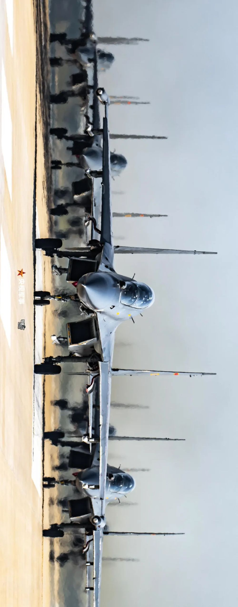

# 起猛了！满屏战机机机机机机机机机……

今天，“央视军事”发布的视频再次登上微博热搜榜。

满屏战机，数都数不清！《军迷之眼》再度上演“名场面”，而托举众多战机起飞的，正是这样一群兵↓↓

空军机务老兵回望来时路，“轻舟已过万重山”。

**空军航空兵某旅张永利** ，从事机务工作近30年，他与苏-30战机相伴的时间也有20多年了。

回忆与苏-30“初相识”的经历，这位老兵依然十分兴奋：“那时候能去学苏-30飞机，我是真的非常幸运的，也很自豪，因为这也就是我们国家当时最先进的飞机。”

“那时候我家里人打电话问‘你现在修的是什么飞机’，我说‘不能告诉你，要保密’，确实感觉很神圣。”

“苏-30飞机来部队的那一年，我印象特别深刻。因为那一年我的小孩3月份出生，然后4月我就到这边来了，它就像我家的小孩一样。”

20多年来，张永利就像照顾孩子一样，一直陪护着苏-30战机，跟着它走南闯北。

回顾这些年人民空军的发展，张永利说：“现在我们空军在不断列装，歼-10C、歼-16、歼-20，苏-30的光环已经慢慢褪去了，
**我的飞机在慢慢变老，但我们的飞机变好了。”**

“有一种感觉就像，年轻人现在流行的一句话， **‘轻舟已过万重山’** 。”

年纪轻轻被叫“地勤大爷”是一种什么体验？

**“黑灯瞎火上路，戴着墨镜装酷。远看以为是明星出户，近看原来是航空机务。”**

现实中的空军机务到底什么样？来听听他们自己怎么说↓↓

“机务工作确实催人老。干机务工作，大多数的时候都是风吹日晒，很多人20来岁，看上去就已经像是30岁、40岁。”

当被问到年纪轻轻就被人喊“地勤大爷”是一种什么体验时，空军某部机械师陈雷幽默回应说：“大家的这种称呼其实是对我们的一种认可。脸上的皱纹越多，就说明工作越仔细；脸色越黑，就说明工作经验越丰富。”

空军某部机械师谢吉亮则给出了这样的答案： **“航空兵就是一天一地。天上是飞行员，地面就是我们，我们支撑起来的，就是大国空军的天梯。”**

**别走开！按照惯例，《军迷之眼》还有一组高清大图来袭，速速收藏：**

**为大国空军撑起“天梯”，点赞机务工作者！**

**监制丨刘一鸣 马烨**

**主编丨徐蕾莹**

**顾问丨苏驰**

**导演丨吴龙飞**

**摄影丨吴龙飞 李峰**

**策划丨马刚 郑嵘**

**统筹丨杨国伟 何亚军**

**“侧卫”来华三十年特别致敬单元**

**历史顾问丨高卓**

**统筹丨杨国伟 何亚军**

**空对空（A2A）摄影单元**

**摄影指导丨吴龙飞**

**摄影丨李强**

**山谷幽行单元**

**方案细化丨杨国伟 周睿光**

**保障丨刘易斯**

**大象漫步单元**

**方案细化丨杨国伟 周睿光**

**保障丨孙林源 马涛涛 陈杰鑫**

**天路基石单元**

**保障丨岑剑敏 王维建 钟前鑫**

**场务尖兵单元**

**参与人员丨李清波 成俞昆 王伟杰 熊鹰 高海鑫 曹大爱**

**魔鬼之眼单元**

**参与人员丨陈向东 黄新才 万斯山 吴宜巍 路易 母文康**

**后期制作丨吴龙飞 杜宏鹏**

**鸣谢丨中国人民解放军95209部队**

**编辑丨王吴恺馨**

**©央视军事**

