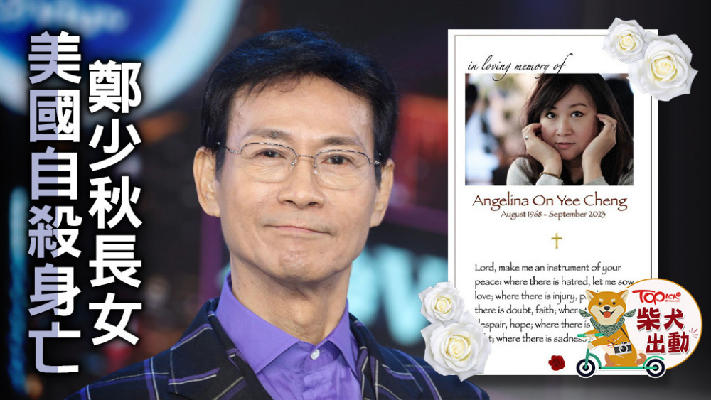
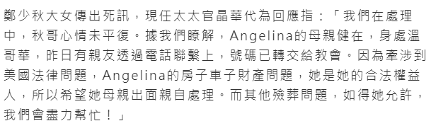
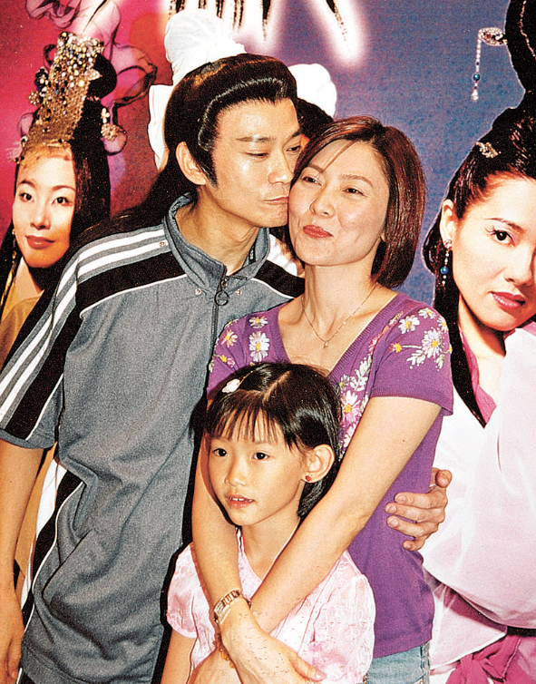
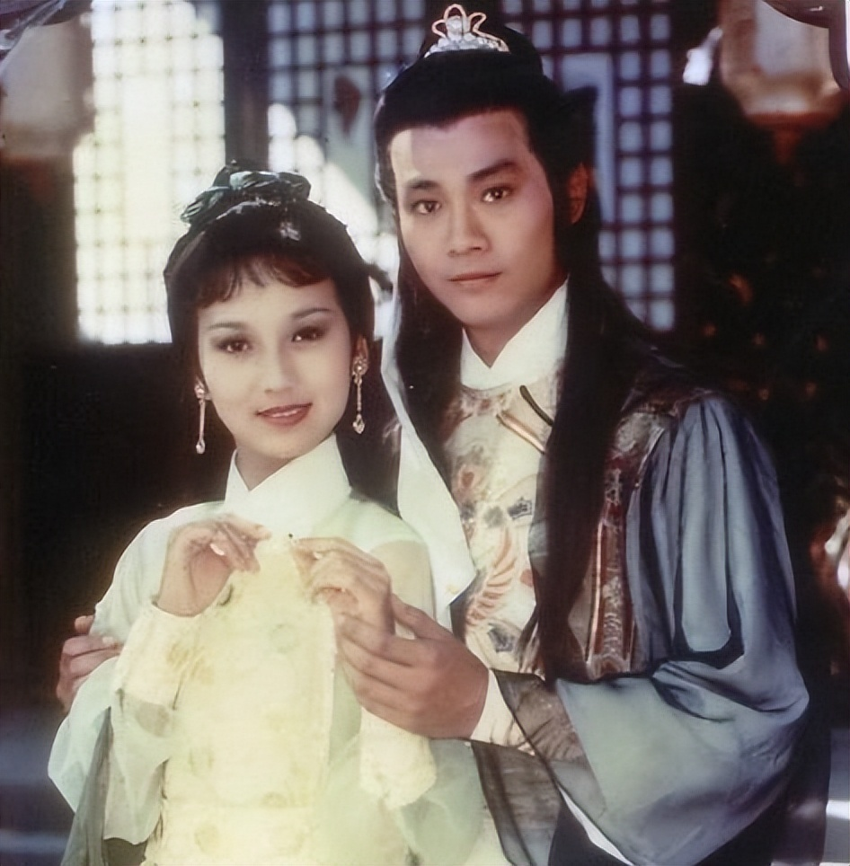
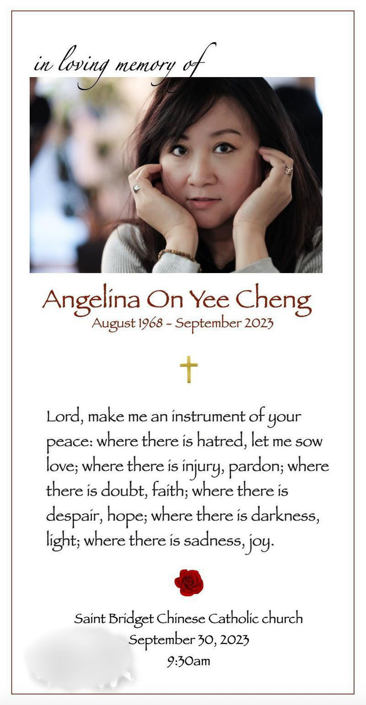
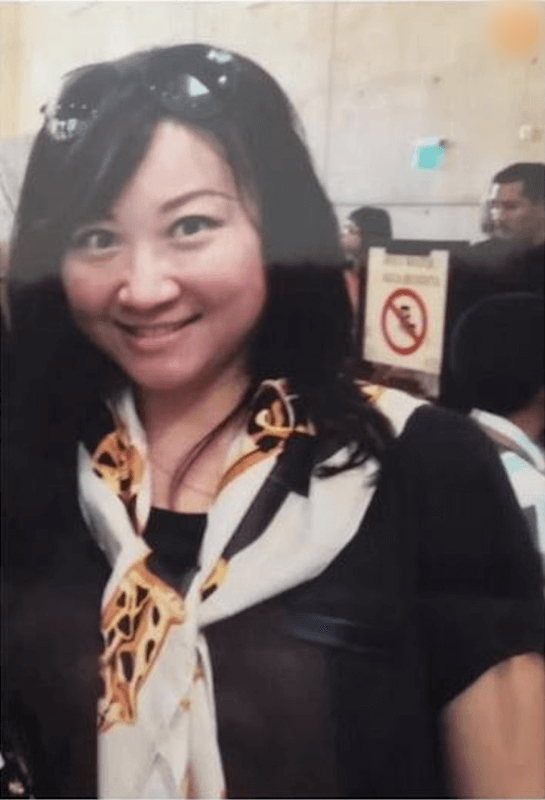
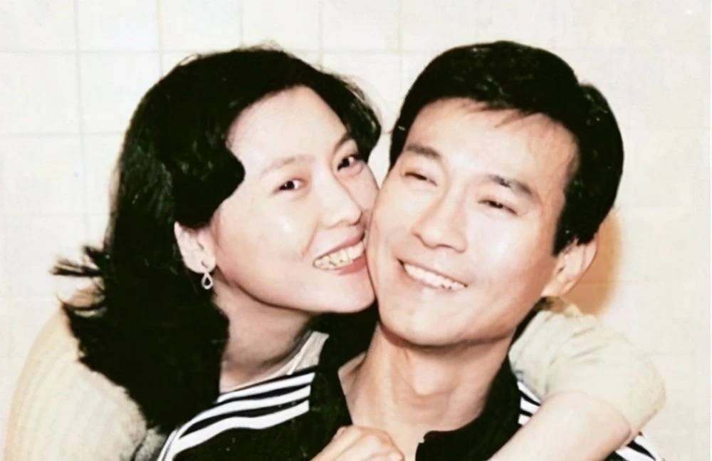

# 郑少秋夫妇证实长女自杀：心情未平复想帮忙办后事，遗产交给生母处理

10月1日，突传郑少秋和前女友卢慧茹的长女郑安仪在美国家中自杀身亡，终年55岁。

据友人透露，郑安仪自杀前感情受挫，疑似卷入一段三角恋，26日开始与外界失联，美国警方接到报案破门而入，发现郑安仪在家中上吊，已失去生命迹象。

郑安仪自杀前，父母都不在身边，只有教会帮她处理后事，9月30日举行追思仪式，教会呼吁死者父母到美国处理死者遗体，因为无法联系上死者父母，只能通过媒体传话。

郑少秋的妻子官晶华10月1日深夜回应，称他们在了解处理中。

10月2日下午，官晶华再次受访，证实郑少秋长女死讯。

官晶华代替郑少秋回应媒体，称郑少秋的心情尚未平复，据他们了解，郑安仪的母亲（卢慧茹）健在，身处温哥华，昨日已有亲友致电联系，卢慧茹的号码已转交给教会，因为涉及美国法律问题，郑安仪的房产和车子都会交给卢慧茹，她是合法的权益人，希望卢慧茹亲自出面处理。

官晶华强调，有关郑安仪葬礼的问题，如果卢慧茹允许，他们会尽力帮忙。

据悉，郑少秋刚刚入行时与卢慧茹交往，二人在1968年生下郑安仪，两人分手后女儿随母亲移居加拿大温哥华，与郑少秋的关系疏离。

有消息称，郑少秋之前支付女儿的大学费用，但没有支付生活费，而从官晶华的回应来看，郑安仪的经济状况不错，在美国有房有车，根本不需要父亲支援。

据好友透露，卢慧茹对郑少秋有恨，经常在女儿面前说郑少秋的坏话，但郑安仪长大后开始了解父母分手的原因，并不恨郑少秋，因为听不惯母亲的闲言碎语，独自离开温哥华到美国生活。两年前，郑少秋到拉斯维加斯演出，她还和父亲见了面。

不少声音指是郑少秋的关系导致女儿想不开自杀，但据媒体透露，郑安仪自杀的原因是情伤，生前发现男友有别的女人想不开，教友早就发现不对劲，近期特别关注郑安仪的动向，没想到还是出了意外。

不难发现，郑少秋和卢慧茹的关系不好，官晶华没有表态会去处理后事，他们目前希望卢慧茹主动开口，双方达成默契后才可以共同处理女儿后事，郑少秋也率先放弃女儿的遗产。

