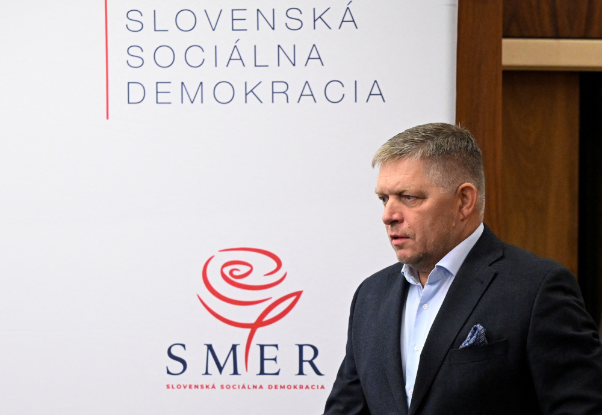

# 俄罗斯：没有干涉斯洛伐克大选

**参考消息网10月3日报道**
据法新社报道，10月2日，斯洛伐克指责俄罗斯对该国9月30日举行的国民议会选举进行了“不可接受的干涉”，并在俄罗斯对外情报机构负责人发表讲话称华盛顿“干涉”了斯洛伐克内政后召见了一名俄罗斯外交官。

报道称，斯洛伐克外交部对俄罗斯对外情报局局长谢尔盖·纳雷什金的讲话提出抗议，称其讲话“质疑斯洛伐克自由民主选举的公正性”，并将这番言论描述为“俄罗斯联邦对斯洛伐克选举进程不可接受的干涉”。

2日，俄罗斯驻布拉迪斯拉发大使馆否认存在任何干涉行为。俄罗斯新闻机构援引该大使馆的话报道称：“与斯洛伐克目前的一些盟友不同，我们没有干涉他国内政，也没有参与政权更迭。”

报道称，美国国务院重申：“美国不在外国选举中采取立场。”

据报道，乌克兰外交部长德米特里·库列巴2日表示，基辅尊重“斯洛伐克人民的选择”。

他在基辅举行的欧盟外长会议间隙说：“但现在说选举结果将如何影响斯洛伐克的立场还为时过早。”

报道称，克里姆林宫认为，给斯洛伐克前总理罗伯特·菲佐的政党打上“亲俄”标签是“荒谬的”。

克里姆林宫发言人德米特里·佩斯科夫对记者说：“我们面临的情况是，任何倾向于考虑国家主权、捍卫国家利益的政治家都会被视为亲俄人士。这是荒谬的。”

据媒体此前报道，斯洛伐克选举委员会10月1日宣布，由前总理菲佐领导的方向党在9月30日举行的国民议会选举中获胜。菲佐在选前承诺，如果其政党在国民议会选举中获胜，将停止向乌军转让军事装备。因为向基辅提供武器只会导致人员死亡和冲突延长。（编译/赵可心）

