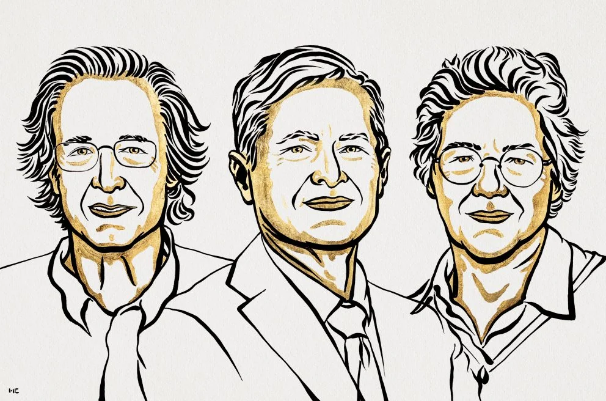
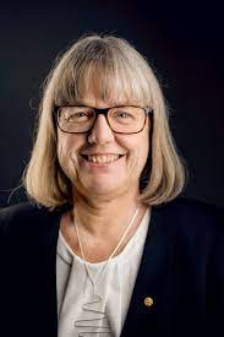

# 刚刚，诺贝尔物理学奖迎来第5位女性得主

**导读：**

刚刚，2023年的诺贝尔物理学奖授予了瑞典隆德大学Anne L’Hullier、美国俄亥俄州立大学的Pierre
Agostini，马克斯普朗克量子光学研究所Ferenc Krausz，表彰他们对于超快激光和阿秒物理学科学的开创性和创新工作。

**撰文｜魏志义（中国科学院物理研究所研究员）**

**责编｜邸利会**

诺贝尔物理奖给予女性极为罕见。尽管历史上的第一次女性诺奖得主是物理学家居里夫人，但自此后，1963年，旅美德国物理学家 Maria Goppert-
Mayer获得了历史上的第二次物理诺奖，距离居里夫人那次（1903）足足过了60年，第三次女性物理诺奖是2018年获奖的加拿大科学家唐娜·斯特里克兰。2020年，美国天文学家安德烈娅·盖兹获得第四枚女性诺奖。今年是第五枚。

现年64岁的 Anne L'Huillier
是一位法国、瑞典物理学家，致力于研究短而强的激光场与原子之间的相互作用。她1958年出生于巴黎，小时候，她受到阿波罗11号的激发，阿波罗11号1969年首次载人登月任务。她还受到祖父的影响，他是从事无线电通信的电气工程教授。于是，她对科学技术的产生了极大热情，促使她后来成为实验阿秒物理学的领导者————阿秒，即10-18
秒，或千分之一飞秒，一阿秒之于一秒，如同一秒之于 317.1 亿年。

她是最早通过实验证明高次谐波（这也是阿秒脉冲形成的过程）产生的人之一，并为该过程的恰当理论描述的发展做出了重大贡献。她还进行了许多开创性的实验，以加深对基本过程的理解，她也是新阿秒科学研究领域形成的关键参与者。

L'Huillier 拥有理论物理学和数学双硕士学位，后来转而攻读实验物理学以完成博士学位。1986 年，她在巴黎的皮埃尔和玛丽居里大学和
Commissariat à l'Energie Atomique (CEA) 完成她多光子电离的论文答辩。同年，她获得了CEA
的永久研究员职位。她于1986 年在瑞典哥德堡的查尔姆斯理工学院和1988年在南加州大学洛杉矶分校做博士后。

1987年，她参加了一项使用皮秒Nd:YAG激光系统首次观测高次谐波的实验。她对这个实验着迷，并决定将自己的时间投入到这一研究领域。

她于1993 年在劳伦斯利弗莫尔国家实验室担任访问科学家。1995年，她移居瑞典隆德大学，并于1997年成为正教授。2004年，她当选瑞典皇家科学院院士。

皮埃尔-阿戈斯蒂尼于 1968 年获得艾克斯-马赛大学博士学位。完成学业后，他成为法国原子能委员会萨克雷分会的一名研究员，在那里担任过各种职务，一直工作到
2002 年。在此期间，他曾在南加州大学、阿姆斯特丹 FOM 和 BNL 担任访问学者。在担任了一系列其他访问学者职位后，他于 2005
年来到俄亥俄州立大学，担任物理学教授。

他曾于 2007 年获得 FOM 荷兰颁发的 Joop Los 奖、OSA 的 William F. Meggers 奖，并且是洪堡研究员。2008
年，他被选为 OSA 院士，“因其在创新实验开发方面的领导地位，为原子和分子在强红外激光脉冲下的非线性响应动力学提供了重要见解。”

Krausz是匈牙利-奥地利物理学家，他的研究团队第一个产生和测量阿秒光脉冲并用来捕捉原子内部电子运动。

Krausz于1985
年在布达佩斯科技大学获得电气工程硕士学位。1991年，他毕业于维也纳科技大学，拿到量子电子学博士，1993年，他拿到维也纳大学的教授资格（“Habilitation”）。1998年，他加入电气工程系担任副教授，并在1999年担任正教授。

2003年，Krausz被任命为德国马克斯普朗克量子光学研究所所长。自2004 年起，他担任慕尼黑路德维希马克西米利安大学物理学教授和实验物理学教授。

早在1990年代初，在维也纳科技大学攻读博士学位时，Krausz就对使用当时新激光器实现的极短光脉冲的想法印象深刻。他的团队在2000年代初产生并测量了第一个阿秒脉冲，这使他第一次能够在原子尺度上实时观察电子运动。今天，我们正在使用这样的脉冲来更好地理解涉及电子、原子和分子的微观过程，并理解它们是如影响宏观世界。

**孪生兄弟：高次谐波与阿秒脉冲**

光是最直观而常见的自然现象，千百年来也是人们认识世界和揭示科学规律最重要的手段。激光的发明不仅为光赋予了从未有过的强大功能，也成为目前人们取得科学发现最重要的工具，无论是探测物质的微观结构，还是了解光合作用的本质；从日新月异的通讯技术，到无坚不摧的精密加工，激光无不起着难以替代的重要作用。

不仅激光本身的发展已荣获多项诺贝尔奖，而且应用研究也摘取了多项诺贝尔奖的硕果。回顾激光发展和开拓应用的历史，不难领略到其在近代科学技术中的重要地位和进一步促进社会进步的潜力，因此回顾一下那些有可能也成为诺贝尔奖级的重要成就是有意义的。

激光作为一种电磁波，其功能和特性可以通过物理参数而定量表征，如振幅、频率、脉宽、相位、偏振等。在这些参数中，频率与脉宽不仅是表征激光特性最重要的两个参数，而且也是比直接放大激光能量以提高振幅更具挑战性的工作。就在1960年激光发明后的次年，Peter
Franken 和同事通过将梅曼发明的红宝石激光聚焦到石英晶体，发现了二次谐波效应，得到了波长约347nm的紫外激光，从此开辟了非线性光学这门学科。

伴随着激光的发展，基于非线性光学的激光频率变换一直是光物理最重要的内容之一，不仅极大的扩展了人们所能得到的激光波长，汇成了色彩斑斓的激光光谱，也提供了研究材料结构与物质特性的重要手段。

虽然继第一台红宝石激光之后不久，人们相继实现了气体、光纤、半导体、液体等多种类型的激光器，找到了数以百计的激光增益介质，得到了不同波长的激光输出，但迄今覆盖激光波长最广的技术还是非线性激光频率变换，特别是在产生具有高光子能量的高频激光辐射方面，非线性频率变换技术基本是唯一可行的方案。1981年，Nicolaas
Bloembergen 和Arthur Schawlow 因为对非线性光学和激光光谱学的贡献获得诺贝尔物理奖。

根据非线性光学的基本原理，实现频率高效率转换的一个基本条件是要有足够光强的入射激光。激光的强度是由其能量和作用时间，也就是激光脉冲的持续时间决定的，因此采用极短脉宽的激光，无疑在产生更短波长，即更高频率的激光方面具有优于长脉冲及连续光激光的巨大优势。

实际上，脉宽作为激光的另一个重要参数，在激光发展的历史上，一直是人们最为关注的研究热点，不仅仅因为短脉宽伴随着高强度，更主要的是其时间分辨能力，能够用于探测快速变化的微观过程。

为了获得脉宽极短的激光脉冲，在激光问世最初的几年里，人们就相继提出并实现了调Q、主动锁模及被动锁模等技术，脉冲宽度很快就从梅曼激光最初的毫秒量级到了皮秒量级（ps），超过了运用电子学手段所能产生的最短脉冲，成为各种物理手段不能企及的最快时间过程，这种时间尺度比分子的弛豫时间还要短的激光脉冲，通常也称之为超快激光。

激光的频率与脉宽可以说是一对孪生的兄弟，其相互满足傅里叶变换关系，已知时域结构的光场，通过傅里叶变换，在一定的条件下，可以得到其频域分布，反之亦然。激光的脉宽与频谱宽度遵循测不准原理。因此要想得到极短的脉宽，激光就必须要有极宽的线宽，为此要不具有极高的频率，即极短的波长；要不具有极宽的光谱带宽。

我们知道，要使激光直接工作在短波段是非常困难的，目前常见的激光增益介质基本都工作在可见到近红外波段，为此寻求并发展具有极宽增益带宽的激光介质，是实现超快激光输出的重要方向，在激光出现的早期岁月，最具这一特征的介质是液体染料，到70年代，人们通过被动锁模罗丹明染料激光，获得了短至1.5ps的最短闪光脉冲。

进入80年代，超快激光迎来了前所未有的黄金发展岁月。

1981年，美国贝尔实验室的C.V.Shank和R.L.Fork等人发明碰撞脉冲锁模（Colliding Pulse Mode-
locking，CPM）技术，利用环形腔染料激光器得到了90飞秒（fs，10-15秒）的脉冲，首次将激光脉冲推进了小于0.1ps的尺度，开拓了超快激光的飞秒时代，掀起了飞秒激光的研究热潮。除美国外，英国、日本等国也相继实现了CPM飞秒激光输出，我国的天津大学、西安光机所、中山大学等单位也紧随其后，通过优化色散补偿，利用CPM技术获得了脉宽不断变短的结果。

但是仅靠色散补偿，由激光振荡器所能直接产生的激光脉宽毕竟有限。因此就在CPM出现后不久，美国贝尔实验室、MIT的科学家们通过放大激光能量提升峰值功率和强度而在光纤中形成的非线性效应扩展光谱后，进一步结合光栅和棱镜等色散元件，先后将脉宽压缩到了30fs、8fs及6fs的最短脉宽世界纪录。

飞秒激光脉冲的快速发展，使得当时人们利用其作为开关时间的泵浦探索技术测量分子、原子的动力学行为成为可能，美国加州理工学院的A.H.Zeawail
教授正是由于利用飞秒激光首次测量化学反应的工作，独获1999年的诺贝尔化学奖。

上述通过直接放大飞秒脉冲能量而提高其强度，为在光纤中产生非线性以扩展光谱提供了不可缺少的技术环节，但面临的一个问题是高强度激光带来的自聚焦效应等问题，不仅导致增益饱和，而且也带来光学元件的损坏，尤其是对于固体激光介质。

1985年，时在美国罗切斯特大学的博士生 Donna Strickland
为了完成产生9次谐波的学位论文任务，面临着压缩激光脉宽的困难，她采用了如上描述的大众化方案，为了展宽激光光谱而实现对脉宽的压缩，首先放大皮秒Nd:YAG激光的能量，但带来的问题是随着能量的放大导致的自聚焦效应对放大器等激光元件的损伤。在导师G.Mourou教授的指导下，他们调整了放大的次序，将本应压缩脉冲的色散光纤放在了Nd:YAG放大器前面先展宽激光脉宽，然后再进行放大。由于峰值功率的降低，激光能量得到安全的放大，最后再利用与展宽器色散相反的光栅对压缩脉宽，完成了啁啾脉冲放大（CPA）的雏形，得到了单脉冲能量
1mJ、脉宽1.5ps的激光脉冲。

 _Donna Strickland在2018年与人分享了该年的诺贝尔物理学奖 |
图源：nobelprize.org/prizes_

基于该发明，Donna Strickland 完成了博士学位论文，于1988年加入加拿大国家研究院（National Research Council of
Canada）Paul Corkum 教授的团队工作。 令他们没有想到的是，90年代随着掺钛蓝宝石激光的广泛应用，CPA
技术得到了极大的发展，短短数年将激光的峰值功率推进了TW（1012W）量级，并分享了2018年的诺贝尔物理奖。

虽然 Donna Strickland 用以实现CPA的Nd:YAG
激光没有染料激光的飞秒脉宽，但其远高于染料激光的单脉冲能量使其拥有更高的峰值功率和强度，因此更容易实现多光子电离（MPI）、上阈值电离（ATI）等非线性效应。

1987年，仅在CPA发明两年之后，以美国 Charles Rhodes 和法国 Anne L’Huiller
为代表的两个研究组通过强激光与原子气体的相互作用，分别独立观察到了波长延伸到极紫外（XUV）的高次谐波（high-order harmonic
generation,
HHG），其中前者采用了波长248nm的KrF准分子激光，激光功率密度为1016W/cm2，得到的最高谐波级次为17次，对应的14.5nm波长；后者采用了与DS研究CPA类似的皮秒Nd:YAG激光，其脉冲宽度为36ps、功率密度为1013W/cm2，得到的最高谐波级次达33次，对应32nm的波长。Anne
L’Huillier 研究团队分别在Kr Xe
等气体中观察的高次谐波分布，其具有典型的两个特征，一是谐波均为入射激光频率的奇次倍；二是谐波均由下降区、平台区及截止区三个部分组成。这种仅用台面尺寸的普通激光所能产生的极紫外相干辐射，完全超出了预料，带给人们激动人心的结果，从而点燃了对其进一步研究的热潮。

那么在超短脉冲强激光的作用下，原子气体为什么会产生如此结构的极紫外辐射呢？1993年，前面提到的加拿大国家研究院的 Paul Corkum
教授提出了三步模型理论，其主要内容可以通过下图得以说明。

第一步首先为强激光作用下的隧穿电离过程，超快强激光场使气体原子的库伦势发生倾斜，使得电子能够以隧道电离的方式逃离原子核的束缚，成为准自由的电子；

第二步是电子加速，隧穿电离后的电子在外加激光电场的驱动下进行加速，通过加速运动积累一定的动能；

第三步是复合发光，加速电子在反向电场的作用下，以一定概率再回到电离的原子核附近并与之复合，在复合过程中电子将以光的形式释放所积累的动能和电离能，表现为高次谐波。

三步模型理论不仅完美的诠释了高次谐波的机理和过程，而且也能说明只有奇数倍谐波产生的原因，由于气体具有中心对称性，而偶数倍的谐波不满足中心对称；另外驱动电场每个半个振荡周期发射一次谐波，不同周期内产生的谐波会相互干涉，考虑到相邻的振荡周期相差一个π相位，因此偶数倍谐波干涉相消，而奇数倍的谐波干涉由于相长可被保留下来。此外当驱动飞秒脉冲为仅包括不多振荡周期或接近单个振荡周期的极短脉冲时,
其产生的高次谐波谱可能是连续的，而不是常规离散的。连续的HHG光谱意味单个孤立阿秒脉冲，而不是由一系列阿秒脉冲组成的脉冲串。

实际上就在 Paul Corkum 发表三步模型理论的前一年，匈牙利固体物理研究所的 Gyozo Farkas and Csaba Toth
就认识到HHG由于类似锁模的特性，是产生阿秒激光脉冲的可行方式，并通过计算表明可以获得100as的激光脉冲。另外从脉宽与带宽的测不准原理，由于HHG所处的极紫外波段，时域上对应阿秒的脉冲宽度也是不难理解的。

但如何证明高次谐波的脉宽就是阿秒呢？如果是，那到底是多少阿秒？这就需要通过实验来回答。

尽管自此之后有大量HHG的理论和实验研究报导，由于缺乏令人信服的实验测量结果，因此频域上的高次谐波并不能在时域认为是阿秒脉冲。直到2001年，才由两个研究组分别报告了令人信服的测量结果——

一个是由法国的P.M.Paul等人与荷兰的同事合作，通过双光子、双电离测量由40fs的飞秒钛宝石放大激光与Ar气相互作用产生的高次谐波相位，得到了脉冲宽度为
250as、相邻脉冲间隔为1.35fs的阿秒脉冲串（Science，Vol.292, 1689-1692）；

另一个则是由时在维也纳技术大学的 Ferenc Krausz 教授等人与加拿大Paul
Corkum和德国同事的合作，在使用7fs的飞秒钛宝石放大激光驱动Ne气产生HHG的基础上，通过互相关测量该7fs驱动激光与滤波HHG后的90eV极紫外光在Kr气中产生的光电子动量分布，证明了150as的时间分辨测量能力，获得了650as的单个孤立阿秒脉冲（Nature，Vol.414，509-513）。

**阿秒时代**

孤立阿秒光脉冲的产生，为阿秒激光的实际应用打开了新的大门，标志着超快研究阿秒时代的来临。由于其重要意义，次年的Nature及Science杂志都将其评为当年的10大科学进展之一。

人类对于极限的追求从未止步过，随着阿秒脉冲的成功测量，不仅激发了人们对于产生更短阿秒脉冲的热情和兴趣，也催生了许多新的应用研究。

在玻耳的原子模型里，电子绕原子核一周的时间为152as，这是人们此前从未能够测量的微观世界。尽管利用飞秒脉冲实现了对分子结构的动力学追踪，但是对于捕捉发生在阿秒时间尺度的电子运动，却是全新的课题。

由于核外电子的运动决定着物质的特性，因此对于电子的动力学测量和控制，成为涉及多个学科的重要内容，随后有关光电效应、凝聚态物理中电子的跃迁、瞬态超导、阿秒磁学等相关应用研究层出不穷。

在阿秒产生方面，也相继出现了偏振选通、双色场选通、阿秒灯塔、长波驱动等产生技术，孤立阿秒脉冲的脉宽也从最初的650as推进到了目前43as的世界纪录。

高次谐波作为阿秒脉冲的孪生体，或物理过程的另一个方面，随着阿秒脉冲的发展也得到了进一步的发展和重视，无论在脉冲能量、还是在截止波长与重复频率等方面，近10年来都取得了重要进展，如日本理化研究所绿川与高桥的研究组采用太瓦级的飞秒激光驱动气体高次谐波，得到了单脉冲能量微焦耳量级的高次谐波；美国科罗拉多大学
Margaret M Murnane 和 Henry C Kapteyn 夫妇教授的研究组与维也纳技术大学 Andrius Baltuska
教授的研究组合作，采用3.9um波长的飞秒放大激光作为驱动光源，得到了截止频率1.6keV、对应谐波级次5500阶的HHG。

这些工作进展不仅本身具有很多重要的应用，也为未来产生脉宽更短、截止频率更高、脉冲能量更强的阿秒脉冲提供了有益的探索和发展基础。此外最近发展起来的固体高次谐波技术，在研究表征材料的特性、揭示相应的物理机制、提供新的阿秒产生技术方面也表现出重要的创新潜力，值得科学家们重视。

正是由于高次谐波与阿秒脉冲不断带来的科学应用和技术进展，Anne L’Huiller、Paul Corkum、Ferenc
Krausz三人获得了2022年的沃尔夫物理奖。

阿秒激光的发展，可以说集成了激光科学最激动人心的故事，由于其潜在的重要应用，早在2006年，就在G.Mourou等人的建议下，欧盟确定了在匈牙利建设以阿秒激光为主体的大科学设施计划ELI-
ALPS，目前已初步建成并开放使用。实际上阿秒激光不断创造最短脉冲世界纪录的演化发展，是建立在克尔透镜锁模（KLM）、啁啾脉冲放大（CPA）、参量啁啾脉冲放大（OPCPA）、载波包络相位（CEP）锁定及HHG等技术之上的。尽管由于篇幅所限，有些重要的技术原理和精彩故事未能一一提及，但毫不影响这些技术的的重要程度，在目前广泛使用的超快激光产品中，人们会注意到这些技术的核心作用。那么高次谐波与阿秒脉冲作为孪生的兄弟，毫无疑问值得诺贝尔奖。

