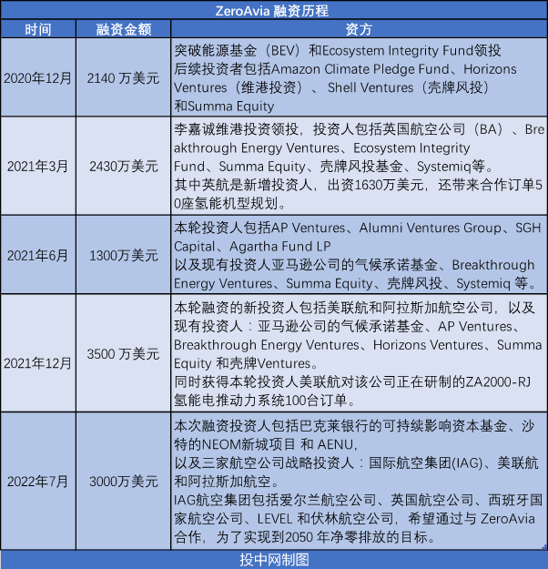

# 李嘉诚盖茨联手中东财团，投了一家氢电飞机

“有头有脸”的全球首富，扎堆投了一家氢电飞机。

近日，美国氢电动力飞机公司 ZeroAvia 获得史上最大融资，具体数额没有披露，但从以往融资规模看，本轮融资规模至少超过5亿人民币。

此轮融资由空中客车公司、巴克莱可持续影响资本和“中东财团”沙特新未来城 NEOM
共同领投。老股东持续加注，包括：贝尔盖茨的突破性能源基金（Breakthrough Energy
Ventures，下称BEV）、李嘉诚旗下的维港投资（Horizons Ventures）、亚马逊气候承诺基金（Amazon Climate Pledge
Fund）、阿拉斯加航空、Ecosystem Integrity Fund 、Summa Equity、AP Ventures。

少有一家初创公司，能在全球范围内集齐如此多的富豪、投资机构和航空集团。ZeroAvia为何如此受热捧？

**零排放氢电飞机**

ZeroAvia成立于2017年，是一家提供氢电航空解决方案公司，位于英格兰风景秀丽的科茨沃尔德的肯布尔（Kemble）基地，在美国也有研发中心。

为了应对航空业日益严重的气候变化影响，ZeroAvia致力于将高污染的航空产业转变为清洁产业，将氢电推进系统作为最环保、最具经济吸引力的解决方案。

和汽车行业一样，目前在飞机领域，也有许多公司开始向低碳环保方向转型，许多初创企业已经进军这一领域。

ZeroAvia的业务涵盖氢能生产和飞机制造，主攻的氢能方向是航空燃油的潜在替代品。该公司的氢电动发动机利用燃料电池中的氢气来发电，用于为电动机提供动力的螺旋桨。

唯一排放的废物是水。公司表示，生产氢气的电能来自太阳能，氢气燃烧后生成水蒸汽，整个闭环流程完全零排放，这也是使用氢燃料电池最大的好处，但仍需要面临生产成本高昂的问题。

早在2023年初，ZeroAvia就已完成“史上最大氢电动飞机首飞”。本次融资结束以后，目前公司内部的流动资金变得更加充足，意味着距离零排放飞机的落地更近一步。

ZeroAvia公司创始人兼 CEO 瓦尔·米夫塔霍夫（Val
Miftakhov）表示，2024年将开始逐步实现商业化，初期目标是造出10-20座的氢能飞机，实现800公里航程——能够满足短途支线飞机的续航需求，而长远目标则是为100-150个座位的飞机开发氢能动力系统，这将成为未来航空领域的“主力军”。

**盖茨李嘉诚中东土豪持续加注**

除了最新这笔资金，ZeroAvia此前已获得超过1.5亿美金的融资。

这家成立仅6年的初创公司，背后云集诸多“首富”，资方阵容豪华，包括比尔盖茨、李嘉诚，全球知名航空集团英国航空、美联航、阿拉斯加航空等，“产业巨头”壳牌、亚马逊，还有英国政府、沙特未来新城NEOM……

ZeroAvia融资节奏稳定，平均3-6个月完成新一轮融资，融资金额在3000万美元左右（约合人民币2.19亿元），比尔盖茨、李嘉诚、壳牌、亚马逊等老股东几乎每轮融资都会持续加注，越来越多航空集团战略投资ZeroAvia，并带来订单。

值得一提的是，ZeroAvia背后资方之一，比尔盖茨突破能源基金（Breakthrough Energy
Ventures，BEV），堪称“史上最豪华的投资团队”。

这是比尔·盖茨在2015年创立的风投机构，凭借“首富”号召力，笼络了马云、潘石屹、扎克伯格、贝索斯、孙正义等 28
位全球顶级富豪或家族作为共同投资人，基金规模为10亿美元，投资年限为20年。

这笔“耐心长钱”将被用于投资有可能为全世界带来廉价而可靠的清洁能源的科学突破，终极目标是将新的零碳排放技术推向市场。涉及领域包括二氧化碳捕集、能源物联网、生物合成、储能公司、可持续燃料、动力电池等诸多领域。这些有望至少每年能减少
5 亿公吨碳排放，即使它们可能在前 20 年内都无法为投资者带来直接经济收益。

就连靠石油发家的中东土豪，同样在转型清洁能源。ZeroAvia另一资方“中东财团”
NEOM就是典型例子。NEOM（沙特新未来城）是位于沙特西北部的工商业新城。该项目是穆罕默德·本·萨勒曼王子的创作，希望创造一个像埃及金字塔一样具有标志性和永恒性的建筑奇迹。该城规划将于2040年建成，到2045年将拥有900万居民，建成后的新未来城将成为一座人工智能之城，这里是“没有道路、汽车的零碳世界”，人们将使用“100%的可再生能源”，俨然一副好莱坞科幻片的即视感。

另外，以润滑油著称的壳牌，对外不再强调自己是润滑油公司，而是一家能源公司，近年来也一直致力于清洁能源的转型投资。还有维港投资，这家完全独立于李嘉诚其他产业的投资机构，一直为李嘉诚提供着充足的现金流，其一举一动都代表着李嘉诚的重要战略。

投资清洁能源，似乎已经成为能源巨头、顶级富豪们的共识。

**为何看中氢电飞机？**

氢能是已被公认的清洁新能源，是零排放飞行的终极方案之一。

航空业是碳排放大户，约占全球排放量的2%以上，是增长最快的温室气体排放来源。不过，相比之下纯电同样有着低碳环保的特点，且现阶段纯电商业化进程似乎比氢能源更快，为什么大佬们看中的是氢电飞机而不是纯电飞机？

首先，氢能更环保。从碳排放来讲，目前70%以上发电仍是火力发电，而火电产生的污染同样不少。而氢能85% 以上是通过可再生能源和核能电力电解生成的绿氢。

其次，氢能更适合载重大、长距离飞行。从续航能力来讲，纯电续航里程通常在百公里级别，适合短距出行，而氢能续航里程则能在上千公里。同时，飞相同距离，电池重量是航空燃料的约40倍。而且氢能可以像汽油一样，实现快速加氢燃料，不像纯电，充电时间长。可见，电气化技术还没有发展到能推动大型飞机或货轮的程度。

因此，氢能可以弥补电气化技术的空缺，在实现重工业转型中，扮演重要角色。

根据发改委发布的《氢能发展中长期规划（2021—2035）》分析，2060年，中国约60%的能源消费将实现电气化。对于剩余的40%较难实现电气化的行业，要推行采用低碳燃料。也就是重型公路运输、航运和航空等行业，以及钢铁和化工等重工业，都需要使用便携的、高能量密度的燃料。

针对这些最难去碳化的行业，氢能正是不错替代品。《报告》预测，氢的消费量将从目前的极低水平增长至2060年的17艾焦耳/年以上，相当于
5.8亿吨煤当量，或者最终能源消费总量的16%。

作为完全清洁的燃料，氢能势必开始发力。

但发展氢能同样有难点。首先，动力电池快速发展，一定程度上挤压了氢燃料电池的生存空间。纯电动补能网络建设日益完善，而氢燃料电池补能，仍需另起炉灶，不仅成本高昂。在技术方面，氢燃料的储存、运输都还存在问题。

所以，耐心长钱的作用也体现在这儿了。

