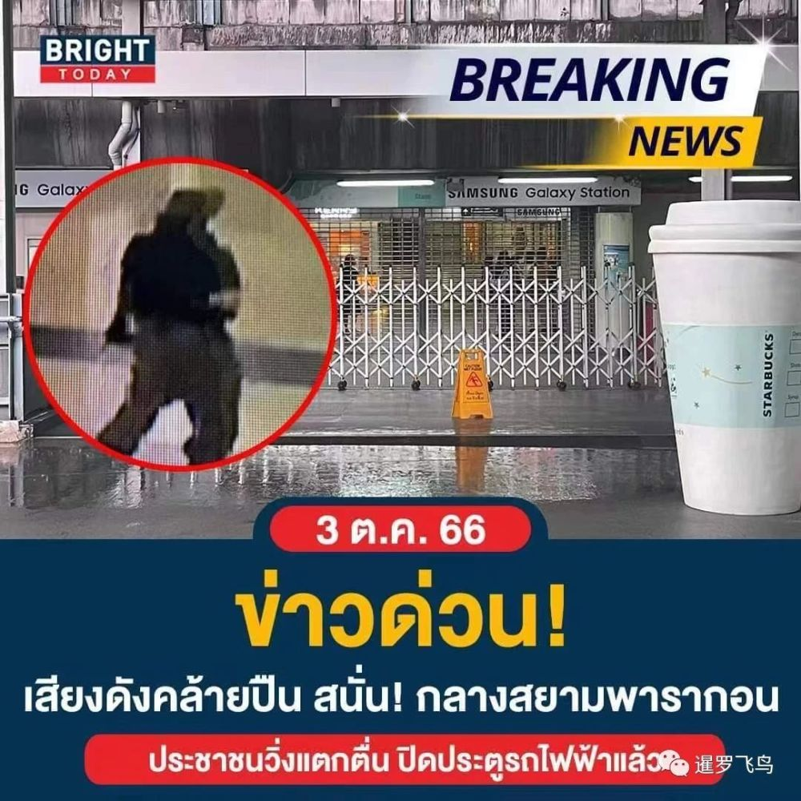
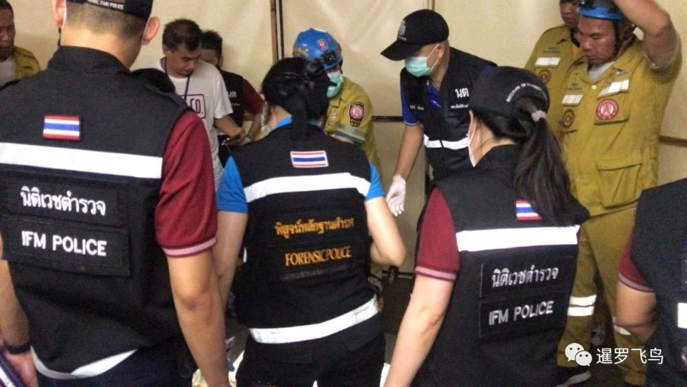
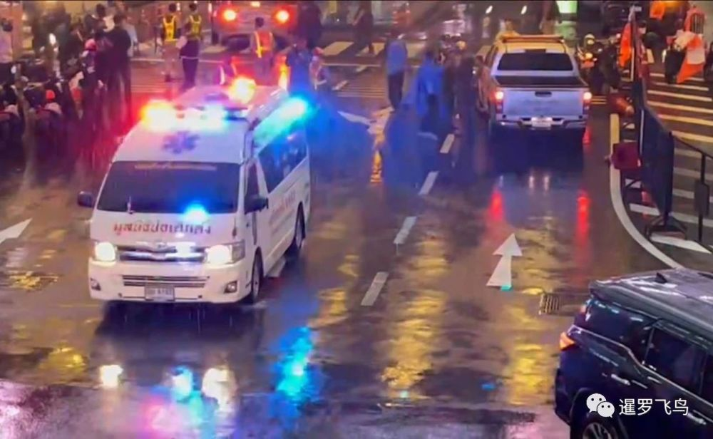
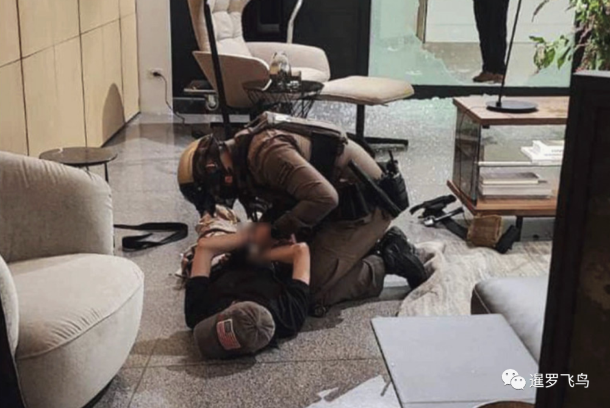
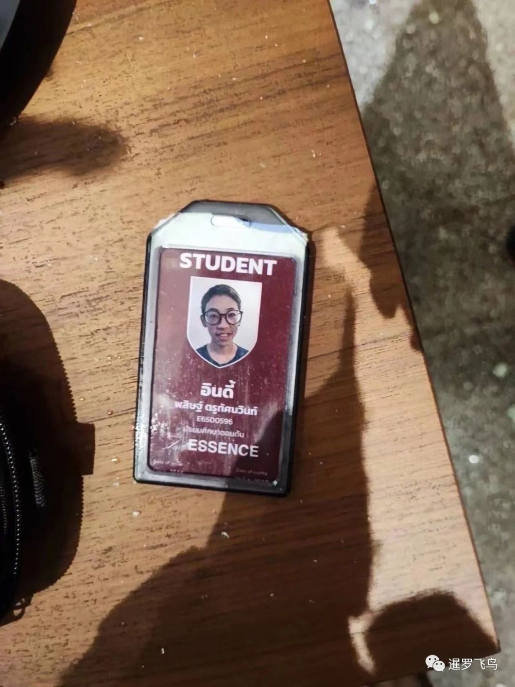
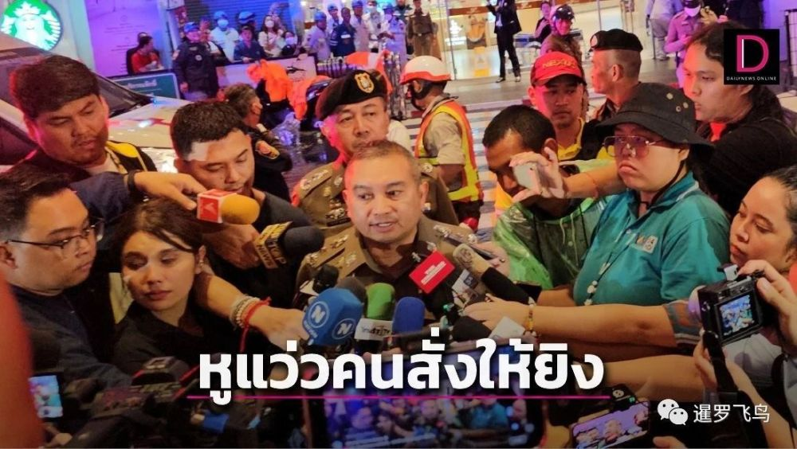
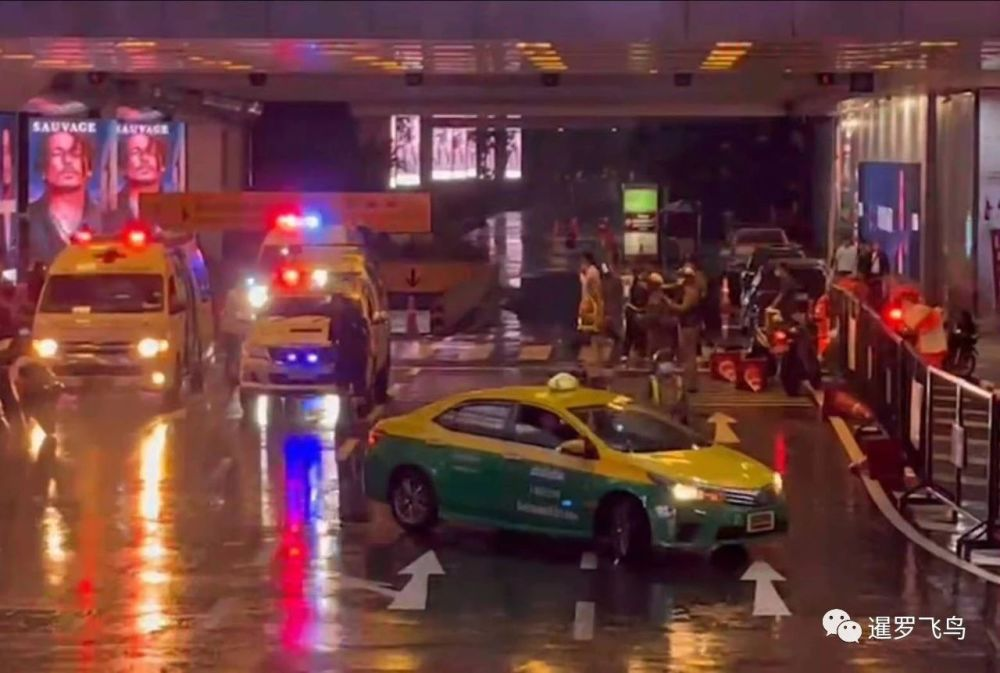
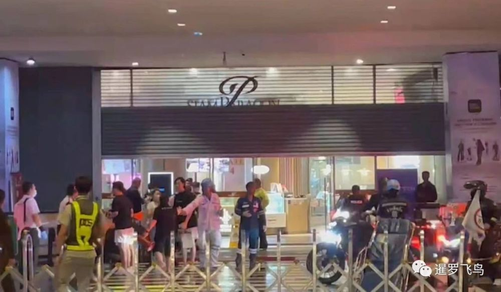

# 泰国曼谷商场枪击案3死多伤，1名中国人不幸遇难，14岁枪手称有人指使

12月3日下午4点20分左右，一名14岁泰国男孩在暹罗百丽宫 (Siam Paragon)
购物中心内开枪，导致数百人仓皇四散逃离。目击者称，听到了10多发枪声。

爱侣湾急救中心主任尤塔娜·斯雷塔南（Yuthana
Srettanan）在给记者的消息中证实了死伤人数。包括一名外国人在内的三人被送往朱拉隆功国王纪念医院救治，一人正在警察总医院接受治疗。

据Tiger等泰媒消息，当场死亡的3人分别为一名中国人、两名泰国保安。

下午5点10分左右，派往现场的泰国警察特别行动队追击枪手，并设法将他困在隔壁的曼谷暹罗凯宾斯基酒店。他最终放下武器，没有挣扎就投降了。

闭路监控录像显示了3日下午泰国警方在毗邻暹罗百丽宫的曼谷暹罗凯宾斯基酒店三楼逮捕这名14岁枪手的过程。

在他被抓捕后，他跟警察有几句对话，他说：​“哥，你看，看到了吗？”，警察：“没关系，安全了，安全了……”。

有网友分析，从少年枪手服装上看是崇拜模仿美国哥伦拜恩高中枪击事件，被捕时不反抗、跪下还回头观察的动作，以及被捕时作出可能药物导致幻觉（口述被人跟踪）的情节来看
，属于高智商犯罪了，后续将是挑战泰国司法的故事了。

据泰媒Dailynews引用泰国警方消息，揭露了少年枪手在商场随机开枪的原因，据悉他听力丧失，他表示是有人指使他这么做的。警方还发现他有游戏成瘾史。目前他的精神疾病史正在接受调查。泰国皇家警察总司令已下令彻查。

泰国总理赛塔表示，他已获悉发生“枪击事件”的情况，并正在关注事态发展。泰国国家警察局长托萨克将军 (Torsak Sukvimol) 已前往现场。

​该事件必将为泰国刚刚恢复的旅游业带来沉重的打击。​

（素材来源泰媒DailyNews，更多精彩内容关注企鹅号“i泰国”，未经授权严禁转载）

