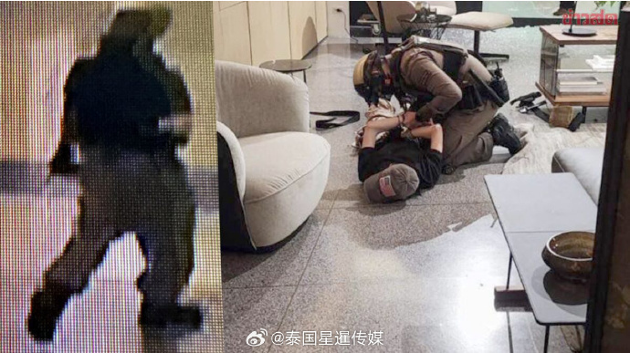
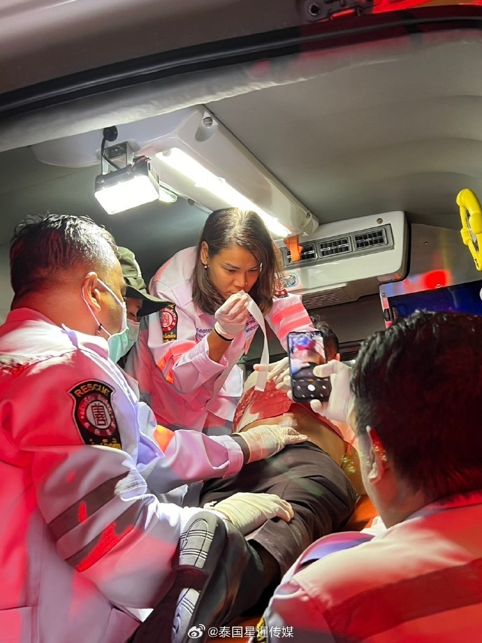

# 泰国曼谷枪击案致3死，泰总理确认遇难者包括一名30多岁中国游客

10月3日下午18点35分，泰国总理兼财政部长赛塔接受采访称，他将前往暹罗百丽宫购物中心查看枪击案情况。记者提问称，是否会前往探望伤者时，赛塔总理表示，需要再次考虑是否合适，因为不知道伤者是否正在接受急救或手术。

当被问及最新死亡人数时，赛塔总理说到“大约20分钟之前，收到报告确认一名30多岁的中国游客死亡。此外，还没有更多的消息。”

当被问及此后的安全措施和应对计划时，赛塔总理表示，这段时间正值各大节日，将会有游客前来，因此必须再次开会讨论。也请冷静一点，发生这样的事情令人痛惜。

来源：泰国星暹传媒

