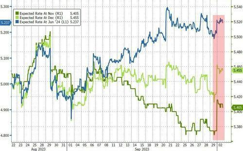
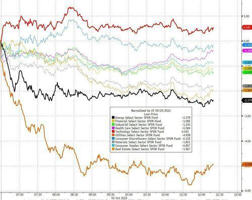
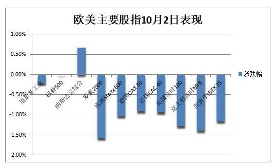
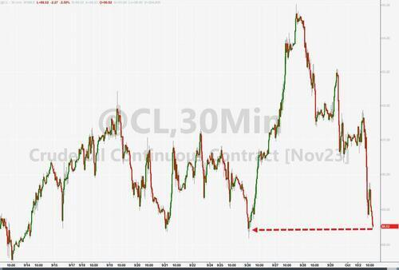
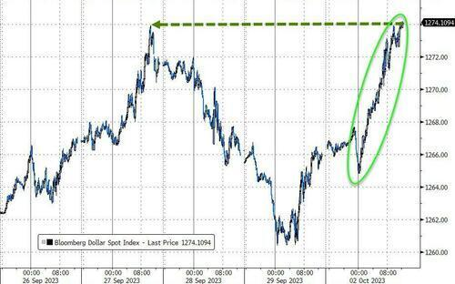
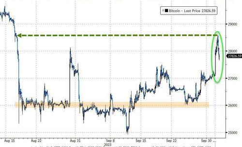
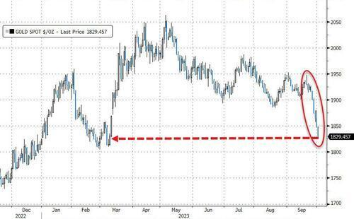

# 美股收盘：道指创四个月最低，美国长债收益率再创十多年高位

美联储主席鲍威尔称，寻求将就业市场长期维持在良好状态，但没有置评货币政策前景。票委兼理事巴尔重申，美联储可以在利率上谨慎行动，很可能还要在一段时间内维持高利率。

市场等待周五发布的美国9月非农就业数据，交易员预期美联储今年维持利率在当前区间的可能性为55%。摩根大通CEO戴蒙称，美联储加息到7%的可能性确实存在。

_市场对美联储的加息预期有所升温_

美国联邦政府上周六深夜获得45天暂时拨款而避免停摆，但有分析称，该法案未解决国会两党对焦点议题的根本分歧，难以避免美国政府在后续再度面临停摆的窘境。

美国9月ISM制造业指数超预期反弹至49，逼近50荣枯线。新订单改善，就业指数重返扩张，物价支付指数回落，均证实美国经济更有可能实现美联储预期的软着落。

欧元区9月制造业PMI终值43.4，持平预期和前值，德、法和意大利三大经济体的制造业均深陷萎缩。欧洲央行副行长金多斯称维持当前利率水平有助于实现通胀目标，驳斥降息言论。

日本央行9月会议纪要显示票委们讨论了退出超宽松政策的必要条件，即持续稳定地实现物价目标，以及伴随工资增长。日元兑美元直逼150创一年新低，日本央行宣布计划外购债操作。

标普惊险收涨，道指跌至四个月最低，罗素小盘股年内首次转跌，中概新能源车齐跌

10月2日周一，在美国联邦政府避免停摆后的首个交易日，美股集体小幅低开。科技股居多的纳指最高涨1%领跑主要指数。

由于有人开始计价2024年美国政府关门的可能性，无法最终提振美股，午盘时标普500指数和道指刷新日低，道指最深跌近290点，罗素小盘股跌约2%表现最差。

美债收益率创十多年新高再度压低美股。通讯服务和科技板块在标普大盘中唯二上涨，能源板块跌超2%表现第二差，公用事业板块跌5.5%至2020年9月以来的三年新低。

**尾盘时美股跌幅显著收窄。** 道指连跌两日至6月1日来的四个月新低，标普惊险收涨，纳指连涨四日至近两周最高，
**罗素小盘股连跌两日至5月31日来最低且年内首次转为累跌** ：

标普500指数收涨0.34点，涨幅0.01%，报4288.39点。道指收跌74.15点，跌幅0.22%，报33433.25点。纳指收涨88.45点，涨幅0.67%，报13307.77点。纳指100涨0.83%，罗素2000小盘股跌1.58%。

 _尾盘时美股跌幅显著收窄，但道指四个月最低，罗素小盘股年内转跌_

_公用事业板块表现最差，通信服务和科技板块上涨_

标普11个板块多数收跌。公用事业重挫4.72%，能源跌1.91%，房地产和原材料分别跌1.75%和1.31%，工业、
金融业与日常消费均跌超0.5%。通信服务和科技板块分别上涨1.47%和1.33%。

高盛预计美国大型科技股继9月大跌之后将出现反弹，理由是盈利预测仍在上升之际，此次抛售已导致科技股估值处于历史低位。

**明星科技股普涨**
。元宇宙Meta、微软和谷歌A均涨约2%，至两周新高；苹果涨1.5%，从四个多月低位连涨三日；亚马逊涨1.8%，脱离三个月低位；奈飞涨0.7%仍徘徊四个月低位；特斯拉跌3%后转涨0.6%，脱离一个月低位至一周半最高。

**芯片股齐涨。**
费城半导体指数涨超1%后一度转跌，最终收涨0.4%至两周高位。英特尔跌幅显著收窄至0.3%，AMD跌1%后转涨0.4%，与涨3%且连涨四日的英伟达同创两周半最高。

**AI概念股集体回调** 。C3.ai跌超3%，止步三日连涨，与跌超2%的SoundHound.ai均脱离一周高位，Palantir
Technologies转跌0.8%脱离一个月最高，BigBear.ai跌7%，重新下逼近九个月最低。

消息面上，Truist重申对Meta买入评级，称四季度会有持续增长。摩根大通重申对苹果增持评级，称产品交货时间缩短，苹果承认iPhone15存在过热问题，将修复系统故障。瑞银重申对亚马逊买入评级，看好Prime视频的广告机会。特斯拉第三季度交付量未达预期、产量季环比下滑。高盛将英伟达加入10月份的“确信买入名单”，称在可预见未来将保持加速计算行业标准的地位。

**热门中概尾盘跌幅显著收窄。** ETF
KWEB接近抹去0.8%的跌幅，CQQQ跌幅收窄至0.5%，纳斯达克金龙中国指数（HXC）跌1.2%后收跌0.6%，脱离两周最高

纳斯达克100成份股中，京东跌0.2%，百度跌1%，拼多多涨1.6%。其他个股中，阿里巴巴跌幅收窄至0.2%，B站跌1%，腾讯ADR跌0.6%，理想汽车跌超1%下逼三个月最低，公布9月新车交付数据的小鹏汽车跌0.6%，与跌2.8%的蔚来均脱离两周高位。

**银行股指止步两日连涨并齐跌2%。**
行业基准费城证交所KBW银行指数（BKX）跌2.4%至四个月最低，5月4日曾创2020年10月以来最低。KBW纳斯达克地区银行指数（KRX）跌2%至三个月低位，5月11日创2020年11月来最低；SPDR标普地区银行ETF（KRE）跌2.5%，5月4日曾创2020年10月来最低。“美国四大行”跌1%至3%不等，高盛跌1.6%，大摩跌近2%。

**其他变动较大的个股包括：**

“特斯拉劲敌” Rivian午盘后转跌2.6%，脱离近两个月高位，但三季度交付近1.56万辆电动车创公司纪录，产量超预期并重申全年目标，Evercore
ISI上调评级至增持，预言再涨44%。

比特币升至8月中旬以来高位，美股区块链类股齐涨，但尾盘涨幅显著收窄。“美股加密货币交易所第一股”Coinbase涨超6%后收涨0.3%，在新加坡取得主要支付机构牌照，Riot涨6%。

贵金属价格大跌拖累黄金和白银矿商类股。Coeur Mining和Hecla Mining跌超7%，Harmony Gold Mining跌6%，Gold
Resources 跌超5%。

新晋上市的食品配送公司Instacart跌超9%，连续五个交易日低于30美元发行价即“破发”，也创上市后新低。承销其IPO的华尔街银行预计下半年前景疲软，收入增长放缓，利润下降。

被《芭比》电影“带货”的时尚平底勃肯鞋德国制造商Birkenstock寻求在美国纽约以估值92亿美元上市，IPO定价区间为每股44至49美元。

**欧元区制造业数据堪忧，欧股齐跌约1%。** 泛欧Stoxx 600指数收跌1.03%，重返3月末以来的半年新低，公用事业股跌近3%，化学品类股跌近2%。

美国长债收益率涨超10个基点，10年期刷新十六年最高，30年期创十三年高位

制造业数据利好，外加美国政府暂时避免关门，均引发投资者抛售避险属性的欧美国债。美债收益率周一集体走高，5到30年期收益率全线涨逾10个基点，长债收益率再创十多年新高。

对货币政策更敏感的两年期美债收益率最高上行近8个基点至5.12%，收复上周四以来近半跌幅，脱离两周低位。10年期基债收益率最高升13个基点至4.71%，刷新2007年10月15日以来最高。30年期收益率最高涨11个基点并上逼4.82%，刷新2010年以来最高。

有分析称，美国国会及时通过权宜法案让政府运作至11月17日，令上周因避险而买入美债的投资者纷纷抛售。这也推动市场上调对美联储年内加息的押注，并进一步削减对明年的降息押注，从而对美债价格构成进一步利空。

_10年期美债刷新十六年最高，30年期收益率创十三年高位_

欧债收益率也大幅跳涨。欧元区基准的10年期德债收益率尾盘涨超8个基点至2.92%，接近上周四触及2.98%创下的2011年7月以来最高；两年期收益率涨3个基点至3.23%，7月初触及3.39%至2008年以来最高。10年期意债收益率微跌至4.38%，上周触及4.96%创2012年来最高。

同时，10年期英债收益率涨近13个基点至4.56%，两年期收益率涨近8个基点至4.98%，30年期收益率涨超11个基点并突破5%。有英国央行票委称在利率政策上持鹰派观点。而日本10年期国债收益率升至0.775%，创2013年9月以来最高。

油价连跌三日至近三周最低，美油跌超2%且失守90美元，布油跌穿91美元

美元走强、投资者获利了结、市场担心原油供应增加和高利率对需求的压力，WTI
11月期货收跌1.97美元，跌幅2.17%，报88.82美元/桶。布伦特12月期货收跌1.49美元，跌幅1.62%，报90.71美元/桶。

美油WTI最深跌2美元或跌2.2%，失守90美元心理整数位，刚切换到12月期货的布伦特最深跌1.58美元或跌1.7%，失守91美元，均连跌三日至9月中旬以来的近三周最低。布油较上周五11月期货到期时的收盘价跌约4%。

_油价连跌三日至近三周最低，美油跌超2%且失守90美元_

一方面，投资者趁着第三季度油价大涨近30%至十个月高位而获利了结；同时，尽管市场不相信本周OPEC+开会将改变油产决策，但荷兰国际集团ING预言沙特可能开始放松额外自愿减产力度。

供应端也在增加。土耳其称本周将重启来自伊拉克的石油出口管道运营，此前曾暂停约六个月。尽管沙特减产，但OPEC石油产量在9月连续第二个上升。欧洲制造业低迷也对需求造成压力。

欧洲基准的TTF荷兰天然气跌6%，失守40欧元/兆瓦时整数位，连跌五日至近四个月最低。ICE英国天然气也跌超6%并失守100便士/千卡关口。美国天然气跌3%，脱离近两个月高位。

美元涨破107创十个半月最高，日元下逼150创一年低位，离岸人民币失守7.32元

利好的ISM制造业数据发布后，衡量兑六种主要货币的一篮子美元指数DXY涨0.7%并升破107关口，刷新去年11月以来的十个半月高位，此前已连涨11周。

 _美元涨破107创十个半月最高，突破上周三高位_

欧美经济走势分野，令欧元兑美元最深跌0.8%并失守1.05，创去年12月以来的十个月最低。英镑兑美元跌0.8%并跌穿1.21，创3月中旬以来的近七个月最低。

日元一度跌0.4%至149.91，逼近华尔街猜测日本央行将介入救汇的150大关，刷新去年10月中旬以来的一年低位。离岸人民币失守7.32元，较上日收盘最深跌近240点，澳元跌1%。

**主流加密货币多数上涨。**
市值最大的龙头比特币最高涨超4%并升破2.8万美元关口，创8月17日以来的六周新高，第二大的以太坊涨超3%并升破1700美元。但美股盘中，比特币涨幅收窄并重新失守2.8万美元，以太坊转跌超1%至1650美元一线，三季度均曾两位数累跌。

 _比特币一度升破2.8万美元至六周新高_

黄金跌1%，白银跌超4%，均创近七个月最低，伦铜跌2.6%至四个月低位

美元和美债收益率携手走高打压商品价格。COMEX
12月黄金期货收跌18.90美元，跌幅1%，报1847.20美元。12月白银期货收跌4.6%，报21.42美元/盎司，均创3月以来最低。

现货黄金最深跌超21美元或跌1.2%，一度失守1830美元整数位，连跌六日至今年3月初以来的近七个月最低。现货白银最深跌4.5%并跌穿22美元，也创近七个月低位。现货铂金跌2.7%至去年10月以来的近一年低位。

在美联储加息前景的影响下，自5月初突破每盎司2000美元的关键水平以来，金价已累跌超11%或230
美元，有分析认为金价短期内或跌破1800美元，但花旗看好到2025年的白银工业需求。

_黄金跌1%，白银跌超4%，均创近七个月最低_

**伦敦工业基本金属显著走低。**
经济风向标“铜博士”跌近220美元或跌2.6%，接连失守8200和8100美元两道整数位，创5月末以来的四个月最低。伦铝跌超1%脱离五个月高位。伦锌跌1.8%下逼2600美元，也脱离近五个月高位。伦铅跌超1%至六周最低。伦锡跌1.9%至六个半月最低。

有分析称，供应压力限制金属价格。LME注册仓库的铜库存在过去三个月飙升141%，至去年5月以来最高，8月份最大生产国智利的铜产量同比增长2.7%至逾43万吨。LME仓库中的捏库存也升至近六个月最高，锡和铅库存一直在上涨，均暗示需求不力。

美国小麦期货周一盘中转涨1%，上周五曾触及三年新低，因美国小麦产量超预期而下跌逾6%。大豆期货在周一盘中触及6月29日以来的三个月最低。

