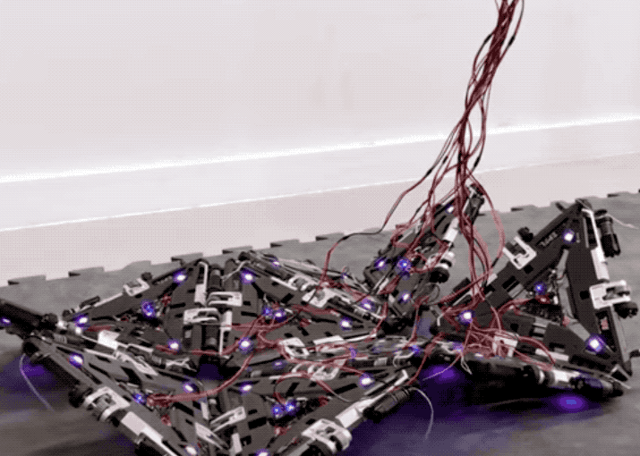
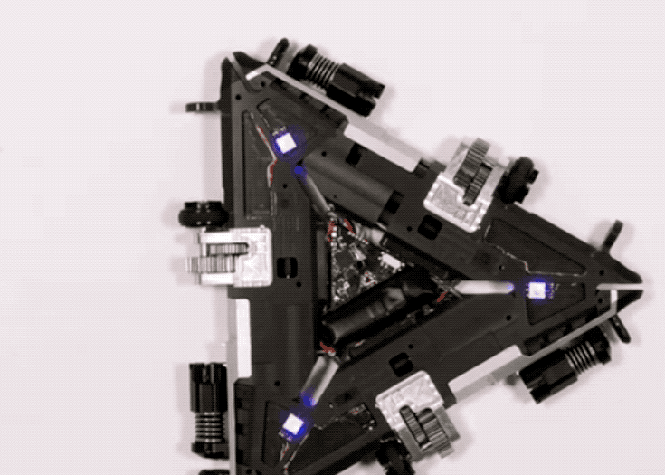
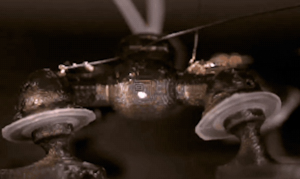
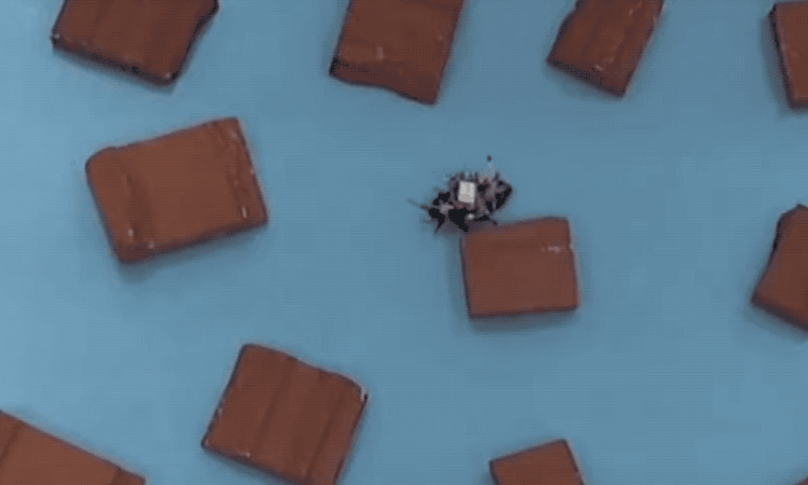

# 这些牛鬼蛇神，还敢叫自己机器「人」？

在人形机器人之前，波士顿动力开启的机器狗风潮也曾经大火，目前，机器狗产品已经进入了许多工业领域进行了实际应用。不过，无论是人形机器人还是机器狗，都还在模拟我们生活中最常见的生物类型，使用两足或四足行走。

或许你曾思考过，这样的设计是不是过于拘泥？机器人与人类截然不同，它们并不受到任何生理上的限制。难道它们不应该拥有一个更加富有想象力的设计吗？

一些科学家正是这么想的。

在这篇文章中，极客公园将挖掘一些充满创意的机器人行走设计。尽管其中的许多设计仍处于早期研究阶段，但这些设计，有望打破常规，塑造未来机器人技术。

机器人“变身！”

可变形机器人听起来是最接近科幻中的机器人。人们对机器人最早的幻想之一，就是变形金刚这样的机器人。

来自瑞士洛桑联邦理工学院 (EPFL) 的工程师团队就设计出了这样一款机器人。

和我们常见的设计初期就固定成某个形状的机器人不同，瑞士洛桑联邦理工学院的团队设计出来的机器人Mori3，由一堆零散的“三角形”组成，在完成特定任务时，这些三角形会自动组合，组成最合适完成任务的形态。

_图片来源：瑞士洛桑联邦理工学院Youtube视频_

仔细观察Mori3的每一片三角形，三角形其实本身也可以进行变化，三角形的三个边可以伸缩，从等边三角形变形成更加不规则的三角形。在三角形的每条边上，都有一个卡位，可以与其他三角形相连。

研究员介绍，Mori3的厉害之处在于，三角形不但可以任意拆装组合，三角形中其实含有可以通信沟通的部件，三角形之间由此可以相互沟通，进行自我组合。

作为一个由三角形组成的可变形机器人，Mori3可以根据需求，采用不同方式进行行走。组成四足机器人时，它的腿可长可短，而在平面上，它也可以直接组成一个类似轮子的形态。

之所以采用三角形，研究者是这么解释的：三角形是多边形的最小结构，而Moris的底层技术正是多边形网格处理，即一种能够把多边形划分成为多个无缝衔接的小模块的技术。

_图片来源：瑞士洛桑联邦理工学院Youtube视频_

Mori3这样的机器人，属于可变形机器人的一种。在论文中，研究人员写到：“可变形机器人可以拥有广泛的功能性，但是这一点迄今为止受到了形态灵活性和解决特定应用难以兼顾的限制。”

2023年6月公布的Mori3验证了多边形网格处理可以作为一种可行的机器人策略。通过对三维结构进行抽象，采用多边形网格处理的机器人可以创建出多样性的形状，并能够进行动态控制。

Mori3目前已经可以实现许多功能，比如移动、处理物体和与人交互。研究员提供了几个在家居场景下Mori3可能实现的功能：可以用于挪动家具；可以被固定在天花板上，作为“第三只手”，吊下来自动把一些物品捡到应有的位置。

不过这样的机器人，目前更大的可能，是被用于航空领域。“像 Mori3 这样的通用机器人在某些领域的效率不如专用机器人。也就是说，Mori3
的最大卖点是它的多功能性。”研究者Jamie Paik提到。

在航空领域，使用这种可重新配置的模块可以有效减少有效载荷质量，从而减少推进剂的需求。可变形还可以使它能够轻松通过一些复杂的地形，到了位置之后重组而满足需求。

通过爆炸行走的机器人

通常讲到机器人，我们想到的都是一些大型的机器人。事实上，在更迷你的尺度上，机器人领域也有很多有趣的事情发生。

9月14日才发表在《科学》杂志上的一篇论文中，科学家刚刚宣布造出了一种运动方式十分奇特的微型机器人——通过进行反复自爆产生推力进行走路。

_图片来源：IEEE Spectrum的Youtube（或者可以放这段视频）_

视频中的小型四足机器人，只有四条腿，但可以实现高频“踢踏舞”，也可以跳到身体的百倍高高度，动态的视觉效果有点让人想起了米奇的动画的夸张视觉效果。

据介绍，该机器人只有29毫米长，重量仅为1.6克，是一个“昆虫级别”的机器人。但它可以垂直跳跃59厘米，并且可以携带22倍于自身重量的重量行走。

帮助这个机器人完成这一点的，是它特殊设计的驱动器。

与传统机器人使用电池电力驱动不同，它使用的驱动器可以被形容为是非常小，非常软的内燃机，拥有一个软体的燃烧室。

这个像气球一样的软体燃烧室，被安装在腿的中间。里面注入甲烷蒸汽和氧气，需要运动时，会有一个非常小的火花点燃这些气体，产生爆炸。在爆炸的一瞬间，燃烧室会像气球一样鼓起来，产生一个力驱动机器人向上飞行。

 _图片来源：IEEE Spectrum的Youtube_

这只机器人目前有四只腿，但是只在身体的两侧有两个驱动器。通过这样的设计，可以实现一些运动控制。比如同时触发两个驱动器会使机器人向前移动，只触发一侧可以使机器人旋转或者控制方向。

研究员表示，其实使用这样的驱动器的机器人，并不真的需要使用腿的结构。“完全可以是一只快速蠕动的虫子的形态，或者是一个快速煽动翅膀的昆虫形态。”康奈尔大学的实验室Robert
F. Shepherd讲到。

康奈尔大学的研究员们最初探索使用“自爆”的方式进行前行，主要是因为小型机器人不能像大型机器人那样使用电动的解决方案。无论是电池还是电动的驱动器，都没有办法很好地缩减尺寸。

不过在进行小型化研究后，研究员现在正在进行更大胆的设想：将无数这样小型的通过爆炸驱动的驱动器运用到大型机器人中，变成大型刚性机器人的人造肌肉的一部分。

化学燃料的能量密度是远大于电池的。使用这样小型的爆炸方式来运行，机器人的运动可以更强大，更快，能承受的负载也可以更大。

蛇式前进

一谈到机器人行走，我们最直观的想法还是会想到两足机器人或者四足机器人，尤其是四足，几乎是机器人行走的首要选择。

2021年，NASA举行了BIG Idea Challenge，参与者需要挑战设计一个，能够在月球的陨石坑这样的极端地形下生存、并将数据发送回地球的机器人。

来自东北大学（Northeastern
University）的获奖者，先后设计了跳跃、有腿、轮式甚至翻滚式的机器人。轮式的机器人会沉入风化层中，无法安全地在陡峭的地形中行进；双足式机器人在沙质环境中也会下沉并且稳定性较差；跳跃机器人很难在不造成损坏或被卡住的情况下发射和着陆。

翻滚式机器人是其中表现相对较好的，可以安全到达陨石坑，但是一旦到达陨石坑之后，翻滚式机器人精准操纵科学仪器完成任务的水平却较差，只能通过翻滚前进，对运动的控制性也较差。

最终，团队利用响尾蛇的灵感，设计出了一款蛇式的机器人。

_图片来源：东北大学的研究视频_

除了蛇身可以扭动前进之外，蛇式的设计还可以让机器人直接卷曲成一个螺旋和直接形成一个轮式的样式，在斜坡上能更快地下滑。

而蛇身尾部设计有一个微型中子光谱仪，可以测量月球表面中子能量的变化，并识别沙克尔顿陨石坑深处的氢，从而识别是否含有水。

事实上，采用蛇形机器人形状来探索太空的机器人已经变得越来越常见了。

2023年5月，在另一个太空探索任务中，NASA刚刚发射了一个重约100公斤，长4米的机器人，来探索土星卫星土卫二上是否存在生命迹象。

与月球上的陨石坑不同，土卫二的表面是冰冻的。因此，在EELS项目中，蛇形机器人身上有着螺旋的表面，以提高摩擦力。为了探测冰冻的水面下的世界，蛇形机器人还被设计成了可以游泳的形态。

_图片来源：NASA Jet Propulsion Laboratory的Youtube视频_

设计一个蛇形机器人是很难的。“真正的蛇依靠身体上鳞片的微观结构来移动，这是我们无法复制的，因此看起来正确的运动模式可能会让机器人蛇在原地扭动，而不需要任何向前移动。”加州理工学院教授Christoph
Koch讲到。

目前蛇形机器人，尤其是自主运动的蛇形机器人仍然处于一个比较前沿的领域。“没有一本关于如何设计自主蛇形机器人的教科书。我们必须自己写。这就是我们现在正在做的事情。”EELS
首席研究员Hiro Ono讲到。

在未来，蛇形机器人或许还将加入飞行功能。

去年，在《流体物理学》刊物上上发表的一篇论文中，弗吉尼亚大学和弗吉尼亚理工大学的学者收集了一种会飞的蛇——天堂金花蛇的数据，进行分析，揭露了天堂金花蛇飞行气流机制。报道称虽然这些技术没有马上被运用到机器人中，但很可能研究者将进一步将这样的运动机制添加到蛇形机器人中。

未来的机器人，并不需要机器？

受到生物仿真启发的机器人有很多，但未来的机器人大军，可能根本不是钢筋铁骨，而是一个个无需充电的，远程控制的蟑螂赛博格？

新加坡南洋理工大学9月研发出了一种新型的无侵入式控制蟑螂的方法，让蟑螂能够为人所用，成为蟑螂赛博格。

研究小组找到了一个办法，可以为蟑螂带上一种特殊的套筒。套筒由黄金和塑料制成，一旦接受紫外线的照射，就会像塑料收缩膜一样收缩。

同时，研究人员给蟑螂背上一个小背包，背包可以远程接受控制器的信号。这样，一旦接收到信号，小背包会根据信号，选择性地刺激蟑螂的触角，从而引导蟑螂改变其前进方向。研究人员还将一个电极粘在蟑螂的腹部，当以正确的方式刺激时，蟑螂会跑得更快或更慢。

在研究人员进行的一系列测试中，蟑螂赛博格可以完全做到听从命令在S型的轨道上奔跑。

事实上，人们试图造出动物赛博格的努力已经有很久了，但是远程控制通常达不到相关的精度，因此很多时候需要借助脑机接口、插入电极直接控制肌肉的技术和基因改造技术进行控制。此次对蟑螂的控制，在无创控制的控制精度上是一个突破。

如果此项技术能够进一步出现突破，直接利用生物制造机器人，比起利用生物仿真机器人，或许会是一条伦理上充满争议，但技术上充满前景的路线。

