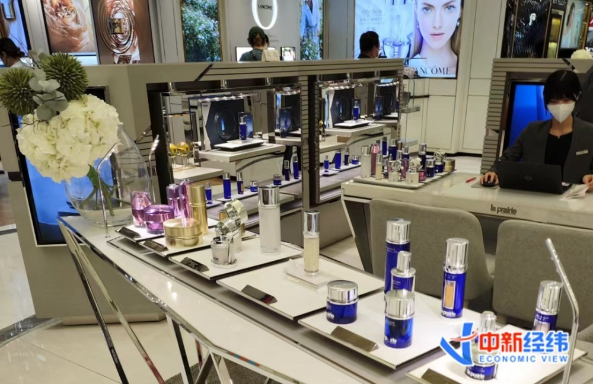
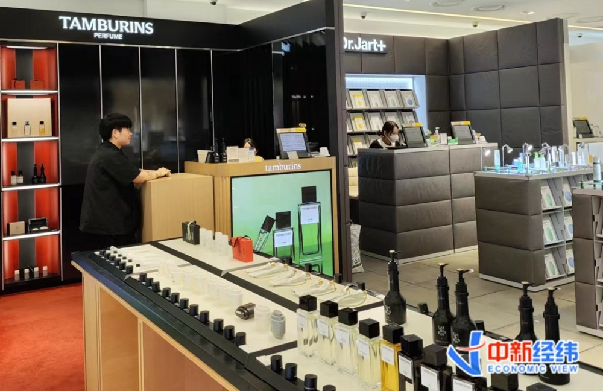

# 韩国代购自述：人肉搬运10公斤，赚得还没路费多

中新经纬10月3日电
(马静)“想转行，虽然还没有方向，但我明确知道代购是做不下去了。”小许在韩国留学期间开始做代购，今年是第八年。她告诉中新经纬，最近觉得赴韩代购越来越难做，早起抢货熬夜发朋友圈，一个人搬十多公斤重的东西飞一趟，赚得还没路费多。

曾经，来自中国的代购撑起了韩国免税业的半壁江山，但今时已不同往日。

**两次飞韩国代购都亏本**

小许通常会亲自飞到韩国采购，俗称“人肉代购”。她算了一笔经济账，从河南飞韩国，机票来回2000元人民币，住宿一晚约400元-500元。为了节省成本，代购们通常会和同行拼一个房间，房费各半，停留4天—5天。再加上吃吃喝喝的费用，去一趟韩国的成本约在5000多元。

自从出境游放开后，小许前后共去了韩国四次，但前两次都以亏本告终，第三和第四次堪堪回本。

小许表示，代购本身是赚差价，利润并不高。但之前胜在客户多，单子多，带货量通常在100公斤左右。
**一般一个月出去一个星期，生意较好时，一个月可能要出去两次。一次可以轻松赚到1万元以上，有时也能达到2万元。但现在购买的人少了，每次带货也就十几公斤左右。**

“今年飞了三趟只回了机票钱”“去一趟韩国，累得要死要活，竟然还亏钱了”“开放后第三次飞，心脏真的受不了，要么没单，要么没货，要么得搭配，一次比一次滑铁卢”……社交媒体上，不少主打日韩代购的博主们都在贴文中将赴韩代购称之为“夕阳产业”。

_韩国的免税店 来源：受访者小许_

据韩国免税业协会披露的最新数据，7月，韩国免税销售额为9908.56亿韩元(约7.33亿元人民币)，再创年内新低；环比下降7.5%，这也是韩国免税收入连续第六个月呈现下降趋势。但与此同时，消费者人数增长至195.99万，环比增长近8%。

细分数据显示，7月，韩国免税消费中，面向外国人的销售额为7503.18亿韩元(约人民币5.5517亿元)，占全部的75.72%。不过，该销售额已经是连续第四个月下降，与此同时，外国消费者的数量连续5个月增加，7月为56.70万人。

一位不愿具名的韩国免税业人士对中新经纬表示，相较此前，韩国代购的规模确实有所减少。一是疫情期间无法出国，很多从业者转行；二是中国国内离岛免税等渠道的商品价格折扣多，更具优势。此外，赴韩代购的产品类型也有变化，香化类产品减少，生活用品等品类增加。加之许多国际大牌撤离韩国免税店，且欧洲更具价格优势，因此赴韩代购奢侈箱包的也不多了。

该位人士还表示，当前免税店的返点也比此前要少。据了解，每个免税店都有自己的金卡，返点政策即指线下免税店消费享受金卡折扣后，再按照相应的点数比例进行返现。

“疫情期间，旅游零售受到影响，免税店也希望利用代购走量拉升利润，基本给的都是批发价格。现在免税店虽然仍旧支持代购，但预期利润要更多一点，不会再类似于批发价，因此返点政策就发生了变化。”该位韩国免税业人士称。

**“身边认识的韩国代购基本都在考虑转型”**

多位受访人士均提到，价格优势不再突出是韩国代购走向“衰落”的主要原因。

珠珠也是一名日韩代购，但早早嗅到市场变化的她选择了转行。她告诉中新经纬，此前，韩国免税店的化妆品、保健品、衣服和中国国内市场存在明显价差，
**但随着直播带货和海南离岛免税市场的发展，这种价差已经被打下来，市场需求减弱，代购的盈利空间被压缩。**

小许称，相较此前，韩国免税店代购大排长龙的情况已经很少见到。前两年，自己好多客户都去做代购了，但现在身边认识的韩国代购基本都在考虑转型。有一些已经转向直播，一些则兼做很多国内业务，比如卖诸暨珍珠、莆田鞋子、广州复刻包包、衣服等，基本上不会再有人专门做日韩代购，否则肯定会亏钱。

冯信是某旅游零售服务商高管，他认为，相较韩国，海南离岛免税店的商品折扣以及线上电商平台显然更具竞争力，尤其是香化类产品。与此同时，海关正在加强对代购行为的打击，“不只是从国外往境内飞费劲，即使从香港清关，压力也比较大，对代购来说，生意并不好做”。

旅游零售商品比价APP杰西卡的秘密显示，以热门商品海蓝之谜沁润修护精粹水(150毫升)为例，全球最低价在中国，海南各离岛免税店及线上电商平台价格在598元—699元人民币之间，但韩国最低是745.91元。

 _韩国免税店 来源：受访者小许_

**消费回流，中国的免税店赚翻了吗？**

当免税消费主战场从韩国部分分流至国内，中国的免税店赚翻了吗？

仅看离岛免税市场，自2020年7月1日离岛免税新政实施以来，各免税店一度赚得盆满钵满。据海关数据，截至2023年6月30日，新政实施三年，共监管离岛免税购物金额1307亿元、购物旅客1767万人次、销售件数1.75亿件，比2017年7月至2020年6月分别增长279%、92.6%、272%。
**这意味着日均销售额就达1.19亿元。**

从公司来看，“免税茅”中国中免在海南布局最广，具有优势地位，同时又手握cdf会员购等多个电商平台。在全球旅游遇冷背景下业绩逆势冲高，中国中免2020年、2021年净利润同比增速分别达32.57%、57.23%，成为全球最大的旅游零售商，2022年蝉联该宝座。

不过，从近期数据来看，高速增长动力有所减弱。中国中免半年报显示，2023年上半年其实现营收358.58亿元，同比增长29.68%，而营业利润同比下降6.50%至49.53亿元，归母净利润同比下降1.83%至38.66亿元。

财报还显示，受海南地区备货增加所致，中国中免2022年末存货价值279.26亿元，占总资产的比例为36.79%，2023年上半年存货价值为244.54亿元，占总资产比例为30.99%。基于此，中免在半年报中，对存货跌价准备及合同履约成本减值准备计提了2.23亿元。

冯信认为，由于多数美妆品牌产能过剩，而零售商和部分消费者还握有存货，导致消费需求下滑。在此市场环境下，雅诗兰黛、兰蔻等在内的各个品牌也在抢占市场，再叠加海南离岛免税市场，基本上各个渠道都在低价竞争。
**而海南离岛免税库存积压比较多，免税店为了消化这些库存，也不得不在现有市场下，用低价清货。**

不过，冯信强调，虽然依靠价格优势，海南离岛免税及各免税店电商平台吸引了大量客流，但低价竞争并不是长久之计，尤其是海南离岛免税市场。在他看来，需要明确的是，海南离岛免税消费和出国旅游消费的用户层并不高度符合，即使海南的价格比海外高出3%—5%，也一样是有市场的，各免税店不能仅仅依靠“价格战”。(应受访对象要求，文中小许、冯信、珠珠均为化名)

**(文中观点仅供参考，不构成投资建议，投资有风险，入市需谨慎。)**

**中新经纬版权所有，未经书面授权，任何单位及个人不得转载、摘编或以其它方式使用。**

责任编辑：魏薇 罗琨

