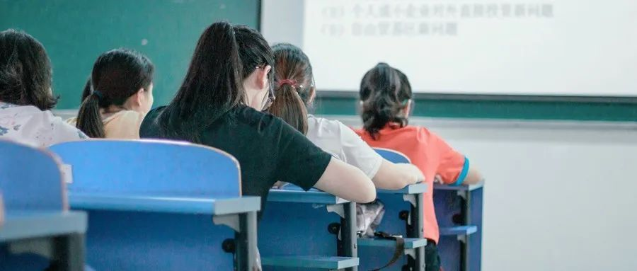
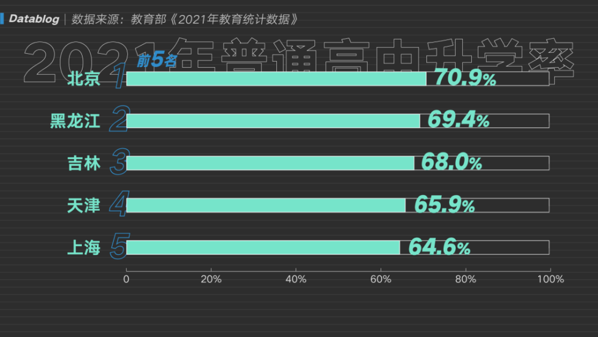
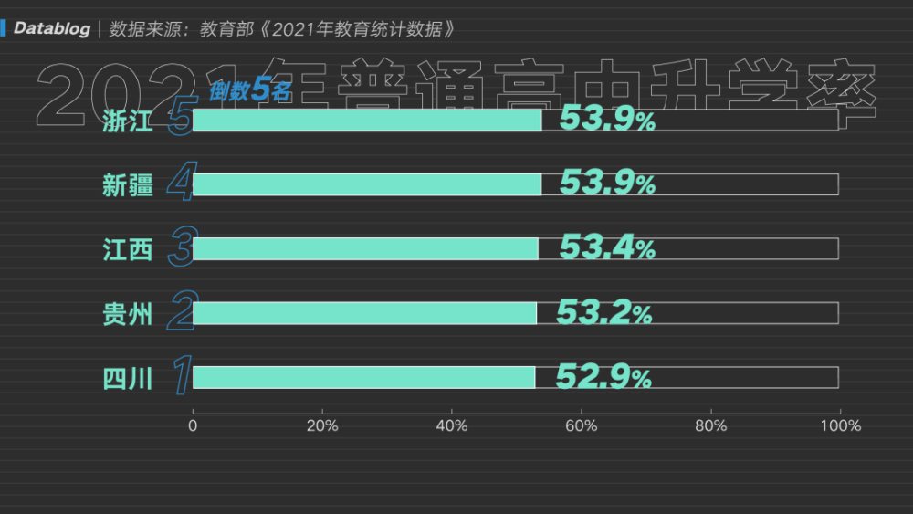
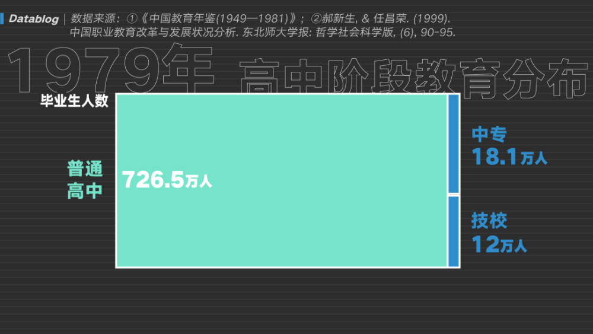
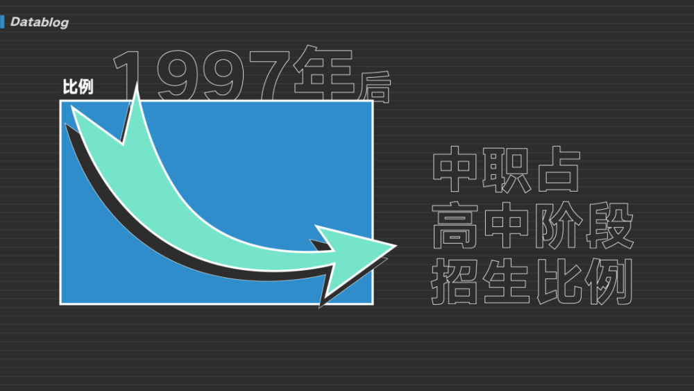
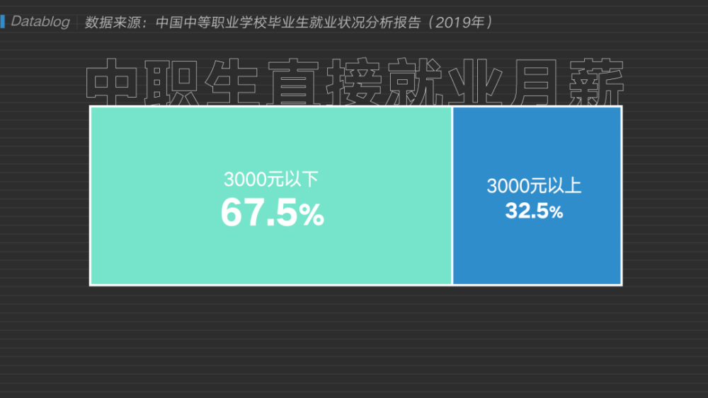
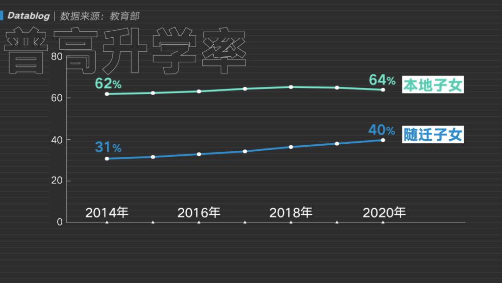

# 40%的学生被分流上不了高中：大多数来自农村，其父母多为工人或无业

**中考分流的真相**

新学期来临，有些学生兴高采烈地迎接升学，也有些人则要踏着沉重的脚步走进中专的大门。

这些年，无论是北京海淀妈妈，还是普通小镇家长，都会因为普通高中与职业院校“五五分流”的消息焦虑得头秃。每次过年回家，许多年轻人还能听到七大姑八大姨抱怨自家小孩要上不了高中了。

而另一边，那些没考上高中的孩子在公共视野中成了“看不见的 40%”。上个微博，会感觉这世界仿佛人均本科，根本不存在职校生。

那么，上高中真的有在变难吗？没考上高中的孩子最后都去哪里了？

**四成孩子，注定上不了高中**

其实人们常说上高中，指的只是上普通高中。

在教育部的定义里，普通高中和中等职业教育都属于高中教育阶段。但前者才是长辈眼里正儿八经的高中。后者，就是在人们的刻板印象中，学生成天厌学、打架、混日子的职高、中专和技校。

现在许多家长比起担心高考，更担心孩子的中考了，还有些家长都恨不得给孩子报十个培训班。

那到底有多少人上不了高中呢？

2022 年，根据教育部统计，全国初中毕业生大约有 1624 万，而普通高中招生数只有 948 万，占初中毕业生的比例不到
60%，也就是说大约四成孩子注定上不了高中 [1]。

全国大部分地区的普高升学率都在 50% 到 60% 之间。分地区来看，几个直辖市和东三省的升学率比较高。例如黑龙江，普高升学率达到 69.4%，相当于
100 个初中毕业生中，有将近 70 个能上普高。

排行垫底的是四川、贵州、江西等省份，只在 50% 左右徘徊 [2]。

这些升学率的数字乍一听很残酷，但和以前相比，现在学生上高中其实变容易了。

2000 年时，中国普通高中升学率才不到 30% [2]。在很多农村，你能上个高中就算是同龄人里的学霸了。2010
年以来，中国人的普高升学率还上升了十个百分点 [1][2]。

**过去，读中专堪比读985**

既然上高中的比例实际上在提高，那家长和学生们为什么反而比过去还焦虑呢？

答案是人们对读中职的恐惧也提高了。

其实在以前，中国人很少有考不上高中的焦虑。中职这么不受待见，还是这二十多年来的事。

时间倒转至改革开放之初。1979 年时，中国的普职比高达 24:1 [3]。也就是说，初中后升学的学生中，超过 90% 都上了普高。

但这不意味着当时的人就更愿意上普高。

那时候，中专、技校生凭借着政策优惠，上学既能转户口，又拿人民助学金，毕业后还包分配工作，到国企里当干部
[4]。许多成绩优异的初中生都抢着考中职，考上了不但不焦虑，还跟现在上 985 一样开心。

转变发生在上世纪 90 年代中期。

中专和技校逐步走向了全面收费，学生毕业了也不再包分配，直接使得这些学校对初中生失去了吸引力 [5]。

1997 年后，中职占高中阶段招生的比例下滑 [4]。到 上世纪90
年代末，许多国企在岗的熟练工人都可能要下岗，一个中专刚毕业的新手工人不仅就业困难，工人这个身份带来的荣誉感也大不如前了。

也正是这一时期，中国的市场经济高速发展，社会对高技术人才的需求猛增。与此同时，中国高校开始扩招，上大学不再像以前那么难，毕业了还能做社会眼里更体面的工作，人们就更愿意把孩子送去普高。

**现在读职校，有出路吗**

就这样，中职逐渐从尖子生的选择变成人们口中的“差生收容所”。

家里的长辈一听有哪个孩子读中专，就觉得他一定是班上的那种“坏学生”，去中专了也只是再混三年，还不如早点去打工挣钱。

可实际上，中职学生哪怕想沉下心来学门技术，学校也没能提供这样的环境。

同样都是高中阶段，读中职的体验比普高可差太多了。

根据教育部全国教育经费执行情况，在高中阶段的教育中，中职经费总投入占了三分之一左右，而普高则超过六成 [6]。

一些经费短缺、管理机制又落后的中职学校里，不仅没有专业的技术老师，也没有供学生练习技术的教学设施。

曾经一位从职校辞职的老师匿名发帖，吐槽实验室的设备要么是坏的、要么就不存在。甚至这几年新闻里经常能看到中职给学生提供的实习机会，就是暑假组团到电子厂里当廉价的劳动力
[7]。

教学环境落后，使得许多学生花了三年也没学到一技之长。

一项样本量约十万人的问卷调查显示，超过六成的家长和企业人员都认为，中职教育的最大难题是人才培养质量堪忧，无法满足企业的招聘需求 [8]。

该调查还发现，在有些中职学校，学生就业率还不到 10%
[8]。一些学生哪怕找到工作了，做的还是培训一天就能上岗，几乎没有技术门槛的活，每月只能领到微薄的薪水。

一项关于中职毕业生的分析报告显示，2019 年，接近 70% 的中职生月薪不到 3000 元 [9]。

而据麦可思的报告，2019 届本科毕业生平均月收入为 5440 元，高职毕业生也有 4295 元 [10][11]。

直接毕业工资低，不少中职生就只好继续学，在拥挤的“独木桥”上，竞争一个升高职、升本科的机会。报告显示，接近一半的中职毕业生都选择继续升学 [9]。

这样一来，现在的中职生就面临着双重的困境。去就业，在学校学到的东西不够用；去升学，不仅很难和遍地的大学生竞争，还和职业教育的初衷背道而驰。

**中职学生，大多数都来自农村**

面对着这样的未来，中职学生难免会无奈又彷徨，那些来自农村、家境贫寒的孩子体会得还要更深。

中国综合社会调查数据显示，对于 90 后而言，虽然农村学生上高中的比例比起以前有提升，但还是只有 38%，比城市学生的升学率低得多 [12]。

中国发展研究基金会对广东、四川、贵州三省 30 所中等职业学校的跟踪研究也发现，这些学校 70% 的生源都来自于农村
[13]。他们中的许多人，因为没有更好的家庭资源、教育环境，更容易在中考这场“战役”中被淘汰出局。

也有一些农村孩子虽然跟随父母进了城，但也因为户籍等原因没法就读本地高中。教育部数据显示，2014
年以来，全国的本地初中毕业生超过六成能上普高，而随迁子女的这个比例不超过 40% [2]。

曾经有记者问一位上海中等职业学校的老师，班上学生的家长是做什么工作的，得到的回答是工人、保洁、食堂打菜员、无业……不少学生都是没有本地户籍的流动儿童。

他们中的许多人毕业后，因为找不到好工作，只能继续从事父辈的职业，延续他们的命运。

所以，可以说上高中其实没有变难，但随着中职的光环褪去，随着人们把高中当成人生唯一出路，水涨船高的教育投入就让这场竞争变得更为激烈。而最后“落败”的往往是在网络上最没有声量的人。

还值得庆幸的是，现在这个社会，学历虽然重要，但还不能给人全盘限定未来的轨迹。中职不会给人生宣判死刑，就像大学学位证也没法许诺你一个美好前程一样。

策划：库洛洛

配音：唐不苦

分镜：叶榆北 甜甜姜

动效：陈颖 卜卜脆

剪辑：甜甜姜

设计：杨波浪 麦土豆

[1] 教育部. (2023). 2022 年全国教育事业发展统计公报.

[2] 教育部. (2022). 教育统计数据(2000-2021).

[3] 中国教育年鉴编辑部. (1984). 中国教育年鉴(1949—1981). 中国大百科全书出版社.

[4] 和震. (2009). 我国职业教育政策三十年回顾. 教育发展研究, (3), 32-37.

[5] 曹茂甲. (2011). 建国以来中等职业学校招生就业制度的演变. 职教通讯, (17), 61-66.

[6] 教育部. (2021). 全国教育经费执行情况统计快报.

[7] 周兰, & 邢鹏举. (2021). 郑州一职业中专强制学生到专业不符的电子厂实习？教育部门介入，不再强制实习. 今报网. Retrieved 14
August 2023, from http://www.jinbw.com.cn/c/20210507/n_1620391673215197.html.

[8] 王湘蓉, 孙智明, 王楠, 周彩丽, 赵琼花, & 袁嘉妮. (2021). 中国职业教育发展大型问卷调查报告. 教育家.

[9] 中等职业学校职业指导丛书编写组. (2020). 中国中等职业学校毕业生业状况分析报告 2019 年. 北京理工大学出版社.

[10] 麦可思研究院. (2020). 2020 年中国大学生就业报告.

[11] 麦可思研究院. (2020). 2020 年中国高职生就业报告.

[12] 中国综合社会调查项目组. (2018). 中国综合社会调查 2017 数据集.

[13] 中国发展研究基金会. (2019). 赢未来：中等职业教育学生发展报告——基于 30 所中等职业教育学校的调查研究.

