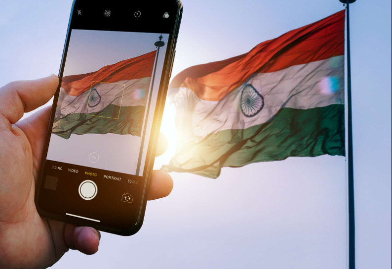
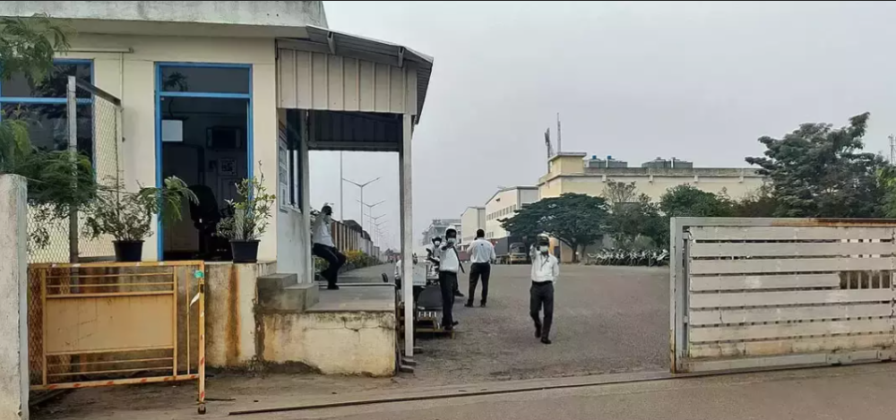
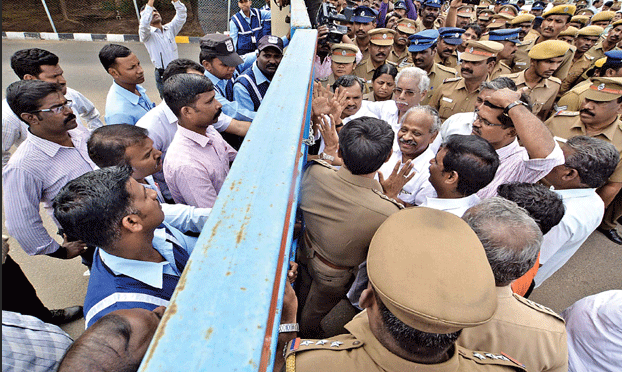
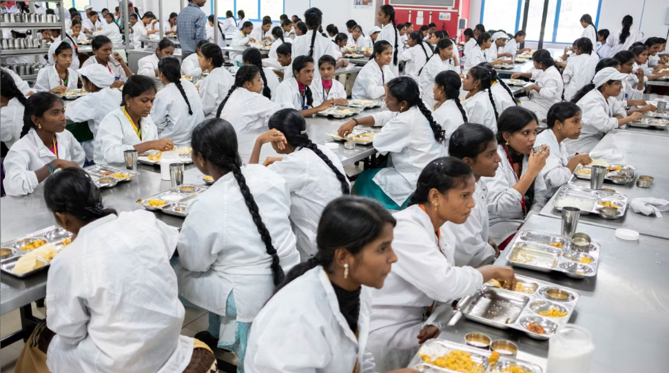
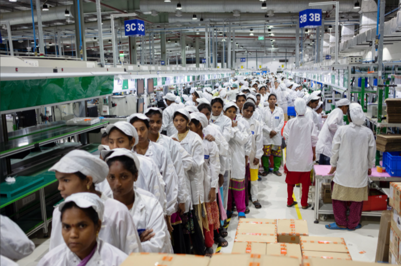

# iPhone背后的富士康印度：被骂血汗工厂本色，员工待遇差生活条件恶劣

划重点：

  * _1_ 按照苹果的规划，到2025年印度产iPhone将占全球总产能的25%，高于2022年的5%。
  * _2_ 富士康印度泰米尔纳德邦工厂2021年曾发生员工集体中毒事件，导致该工厂闭厂整改。
  * _3_ 富士康泰米尔纳德邦工厂多聘用合同工，同工不同酬，富士康借此撇清法律义务。
  * _4_ 富士康泰米尔纳德邦工厂工人一周工作六天，每天工作八小时，过多请假要扣工资。
  * _5_ 富士康泰米尔纳德邦工厂工人工资极低，普通工人不吃不喝工作半年才能买一部iPhone 15。

腾讯科技讯
10月4日消息，富士康的工作环境较为恶劣，长时间的高强度工作和严格的时间限制，让员工难以承受。另外，富士康对员工的纪律和工作要求非常严格，一旦违反规定，可能会面临罚款、警告、甚至被开除的处罚。国外媒体日前撰文指出，在苹果把iPhone的部分组装任务转移到印度之后，富士康又在印度饱受争议，并因2021年发生员工食物中毒时间导致集体罢工。以下为文章全文：

在印度南部一条尘土飞扬的高速公路旁，三座新落成的工厂建筑矗立在黑色尖钉铁栅栏后面。在它们的阴影中，若干辆黄色的工程车辆停在翻起的土堆和一个半建成仓库的龙骨旁边。今年5月的一个下午，一群身着蓝色和粉色制服的女人在交通和建筑的喧嚣声中匆匆从一栋楼跑到另一栋楼。

这座工厂位于印度泰米尔纳德邦工业城镇斯瑞佩鲁姆布杜尔（Sriperumbudur），是苹果在中国之外重要的iPhone组装中心之一，由总部设在中国台湾的电子制造公司富士康运营。这家工厂的大门每天三次向成千上万的工人敞开，其中大约四分之三是女性。这些工人一周工作六天，每天工作八小时，在繁忙的装配线上焊接配件、拧螺丝或操作机器。该工厂也是印度最大的iPhone工厂之一，拥有约1.7万名员工，每年生产600万部iPhone。而且，这家工厂还在快速扩产。

在苹果2022年售出的2.32亿部iPhone当中，绝大多数由中国工厂生产，其中许多来自富士康位于郑州的一家大型工厂。苹果选择押注印度，因为该国也是14亿年轻人口的家园。2022年9月，苹果宣布iPhone
14将首次在印度组装(在此之前，富士康位于斯瑞佩鲁姆布杜尔的工厂只组装较旧的型号)。今年4月，苹果首席执行官蒂姆·库克（Tim
Cook）飞往印度，拜会印度总理纳伦德拉·莫迪（Narendra
Modi），承诺将加大对该国的投资，并亲自为两家新开的苹果零售店剪彩。根据最新的报道，斯瑞佩鲁姆布杜尔工厂的工人正在组装已在9月上市的新款iPhone
15。

推动苹果转向印度的正是富士康。到2024年，富士康希望将该公司位于印度南部的工厂产量提高近四倍，达到每年2000万部iPhone。据报道，富士康计划雇佣数万名工人来实现这一目标。遥感卫星数据公司星球实验室（Planet
Labs）提供的卫星图像显示，斯瑞佩鲁姆布杜尔工厂正在快速扩张，在过去两年里建造了三座新厂房，新开辟的空间还能够容纳至少三座新厂房。据摩根大通的分析，到2025年，苹果在印度生产的iPhone将占全球总产能的25%，而2022年这一比例仅为5%。

苹果向印度转移iPhone产能，既有受益者，也有受害者。2021年，159名工厂工人因在分包商提供的宿舍吃了不卫生的食物而中毒住院。这一事件引发了一连几天的抗议浪潮，引起了印度媒体对iPhone组装工人恶劣生活条件的关注。住院治疗之后，印度政府对该工厂进行了检查
--此前没有报道过--
查出许多安全隐患和侵犯工人权利的行为。富士康对此发表声明称，2021年12月进行的政府检查促使富士康在苹果和泰米尔纳德邦政府的监督下，花费160万美元改善工厂的健康和安全。

**印度政府调查**

2021年12月17日上午9点，在员工集体食物中毒事件发生两天之后，泰米尔纳德邦政府的健康和安全检查员出现在斯瑞佩鲁姆布杜尔的iPhone工厂门口。根据政府检查员随后发送给富士康的信件，检查发现，6名工作是手工把iPhone零件焊接在一起的工人“没有配备防护设备”，包括护目镜、耐化学腐蚀的手套或呼吸器。检查还发现，在进行焊接的工厂区域，通风系统不足以防止“有毒烟雾泄漏和扩散到工作环境中。”信中说，焊接过程“对工人的健康非常有害。”

在该工厂的另一个地方，检查员发现工人“没有配备合适的护目镜来保护他们的眼睛免受过量的光线和红外辐射的伤害。”他发现77台自动化机器的门上缺少关键的“联锁装置”，防止在危险条件下运行；还有262台冲压机器缺少防护装置。信中说，缺乏这些保护机制会给员工带来身体伤害的风险。此外，6个用于将微小电子元件附着到iPhone电路板上的大型工业烤箱，在工厂工人预计使用它们之前，没有经过“合格人员的测试”。

根据这封信，检查还发现了几起明显违反印度劳动法的行为。据说，在过去的3个月里，该工厂至少有11名工人被要求超时工作。至少有17名工人被要求在周日工作，而通常这是他们每周唯一的休息日，并且在3天内没有给他们提供补休。“工厂里的所有厕所和小便池都没有始终保持清洁卫生，”信中说，工厂一楼有碎片，存在安全风险。检查员声称，工厂经理没有保存工厂工人的登记册或工资登记册。在检查时，该工厂的6126名工人中有4500多人据称不是受雇于富士康，而是受雇于11个不同的分包商，这些分包商没有在泰米尔纳德邦工业安全和健康理事会合法注册。

这封信表明，检查员发现该工厂存在多处违反地方法律的行为。同样的调查结果也可能违反苹果长达127页的《供应商行为准则》，该准则在字面上保证iPhone制造工人有权在安全的环境中体面地工作。该准则规定，苹果供应商必须提供“安全的工作条件”，包括提供个人防护设备，确保足够的通风，以及维护机器上适当的安全机制。苹果的《供应商行为准则》称，任何加班都必须是自愿的。它补充说，工人应该每七天至少休息一天，并且可以使用干净的厕所设施。苹果并不阻止其承包商使用第三方劳务中介来供应工人，但表示这些中介必须合法注册。“任何违反本准则的行为都可能危及供应商与苹果的业务关系，甚至包括终止关系，”苹果在《供应商行为准则》作出了这样的规定。

泰米尔纳德邦检查员当时在致富士康的信中警告称，除非该公司能够解释为什么它“不应因检查中发现的违规行为而被起诉”，否则会在7天内对其采取“适当的行动”。目前无法证实泰米尔纳德邦政府在这封信之后采取了什么措施。当时对富士康进行检查的泰米尔纳德邦工业安全与健康理事会对此报道未予置评。

在检查后的第二天，富士康斯瑞佩鲁姆布杜尔工厂停工整改。不久之后，苹果派出了一个独立审计团队。但在当时的公开声明中，两家公司都没有提到泰米尔纳德邦检查员描述的工厂内部出现一连串的问题。相反，苹果和富士康都发表声明称，他们对非厂区宿舍的卫生问题感到担忧，并将迅速着手解决那里的状况。两家公司的声明给人的印象是，工人健康和安全的主要风险来自分包商经营的宿舍，而不是富士康自己的工厂。该工厂关闭了近一个月时间，在2022年1月12日开始分阶段重新开放。

苹果和富士康对此报道分别发表声明，承认泰米尔纳德邦政府对工厂进行了检查，但没有对具体发现发表评论。“我们采取了措施，解决了政府在检查中提出的每一个问题，”富士康发言人在声明中表示，但没有具体说明这些问题是什么。“员工的健康和安全是富士康的头等大事。”

苹果发言人同样拒绝对具体调查结果发表评论。“富士康斯瑞佩鲁姆布杜尔工厂的问题已经在一年半前进行了调查和解决，随后我们对该工厂试用了一个阶段，”苹果发言人在声明中表示。“在此期间，富士康对改善员工生活条件进行了投资，通过了我们的季度审计，有时是每周审计。苹果和独立审计师通过频繁到访和员工访谈，对工厂的升级进行了跟踪。”该发言人还说，苹果开展的调查发现，2022年8月至12月期间，该工厂的员工满意度提高了27%。

**压榨合同工**

根据外媒对3名工人的采访，在检查、抗议和工厂关闭后的几个月里，富士康实施了一些积极的变革。该公司取消了工人必须住在分包商提供的宿舍的规定，并将工人的工资每月增加了5000卢比（约合60美元），以支付独立租赁宿舍的相关成本。工人们说，自抗议以来，工厂食堂的食物和车间的工作条件都有所改善，但他们认为仍存在重大问题。

自工厂关闭并重新开放后，4名现任员工在今年5月向外媒表示，总体来讲，工作场所的安全性得到了改善。但是这些员工抱怨过高的生产目标，以及实际上造成双层工作场所的分包制度，在这种工作场所，相对较少的富士康员工享有比大量临时工更高的福利和工作保障，而临时工由第三方印度分包商雇佣，也在工厂内工作。（在接受外媒采访的4名员工当中，有3人通过分包商雇佣的；只有1人是富士康员工。)

虽然接受采访的工人一致认为，自2021年抗议和随后的检查以来，工厂的条件有所改善，但他们也表示，许多问题仍然存在。3名工人提到的同一问题是他们的工资：根据工厂内略有不同的角色，从每小时82到101卢比不等，相当于每小时0.99到1.22美元。虽然这样的工资是泰米尔纳德邦电子工人最低工资的两倍多，比印度大多数非国有企业要好，但它们给工人提供了很少的提升经济地位的机会，特别是因为他们中的许多人有孩子和年迈的父母要抚养。“按印度国情来看，这并不是一个可怕的工资。这不是一个公平的工资，但它并没有让我感到震惊，”工厂附近城市钦奈的劳工律师拉马普里亚·戈帕拉克里希南（Ramapriya
Gopalakrishnan）说。她说，在工厂周围的城镇租一个房间将花费一个工人月薪的三分之一左右。“除此之外，还要养活两个上学的孩子，还要养活父母，这非常困难。”

在富士康斯瑞佩鲁姆布杜尔工厂，每天轮班开始前，富士康的管理人员都会宣布生产目标。据两名装配线工人称，有些日子，这些目标可能要求每个工人每小时处理多达520部iPhone或者每7秒处理一部。按照这样的速度，生产线上的每个工人每天可以处理价值约400万美元的iPhone。

这条装配线上的每个工人都有指定的任务。有些人是在iPhone主板上安装特定组件；其他人已学会了拧紧单个螺钉所需的精确的手指运动。在常规阶段，一些工人进行质量检查，以确保每部手机从装配线上的一个点运送到下一个点时没有出现任何问题。

工厂车间的合同工米娜（Meena）说，她一周工作六天，每天工作八小时，弓着背站在工位上，手指不停地移动。“有些日子，我甚至没有时间去洗手间，因为我必须达到生产目标，”她说。“如果主管注意到产品堆积在我这个位置的传送带上，他会训斥我。”米娜说，分配给自己的任务，导致她的手指、手腕、肘部、肩膀、脖子和背部疼痛。她说，如果她改变姿势来减轻疼痛，比如翘起二郎腿，主管会经常催促她坐好。米娜说，富士康允许出现健康问题的工人短暂休息，并为他们提供非处方止痛药。但是在休息之后，米娜说她仍然希望在今天剩下的时间里继续进行高强度的工作。

米娜并不直接受雇于富士康。相反，像她在工厂的许多同事一样，她受雇于第三方承包商。劳工律师戈帕拉克里希南表示，这种制度并非富士康独有。她说：“这种作法在印度制造业很常见，因为这有助于工厂主保持灵活的劳动力，他们对合同工几乎不用承担法律义务。”

“与固定的雇员不同，这些所谓的合同工甚至不知道他们是否能在明天以后谋生--
这就是我们正在谈论的不确定性程度，”戈帕拉克里希南说。“这一整套合同工制度旨在降低劳动力成本，逃避遵守劳动法的责任。”

据三位接受采访的人士透露，在斯瑞佩鲁姆布杜尔工厂，合同工没有病假或假期，也没有合同副本。工人们说，富士康今年早些时候在那里制定了一项新政策，如果合同工一周内休息两天，他们的月薪将被扣除1500卢比（约合18美元），相当于几天的工资。工人们说，如果连续休息三天，他们的工资将被扣除5000卢比（约合60美元）。

这似乎描述了更多违反苹果《供应商行为准则》的行为。苹果在行为准则中规定，供应商遵守“最高标准”的劳动标准。它特别指出，供应商不得将扣除工资作为一种纪律形式，不得阻止工人上厕所，必须采取措施减轻“人体工程学危害”，包括痛苦的姿势和重复的动作。

在苹果和富士康的声明中，都没有对克扣工资、合同工工作条件差、人体工程学危害或高产量目标的指控发表评论。“我们与当地相关机构合作，确保所有招聘工作都遵循富士康的招聘标准和指导方针，以及当地的劳动法规，”富士康发言人表示。“无论我们在哪里，富士康都与利益相关者沟通和合作，不断创造一个健康和有竞争力的运营环境，同时保护我们员工的权益。”

“我们对供应商有业内最高的标准，并定期评估他们对我们行为准则的遵守情况，”苹果发言人表示。“通过多种反馈渠道，包括员工调查和匿名举报，我们一直在寻找进一步提高标准的方法。”

**iPhone 15等于半年工资**

回到富士康厂区的外围，越过土堆和半建仓库的龙骨，越过一个由穿着白衬衫的警卫把守的安全小屋，是两排看起来像是工人宿舍的建筑。两排建筑都有四层楼高，100米长，带有混凝土阳台。

这些建筑可能是未来的一种尝试。随着苹果热衷于在印度增加iPhone产量，富士康计划在斯瑞佩鲁姆布杜尔工厂附近为多达6万名工人建造大型宿舍。富士康厂区内的一大片土地目前正在施工。因此，该工厂的工人担心，富士康可能会再次要求员工住在公司经营的宿舍，并可能取消目前支付给工人的每月5000卢比（约合60美元）的住房补贴，用户支付他们在厂区外住宿的费用。

与此同时，最贵的iPhone 14零售价为999美元，最贵的iPhone
15零售价为1099美元。虽然苹果没有公开披露iPhone的最终售价和生产成本之间的差异，但该公司最新的财务数据显示，产品销售的每一美元收入中，该公司可以获得约35%的利润。

斯瑞佩鲁姆布杜尔工厂四名接受采访的工人表示，虽然他们不太可能在其他地方找到更高的工资，但他们仍然觉得应该得到更好的待遇。他们中收入最低的人要花大约六个月的时间才能攒够钱买一部iPhone
15--
这还是在未支付房租、食物或养家糊口的情况下。一名年轻的女员工表示：“当我把我的工资与一部iPhone的价格进行比较时，显然他们可以付给我更高的工资。”（无忌）

