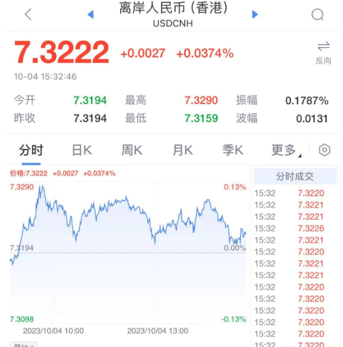

# 发生了什么？亚太市场上演“股债双杀”，恒生指数盘中再创年内新低

中国基金报 泰勒

昨晚美股暴跌，寒气传到到亚太市场，日本、韩国股市均暴跌超2%，亚洲市场上演“股债双杀”，恒生指数盘中再创年内新低。

一起看看发生了什么事情。

**亚太市场暴跌**

周三亚太股指集体大跌，日经225指数跌2%，韩国KOSPI指数跌2.41%，澳大利亚S&P/ASX200指数跌0.77%，台湾加权指数跌1.1%。

此外，多国国债跟随美债下跌，30年期美债收益率涨至5.0%，为2007年8月以来最高水平，10年期日债收益率自2013年以来首次升至0.8%，10年期德债收益率自2011年以来首次升至3%，意大利10年期国债收益率涨至4.964%，达到自2012年11月以来的最高水平。

港股方面，恒指收跌0.78%，科指收跌1.71%。

A50跌1.5%左右，人民币汇率跌至7.32。

欧洲开盘后继续下滑，美股盘前继续下跌。

**背后发生了什么？**

原因还是出在美国。

当地时间周二（10月3日），最新公布的美国职位空缺数量意外明显反弹，表明即便美联储正努力使经济降温，但劳动力市场仍然强劲且紧绷。

美国8月JOLTS职位空缺增加至996.1万，远高于预期881.5万及7月882.7万，反映劳动力市场仍然强劲。

市场对美联储尚未完成加息的猜测进一步升温。投资者逐渐认为政策利率可能会无限期地维持在高位，长端债收益率飙升已经反映了这一预期。

随后，美国国债收益率大幅上涨。10年期美国国债收益率自2007年8月以来首次突破4.8%，不断加剧的国债抛售引发了华尔街股市周二再次下跌，抹去了道琼斯指数年内的剩余涨幅。

10月4日，美国30年期国债收益率触及5%的水平，这是自2007年以来首次，有分析师表示，只有在美国劳动力市场数据出现令人失望的情况下，这一趋势才会出现逆转。问题在于，近几个月来，有关美联储大举加息导致美国经济即将陷入衰退的说法一直被证明是错误的。数据继续显示，美国经济具有弹性，这让美联储几乎没有理由在短期内降息。这可能进一步给整体风险情绪增加压力。

华尔街日报记者Nick
Timiraos撰文称，长期债券利率突然飙升至16年高点，正威胁着经济软着陆的希望，尤其是因为这一情况的具体触发因素尚不清楚。一年半以来，美联储一直在提高短期利率。这些加息旨在推高长期债券收益率，通过放缓经济来对抗通胀。但最近这波上涨值得人们小心。如果最近借贷成本的攀升，以及随之而来的股价暴跌和美元走强持续下去，那么明年美国和全球经济可能会明显放缓。近期收益率的快速上涨也增加了金融市场崩溃的风险。

美联储博斯蒂克指出，美联储在压通胀方面仍有很长的路要走，可能需要很长时间，才能采取降息行动，希望美国在「很长一段时间」保持利率稳定。

克利夫兰联储主席洛蕾塔·梅斯特（Loretta
Mester）表示，通胀仍有上行风险，美经济如稳健，将支持11月再加息。美联储需要在加息不足与加息过度之间找到平衡点，亦有必要在一段时间内维持限制性利率政策。

芝商所数据显示，市场预期联储局年内再加息概率，由上周不足4成，升至现时接近5成。

