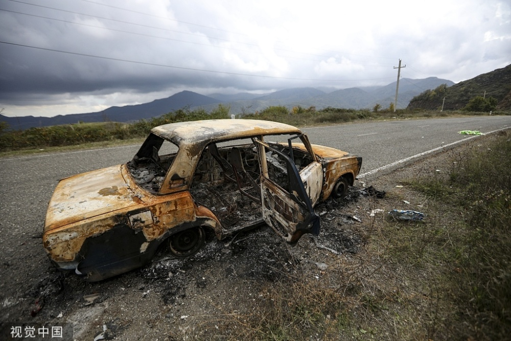
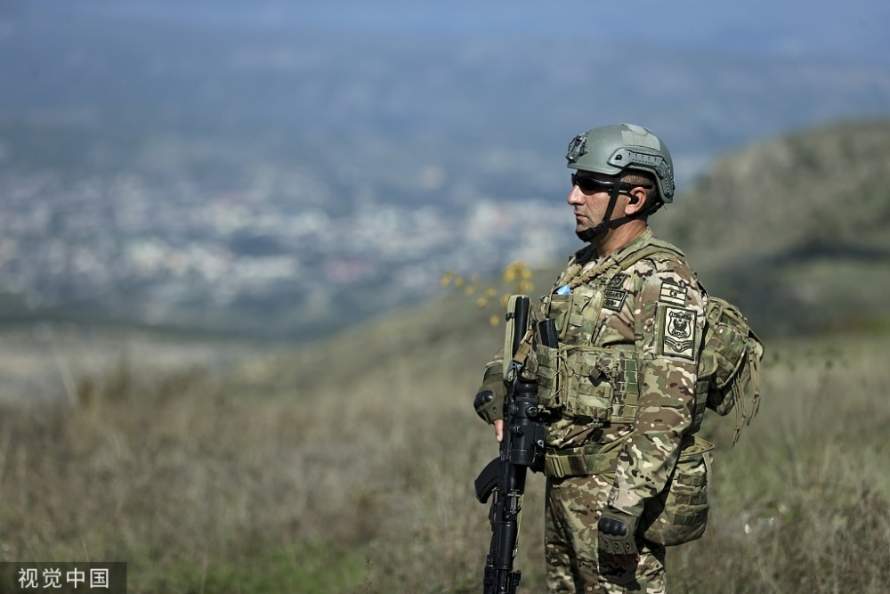
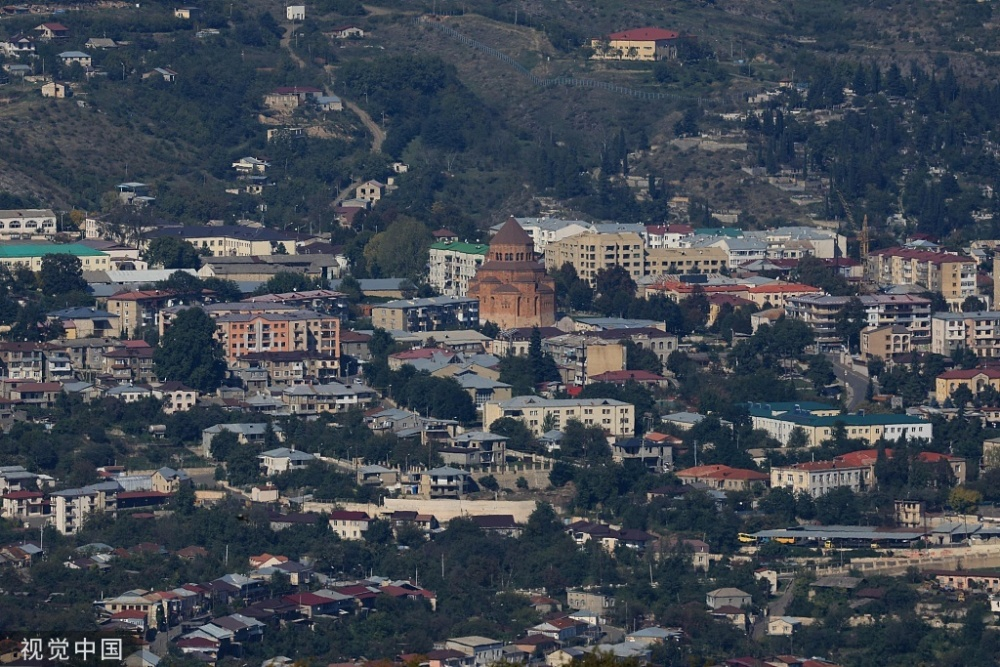
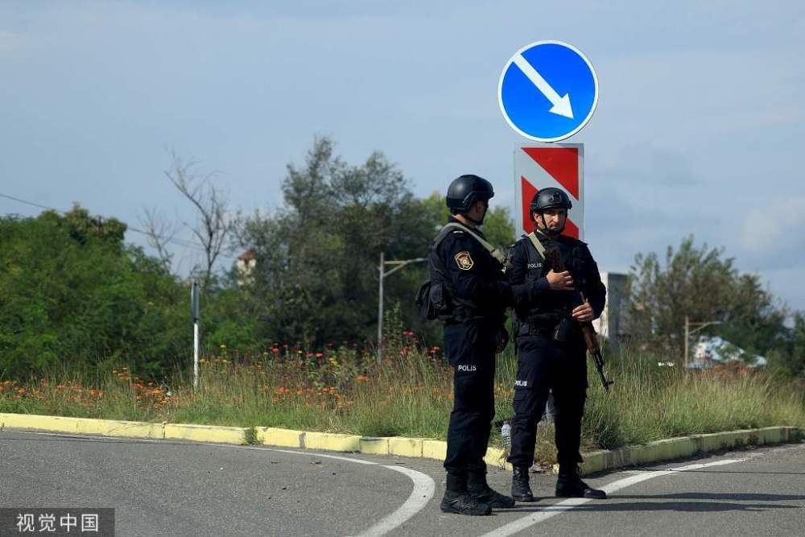
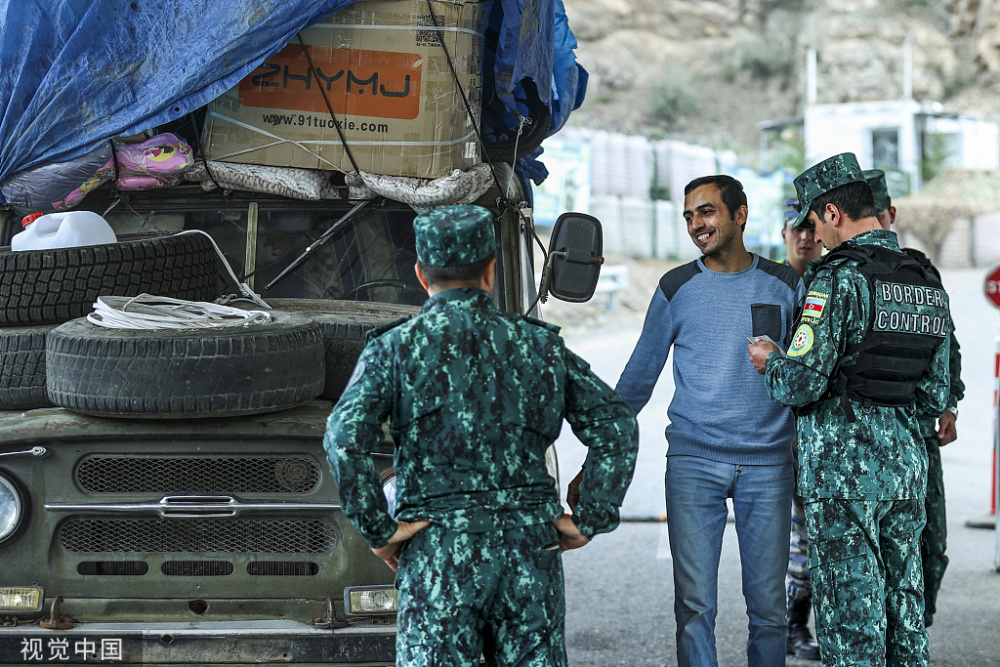

# 纳卡归属尘埃落定但亚阿冲突难终止，南高加索新一轮博弈正拉开帷幕

_当地时间2023年10月3日，在阿塞拜疆穆赫塔尔村附近的路上看到一辆被烧毁的亚美尼亚汽车。本文图片 视觉中国 图_

当地时间9月28日，未获国际承认的纳戈尔诺-
卡拉巴赫（以下简称“纳卡”）地方当局——“阿尔扎赫共和国”首脑签署了一项法令，宣布“阿尔扎赫共和国”将于2024年1月1日起终止存在。此前，阿塞拜疆于9月19日在纳卡地区发起“反恐行动”，一日之内纳卡当局宣布投降，亚美尼亚也未派出一兵一卒驰援，一触即发的“第三次纳卡战争”消弭于无形。而随着“阿尔扎赫共和国”终将停止存在，亚美尼亚与阿塞拜疆争夺了几十年的纳卡地区也将全归阿塞拜疆所有。

然而，笔者认为亚阿冲突恐怕不会就此终止，土耳其-
阿塞拜疆联盟仍将致力于开辟“赞格祖尔走廊”，同时域内强国与传统大国仍将继续角力，南高加索地区将逐渐步入“后纳卡战争时代”。

_当地时间2023年10月3日，一名阿塞拜疆军人在纳卡地区附近巡逻。_

**阿塞拜疆“收复失地”与地区力量格局的变化**

阿塞拜疆与亚美尼亚对纳卡地区的争夺由来已久，只是在苏联时期双方的冲突暂时停止。然而，就在与苏联解体差不多同时，在纳卡地区占多数的亚美尼亚族发起公投，宣布独立。随之而来的是亚美尼亚与阿塞拜疆之间数年的战争，即“第一次纳卡战争”。这场战争的结果是，亚美尼亚及其所支持的纳卡亚族政权（即“阿尔扎赫共和国”）大获全胜，不但完全占据了纳卡地区（见下图红色部分），还控制了纳卡周围的阿国领土（下图红色周边的深棕色部分）。

阿亚两国当时的部队使用的都是苏联驻军遗留下的军火，作战模式也可以说是师出同门，“第一次纳卡战争”出现这种一边倒的结果，当时普遍认为主要原因是俄罗斯偏向已加入集安组织的亚美尼亚，而支持阿塞拜疆的土耳其却表现得有心无力。

随后几十年里，阿塞拜疆通过石油出口实现了经济增长迅速，在武器装备上除了获得来自传统盟友土耳其的大力援助，还装备有大量以色列提供的武器，基本摆脱了对俄制装备的依赖。而2018年通过颜色革命上台的亚美尼亚总理帕西尼扬，从一开始就被莫斯科怀疑其“心向欧美”。最终在厉兵秣马二十多年后，阿塞拜疆通过2020年的“第二次纳卡战争”，成功夺回了大部分被占领土，在俄罗斯调停下与亚美尼亚签署了为期五年的停火协议。

根据协议，亚美尼亚军队撤出纳卡地区，但亚方可以通过拉钦走廊（见上图紫色部分）与“阿尔扎赫共和国”残存的部分连接，该走廊按规定由俄罗斯“维和士兵”控制。阿塞拜疆获得在亚美尼亚南部领土的“赞格祖尔走廊”（上图浅蓝部分）的“自由通行”权利，从而使阿塞拜疆本土和被亚美尼亚隔开的纳希切万飞地相连接，而这条走廊若继续延伸则可以联通阿塞拜疆和土耳其（见上图深蓝部分）。

这样一纸协议很难给南高加索地区带来长久和平。原因在于，通过“第二次纳卡战争”，阿塞拜疆已经确信其拥有对亚美尼亚的绝对军事优势，同时也测试出俄罗斯对亚美尼亚的实际支持相当暧昧。阿塞拜疆对完全收复国土已经毫无担忧，当时之所以没有“勇追穷寇”，主要是希望通过维持拉钦走廊的存在，施压亚美尼亚，换取在其领土南部开通“赞格祖尔走廊”。

_当地时间2023年10月3日，纳卡地区。_

根据2020年停火协定，由俄军把守的拉钦走廊理论上确保了亚美尼亚与卡拉巴赫地区的联通，但阿塞拜疆方面从2022年末就开始以各种方式封锁拉钦走廊，俄方对此也未做出激烈反应。亚美尼亚的反应颇为耐人寻味，除了向美国、欧盟寻求援助外，将怒火撒向了俄军，指责他们未能履行承诺。帕西尼扬更是多次宣称俄罗斯主导的集安组织不能给予该国安全保障，今年9月甚至派遣其夫人出访与俄罗斯交战中的乌克兰。

2022年以来，以美国、法国为首的西方国家对亚美尼亚“弃俄投西”投桃报李，法国议会今年7月通过了谴责阿塞拜疆的决议，美国也在9月与亚美尼亚举行了小规模联合军演，但欧美这些形式上的支持根本无力改变阿强亚弱的物理事实。最终，当阿塞拜疆在9月19日发起“反恐行动”后，亚美尼亚按兵不动，而纳卡的亚族政权“阿尔扎赫共和国”则将在明年彻底成为历史名词。

虽说这样的结果让“第三次纳卡战争”的风险消弭无踪，但留给国际关系学者的反而是更多疑问。那就是，无论帕西尼扬本人有多么“亲美厌俄”，他都十分清楚，能在纳卡问题上给予实质性帮助的只有俄罗斯，而非千里之外的欧美，自己的政治主张虽然不为莫斯科所喜，但坐视土耳其在南高加索势力的增长就意味着俄罗斯自身的话语权下降。

_当地时间2023年10月1日，阿塞拜疆，一名阿塞拜疆军官展示亚美尼亚军队在纳卡地区投降的武器装备。_

**纳卡为何成了亚美尼亚急于甩掉的“烫手山芋”？**

对于地区实力的变化，亚美尼亚心知肚明，俄罗斯如今已指望不上，而阿塞拜疆背后却有土耳其。阿塞拜疆和土耳其的政治精英对两国关系有一个基本共识，即所谓的“一个民族，两个国家”，亚美尼亚之所以放弃抵抗，主要是因为以亚国的军事力量，独立对抗这样“一个民族，两个国家”的军事联盟无异于以卵击石。

早在今年4月，帕西尼扬就表示可以有条件承认阿塞拜疆对纳卡地区的主权。但在尚未获得阿塞拜疆对纳卡地区亚族居民政治、安全权利保证的情况下，如此快速地彻底放弃纳卡，还是令人有些吃惊。对此有俄罗斯学者甚至提出这样的观点，阿塞拜疆本不急于完全收复领土，9月对纳卡的“反恐行动”，完全是帕西尼扬故意“碰瓷”的结果，而帕西尼扬之所以急于丢掉烫手山芋，是希望快速斩除纳卡这块俄罗斯用来影响本国政局的“抓手”，如果纳卡问题久拖不决，亚国政坛就有可能再度被“亲俄派”把持。

笔者认为，亚美尼亚当局可能也有这样的考量——那就是一旦纳卡地区的归属问题完全解决，阿土两国就不好再提开辟“赞格祖尔走廊”的要求，因为这样破坏亚美尼亚领土完整的诉求，有违一切现行国际法，届时阿土两国将面临巨大的国际压力。可以说，亚美尼亚目前的战略很像是在防御作战中，被攻击方主动从千疮百孔的第一条防线，后撤到第二条对自己更加有利的纵深防线上，从而在敌强我弱的情况下尽可能以拖待变。

_当地时间2023年10月1日，阿塞拜疆，亚美尼亚军队在纳卡地区投降的武器和装备被展示。_

**谁会是亚美尼亚下一个盟友？**

眼下南高加索地区局势高温不退，各方势力犬牙交错，而尚有一地区强国并未明确选边站队，那就是伊朗。总体来说，在长达30年的亚阿冲突中，伊朗对纳卡归属问题持中立立场，甚至在“第一次纳卡战争”亚美尼亚大获全胜之际，指责过其侵犯阿塞拜疆主权。但在2020年后，面对日益壮大的阿土联盟，尤其是对它们开辟“赞格祖尔走廊”的计划，伊朗明确表示反对。

2021年，阿塞拜疆驻土耳其大使在一次演讲中称“‘赞格祖尔走廊’将成为从欧洲到亚洲的国际运输的替代方案（经里海到中亚），该走廊连接的是整个‘突厥世界’”。该大使口中的“突厥世界”，已远不是土阿两国这么简单，其范围还涵盖了中亚的大部分突厥语国家。

一旦“赞格祖尔走廊”的控制权完全落入阿塞拜疆手中，伊朗就间接丧失了与亚美尼亚的陆路联系，其西北部通向南高加索的陆路通道就完全笼罩在“突厥国家”的影响力之下，这意味着伊朗在很大程度上丢失了对南高加索的影响力。这也是近期伊朗反复提到的“反对该地区地缘政治现状的改变”。作为回应，今年以来，伊朗在“赞格祖尔走廊”附近举行了多次军演。今年1月，阿塞拜疆驻伊朗大使馆离奇遇袭，造成使馆人员死伤，阿国指责袭击是伊朗当局纵容的结果，此后阿塞拜疆关闭使馆数月之久。

除维持南高加索地缘政治现状外，伊朗本国的民族问题也决定其不可能袖手旁观。伊朗北部居住着过千万的阿塞拜疆族人，一旦阿土联盟将“突厥世界”从模糊的语言文化概念落实到政治甚至民族国家的整合上，对伊朗北部的民族分裂势力将是一个强大刺激。从目前情况来看，在未来真正可能站在亚美尼亚一边，实际出手干预走廊开辟的反而是与阿塞拜疆同属伊斯兰国家的伊朗。

 _当地时间2023年10月2日，纳卡地区，阿塞拜疆警察站在路边。_

**正在进入“后纳卡战争时代”的南高加索**

纵观30年来的亚阿军事冲突，纳卡地区的归属就像一块晴雨表，反映出各国势力的变化。1990年代到“第二次纳卡战争”前，国力较弱的亚美尼亚把控了纳卡地区，这折射出的是俄罗斯对前苏联地区不容置疑的影响力。但随着世界政治多极化加速，南高加索地区的力量对比发生了深刻变化，一方面“小国”可以通过自身的经济发展整军备战，另一方面地区的中等强国不再慑于美俄等大国，敢于直接上场对盟友给予直接支持。这就决定了无论是近在咫尺的俄罗斯，还是远隔重洋的美国，除非决定投入真金白银的政治、军事资源，否则对亚美尼亚也只是爱莫能助。

_当地时间2023年10月1日，纳卡地区，亚美尼亚裔居民微笑着向一名军人展示他的随身物品。_

目前的南高加索可以说正在进入“后纳卡战争时代”，虽然当事国亚美尼亚认清纳卡大局已定后果断放手，但阿土联盟对打通“赞格祖尔走廊”仍念兹在兹，俄罗斯缠身于乌克兰战场，美欧口惠而实不至。未来亚美尼亚捍卫其自身利益的选择十分有限，只能运用国际社会维护领土完整的基本准则，同时抓住伊朗对“突厥国家”独霸高加索的担忧。而本地区的明争暗斗也不会因为纳卡问题的基本解决而结束，只有当各国力量通过下一轮的争斗达成新平衡，南高加索地缘政治的活火山恐怕才能进入休眠期。

（党浩楠，莫斯科国际关系学院研究生）

