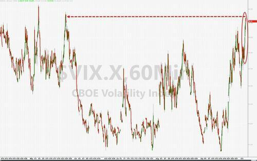
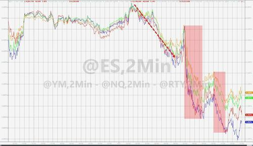
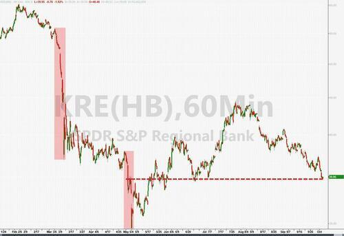
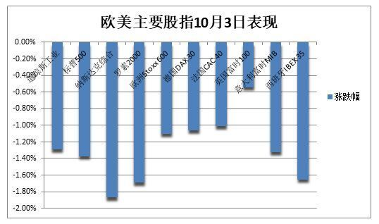
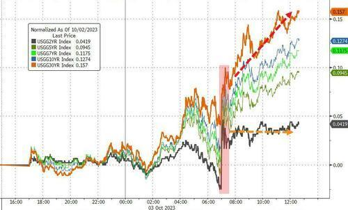
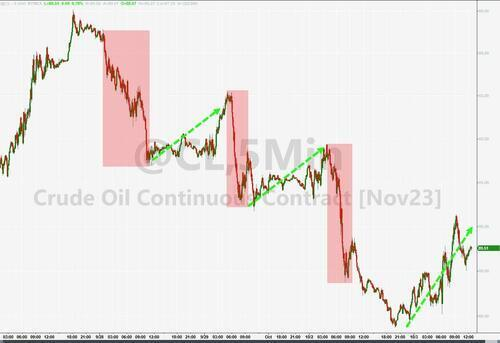
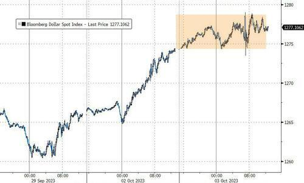
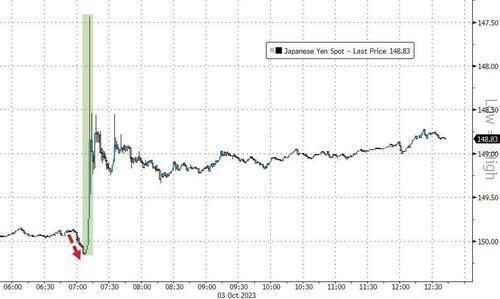
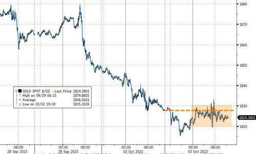

# 美股三大股指全线下挫，纳指跌近2%，美国长债收益率创2007年来最高

美国8月JOLTS职位空缺
961万人，远超预期的881万，较前值跳涨近70万，劳动力市场进一步收紧，坐实了投资者对美联储将面临更多压力在更长时间内维持更高利率的预期。

交易员对美联储在11月加息25个基点的押注小幅升至28%，对等到12月再加息的押注维持在39%。整体来说，认为今年不会再加息的概率约为54%，代表存在很大不确定性。

不过，期货市场预计2024年上半年美国货币政策放松的可能性为42%，代表人们对高利率维持更长时间、从而令经济陷入衰退感到担忧，欧美国债收益率曲线均呈现“熊市陡峭化”。

明年FOMC票委、克利夫兰联储主席梅斯特称，如果经济仍然稳健，将支持年内再度加息，但美国可能已经接近或者达到峰值利率，“当前的问题是需要在多长时间内维持利率在限制水平”。

同为明年票委的亚特兰大联储主席博斯蒂克称，如果通胀预期稳定则可以耐心等待，“不急于加息，也不急于降息”，希望利率在“很长一段时间”保持稳定，但预计明年接近年底时会降息一次。

美国财长耶伦称，对经济前景感到“非常乐观”，美国正在走上财政稳定之路，正一直关注利率状况，长期利率水平可能会比预期更高，但高利率维持更长时间并非板上钉钉。

欧洲央行票委和首席经济学家均警告通胀冲击尚未结束，但认为利率已经处于有助抑制通胀的水平，只要有需要就应维持高位水平，交易员也彻底打消了对年内欧洲再度加息的押注。

美股齐创四个月最低，道指年内转跌，亚马逊跌3.7%，中概指数和美股银行股均跌2%

10月3日周二，由于市场对美联储加息的预期有所升温，美国长债收益率再度刷新十多年最高，美股显著低开低走。

开盘近一小时，跳空低开逾百点的道指便跌近300点或跌超1%，在2023年转为累跌，加入罗素小盘股年内转跌的态势，随即美股全线跌1%，“恐慌指数”VIX升至20创5月份以来最高。

 _“恐慌指数”VIX自今年5月以来首次升破20_

道指最深跌近520点或跌1.5%，一度失守3.3万点整数位，标普大盘最深跌1.7%，非必需消费品板块领跌，科技股居多的纳指跌2.2%创8月2日以来最大跌幅，小盘股也一度跌2%。

**最终美股集体收于日低附近，**
道指连跌三日至5月31日以来的四个月新低，创3月份以来最大单日跌幅，标普创6月1日来最低，纳指止步四日连涨创5月31日来最低，罗素小盘股连跌三日至5月4日以来的五个月最低：

标普500指数收跌58.94点，跌幅1.37%，报4229.45点。道指收跌430.97点，跌幅1.29%，报33002.38点。纳指收跌248.31点，跌幅1.87%，报13059.47点。纳指100收跌1.83%，罗素2000小盘股指数收跌1.69%。

_美股齐创四个月最低，道指年内转跌，纳指领跌，标普下逼200日均线_

高盛加入摩根士丹利和摩根大通等华尔街银行的行列，担心利率高企令美股进一步下跌，理由是标普500指数与10年期实际利率之间的背离程度逼近除2020年以外的近二十年最大水平。

**明星科技股齐跌**
。元宇宙”Meta跌近2%，微软跌2.6%，谷歌A跌超1%，均脱离两周新高；苹果和奈飞跌近1%，均重新逼近四个多月低位；亚马逊跌3.7%至三个半月最低；特斯拉跌2.8%后收跌2%，止步三日连涨并脱离一周半最高。

**芯片股普跌。**
费城半导体指数跌2.1%，失守3400点脱离两周高位。但英特尔涨0.6%至两周最高；AMD和英伟达跌约3%，均脱离两周半最高，Arm跌超1%逼近历史新低。

**AI概念股再度回调** 。C3.ai跌3%逼近四个多月最低，SoundHound.ai也跌3%，从一周高位连跌两日，Palantir
Technologies跌超6%继续脱离一个月最高，BigBear.ai跌3.6%下逼近九个月最低。

消息面上，Meta正考虑向欧盟的Facebook和Instagram社交媒体用户收取14美元左右的无广告服务月费，旗下“元宇宙”业务Reality
Labs将裁员。KeyBanc预言英伟达再涨65%，上调目标价至750美元，理由是中国需求稳定和向价格更高GPU的转变带来更多收益，该股今年涨200%。英特尔股价盘后涨超2%，将组建可编程解决方案小组，并作为独立实体运营。微软称，通过文本描述生成图像的Dall-e
3人工智能应用已可在必应搜索平台和Bing-Chat聊天机器人中使用。

**热门中概追跌美股大盘** 。ETF KWEB跌2%，CQQQ跌1.7%，纳斯达克金龙中国指数（HXC）跌2.2%连跌两日至近两周低位。

纳斯达克100成份股中，京东跌超2%，百度跌近3%，拼多多跌近2%。其他个股中，阿里巴巴跌超2%，B站和腾讯ADR跌约1%，理想汽车跌1.7%逼近三个月最低，小鹏汽车跌3.7%，蔚来跌2%。

**利率飙升下，银行股指连续两日齐跌2%。**
行业基准费城证交所KBW银行指数（BKX）创四个半月最低，5月4日曾创2020年10月以来最低。KBW纳斯达克地区银行指数（KRX）创三个半月低位，5月11日创2020年11月来最低；SPDR标普地区银行ETF（KRE）5月4日曾创2020年10月来最低。“美国四大行”齐跌，美国银行跌约3%最差，高盛跌近4%拖累道指。

 _银行股指连续两日齐跌2%，创至少三个月最低_

**其他变动较大的个股包括：**

“特斯拉劲敌”Rivian跌超8%至一周新低，脱离近两个月高位，尽管摩根士丹利重申增持评级，看好产量和交付量目标，但借贷成本上升令人们担心美国电动汽车需求疲软。

礼来制药计划以14亿美元现金、约合每股12.50美元收购癌症疗法开发商Point Biopharma，礼来跌超2%至近两个月最低，Point
Biopharma大涨85%至近七个月最高。

共享经济的龙头之一爱彼迎跌超6%至五周最低，创近五个月最大跌幅，券商KeyBanc下调增持评级至“中性”，理由是疫情后旅行需求降温，该公司的利润率将受到挤压。

但惠普逆市涨近2%，脱离一年最低，美国银行将评级从“卖出”连升两级至“买入”，理由是个人电脑PC前景改善、公司基本面强劲和估值具有吸引力，该股较7月高点下跌了23%。

欧股连续两日普跌约1%。泛欧Stoxx
600指数收跌1.10%，连跌两日至3月24日以来的半年多新低，所有板块齐跌，在高利率的影响下，负债深重的公用事业板块跌2.7%，矿业股跌2.6%。主要国家股指均跌超1%，仅出口商居多的英国大盘股因英镑贬值而跌幅较小。

欧美国债收益率齐涨，10年与30年期美债收益率升超13个基点至2007年以来最高

美债收益率再度齐涨，长债收益率相对涨势持续显著。桥水达利欧预言，作为“全球资产定价之锚”的10年期美债收益率将升至、甚至是升破5%关口。

对货币政策更敏感的两年期美债收益率最高升4个基点至5.15%，收复上周三以来跌幅。10年期基债收益率涨超13个基点并突破4.80%，与涨15个基点至4.95%的30年期长债收益率齐创2007年以来的十六年最高。

_10年与30年期美债收益率两位数跳涨，齐创2007年以来最高_

五年期美债收益率升近9个基点并突破4.80%，同创2007年7月来最高。衡量实际利率的美国30年期通胀保值国债（TIPS）收益率升破2.5%，创2008年来新高。两年/10年期关键美债收益率倒挂幅度缩至35个基点，创今年3月份以来最窄。30年期固定按揭贷款平均利率接近8%。

_美债收益率“熊市陡峭化”，代表市场预期高利率维持更长时间_

有分析指出，除了对美联储加息的展望升温，不断扩大的联邦预算赤字将导致债券供应超出需求，从而需要更高收益率来吸引投资者持有债券，都导致美债收益率连日来居高不下。

欧元区基准的10年期德债收益率尾盘涨超4个基点上逼2.97%，逼近上周四触及2.98%创下的2011年7月以来最高；两年期收益率跌2个基点至3.21%，7月初触及3.39%至2008年来最高。

欧洲负债较深外围国家基准的10年期意债收益率最高涨超5个基点上逼4.98%，交投2012年来最高。同时，10年期英债收益率涨3个基点上逼4.60%，两年期收益率相对涨幅较小。加拿大10年期国债收益率自2007年以来首次触及4.25%。

有分析称，这主要是由于面对居高不下的通胀，欧美央行政策制定者继续排除降息的可能，但衰退担忧仍令市场计价欧洲央行明年7月首次降息。北欧银行Nordea认为，长债收益率显著上升，欧美国债收益率曲线呈现“熊市陡峭化”，表明市场认为利率将在更长期维持高水平。

油价跌超1%后转涨，止步三日连跌、脱离三周低位，布伦特一度失守90美元关口

在OPEC+周三开会讨论产量决策前夕，油价在美股盘中止跌转涨。WTI
11月期货收涨0.41美元，涨0.46%，报89.23美元/桶。布伦特11月期货收涨0.21美元，涨0.23%，报90.92美元。

美油WTI一度跌1美元或跌1.2%，日低失守88美元至9月12日以来最低，转涨后重上89美元。布伦特也最深跌超1.10美元或跌1.3%，一度失守90美元心理整数位至9月8日以来最低，转涨后重回91美元，均止步三日连跌并脱离三周低位。

_油价跌超1%后转涨，布伦特一度失守90美元_

欧洲基准的TTF荷兰天然气再跌6%，进一步远离40欧元/兆瓦时整数位，连跌六日至四个月最低。ICE英国天然气也跌超6%并下逼90便士/千卡。但美国天然气涨4%，重返近两个月高位。

美元再创十个半月最高，日元跌穿150后迅速反弹，离岸人民币一度失守7.33元

美国JOLTS职位空缺数据发布后，衡量兑六种主要货币的一篮子美元指数DXY最高涨0.4%，并站稳107关口上方，刷新去年11月以来的十个半月高位，此前已连涨11周。

 _美元再创十个半月最高，尾盘重新失守107关口_

欧美经济和央行政策走势分野，欧元兑美元最深跌0.3%更加远离1.05，刷新去年12月初以来的十个月最低。英镑最深跌0.3%进一步远离1.21，再创3月中旬以来的近七个月最低。

日元兑美元一度跌穿150大关，为去年10月来首次，随后迅速回涨，至日内涨0.6%并升破149，但仍徘徊一年低位。澳元连续两日跌1%至11个月最低。俄罗斯卢布一度跌穿120大关。

有分析称，日元跌破150后迅即反弹，在短短几秒钟内飙升近2%，最高达到1美元兑147.43日元，市场怀疑日本当局可能已出手干预汇市。

_日元兑美元跌破150大关后迅即反弹，仍徘徊一年低位_

离岸人民币一度跌穿7.33元，较上日收盘最深跌超90点，徘徊三周低位，美股盘中交投7.32元一线。其他非美货币也普跌，MSCI新兴市场外汇指数抹去2023年开年以来全部涨幅。

**主流加密货币普跌。**
市值最大的龙头比特币跌超1%，重新失守2.8万美元关口，脱离六周高位，第二大的以太坊仍徘徊1650美元整数位，三季度均曾两位数累跌。

金银再创近七个月最低，现货黄金徘徊1820美元，铜价盘中四个月来首次跌穿8000美元

美元和美债收益率携手走高，持续打压商品价格。COMEX
12月黄金期货收跌0.31%，报1841.50美元/盎司，期银跌0.2%，报21.377美元/盎司，均连续两日创下3月以来的半年多最低。

现货黄金最深跌超12美元或跌0.7%，一度失守1820美元整数位，创3月5日以来的七个月最低，连跌七个交易日创去年8月以来最长看跌周期。

昨日跌超4%的现货白银一度跌1.7%并短暂失守21美元整数位，创下3月中旬以来最低，美股盘中转涨，昨日跌近3%的现货铂金一度再跌1%，刷新一年最低。

_金银再创近七个月最低，但跌幅较昨日显著收窄_

**伦敦工业基本金属继续齐跌，但跌幅较上日明显收窄：**

周一跌2.6%的经济风向标“铜博士”再跌0.6%，下逼8000美元关口，连跌三日至四个半月最低，盘中曾自5月来首次跌穿8000美元。

昨日跌超1%的伦铝再跌1.3%，失守2300美元，从五个月高位连跌两日。昨日跌1.8%的伦锌再跌3.8%，下逼2500美元，进一步脱离近五个月高位。昨日跌超1%的伦铅再跌1.3%，至七周最低。伦镍微跌，徘徊2021年10月以来的两年低位。昨日跌1.9%的伦锡转涨1.5%，脱离半年低位。

有分析称，LME交易所库存进一步增加的预期以及美元飙升，都加剧了对工业金属需求的担忧。LME铜库存自7月中旬以来攀升超过200%，至去年5月来最高，导致期货升水幅度创二十年高位。LME仓库中的镍库存也升至近六个月最高，锡和铅库存一直在上涨，均暗示需求不力。

