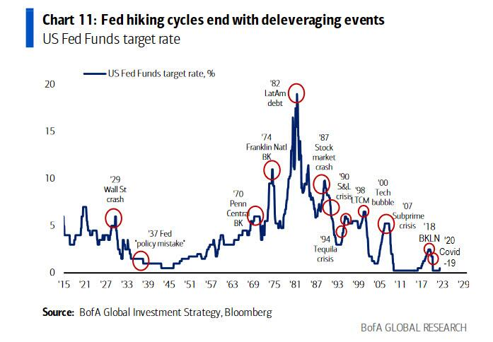

# 高盛、摩根大通“异口同声”：美国利率这么猛涨，金融市场要出事

华尔街一直期待的停止加息，希望已经落空了。取而代之的，是残酷冷峻的“更高更长”。

不过，尽管美国经济现在形势良好，但真的能实现“永不着陆”吗？历史提醒我们， **美联储的紧缩周期总以眼泪结束** 。正如美银分析师Michael
Hartnett所言：

“加息周期总是以延期的政府、企业、银行和投资者的违约及破产而告终。”

两家华尔街大行已经发出了警告： **高盛和摩根大通的分析师都指出，利率继续上升，可能危机美国的金融稳定。**

高盛、摩根大通齐声警告

摩根大通资产管理公司的David Lebovitz在接受媒体采访时表示：

“如果利率继续像现在这样上升， **就会发生金融灾难，将促使美联储朝相反的方向行动。”**

他认为，如果收益率继续攀升，美联储最终可能会被迫降低利率。

摩根大通全球和欧洲股票策略主管Mislav Matejka也在最新发布的报告中指出，债券收益率不太可能继续上升太长时间，并可能最终下降。

此外，高盛分析师Adam Crook在最新报告中写道：

**金融环境有继续收紧的重大风险，直到有什么事情发生。**

随着市场努力寻找合适的债券清算水平，所有道路似乎都指向美债的持续抛售：

长端债券的边际买家似乎不存在；鹰派的美联储只是表明美国经济可以比其他国家更长期地承受更高的利率；石油价格面临上行风险；美国政府在可预见的未来将保持高赤字运行；日本央行可能结束YCC/负利率，移除全球收益率的最后一个锚。

与此同时，高盛外汇交易联席主管Alan Stewart也着重强调了利率崩溃的风险：

“最脆弱的市场敏感度似乎仍然是核心收益率的持续扩大。虽然9月底的回调给主要美债持续10周的抛售和同时出现的金融环境收紧带来了一些希望，但我们在8月底看到名义收益率出现类似但暂时性的回调，而9月又恢复了收紧，这让我们有充分的理由保持谨慎。”

利率上升，带来风险激增

周二，十年期美债收益率日内上涨5个基点达4.848%，创下16年新高，而三十年期美债收益率涨幅更高达16个基点，逼近4.95%，两年期美债收益率高见5.156%，日内涨4.4个基点，接近9月21日创下的逾17年高位。

上半年硅谷银行和瑞士信贷的破产尚殷鉴不远，当时的地区银行危机即是因加息导致债券价值暴跌，中小银行出现巨额浮亏所致。

**如今的金融条件，要比当时更加紧缩。**
银行业现在有美联储BTFP政策工具兜底，所以暂时没有风险，但在六个月后，BTFP机制就会到期。高利率对金融市场的负面影响，未来可能会进一步传导。

根据联邦存款保险公司发布的季度数据，截至6月30日，美国银行持有的投资证券的未实现亏损为5580亿美元。但是，由于许多银行选择不再投资到期的债券，这个数字实际上低于2022年第三季度的高峰；然而，随着夏季收益率的上升，预计未实现亏损还在继续增加。

更让人担心的事，尽管金融市场出现了越来越多的压力迹象，但政策反应仍然倾向于紧缩。金融博客Zerohedge警告称，美国正越来越接近一场由美联储政策制造的危机。

