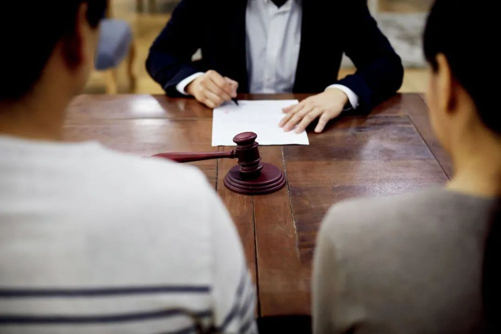

# 三名法官被抓，一起离婚财产纠纷14年未结案

2021年9月23日上午，位于长沙市雨花区香樟路上的湖南省女子监狱，进行了一场关于离婚后财产纠纷的庭审。

主持这场庭审的，是来自广西梧州市万秀区法院的法官。原告是正在此间服刑的许淑清，被告是她的前夫张松成。

许淑清是知名企业家，曾任广西梧州中恒集团股份有限公司（以下简称广西中恒股份）董事长兼总裁。2015年8月，许淑清因涉嫌单位行贿罪被查，2017年获刑十七年。正因此，前述庭审才会安排在监狱中进行。

她与张松成于2009年4月登记离婚，四个月后，因离婚后财产纠纷，张松成将许淑清告上法庭，随后许淑清又将张松成起诉。在湖南省女子监狱进行的庭审，是此两案在延宕多年之后的又一场开庭，至今仍未完结。

自发起诉讼，张松成与许淑清的离婚后财产纠纷案已历时14年。在这期间，这场官司波折丛生，特别是随着许淑清因涉嫌犯罪被查，多名法官在审理该财产分割案中受贿之事也浮出水面。一位当事律师告诉《中国新闻周刊》，一宗简单的离婚析产案，由于掺杂了审判人员钱权交易、徇私枉法等问题，变得复杂起来。

 _图/视觉中国_

**6份离婚协议**

在张松成的回忆里，他与许淑清于1997年相识于广东珠海。彼时，他们俩都是39岁，许淑清的婚姻状况是离异，张松成和当时的妻子之间也存在问题，后来，张松成离婚，2000年8月1日，张许二人登记结婚。他们各自都已有孩子，结婚后，喜欢孩子的许淑清又领养了两个孩子。

张许二人虽在广东相识，但都不是广东人。张松成是湖南宁远县人，1976年到珠海参军，曾做过茂名市茂南区人武部部长、区委常委，2008年转业到珠海市口岸局，曾任副局长，2019年退休。

张松成告诉《中国新闻周刊》，许淑清是黑龙江齐齐哈尔人，早年曾在黑龙江富裕县畜牧局工作，与前夫离婚后，于1980年代到广州打工，进入了广州黄埔区的一家港资服装企业工作。不过，许淑清早年经商时填写的一份法人登记表显示，她在1973年到1992年在黑龙江服装厂工作，1992年5月起在广州黄埔某服装厂工作。

许淑清的企业家之路始于1993年8月，工商资料显示，她和他人共同出资成立广州市黄埔区联丰贸易有限公司（以下简称联丰公司），注册资本金为50万元，其中许出资30万元，占比60％，担任法人。

1997年，该公司由最初的集体所有制企业改制为有限责任公司，从事服装生产经营。至2010年，该公司注册资金已多次增资，增至1亿元，其中许淑清的出资增至9000万元，占股90％。公司名字也多次更改，于2004年9月更改为广州保宇实业有限公司（以下简称广州保宇公司）。

2005年8月，广州保宇公司出资13705.2万元，占股90％，许淑清之子赵学伟出资1522.8万元，占股10％，共同收购广西梧州市经济发展公司所持梧州鸳鸯江大桥有限公司100％股权，也从而使许淑清控股的广州保宇公司间接成为知名药企、A股上市公司广西中恒股份最大股东，许淑清出任董事长。2010年5月，梧州鸳鸯江大桥有限公司更名为广西中恒实业有限公司，同年12月，广州保宇公司更名为广州中恒集团有限公司（以下简称广州中恒公司）。

与生意场上的突飞猛进所不同的是，许淑清与张松成的婚姻渐渐分崩离析。他们是在珠海结的婚，但张松成回忆，婚后“她有一段时间在珠海，大部分时间在广州”。从2002年开始，张松成也被调到茂名工作，几年之后才又转业回到珠海。在这期间，从2003年年底到2004年，许淑清开始频繁到广西考察收购项目，收购成功后，更是把精力倾向广西方面。后来两人打起财产官司，在一份答辩材料里，许淑清曾这样叙述：“从2006年初开始，被告（许）把全部的生意转到广西梧州市，随之也把全部的时间和精力转到广西梧州市。从2006初至今（至打官司），被告一直在广西梧州市居住。”许淑清还在2009年8月将户籍从珠海迁至了梧州。

至于之后张、许二人为何发展至离婚的地步，许淑清在前述答辩材料里说：“由于双方的感情基础薄弱、性格不合以及工作等原因，经常矛盾重重，曾多次协议离婚，并订立《离婚协议》。”在一份自述材料里，许淑清还曾提及张松成“婚内出轨找小三并对我家暴”，但对于许的说法，《中国新闻周刊》向张松成求证，均被张否认。

从2004年11月24日起，也就是二人结婚四年后，二人前后签署了六份离婚协议书。

最早的一份协议内容很简短，第一条关于“子女问题”，铅字内容为“各自的孩子各自负担”，后又补充手写内容“双方在婚内无生子女”。第二条是“财产处理问题（包括私有住房）”，铅字内容为“产权归各自所有”，后又补充手写内容“女方在广州保宇公司的出资和收益归女方”。

第二份签署时间在2006年9月9日，对财产问题有所补充，手写内容显示，“即婚后登记在各自名下的财产收益归各自所有”。

第三份签署时间是2007年3月6日，协议共八条简短内容，有关财产问题仍然提出“各自财产归各自所有”，并补充手写“如发生纠纷由广西梧州市中级法院受理管辖”。

2007年8月2日，二人又签署了一份协议，内容均为手写，共六条，包括：一、我张松成同意在2007年8月8日办理离婚手续；二、离婚后双方同意继续在一起生活1~2年；三、从办理完手续开始许淑清付给张松成每月15000元工资（工资发至X年内）；四、并借给张松成30万元活动费；五、如果1~2年在一起生活很好就复婚，如果不能生活到一起就分手等。

张松成与许淑清登记离婚的时间是2009年4月7日，当日，二人也曾签署一份离婚协议书，并存档于婚姻登记机关。这份协议内容共六条，第三条是关于“债务及财产分割”，内容为铅字体：“各自名下的债务由各自承担；属于二人共同财产梧州市升龙秀湾8号楼20层北侧住房一套（以下简称“升龙秀湾房”），归张松成所有；另由许淑清一次性付给张松成现金300万元人民币。”

而在二人登记离婚后，还曾出现过一张离婚协议书，日期显示是手写体“2009.4.19”，此份协议铅字部分与第一份离婚协议书一模一样，另外补充的手写内容为“珠海的房归张松成，升龙秀湾房归许淑清。”这份协议也有二人签名，并按了手印。

和许淑清的说法不同，张松成对于当年两人为何会离婚，讲述的则是一个所谓“假离婚”版本，大致是：2008年年底正值张从部队转业待安置期间，许提议张如果自谋职业，可以找个投资伙伴，到梧州成立一家彩印包装生产企业，她可以提供业务资源，即该企业成立后可作为广西中恒股份指定供应商。但她咨询过律师，因为广西中恒股份是上市公司，他们如果是夫妻关系，这种业务往来会是关联交易，为规避法律，可以办理假离婚手续。张松成同意了，就和许一起去办理了离婚登记。在办理完离婚手续后，张渐渐意识到不对劲：许要把假离婚变成真离婚。张松成感觉是被许淑清骗了。

但是，对于上述张松成的说法，《中国新闻周刊》未能向许淑清求证。

**几次判决**

2009年8月，以许淑清为被告，张松成向珠海中院提起民事诉讼。自此，延宕十余年的张、许二人间的离婚后财产纠纷案正式开启。

据张松成提交给珠海中院的《民事起诉状》，其诉讼请求是：请求依法分割离婚时未分割的广州保宇公司90％的股权，请求分得该股权的一半，即价值4500万元人民币出资额财产。他认为，此前离婚时，《离婚协议》只对部分共同财产进行了分割。

珠海中院受理此案后，许淑清对管辖权提出异议，认为本案应移送广西梧州中院审理。珠海中院裁定同意，将案件移送梧州中院管辖。张松成不服，上诉至广东高院，广东高院驳回了其上诉。

就在该案移送梧州中院管辖、但尚未进入审判环节期间，2010年4月，许淑清向梧州市万秀区法院提交诉状，以张松成为被告，诉请判决确认升龙秀湾房产权归许个人所有，并判决确认许在广州保宇公司所占90％股权属其个人财产。

关于广州保宇公司的股权问题，许淑清诉称，该公司成立于原、被告结婚前，并且在原、被告婚姻关系存续期间，双方亦明确原告在广州保宇公司的出资及收益属原告个人财产。

2010年4月，梧州万秀区法院受理了许淑清诉张松成案，张松成提出管辖权异议，异议被驳回。当年7月，梧州中院对张松成诉许淑清案作出裁定，该案也由万秀区法院审理。

不到两个月后的9月9日，万秀区法院第一次就张、许离婚后财产纠纷案开庭审理，先审理的是许淑清诉张松成案。当年9月21日，万秀区法院作出“（2010）万民初字第177号”民事判决书，判决：一、确认原告许淑清在广州保宇公司所占90％股权属原告许淑清的财产；二、驳回原告许淑清关于升龙秀湾房产权归其所有的诉讼请求。判决书显示，此案审判长为肖军卫。

前述判决作出后，许、张均不服，均向梧州中院提起上诉。2011年8月，梧州中院判决维持万秀区法院民事判决第一项，撤销其判决第二项，确认升龙秀湾房属许淑清财产。判决书显示，此案二审审判长为蒋学政。

张松成不服判决，向广西高院申请再审。2013年1月18日，广西高院驳回了张的再审申请。

而对于张松成诉许淑清案，万秀区法院立案受理后，一度以“本院立案受理的‘（2010）万民初字第177号’原告许淑清与被告张秀成离婚后财产纠纷一案还在二审审理中，本案必须以此案的审理结果为依据”，作出了中止审理的裁定，在“（2010）万民初字第177号”案件终审后才恢复审理。

万秀区法院在2011年9月22日开庭审理了该案。六天后，万秀区法院判决，驳回了张松成的诉讼请求。法院认为，“鉴于本院审理的‘（2010）万民初字第177号案’对本案原告主张要求分割的财产已作确认属许淑清财产，原告要求分割财产的主张没有事实和法律依据，本院不予支持。”判决书显示，该案审判长是肖军卫。

张松成不服前述判决，上诉至梧州中院。2012年2月23日，梧州中院作出判决，驳回张的上诉，维持原判。判决书显示，该案二审审判长为周春兴。对于梧州中院的判决，张松成仍然不服，向广西高院申请再审。2013年4月，其再审申请被驳回。

_许淑清前夫张松成在湖南女子监狱门外。图/受访者提供_

**三名法官获刑**

拿到判决结果，之后一两年，张松成都将此事搁置一边，不再理会。直到后来，许淑清被捕，又有几名梧州法官出了事。某梧州籍商界人士主动联系张松成，称这些法官和他的案子有关，并找到判决文书给张看。他看后，感觉“铁定能翻案了”。

许淑清被查发生在2015年8月，她以涉嫌单位行贿罪被湖南省人民检察院立案侦查并采取强制措施。2017年10月，湖南吉首市法院一审判决许淑清犯职务侵占罪、单位行贿罪，判处有期徒刑十七年。

《中国新闻周刊》获得的法律文书显示，正像张松成被告知的，在查处许淑清一案过程中，时任梧州市万秀区法院副院长金明、苍梧县法院代理院长蒋学政以及蒙山县法院院长周春兴因涉嫌在许淑清财产分割案审理过程中收受贿赂先后被查。

金明于2016年6月8日因涉嫌受贿罪被刑拘，2017年8月，广西岑溪市法院作出一审判决，金明犯受贿罪，判处有期徒刑一年三个月。

法院审理查明，2009年7月，张松成向珠海中院起诉要求分割与许淑清离婚后的夫妻共同财产，许淑清向珠海中院提出管辖权异议，期间，许的诉讼代理人黄位灿私下找到时任万秀区法院分管民事审判工作的副院长金明，请教金明该案应当如何处理，金明告知可以在万秀区法院就上述财产提起确认之诉。2010年4月6日，许淑清在万秀区法院提起诉讼，黄位灿就该案向金明请求予以关照。案件在立案和审理阶段，金明就该案的诉讼费用如何收取、案件如何处理等问题进行打招呼或过问。

2011年七八月份和2012年上半年，金明先后两次在应邀与黄位灿以及许淑清之子赵学伟等人在酒店吃饭时，收受了赵学伟以感谢金明在许淑清离婚后财产案件中给予的帮助和关照为由而通过黄位灿送的好处费共计12万元。2012年春节前的某个晚上，金明收受了黄位灿以感谢金明在其代理的案件中给予的关照为由而送的好处费1万元。

在审理过程中，在万秀区法院审理的两起诉讼案均担任审判长的肖军卫作证称：许淑清提起诉讼的案件判决书经分管副院长金明签发，因为该案无论从标的金额或者影响程度上都很大，按规定是要经过分管副院长签发；基本上案件的每一步进展他都会向金明汇报；金明曾问过他“许淑清的诉讼请求是否都可以得到支持”的问题，在合议庭意见出来后，金明也问过“为什么许淑清在梧州的那套房子判给张松成”的问题。

另一名法官蒋学政涉嫌受贿的线索，是梧州市万秀区检察院反贪污贿赂局在查办黄位灿相关案件时发现的，之后蒋被带到检察院调查，对其受贿的犯罪事实供认不讳。

2016年12月，万秀区法院对蒋学政一案作出判决，蒋学政犯受贿罪，判处有期徒刑一年十个月，缓刑二年。法院审理查明，2011年7月至2013年11月，蒋学政利用担任审判长和主办人的职务便利，在审理案件中为他人谋取利益，收受黄位灿送予的现金和费用共161600元，非法收受广西梧州市制药（集团）股份有限公司相关人员给付的费用1529元和以24650元购买的玉器二块。

公开资料显示，广西梧州市制药（集团）股份有限公司是广西中恒股份下属企业。

黄位灿的证言显示，蒋是许淑清离婚财产纠纷案的审判长，蒋的女儿要学车考驾照，他帮忙联系驾校并通知其他人去交钱。该案判决后，2012年二三月份，他到蒋的办公室送去了感谢费3万元现金，蒋收下了。

蒋学政的供述及自述则称，2011年六七月份，许淑清离婚财产分割案件上诉到梧州中院民一庭，许淑清不满意一审部分判决，黄位灿找到其希望其作出有利于许淑清的判决，支持许的上诉请求，其作为审判长改判了部分一审判决，支持了许淑清的上诉请求。

蒋还交代，在承办其他涉及广西中恒股份属下公司的案件中，黄位灿叫其在审理案件过程中帮忙。

第三名涉事法官周春兴于2016年12月被广西苍梧县法院以受贿罪判处有期徒刑三年。法院审理查明，2007年，周担任审判长审理并主办了广西梧州市冠豪房地产开发有限公司与广西中恒股份土地使用权转让合同纠纷一案，周利用职务之便，为广西中恒股份在诉讼中提供便利条件，事后收受广西中恒股份副总裁赵学伟送的10万元。2012年，周春兴担任审判长审理了许淑清与张松成离婚后财产分割纠纷一案，其利用职务之便，为许淑清在诉讼中提供便利条件，事后收受赵学伟委托黄位灿送的10万元。

在上述案件中，黄位灿扮演了重要角色。《中国新闻周刊》了解到，黄位灿本是梧州市公安局法制处的一名干部，因为其在当地人脉广，“在公检法都有关系”，在许淑清以及广西中恒股份的一些官司中，黄虽然没有律师身份，但经常会以公民身份担任委托代理人。一位曾和黄打过交道的律师告诉《中国新闻周刊》，黄的角色就相当于“法律掮客”。在许淑清被查后，黄也被查，“后来听说是以贪污罪判刑”。

在周春兴案审理过程中，许淑清之子赵学伟曾出具证言称，2011年底，他送了400多万元给黄位灿，让黄帮其在内幕交易案中疏通关系，前述通过黄送给周春兴的10万元，就是他让黄从那400万元中先开支的，然后其再给回黄位灿。

**启动再审**

2017年12月，张松成以前述两案判决存在原审两级法院三个法官贪污受贿、徇私舞弊、枉法裁判行为造成错案为由，向梧州中院申请再审，并向法院提供了三人的判决书作为新证据。

梧州中院裁定撤销该院对于前述两案的二审判决以及万秀区法院的一审判决，两案都发回万秀区法院重审。

也就是在这个背景下，才有了2021年9月23日在湖南省女子监狱许淑清本人参加庭审的一幕。那天，万秀区法院在监狱中同时审理了两案。张松成也到了监狱外，但他没有参加庭审。张松成回忆，他最后一次见到许淑清还是在2009年到珠海中院立案期间，之后二人就再没见过面。

在再审中，张松成变更了诉讼请求，他要求对此前离婚时没有分割的登记在许名下的广州中恒公司90％股权财产价值进行分割，由许支付该90％股权的折价款给自己。

2023年1月29日，万秀区法院对两案都作出了判决。对于许淑清诉张松成案，判决确认登记在许名下的广州中恒公司的90％股权归许所有，驳回许的其他诉讼请求。

法院认为，双方签订协议后离婚未成且张松成未追认的情况下，离婚前签订的财产分割协议没有生效，对双方均不产生法律约束力。法院确认张、许二人夫妻关系存续期间对广州中恒公司增加的出资额8970万元即对应的89.7％的股权属许、张夫妻共同财产，被告张松成在离婚时已知悉案涉股权的存在，双方离婚当日达成的协议对共同财产的处置仅整体约定升龙秀湾房及300万元归被告，但未罗列原告许淑清获得的财产，说明双方认可在夫妻共同财产分割的问题上，除涉案房屋及300万元归被告张外，其余财产均归原告许所有。

对于张松成诉许淑清案，法院同样判决驳回张松成的全部诉讼请求。

在前述两案判决作出前，许淑清曾向万秀区法院法官提交了一份5页的手写材料。她写道，诉争股权的广州中恒公司是梧州当地上市公司广西中恒股份的第二大股东（曾为第一大股东），“系我本人一手创办并经营，是我多年的心血”。

“2000年我与张松成结婚，2009年离婚，我们两个人都均为再婚，所以我们的财产和子女都归各的，不可能会混同。张松成是部队转业的事业编人员，根本不具有任何企业管理和经营能力，张松成也从未参与公司的经营管理，也未对公司有过任何贡献。我本人早年在广州创业，后来到梧州发展，并一直居住在梧州，梧州对于我本人来说可以说差不多是第一家乡。”

许淑清表达其忧心，说广州中恒公司如果发生股权变动，将直接影响到广西中恒股份的正常运营，将对梧州市经济产生影响。“对此，我本人是不愿意看到的。”

而对于前述两案的判决，张松成均不服，均已向梧州中院上诉。《中国新闻周刊》了解到，2023年8月25日，梧州中院已进行了一次开庭审理，但尚未审理完结。

（实习生赵晨琰对本文亦有贡献）

发于2023.10.2总第1111期《中国新闻周刊》杂志

杂志标题：一起掺杂了钱权交易的离婚财产纠纷案

记者：刘向南

