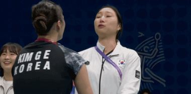
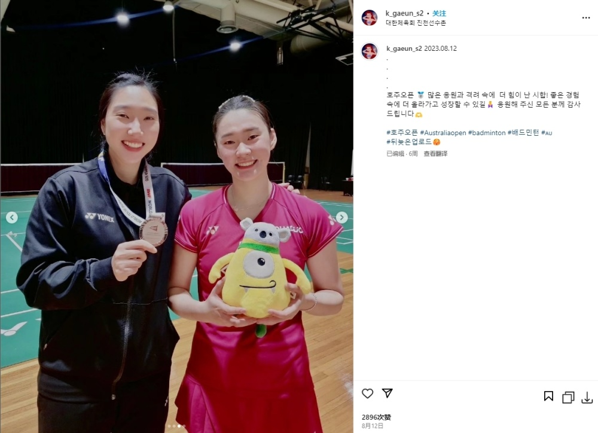

# 此前疑似恶意模仿何冰娇输球表情的韩国选手金佳恩 遭陈雨菲淘汰

直播吧10月05日讯 刚刚结束的一场亚运羽毛球女单1/4决赛，中国选手陈雨菲以2-1击败韩国选手金佳恩晋级。

值得一提的是，在此前进行的女团决赛中，金佳恩与韩国女羽教练成池铉在庆祝胜利时，疑似恶意模仿中国选手何冰娇输球后的失落神情，这一幕当时也引起广大中国球迷不满。

_金佳恩与成池铉的个人IG 在女团决赛结束后至今 都是禁止评论的状态_

