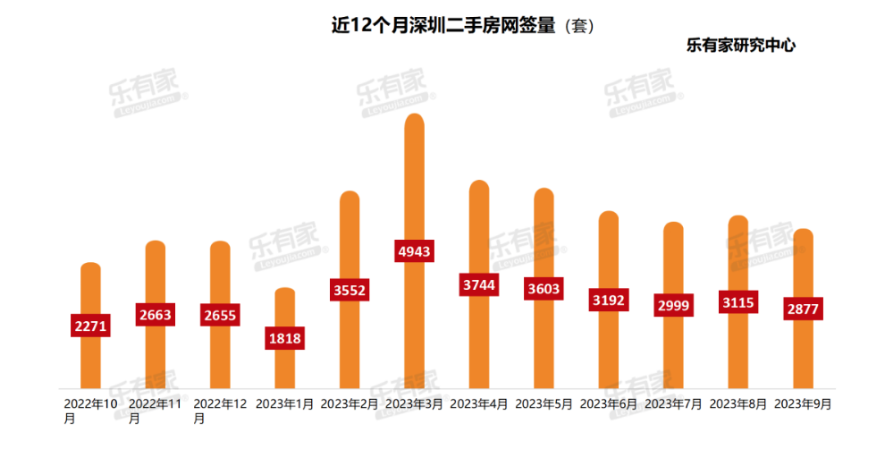

# 深圳“认房不认贷”满月：新房去化周期仍超17个月，二手房放盘量增加

深圳“认房不认贷”新政实施已满月。

乐有家研究中心监测显示，9月实际成交还未完全反映在网签数据上，9月深圳新房市场网签成交2076套一手住宅，环比下跌6%。深圳楼市依然是二手住宅占据主导地位，占比楼市成交总量的54%。数据显示，9月深圳二手住宅过户成交2400套住宅，环比微跌1%。

乐有家研究中心指出，“认房不认贷”新政后，9月上旬，深圳楼市活跃度有了显著的提高。但由于交易流程耗时问题，市场实际成交量还未能完全反映在二手房过户及网签数据上，导致数据双双微跌。不过9月下旬市场略显疲态，涨势放缓。“银十”楼市仍需要更多优化政策来支持购房者住房消费，才能推动深圳二手交易量回到5000套的“荣枯线”水平。

**新政为新房市场带来热度，去化周期仍超17个月**

乐有家研究中心数据显示，新政为新房市场带来热度，9月多个楼盘售楼处人头攒动，开盘现场火爆。9月16日-17日的周末，南山绿景白石洲璟庭、福田金地环湾城、宝安京地海樾府、龙华星河星悦云邸四个新盘相继入市。根据开发商发布的信息来看，四个楼盘共诞生了超2000批购买力。

开发商也积极入市迎“金九银十”，9月深圳全市新增一手住宅预售面积92.2万平方米，创下三季度最高值，环比上涨68%。9月底全市一手住宅库存面积为498.8万平方米，但是随着9月下旬成交走低，一手住宅去化周期持续上涨，超过17个月。

根据乐有家研究中心监测数据，9月深圳新房市场网签成交2076套一手住宅，环比下跌6%。全市各区新房成交主要集中在宝安及龙华。宝安网签775套，环比下跌25%；龙华网签335套，环比下跌9%。罗湖、福田、南山等多个区网签量环比呈现涨势。

**二手房放盘量增加，二手房房价环比持平**

9月的深圳楼市，依然是二手住宅占据主导地位，占比楼市成交总量的54%。

乐有家研究中心监测显示，9月深圳二手住宅过户成交2400套住宅，环比微跌1%。不过，9月市场实际成交数据需要2个月甚至更久才能反映在过户数据上。

另根据深房中协数据显示，9月二手住房网签2877套，环比下跌7.6%。从每周数据来看，9月首周（9.4-9.10）起，周网签量维持超800余套，相较此前的每周600-700套有了明显的上涨。9月上旬市场势头向好，但下旬稍显疲乏。

深圳市房地产中介协会统计数据显示，第38周（9月18日－9月24日）全市二手房（含自助）录得888套，环比下降0.4%，二手房录得量上升态势中止，“认房不认贷”政策效应在逐步减弱。

从各区表现而言，二手住宅过户主要集中在龙岗与福田，各自占比25%及19%。过户超300套的区域有罗湖、福田、南山及龙岗。除了福田、南山、盐田及大鹏下跌外，其余区过户量环比为上涨态势。

在价格方面，随着新政的推行，市场交易活跃度提高，深圳房价逐渐稳定，9月深圳二手房房价环比持平。

乐有家研究中心监测显示，新政出台后，业主放盘量有所增加，趁着市场活跃，不少改善需求的业主希望能早日出手旧房屋，以便置换新房产。因此9月深圳挂牌价仍然处于下滑态势，仅6个片区的业主报价环比略有上涨，90%的业主报价下滑或维持稳定。全市挂牌均价环比下跌0.8%。

