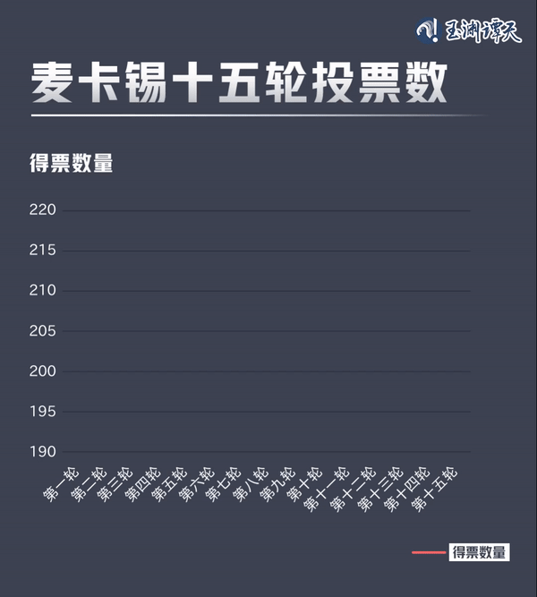

# 玉渊谭天：美国国会乱上加乱，罢免麦卡锡只是序幕

当地时间10月3日，美国众议院就罢免共和党籍众议长麦卡锡的动议进行表决，最终以216票赞成、210票反对的投票结果通过罢免麦卡锡的动议。

这也标志着麦卡锡成为美国历史上首位被投票罢免的众议院议长。

然而，回看麦卡锡从获选到被罢免的经过，今天这样的结果，却不是什么意料之外的“黑天鹅”。

特别是早在年初，麦卡锡竞选的过程中，伏笔就已经埋下。当时，麦卡锡整整经历了15轮投票，才得以当选，而美国出现10轮以上的众议长选举，还是在164年前。

从今天回看麦卡锡担任众议长的仕途起点，也就看清了这轮国会乱象的本质。

美国国会的混乱要从刚刚被罢免的前众议长麦卡锡本人说起，他是电视剧《纸牌屋》中的角色权谋家、阴谋家安德伍德的原型。

回望麦卡锡的政治生涯就能发现，他一路走来，采取的是一种鸵鸟策略。

虽然麦卡锡尽量保证不得罪任何人，但众议院议长的位置毕竟代表着权力和利益，仅仅靠不得罪人就坐享其成，未免也太便宜了。表面看麦卡锡不得罪任何人，但这样的圆滑是以利益交换为代价的。

在他竞选投票的拉锯过程中就能看出端倪。

回看麦卡锡年初十五轮得票的走势，除了一些零星的单票变动，有两次关键转折。

第一次，是第十一轮至第十三轮期间，麦卡锡突破性地再拿下14张选票。

第二次，是第十四轮和第十五轮，此前始终都没有投过赞成的6人转变态度，投了不支持任何一方的“出席票”，从而降低了麦卡锡过关的难度。

然而，这两次关键转折之后，麦卡锡躲不过一个最棘手的问题。他的命运，很大程度上，将会被掌握在一些被两党内斗裹挟的人手里。

这些人不少是共和党乃至国会中思想最保守的人物，为了赢得他们的支持，麦卡锡不得不和这些人妥协交易，以换取他们的投票。

妥协的一项重要内容，是降低罢免众议长动议的发起门槛，降到了只需要1人——任何一名议员，都可以轻易拿捏麦卡锡作为众议长的去留。

不过，恐怕麦卡锡也没想到，这次“让步”的苦果，来得如此之快。

复旦大学美国研究中心副主任信强曾在美国国会工作，他跟谭主分析了产生这种结果的必然性：
**当共和党被这些疯狂的要求绑架，少数极端派会拉着共和党向着更极端的方向发展。哪怕只是极少数的人，也会更加强硬地斗争，换取他们想要的结果。**

于是，一些政客便从中看到了继续抬高要价的空间，开始进一步为自己谋私利。

这次，亲手设计、发起了罢免麦卡锡投票的共和党籍众议员马特·盖茨，就是典型代表。

当地时间10月2日，他向众议院提交动议，理由是9月30日众议院以335票赞成、91票反对的结果，通过了联邦政府临时拨款法案，让美国政府得以继续运行45天。

马特觉得，这完全没把保守派在支出问题上的优先事项考虑进去。边境安全条款，以及更广泛的支出削减计划，都没在临时拨款法案里得到体现。他还声称，33万亿美元的债务才是混乱。

不过，今年以来，让马特不满意的，不止这一件事。

今年初在竞选众议长期间，为了啃下马特这块少数派中最“硬”的骨头，换取他的选票，麦卡锡还和马特谈了众议院军事委员会主席的位置。军事委员会，是国会最具权力的委员会之一。

然而，麦卡锡担任众议长后，当时的“许诺”没有兑现。

对于积怨已久的马特·盖茨来说，发起一个动议并没有什么成本，再加上麦卡锡年初时的“让步”，更让罢免成功的几率大大增加。

不满意，就掀桌。

麦卡锡被罢免，无疑验证了马特这种手段的有效性，更给一批想要谋私的政客，树立了危险的“示范”，如同“破窗效应”。

按理说，“民主”的本意应该是选贤任能，今天的美国政治，却适得其反，并且任由坏的结果愈演愈烈。

麦卡锡正是在这种极端化的政治环境中找到了向上爬的空间，最终却也逃不过被这种极端所连累。

正所谓“机关算尽太聪明，反误了卿卿性命”，不可谓不讽刺。

到这里，美国国会政治可见一斑：

一边，是没有能力、没有态度，站在中间妥协攀附、见风使舵的“麦卡锡们”。

一边，是政治立场越来越走极端，不断抬高要价的两党议员，填充着国会的关键位置。

民主党也不例外。

谭主上次分析美国国会，找到过典型案例：同样以“一人裹挟全党”著称的参议员乔·曼钦。

曼钦的行为，已经预示被算计绑架的美国，实际施政结果会是什么。

过去两年，很多民主党推动的法案，都在临门一脚的最后关头，遭到过曼钦的阻挠。

2021年年末，众议院在长达半年多的拉锯后，好不容易通过了拜登的《重建更好未来计划》，却就因为曼钦反水再次缺失关键一票而搁浅。

当所谓的“民主”决策可以被一人挟持，民众的利益，又能残存多少呢？

一家美国投资管理公司的投资组合经理，在社交媒体上发文估计，国会开会期间，美国纳税人每天要花费2000万美元。

当国会在众议长选举中争执不下时，已经让美国纳税人付出了超过8000万美元的代价。

随着越来越多的议员把心思放在怎么钻制度的空子、绑架国会上，美国国会变得越来越不专业。国会中的委员会就很能说明问题。

曾在美国国会工作过的中国人民大学教授李庆四告诉谭主，
**委员会是美国国会的核心决策机构，照理说，委员会应该聚集的是有过相关工作、教育或专业背景的人，让他们在相关的立法方面发挥专业作用。**

然而事实呢？

拿最典型的众议院外交委员会来说，谭主调查了上一届众议院外交委员会成员的履历背景，47名成员中，有外交经历人只有17%。

美国国会里精通算计的政客越来越多，掌握决策权的人只能优先把每个职位的人选，放在“利益交换”的天平上称量，什么专业、经验，反而被排在了后面，否则下场就是血淋淋的。

当计算和算计成为普遍现象，美国看似精巧设计的制度，越来越不起眼的力量，现在都能利用它、拖垮它，对立和冲突只会愈演愈烈。

在此基础上，可怕的是，更多的人会倒向更容易尝到甜头的极端，所谓“民主”会变成要价游戏——最终为它买单的，始终是老百姓。

正可谓，与不善人居，如入鲍鱼之肆，久而不闻其臭，亦与之化矣。

美国政治的混乱在今天达到了新的高点，但却远远不是终点，很可能是新一轮乱局的起点。

