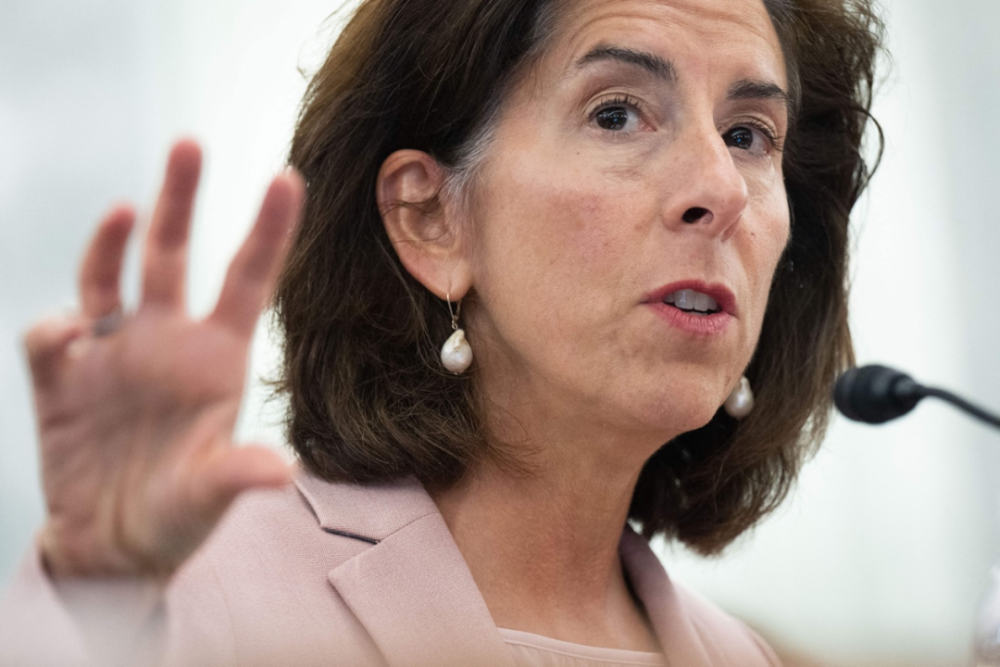

# 美国商务部长再提华为：在芯片上取得突破的报道“极其令人不安”

彭博社报道，当地时间10月4日，美国商务部长吉娜·雷蒙多在参议院商务委员会的听证会上指出，有关中国华为技术有限公司在芯片上取得突破的报道“极其令人不安”，并强调她主管的部门需要更多的手段来实施出口管制。

_美国商务部长吉娜·雷蒙多 图源：彭博社_

今年早些时候，希捷科技就其违反出口管制条例向华为销售硬盘的指控与商务部达成史上单笔处罚金额最大的和解协议，雷蒙多说她对此感到自豪。

雷蒙多对委员会说：“我们已经采取了必要的强硬措施，我们需要多强硬就有多强硬……但我们需要更多的执法资源。”

彭博社报道指出，雷蒙多提及限制法，该法将扩大商务部的权力，令其得以审查和阻止构成国家安全风险的信息和技术交易。

此外，美国商务部正对搭载先进7纳米芯片的华为新型智能手机展开调查，但雷蒙多拒绝透露相关进展。

这是她自8月下旬访华以来第二次出席听证会。值得注意的是，华为新机发售恰巧赶在雷蒙多访华期间，在美国引发了一场关于遏制中国技术进步的努力是否有效的争论，而她也被卷入其中。

彭博社当时委托半导体行业观察机构TechInsights拆解这款手机后发现，它使用了中芯国际最先进的7纳米麒麟9000s芯片。华为和中芯国际此前都被列入美国商务部的贸易管制黑名单。

雷蒙多上个月在众议院作证时说，她认为没有证据表明中国可以大规模开发先进的7纳米芯片，但她仍然面临着来自国会共和党人的巨大政治压力，要求她尽快加强控制。

中国外交部发言人毛宁此前回应称，“华为选择什么时候推出新款的手机，这是企业自己的决定，我不了解”。她强调，我们一贯反对美方泛化国家安全概念，打压中国企业这种歧视性和不公平的做法。破坏自由贸易原则和国际经贸规则，也会扰乱全球的产供链稳定，不符合任何一方的利益。我们也想告诉美方，遏制打压是阻挡不了中国发展的，只会增强中国自立自强、科技创新的决心和能力。

来源丨彭博社、《联合早报》

编辑丨陈淼松，深圳卫视直新闻主编

