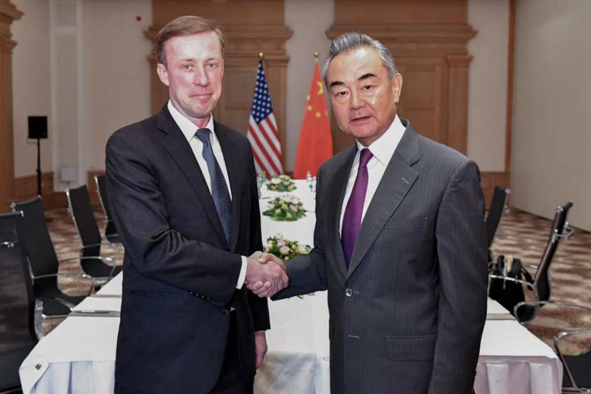
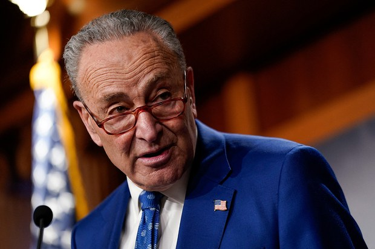
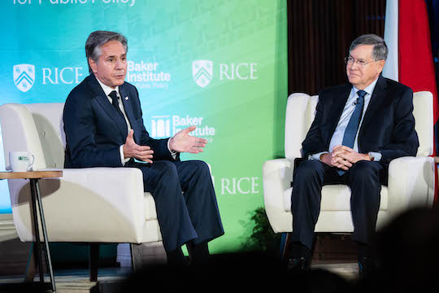

# 美媒称王毅将访美 中美新一波高层接触来了吗

美国《外交政策》引述三名对美国和东亚外交知情的消息人士透露，王毅预计在本月稍晚访美，报道称，预计此访将为中美领导人之间备受期待但仍未安排的会晤铺平道路。外界普遍猜测，41天后美国主办亚太经济合作组织（APEC）领导人会议将是两国领导人会面的重要机会。不过，中方官方尚未证实美媒爆料。

中美高层互动频繁 释放积极信号

今年6月以来，中美高层进行了一系列接触。美国务卿布林肯、财政部长耶伦、白宫气候问题特使克里、商务部长雷蒙多等拜登政府高层官员密集访华，中美关系释放出积极信号。

在美国务卿布林肯6月访华期间，中美双方就同意保持高层交往。布林肯还向中国外长发出访美邀请。8月份，美国务院发言人米勒在记者会上表示，美方对于中国外长的邀约“仍然有效”，但未表示中方是否接受邀请。一个月后，在第78届联合国大会即将召开之际，米勒再次表示，期待王毅能够访问美国。

尽管王毅并未赴美国纽约出席联大会议，但就在联大开幕前3天，中美官方同时发布消息称，9月16日至17日，王毅与美国总统国家安全事务助理沙利文在马耳他两天内举行多轮会晤。

在联大会议期间，布林肯也释出诚意，专门前往中国驻联合国代表团驻地与出席联大的中国国家副主席韩正举行会谈。布林肯在会谈中肯定了中美高层的一系列接触，认为“这展示了我们在负责任地管控分歧”。韩正也表示，希望美方相向而行，推动中美关系重回健康稳定轨道，惠及两国，造福世界。

除了王毅，美国《华尔街日报》9月底还爆料称，国务院副总理何立峰也将访问华盛顿。值得一提的是，何立峰7月在北京会见来华访问的美财长耶伦时，首次以“中美经贸中方牵头人”的身份亮相。新加坡《联合早报》认为，如果此行能够成行，何立峰将是拜登任美国总统以来，出访美国的最高级别中国官员，而这也将使两国领导人的会晤前景更加明朗。

复旦大学美国研究中心副主任信强向深圳卫视直新闻表示，今年美国作为APEC主办国，为显示自身号召力，促成世界上两大经济体领导人会晤至关重要。此外，明年还是美国的选举年，对于拜登而言稳定并改善中美关系也可以彰显政绩，因此美国极力推动两国领导人今年年内举行会晤。

“所以我觉得拜登算盘算得很精。”信强表示，拜登深知如果面对共和党挑战不交出一张令人满意的成绩单的话，连任将会非常艰难。“他需要跟中国配合，需要中国支持，或者需要中美关系展现出一种，比较缓和的迹象。这样才能让投资者信心增长，促进中美贸易进一步发展。美方现在具有强烈的需求。”

**中美多层级多领域接触正在展开**

深圳卫视直新闻注意到，一段时间以来中美两国接触在多层级、多领域展开。在立法机构层面，长期对华强硬的美国会参议院多数党领袖舒默也宣布将率跨党派议员前往中国访问，中国外交部也对此表示欢迎，并表示希望通过此访增进美国国会对中国的客观了解，促进两国立法机构对话交流，为中美关系发展注入积极因素。

外交层面，当地时间9月28日，美国务院发表声明称，美助理国务卿康达在华盛顿会见中国外交部副部长孙卫东，两人就一系列地区问题，包括朝鲜、缅甸和海事问题，进行了坦诚、深入和建设性的对话。中国外交部消息显示，孙卫东“应美方邀请”前往华盛顿，中方也是用了“坦诚、深入、建设性”的措辞形容此次沟通。

在经贸领域，中美互动更加频繁。9月22日，经中美双方商定，成立经济领域工作组，包括“经济工作组”和“金融工作组”，旨在强化经济领域沟通。美财政部称，两国财政部副部长级官员将定期举行会议。

9月28日，中国驻美大使谢锋会见上海美国商会代表团，双方就中美经贸合作及美企在华发展沟通交流。不过谢锋也表示，中美关系仍然面临严重困难和严峻挑战，稳定和改善两国关系任重道远，并指出中美应该找到新时期正确相处之道。

布林肯为何再提中国“挑战”？

就在两国关系呈现积极回暖势头时，布林肯在参加美国一智库的公开活动时，再次谈及中美关系以及中国对美所构成的所谓“挑战”。

布林肯认为，拜登政府在过去一段时间通过的《通胀削减法案》《芯片与科学法案》等法案，这为美国在中美竞争中取得优势地位奠定了良好基础，并再次强调了“团结盟友”的重要性。不过随后布林肯话锋一转，再次强调了中美关系的重要性，并指出中美在许多地方需要合作。

深圳卫视直新闻注意到，布林肯此番论述与白宫官员一段时间以来的对华表述基本一致，仍然秉持此前的“加大在美国国内的投资、与盟友协调、与中国竞争”的新“三分法”论调。但与以往不同的是，布林肯并未提及人权议题、台湾问题等敏感内容。

不过，对华“竞争”甚至“遏制”，仍是近期拜登政府释放出的政策基调。3日，美财长耶伦在出席活动时表示，美国在供应链方面“过度依赖中国”，并重申了自己一贯的观点，认为美国不应该在经济上与中国“脱钩”，但要继续在涉及国家安全问题方面坚持“去风险”的政策。

4日，不久前刚刚访华的美商务部长雷蒙多，在出席美国会参议院商务委员会听证会时再次表示，华为在芯片领域取得的突破“令人难以置信地不安”，并强调美国商务部需要采取更多方法强化出口管制。

同日，美国财政部、司法部、国土安全部、缉毒局和美国邮政局等多部门以“涉嫌生产销售涉芬太尼化学前体和相关设备”为由，起诉、制裁多家中国企业实体和数名中国公民。

“毫无疑问，这种竞争性的甚至是对抗性的对华认知，势必会影响美国政府的决策。”信强表示，“所以我们也一直在跟美国人讲，如果你确实认为中国不是一个威胁，你确实不想遏制中国的发展，那么你应该有实际行动。”

作者丨朱恩地，深圳卫视直新闻记者

编辑丨刘立平，深圳卫视直新闻主编

排版丨季靳玮，深圳卫视直新闻编辑

