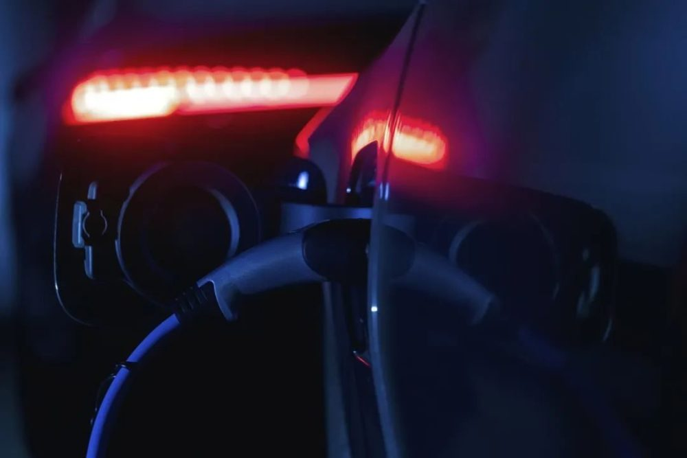
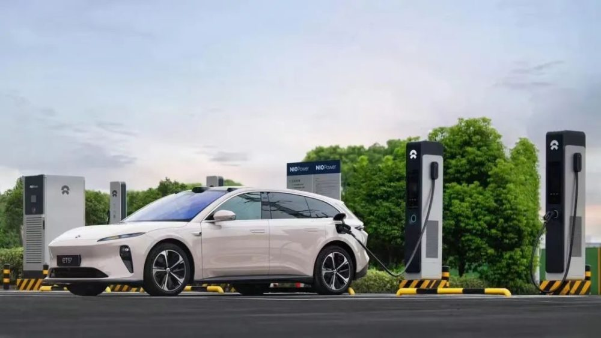
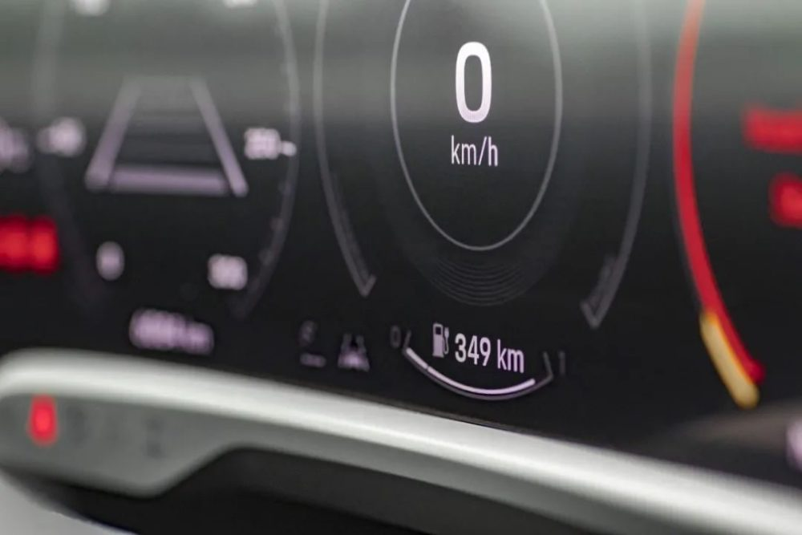

# 十一充电大战众生相：有人在服务区当“充电判官”，增程车主再遭谴责

**每逢十一，总会上演电车车主排队充电的大戏。**

**有人为了防止被加塞，在充电站当起了“充电判官”；有人瑟瑟发抖，在北方初秋的寒夜里打地铺等待充电；也有人总结出一套防插队攻略，在充电站与人斗智斗勇。**

**当一众纯电车主，被漫长的等待耗尽了耐心，看到那些“可油可电”的增程车在挤占稀缺的充电资源时，就气不打一处来，“这个时候了，能加油就别充电了吧？”面对已经破9的油价，增程车主们也很委屈，用油和用电，成本差不少呢。**

**当时间来到2023年，我们为什么还是不能轻松自在地开着电车出远门？**

**文 |** 魏冰

**编辑 |** 李欢欢

**运营 |** 黎静茹

**为了防加塞，我当起了“充电判官”**

江逸是一名大众ID.3车主，这个十一长假，他打算自驾从昆明前往丽江度假。按照计划，江逸9月28日下午四点从昆明出发，全程502公里。ID.3续航450公里，跑高速路续航大概可以达到280公里，为了保护电池，江逸一般按照250公里规划一次充电。

第一次充电，江逸选择的服务区有4个快充桩，他到达时4个充电桩都在使用中，并且有一辆电车已经在排队。江逸把车停在旁边，也加入了排队。

大多数充电桩没有工作人员维持秩序，遇到车多时，排队充电全靠大家自觉。

但总有人不守秩序。江逸在排队时，就曾目睹一场“抢桩未遂”。有一辆车刚到时正好有一个桩在交接，排到的车主正在挪车，刚到那辆车上冲下来一个人，眼疾手快将充电枪抱在怀里想要插队。这个举动立刻遭到其他车主一致声讨，企图插队的车主迫于压力交出了充电枪，心有不甘地走了。

在江逸等待充电的半个小时里，又陆续来了五六辆新能源车。为了防止被插队，江逸在服务区当上了“充电判官”。每新来一辆车，江逸都会主动告知其充电的顺序，组织大家有序充电。

 _▲ 电车在排队充电。图 / 视觉中国_

当了一会“判官”，江逸发现，大部分车主都是讲道理的，彼此配合来维护充电秩序，用江逸的话来说这种模式“更像是共治”。

江逸只关注自己前后的几辆车，排在更后面的就没有太关注了，等江逸充完电离开时，已经有新的“判官”自发出现，继续维持秩序。

排了几次队，江逸总结出一套防插队充电经验：第一，到达服务区时要第一时间拍一张照片，记录自己的到达时间，必要时可以作为自己排队位置的证明；第二，轮到自己充电时，要与同行者配合出击，一个人去挪车，另一个人去看守充电枪并占据车位。

这一套操作下来，基本可以万无一失了。江逸觉得也挺有意思，“国庆出游充个电也是要善用兵法，斗智斗勇的”。

处理插队冲突，只能算旅途中的一个小插曲，遇到寒夜里排长队充电，与北方寒冷的天气对抗，才令人真正难忘。

长假前一天，Model Y车主陈扬自驾从北京开往盘锦，他计划在山海关补能。晚上十点半，陈扬到达山海关服务区，总共4个充电桩，至少有50辆车在排队。

初秋的山海关，夜里已经寒气逼人，气温只有八九度，有车主哆哆嗦嗦打地铺等待充电。

陈扬索性放弃了，原本计划第一天住在锦州，临时改为了山海关，返程时，她直接绕开了山海关服务区。

比亚迪海豚车主杨庆从河南洛阳开往葫芦岛，也选择在山海关服务区补能。杨庆到达的时候已经是晚上11点多，前面还有七八辆车在排队，因为是“到家之前的最后一个充电服务区”，杨庆不得不硬着头皮排队充电。

多台车同时充电，充电桩的功率也随之降低，四台车同时充的话只能达到二三十千瓦。“正常情况我的车最多50分钟就充满了，在山海关我充了一个多小时才充了不到80%。”

也有人等得着急了直接插队，杨庆排队等了一个小时，充电又花了一个多小时，到家已经是凌晨两点了。

**增程车，不配充电？**

凌晨三点，广东省高流河服务区的充电桩区域，依旧很热闹。服务区共有4个充电桩，车主们排队等待充电，不断有新的车到来，队伍越排越长。因为长时间等待，排队的车主们开始变得焦躁起来，自驾出游的兴奋已经被消磨得所剩无几，焦虑、疲惫，可能还夹杂着饥饿，大家的情绪已经到了一触即发的时候。

正在充电的比亚迪秦DM-i（插混车）就成了众矢之的。乔瑟看到，有很多纯电车主在谴责比亚迪秦DM-
i车主，大家主要是认为混动车可以加油，就不应该占据纯电车的充电资源，尤其是在节假日期间，纯电车已经大排长龙的情况下。面对众人的质疑，比亚迪车主心态倒是不错，他没辩驳，待车辆充满电后就离开了。

事实上，从去年十一假期开始，就爆发了一轮增程车主与纯电车主的冲突。2022年10月5日，一名网友在微博发文希望增程车不要与纯电车抢充电桩，“服务区四个充电桩，三个被增程车占用”，该网友认为节假日的高速服务区充电桩属于稀缺资源，既然增程车可以加油，就不应该和纯电车主抢充电桩。“说好的增程车城区用电长途加油，没有续航焦虑呢？可一到了服务区，部分车主钱包很诚实啊！”

_▲ 车主在排队充电。图 / 受访者_

这件事引发了极大热议，有网友认为：“可油可电的理想在节假日高速充电就和路上的龟速车一样，合理合法但膈应人。”

也有观点认为不应该道德绑架混动车主。陈扬觉得，混动车只是比纯电车多一种补能选择，到底选择充电还是加油，混动车主有权利自己做主。

除了不受纯电车主待见，站在充电桩运营商的角度来看，增程车可能也不受欢迎。

通常，增程式车型配备的电池容量较小，只支持慢充，充电时间长。蔚来某服务区充电桩工作人员林泽告诉每人Auto，一般情况纯电车每小时大约能充70度电，同样时间，像理想ONE这样的增程式车型大概只能充不到40度电。

这个十一，纯电车主徐林在充电站遇到六辆正在充电的增程车，而那个充电站一共只有八个充电桩，“全是理想和比亚迪”。等到徐林离开的时候，他的车子充了75度电，而旁边的理想只充了20度电。充电效率低，意味着同样时间内充电站的收益就低。徐林不禁感慨，充电桩运营商都是慈善家吗？有媒体报道，已经有部分充电站明确标明“油电混合车辆禁止充电”。

增程车主们也是有苦说不出。

比亚迪汉DM-i车主林冉告诉每人Auto，在用电和用油两种模式下，增程车的用车成本差别很大，以林冉的比亚迪汉DM-
i来说，馈电状态大概百公里油耗5.5L左右，约合0.46元/公里，而纯电模式下，大约0.2元/公里，十一期间，林冉跑了700公里，算下来两种模式下用车成本大约相差一百多元。

“每个车主都有权利充电，先到先得。”

为了保护自家车主的充电权益，车企不得不在自营充电网络针对其他品牌车主提出一些限制条件。

今年7月末，在自驾游的热门地区新疆克拉玛依至赛里木湖路段，有车主发现，蔚来超充桩在高峰期（7月20日-10月8日的11点-18点）仅供蔚来车主使用，其他时间段则可以向非蔚来车主开放。

 _▲ 蔚来充电桩。图 / 蔚来官方微博_

在今年4月之前，特斯拉的充电站是不对外开放的。4月开始，特斯拉虽然在国内部分区域试点开放充电站，但首批仅开放10座超级充电站和120座目的地充电站，对于国内1600+超充站个数，只是九牛一毛。

**充电桩还是不够多？**

其实说到底，纯电车主的补能焦虑，增程车主到底该不该充电，归根结底还是因为充电桩数量不足。

据中信证券研报分析，截至2022年底，我国存量车桩比为2.5: 1，存量新能源汽车与公共充电桩比例约为7.1:1，距离“一车一桩”的目标仍有很大差距。

但疯狂建充电桩也不现实，充电资源不足，其实只是节假日车主集中外出导致的。高速公路的充电站虽然在节假日客流爆满，但平日里使用频率相对较低，在高速建充电站远不如在城市内铺设充电桩“实惠”，因此企业缺乏动力在高速公路布局充电桩。

_▲ 充电桩。图 / 视觉中国_

中国充电联盟副秘书长仝宗旗表示，目前中国市区充电桩的平均利用率不到10%，即一天24小时，只有不到2.4小时有人使用；尤其在高速路段，充电桩的利用率甚至不到1%，严重影响充电网络的盈利能力。

河北某高速蔚来充电站的工作人员林泽告诉每人Auto：“高速充电桩平时没什么人用，节假日人可就太多了。”以林泽负责的站点为例，普通工作日一天也就换电20多次，但十一长假换电需求大增，仅9月28日一天就换电将近170次。

正因如此，不少高速路段的充电桩虽然建好了，但并没有开启使用。

十一假期，乔瑟和男朋友计划从深圳自驾到云南香格里拉，沿途会经过南宁、昆明、大理、丽江等城市，来回差不多有5000公里。为了避开“出广”的车流高峰，乔瑟计划9月27日晚上出发，10月5日返回深圳。

乔瑟的车是一辆比亚迪汉EV，续航里程600公里。此前，乔瑟也经常开这台电车跑五六百公里的跨省长途，不过，像深圳往返香格里拉这样跨越5000公里的“大工程”，她还是第一次挑战。根据以往用车经验，乔瑟乐观预期，高速路全程速度比较快，能耗大，续航里程估计要打个八折，“（满电）应该可以跑400公里”。

9月28日上午，乔瑟到达南宁，一切都很顺利。途中在高速服务区、南宁市区和贵港市区分别补了一次电。29日下午，乔瑟给车辆充满电从百色驶向昆明，全程546公里，计划途中补一次电就足够了，但她没想到那一段路全是爬坡，眼看着电量一格一格迅速往下掉，比预想中更耗电。

还剩30%电量的时候，乔瑟开始寻找有充电桩的服务区，此时她的心态还比较稳，觉得到下一个服务区就好了。

到达距离最近的服务区时，乔瑟发现，充电桩还未投入使用，迅速转战最近的马蚌服务区，充电桩依旧是未投入使用状态，就这样，乔瑟连续找了好几个服务区都没办法充电。

乔瑟彻底慌了，她已经失去了刚开始自驾时的轻松，第一次感到如此强烈的充电焦虑，并且这种焦虑一次次被“尘封”的充电桩不断放大，她已经开始想象自己被拖车拖走的画面了。幸运的是，当车辆剩余2%电量时，她终于找到了可以充电的地方。

**续航打6折，大家已经麻了**

导致电动车主节假日出行，总是陷入窘境的另一个原因，是电动车续航虚标。

虽然目前大多数电动车的续航里程都能达到500公里以上，但车主的普遍感受是，跑长途仍不够用。

10月1日，海豹车主赵亦从南京自驾去洋河，全程260公里。赵亦的车标准续航700公里，驾驶途中，赵亦一直把车速定在110公里/小时，为了省电，他甚至没开空调。到目的地后续航减少了434公里，剩余电量38%。

返程时赵亦满电出发，依旧将速度保持在110-120公里/小时之间。这一次赵亦全程开启空调，温度维持在23度，依旧是跑完260公里的路程，剩余电量33%。

也就是说，跑高速续航差不多打了6折。

_▲ 仪表续航里程。图 / 视觉中国_

“如果你不知道什么是续航焦虑，开台电车上德国高速吧。”在德国生活的特斯拉Model
3车主调侃道。在不限速的德国高速公路上，标准续航350公里的特斯拉，在开了100公里左右就只剩50多公里的续航了。这位车主只好一路跑在右车道，“苟”到了充电桩。

新能源车销售李青告诉每人Auto，新能源车亏电普遍比较严重，就是续航虚标。“一辆纯电动车，开空调、不跑高速，续航基本上要打8折；如果是冬天开暖风，可能打到7折，跑高速的话甚至要打5到6折。”

乔瑟的车标准续航600公里，在爬坡和高速的双重难度之下，满电状态仅仅跑了300公里左右。

实际上，电动汽车能耗及续航里程会受到温度、载重、坡度、驾驶习惯、路况等诸多因素的综合影响，加上车辆的电池管理系统水平参差不齐，电动汽车续航不准已经是大家默认的事，乔瑟出行时会按照打折后的续航里程规划补能。

为了错峰，乔瑟提前在10月3日踏上了返程。差点叫拖车的经历，至今仍令她感到后怕，她希望回程有足够宽松的时间补能，而原计划要去的洱海和玉龙雪山，也只能放弃了。

（应受访者要求，乔瑟、江逸、陈扬、李青、林泽、徐林、赵亦、林冉、杨庆均为化名）

**文章为每人Auto原创，侵权必究。**

