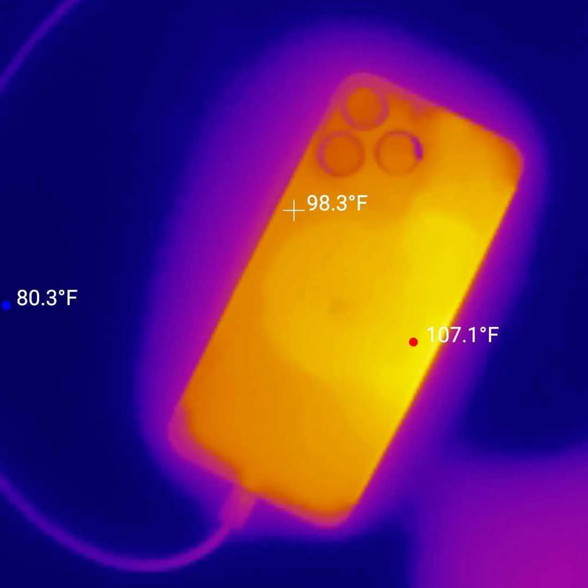
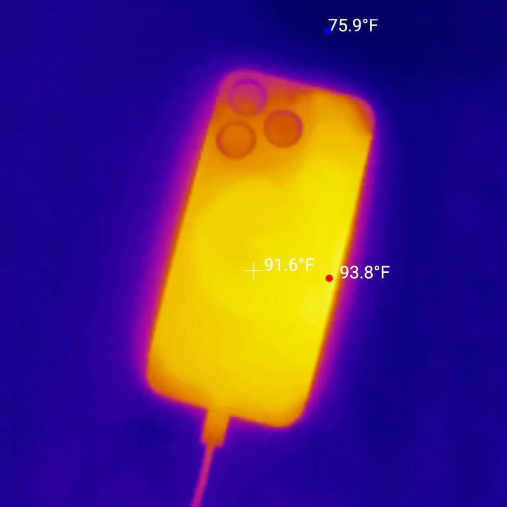

# 实测：苹果系统升级后改善iPhone 15 Pro过热问题，充电温度可降7.4度

IT之家 10 月 6 日消息，苹果公司昨日发布 iOS 17.0.3 更新（内部版本号：21A360），重点解决了可能导致 iPhone
比预期运行温度更高的问题。

IT之家此前报道，从 GeekBench 跑分来看，iOS 17.0.3 更新并未通过降频方式降低温度，而是通过优化系统和应用等带来改进。

那么 iOS 17.0.3 真的降低温度了吗？国外科技媒体 ZDNet 主编 Jason Hiner 近日进行实测。

测试方式是首先耗尽 iPhone 15 Pro 和 iPhone 15 Pro Max 两款机型的电量，对比升级 iOS 17.0.3
前后充电状态下的手机温度。

在升级 iOS 17.0.3 系统之前， **iPhone 15 Pro 和 iPhone 15 Pro Max 在充电状态下最高温度为 107.1
华氏（41.7 摄氏度），而且经常会超过 100 华氏。**

而在升级 iOS 17.0.3 系统之后，iPhone 15 Pro 和 iPhone 15 Pro Max 在充电状态下最高温度为 93.8
华氏（34.3 摄氏度），温度在 85-95 华氏之间。

