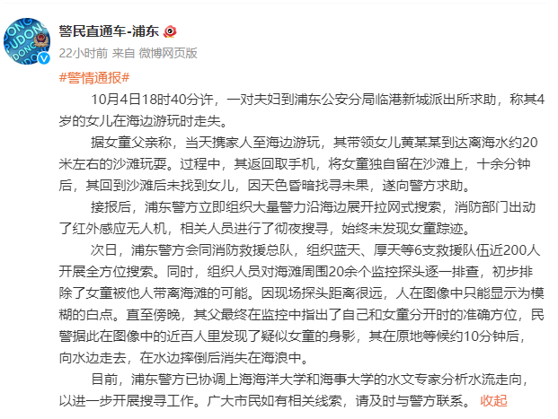

# 4岁女童海滩走失，媒体：父母不能“心太大”，网友不能“恶意太大”

作为父母，看娃时不能“心太大”；作为网友，评论时不能“恶意太大”，这是人人该有的自觉

一名4岁女童近日在上海南汇新城海滩走失一事，正牵动无数人的心。自事发时起，当地已经有多方救援力量投入搜救工作。10月6月下午，警方通报，经排查，初步排除了女童被他人带离海滩的可能。从监控图像中发现了疑似女童的身影，“在原地等候约10分钟后，向水边走去，在水边摔倒后消失在海浪中。”参与搜救的上海蒲公英救援队队长介绍，事发沙滩是一个离岸流冲击出的泥沙滩，沙质并不好，并非景区。

4岁女童，海滩走失，父亲取手机留女童独处，至今搜救无果……这些关键词叠加，很难不引发大众的怜幼情结与忧心意绪。“女孩去哪了”，无疑是社会多方关切之中的共同疑问。这般疑问，需要用清晰的事实链去廓清。

毋庸讳言，在此事中，父亲留女童独自在海边的过失跟女童走失的后果之间，有值得臧否和省思的空间。就目前看，一些网友将对女童命运的关切转为了对女孩父亲的鞭挞，还有人脑补出“女孩父亲是她的继父、这次是故意弄丢、错报离开时间”等情节，将这起突发事件渲染成极具悬念的刑事案件。循着这类声音可以看到，在相关新闻的留言区内，主张网暴这位父亲的声音比比皆是。

普通人在角色代入后的痛心完全可以理解，女孩父亲的一些做法也绝非不能批评：
**将只有4岁大的幼童独自一人留在海滩十几二十分钟，无疑是犯了育儿带娃的大忌——不能让幼童离开大人的视线。**
这本是带娃常识，更别说是非短暂性离开。更何况，女童走失的沙滩并非景区，一直以来都不鼓励大家进，本就不适合带幼童来玩耍。就此看，这位父亲确实当得起“心太大”的指摘。

对很多父母而言，此事无异于育儿活教材。做过父母的人都知道，4岁左右的孩童正处于对世界充满好奇又能蹦会跳的年龄，带娃时几乎得无时无刻不盯住孩子，尽可能减少“监护盲区”。虽然这免不了要牵扯大量精力，但育儿的世界从来没有“容易”二字，也没有“Easy模式”。在此事发生后，更多父母当对镜自照，汲取别人留下的教训，减少自己可能出现的过失。

由此事抛出的儿童安全议题去探讨“带娃安全注意事项”，本无可厚非，但要切忌越过“合理批评”的边界，在事实未明之前就大搞诛心论。女童海滩走失，如果错在父亲身上，那么痛也在父亲身上，留给他懊恼悔恨的余地空阔，舆论不必也不该用满怀恶意的“故意伤害指控”对他伤口撒盐。

不得不说，在当下的网络，每当发生“悬案”，总会出现“人均一个福尔摩斯”的景象：有人负责“喂料”，有人负责拆解，有人负责撕、怼、喷。
**部分网友会将过剩的隔空断案癖好与道德审判冲动投射到个案上，还假以“真相”“正义”之名。可事实上，许多猎奇式想象跟阴谋论式揣测无关真相，更无关正义。**

针对此事，尽管离散式舆情很难抑制围绕女童家庭关系的联想，但女孩父亲到底是“有心之错”还是“无心之失”，只能由缜密调查去厘清，这二者区别是巨大的。在事实浮出水面之前，舆论当尽量克制“断案癖”与“审判欲”，别用那些煞有介事的故事捏造或细节编排去乱带节奏、误导公众，制造更多伤害。10月7日，媒体从上海市公安局浦东分局获悉，走失女童一家系原生家庭，不存在曾丢过该女童的情况。这样的澄清，就让很多臆断先行的结论站不住脚。

**4岁女童海滩走失，留下了太多教训供女孩家人和更多父母汲取，沿着这些教训去反思去批评都不是问题，但反思和批评通往的不该是被情绪带着跑的网暴——网暴只会挥霍事件遗留的反思机会。**
作为父母，看娃时不能“心太大”；作为网友，评论时不能“恶意太大”，这是人人该有的自觉。

红星新闻特约评论员 佘宗明

编辑 赵瑜

