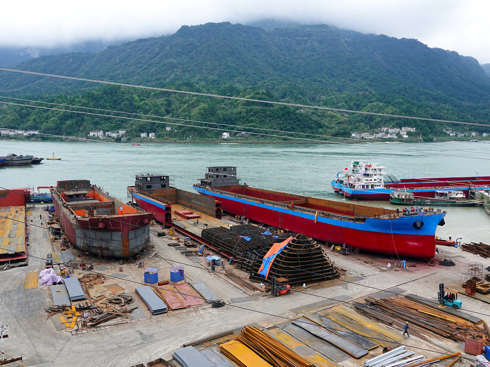

# 82%∶6%！中国9月造船接单量远超韩国，韩媒：差距正越拉越大

【环球时报驻韩国特约记者 张静 环球时报记者
陈子帅】据韩联社6日报道，英国造船和海运业分析机构克拉克森当天发布的数据显示，韩国船企9月接单量远少于中国，全球占比为6%，排名第二；而中国以82%居首。

_2023年9月24日，湖北宜昌，长江三峡乐天溪造船基地，造船厂工人在造船。（视觉中国）_

韩联社报道称，9月全球船舶订单量为186万修正总吨（CGT），同比减少59%。其中韩企接单量为12万CGT（4艘），占比约为6%，排名全球第二。中国承接153万CGT（62艘），占比约82%，以绝对优势处于领先地位。此外，今年1至9月全球累计船舶订单量为3014万CGT（1196艘），同比减少23%。其中，韩国和中国接单量分别为742万CGT（168艘）和1799万CGT（726艘），占比分别约为25%和60%。截至9月底，全球手持订单总量环比减少36万CGT，为1.2219亿CGT。韩国和中国的手持订单量分别为3944万CGT（32%）和5815万CGT（48%）。

韩国《全球经济新闻》称，韩国造船业与中国造船业接单量的差距正越拉越大，韩国造船业在如何争取新订单方面正亮起红灯。韩国《亚洲经济》的报道将矛头指向本国“人力不足，技术优势不再”。报道称，韩国造船海洋产业人力资源开发委员会今年5月发布的数据显示，2014年韩国约有20万造船人力，去年11月则锐减至9.5万人。2014年以后，国际油价下跌导致韩国造船厂的主要客户订单急剧下降，生产岗位人力大幅缩水。与此同时，韩国年轻人对造船业表现出回避态度。此外，在被视为韩国造船企业竞争力的高附加值船舶制造技术方面，中国与韩国的差距在逐渐缩小。韩国的全球高附加值船舶市场份额从2020年的65%下降至去年的57%，中国从23%上升至39%。

海军军事专家李杰6日对《环球时报》记者表示，中韩在造船领域接单占比差距越拉越大，原因主要有以下几方面：首先，过去世界造船业呈现中日韩三足鼎立局面，如今中国凭借最为完整的工业化体系，在造船方面的发展速度明显更快；其次，海洋是中国重要的战略方向，中国在海军建设方面倾注了很大心血，海军的发展同时也促进了造船业的发展；最后，与中国相比，韩国不仅造船量少，同时技术革新速度也慢，世界越发青睐技术和经验日益丰富的中国造船业。

韩国汉阳大学教授李正焕日前接受韩国YTN电视台采访时表示，随着韩国人工成本上升等原因，集装箱船、散货船等订单都被中国拿走。特别是中国造船业技术的进步，进一步提升了在低附加值船舶制造方面的优势。韩国目前重点制造的是高附加值的液化天然气船，在这方面韩国仍有技术优势。

