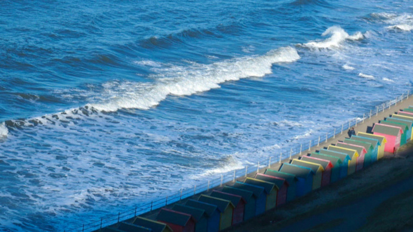
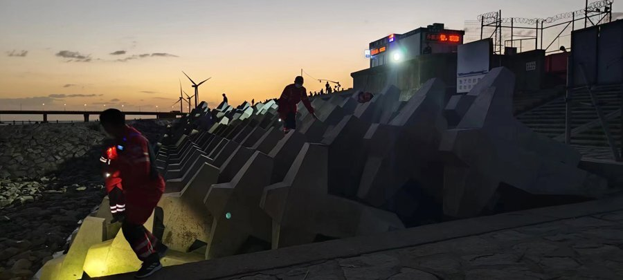
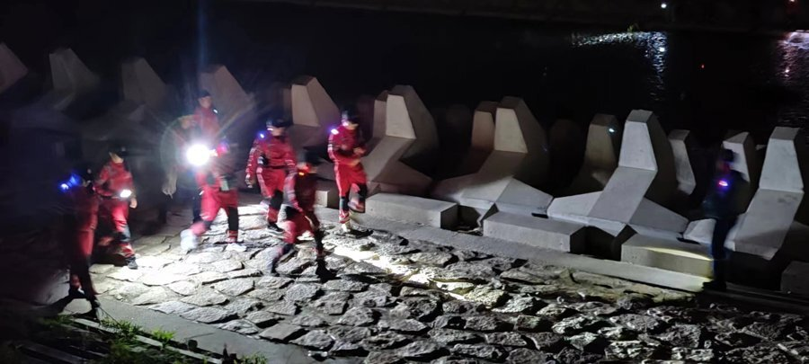
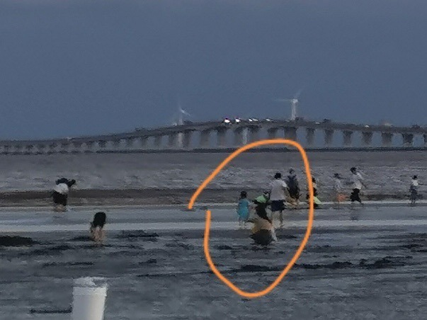
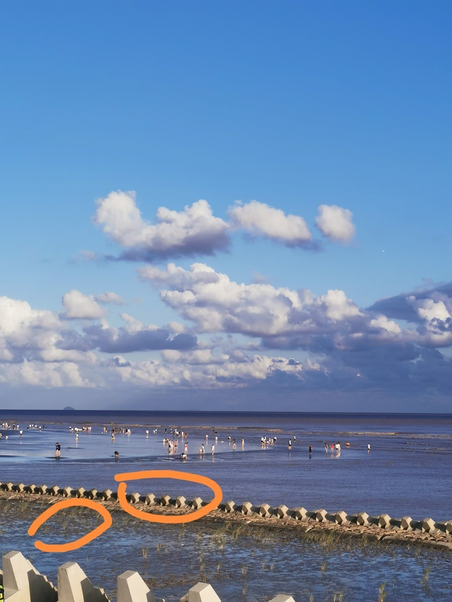

# 上海4岁女童走失：“野海滩”的另一面

10月4日，上海市南汇新城海滩，一名4岁半的女童黄元芯失联。

10月6日下午4时，综合上海市浦东区警情通报，在图像中的近百人里发现了疑似女童身影，其在原地等候约10分钟后，向水边走去，在水边摔倒后消失在海浪中。

截至10月7日正午，相关部门回应走失女童一家系原生家庭，不存在曾丢失女童的情况。记者联系上海海事大学获悉，海事大学目前已有两位水文专家参与7日上午的调度会，参与救援方案制定。

救援仍在继续，但女童走失事件的背后，浮现出“野海滩”赶海的安全隐忧。平静的海面下，有着难以预料的生命危险。

_游客拍到的当天照片。 受访者供图_

水域救援难度大

10月5日，上海山锋救援队接到应急管理局的任务，下午3时抵达南汇新城海滩。队长张善丰和指导员冷志明介绍，救援队去了25到35人，先维持5米一人的站岗，防止游客下到海滩，现场也有喇叭在放：“今日有水域演练，禁止游客进入。”

水域搜救领队金琪表示，当时救援队带了5台无人机，2艘冲锋艇，一个AED机（除颤仪），还有一个热成像感应仪。无人机先飞上去观测，救援队员再拿着人为手电筒和人眼在工字形堤坝间、沙滩上进行巡逻，大概300到500米的距离，查看是否有显眼的蓝色，女孩走失时的着装。

“堤坝缝隙大，以孩子的体型很容易卡进去。”金琪说道，工字形的石头间隙，成年人可以一脚踩进去，如果孩子摔倒了，很可能被一个大浪冲到间隙里。

4日退潮时，海浪离救援队已经有100米左右的距离，但海风很大，救援队的冲锋舟没有下水。金琪回忆，当时淤泥滩受到潮水影响很软，一脚踩下去有半米左右的深度，差不多到他的小腿膝盖。“太细腻了，容易踩塌，除非太阳出来把泥晒干，硬度会高一点。”

_山锋救援队在海滩搜救 受访者供图_

_山锋救援队在海滩搜救 受访者供图_

金琪在现场看到了黄元芯的母亲和外婆，两人除去派出所查看监控，平时就在海边等待着救援队的消息，来回跑。

“她们很急，也说不出什么话。”金琪叹气，两人不停形容孩子的穿着、体型，每次看到救援队，母亲都会带着哭腔感谢。队员们不敢多问。

两天里，救援队都在退潮后进行搜救任务。6日晚8时，山锋救援队离开新城海滩，7日目前没有收到应急管理局的指令。

金琪指出，救援的黄金时间是72小时，尤其是水域的话更赶时间，如果是陆地，例如芦苇荡之类搜救还有一些希望。

救援队此前也遇到过不少水域搜救，今年1月时，就有老人在钓鱼时被水流冲走。“海边失踪的话基本上都是海警出动，如果面积比较大，会联系当地的应急管理局，组织救援队过去搜救。”

海滩潜伏隐患

10月4日5时33分，王微（化名）一行正在新城海滩游玩。她随手拍下的风景照里，恰好有一位身着蓝色裙子的女孩疑似黄元芯。

 _王微拍到的“疑似”图 受访者供图_

不久前，王微在小红书上检索“赶海”，在一系列推荐中选择了南汇新城海滩。

她回忆，进入海滩的路上有很多防护措施和工作人员把守，旁边有很高的护栏。她和朋友翻了一面墙，花了近1小时才到海边，离开的时候岗亭开了，能直接出去。

“淤泥滩很滑，沿路的石头有些高。”6时天色已暗，王微摸着黑从淤泥滩一点点趟回岸上，一不留神就会踉跄。此时她隐约听到寻人的广播声。

“广播还有说海边危险，请大家迅速上岸什么的。”海风疾呼，王微只能走近了才能听到些内容。她说，当时没有注意到海边是否有安全警示牌。

金琪是第一次来到新城海滩。他说，游客们口中的“墙”应该是指海滩上方的石头堤坝。前往海滩时，停车后需要走200米左右的路到达堤坝，其中只有将近10米是平路，其他的路由一块块小石头搭建而成，凹凸不平。堤坝由四到五排的工字形石头堆叠，可以攀爬。

_海滩上方的堤坝 受访者供图_

_金琪所说的堤坝。 受访者供图_

金琪看到，尽管现场有50到80米的栏杆，有救援队员把守，仍然会在海滩上看到不少游客。“有人是从小路下去的，有人是翻堤坝过去的。”这些游客很多是退潮前3到4个小时就到了海滩，等到日落，退潮后去赶海。

他强调，工字形的堤坝，救援队员走下去也很危险。淤泥滩如果不穿防滑的鞋子，容踩空伤到膝盖、大腿。

另一位游客表示，新城海滩现在正是“热门”的时候，进出口要排队，脱鞋出来后清洗脚也要排半小时的队，但海滩下海的地方有潮汐时间表，“一般都是白天时候去的，现在海边晚上天气太冷，也不安全。”

_王微看到附近有很多石桩子。 受访者供图_

赶海的另一面

周婷（化名）今年刚搬到临港居住。她表示附近有两个“野”海滩，新城和南汇嘴。她印象深刻的是今年8月去南汇嘴时，一些路口都被铁丝网封死，没有路可以走。但游客很多，一些游客就在铁丝网中间开了一个口子，纷纷从里面钻进去，再翻越堤坝进入海滩。

“今年以来很多人来临港的海滩拍海景打卡。”在她看来这里不算景点，没有开发好，海滩附近有很多施工的大车，进去的路“有时候乱七八糟”的，沿路都是垃圾，没有人清理。但她每次去游玩，“海滩上站的全是人，一直都密密麻麻的。”

周婷回忆，此前和朋友在海滩的石头路上走，正值中午涨潮期，她眼看着海水从较浅的地方一点点漫上来，几乎快要盖住一米多高的大石头。周婷忙往回撤，她看到还有许多游客停留在原处，很多人已经走到了很远的地方，离岸边100米以上。回到岸上后，她听到有大喇叭开始喊，涨潮危险，请大家远离海岸。她觉得这些提醒确实起到了警示作用，但没有强制性和约束力。

“排队，哪有人排队？”周婷笑道，两片海滩的出入没什么秩序，“挺乱的。”

近年来，“赶海”正在各大社交平台上走红。与此同时，安全隐患和环境破坏也随之浮现。

有游客和专家提议，除了在相关地点附近增设更多的安全设施和人员监管，更为重要的是，让更多人了解海洋知识、培养安全意识，不要盲目“赶海”。

