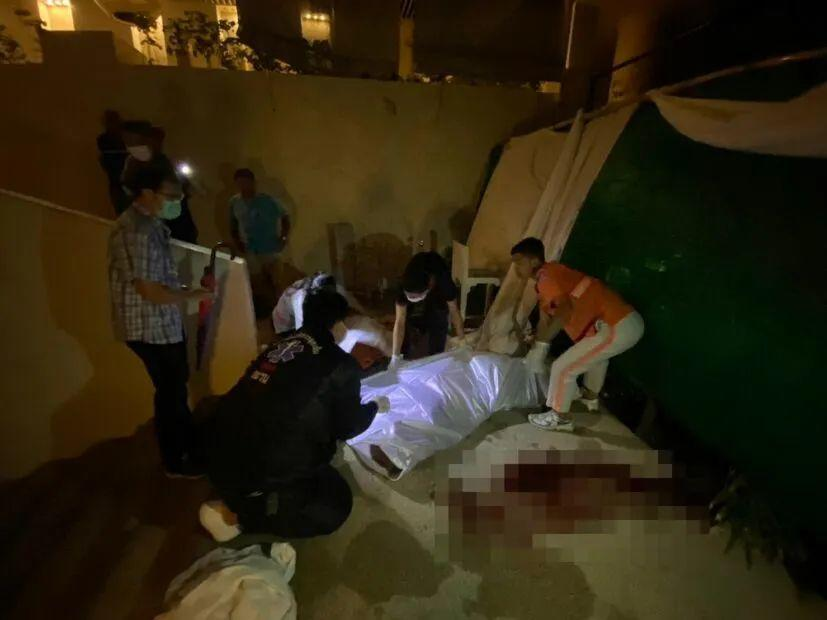

# 中国女游客在泰国普吉岛五星级酒店坠亡

当地时间10月6日，一名中国女性游客从泰国普吉岛某豪华五星级酒店10楼坠亡。当地警察和法医赶到后，就事故原因展开调查，目前尚未得知坠亡原因。泰国普吉府卡隆警察局工作人员向红星新闻确认了该消息，并表示目前该游客遗体已被送往附近医院进行尸检。

10月6日凌晨4点左右，泰国普吉府卡隆警察局调查副督察苏卡瓦特接到卡隆警察局事件通知中心电话，称辖区内发生了一起案件，一名外国游客在普吉府卡隆分区的酒店10楼坠亡。

 _▲坠亡现场_

接到报警后，苏卡瓦特立刻向卡隆警察局局长和副局长报告。警方抵达现场后发现，一名34岁的中国女性躺在血泊中，已无生命迹象。

_▲泰国警方抵达现场_

据酒店工作人员称，死者独自一人使用其个人汽车驾照作为凭证在该酒店开房，并入住10楼1040号房间，目前其死因尚不明确。法医和警方已在现场取证，该女子遗体也被送往附近医院进行死亡原因调查。

泰国普吉府卡隆警察局工作人员向红星新闻确认，辖区内外国游客集中区域有一名中国女子从酒店坠亡，目前遗体在附近医院停放。

红星新闻记者 沈杏怡

编辑 彭疆 责编 官莉

