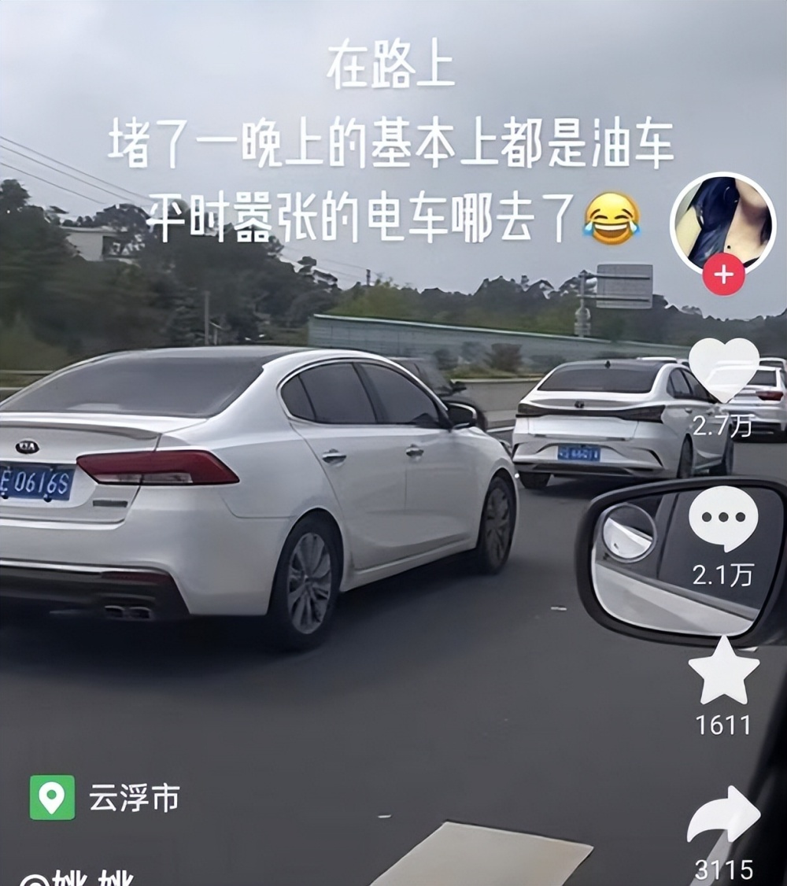
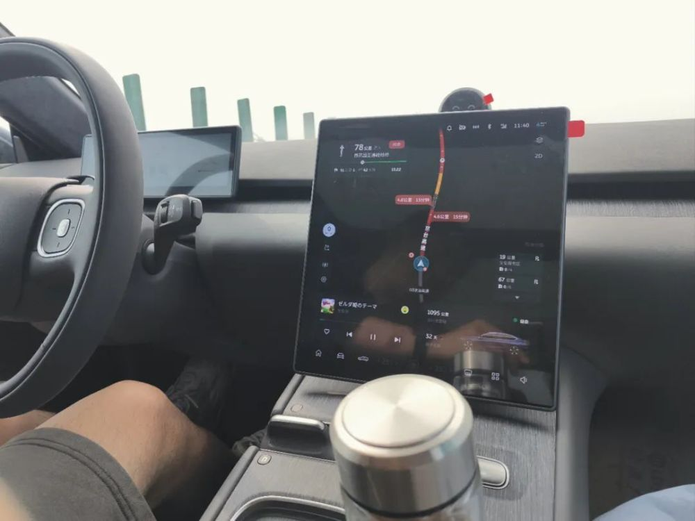
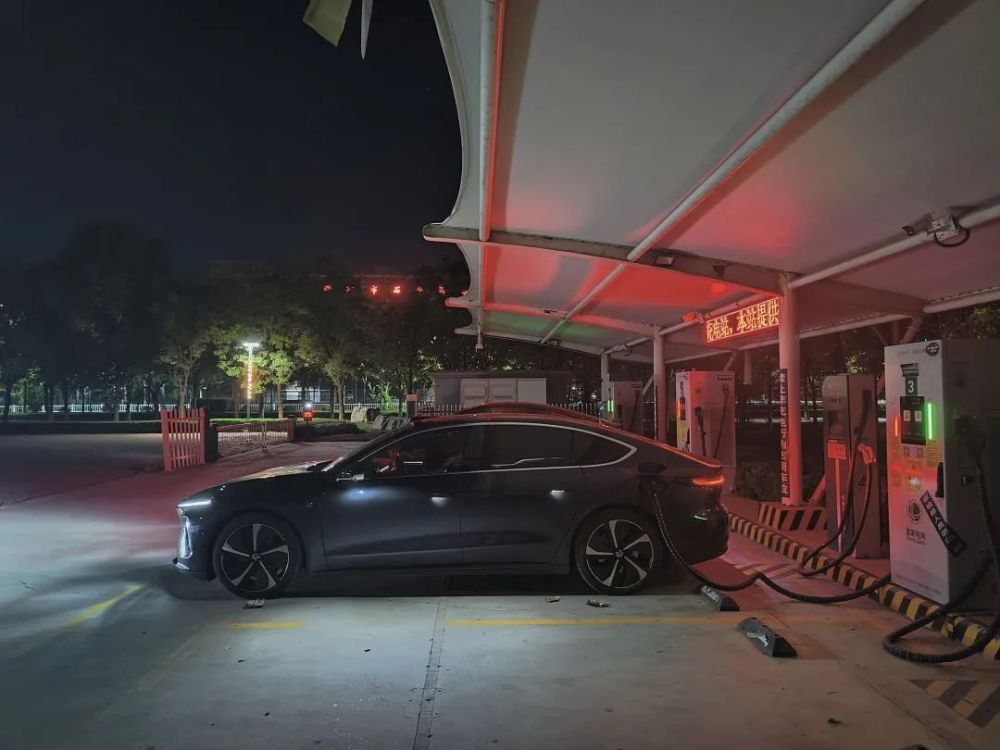
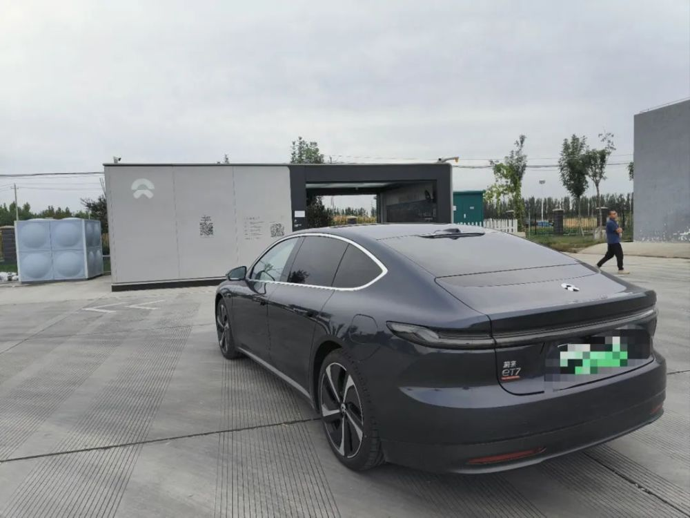
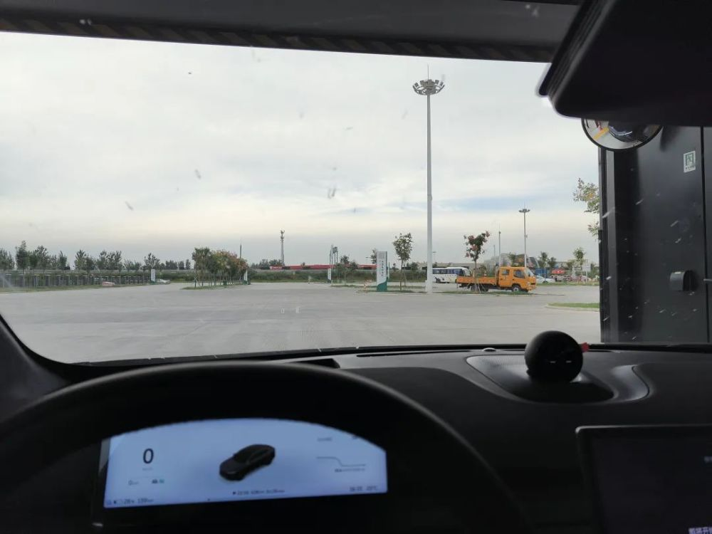

# 从北京到武汉，一辆“电动爹”的国庆囧途

**文｜园长**

**编｜陈梅希**

中秋国庆假期之前，每一个知道我要开一辆电动车从北京回武汉的朋友，都露出了惊讶的神情。我大概能读出每一次皱眉背后的忧虑：

今年国庆节很可能是近几年最堵的一个，高速堵车是大概率事件；电动车续航、充电都是问题，跑1000多公里的高速路，让本不富裕的续航雪上加霜。最糟糕的是两种窘境同时登场，倘若在堵成停车场的高速路上耗尽最后一丝电量，难道要把车推到服务区吗？

但没有买到票的我，只能一边带着忐忑一边宽慰担心我的朋友：没事，这辆车续航500多公里，高德地图都说充电两次就可以；实在不行还可以换电，换一次电也就几分钟，和加油也差不太多；如果高速上没有地方充电，我就想办法找出口下高速，再去市区或者县城找换电的地方。

至于长时间开车的疲劳驾驶问题，我告诉朋友们，问题不大，这辆车自带L2级以上的辅助驾驶，高速路上只要点击一下方向盘左边的智驾按钮，就可以自动进出匝道、自动变道超车、自动保持车距，握好方向盘、随时观察前方路况，理论上讲和乘坐高铁没有什么区别，没有多少体力的消耗。与其说是在宽慰担忧我漫漫返乡路的朋友，倒不如说是给自己一点勇气。

但“理论上”和实际有多大差别，特别是在车流量很大、大概率堵车的国庆假期，我的心里也没有底。
**古人说，车到山前必有路，到了当代，车到没电不一定有充电桩。**

无论如何，带着期待和不安，我和我的小电车，踏上了国庆返乡路。

只要有电，就不怕堵车

我是9月29日、中秋国庆假期第一天上午出发的，这天的目的地是河北省沧州市，距离北京不到200公里。出发前一晚的高德地图显示不论多早出发，所用时间差不多都是4小时30分钟，比平时久两个多小时，于是我决定干脆睡到自然醒再出发。

还没出北京，我在京台高速上就遇到了此次出行以来拥堵最严重的路段，平时畅通无阻的高速路，堪比早高峰的北京东三环。

_龟速行驶中_

看着身边一辆辆怠速中慢慢挪动的车辆，我不禁开始心疼他们的油——最近，92号油涨到了8块多。还好，我这辆车是用电的，头一天换了新的电池，续航里程还有500公里以上，可以放心地开空调，慢点开反而比较省电。

一路上看到的新能源车仍然略显稀少，粗略一算，90%的车都是油车，像我一样“头铁”开着纯电车在国庆期间跑高速出远门的少之又少，相比市区新能源车的密度低了不是一点半点，偶尔才有一辆理想L7或者比亚迪秦Plus
Dmi等可油可电的新能源车从身边经过。

之前我从北京到内蒙古乌兰察布、河北承德市等地短途出行时，时常可见同样从北京过来的特斯拉ModelY、极氪001等纯电车。只从这一点来看，人们对于纯电新能源车远途出行的信心，还是不太够的。

从北京到沧州，一路上不少服务区都排起了长队，两车道的高速路在服务区附近被挤得只剩一条。

如果在这种情况下必须进服务区加电，就将大大增加路途所需要的时间，因为仅仅进入服务区就要排队很久，更不用说充电排队了。

经过4个半小时拥堵下的龟速行驶，和出京的车辆挤挤挨挨后，我终于到达沧州市区。平均下来速度只有40多公里每小时，比骑电动车快不了不少。如果坐高铁的话，足够往返两趟。好消息是因为开得慢，基本上都在电车的经济电耗区间开车，实际续航仍然有200多公里。

因为有终身免费的换电权益，假期第二天下午，我在踏上南下旅途前，找了一家换电站换上了新的电池。

9月30日，路上的车少了很多，基本没有碰到拥堵路段。但考虑到天色已晚，行驶到山东省聊城市茌（chi，二声）平区时，我决定在这个县城暂歇一晚，顺便体验电车在县城的充电。

下了高速，电车续航还剩100多公里，但下一个换电站远在几十公里之外，保险起见，还是决定在茌平县城充个电。我在车辆手机App上找了一个本地评分最高的充电桩，位于当地的景区停车场，开车过去不到10分钟。

“没有深夜开车充过电的人，不足以谈人生”

本着“来都来了”的原则，我决定把电池尽量充满。时间已到深夜，仍然有不少车辆陆续来到这个县城充电站，大多数不是本地牌照，也是和我们一样旅行至此的外地车。充电站隶属于国家电网，下载e充电App才能使用。

这也是本次旅途中我唯一一次充电。

不到一个小时，电量从20%多充到了90%出头，考虑到过了90%电量电池会自动开启慢充模式来保护电池，我就拔下充电枪回宾馆了，充电费用是50块钱。

旅途第三天，也就是10月1日上午，我和小电车继续出发，从茌平向东不到一百公里到达济南，拜访一位朋友。这天上午山东境内的高速路也很堵，本来我们约的是10点钟的早午饭，喝一碗单县羊汤就走，硬生生拖到了11点多才到，改成了吃午饭，品尝了经典鲁菜九转大肠。

不均匀分布的充电桩

在济南打开车辆手机App的充电地图，充电桩和换电站密密麻麻，在比较发达的省会城市，新能源车的普及率并不亚于北京上海等一线城市。

_四线城市的无人换电站_

实际上，充电桩和换电站的普及率，即便在三四线城市也相当高了：前一天在沧州，周围已经有不少充电桩，有的地方还有配置更高的快充桩、目充桩（目的地充电桩），甚至在这个四线小城市还有两座这个品牌车的换电站。

我看电量还有一多半，决定直接上高速，计划当天就到达武汉。

_换电预约，电池比较充足且无需等待_

车机导航给出了两次换电的方案，一次在鲁西南的山东菏泽，一次在紧邻湖北的河南驻马店，都是在服务区里面，不必下高速去市区的换电站。

一路上车不算多，我的车速一直卡着最高限速行驶。这样操作的后果是，电量消耗很快，车机导航显示的下一个换电站距离在慢慢变小，但仪表显示的实际续航里程刷刷往下掉，眼瞅着实际续航里程就要低于距离换电站的里程。

电量焦虑下，我在导航上切换到了一个更近的换电站，尽管它要绕路——下高速再上高速。

_高速上的换电站，基本都有工作人员值守_

相比城区的换电站，高速换电站的使用频率似乎更高，我到达时一辆SUV刚好离开，换好电之后另一辆SUV紧随而至，不过我们都没有排队。

离开这个换电站不久，七八点钟天黑之后下起了小雨，到了河南境内成了大雨。

得益于两吨多的车重，雨中电车跑高速依然稳定，120公里左右丝毫没有飘忽的感觉。继续行驶近300公里后，晚上九点，我在雨中开到了河南驻马店的高速换电站，这次同样需要先下高速、再上高速。这家换电站同样有工作人员守候在附近。

再次出发后，雨势越来越大，加上夜晚行车时间较长，视觉有些疲劳了，我决定就近找个县城休息一下，顺便给车充电。

我在确山县城下了高速，停好车之后一看车辆手机App，整个县城没有开放的充电桩。虽然街边可以见到五菱宏光Mini之类的电动车，但这里的充电设施应该都是私人的。

晚上十点刚过，秋雨中，气温骤降，呼吸可见白气。街上行人车辆寥寥，似乎整个县城都已睡下，找不到可以吃饭休息的地方，几家宾馆也显示满房了，我在路边找了个能停车的地方，开启外循环休息了半个小时。

继续上路后，雨还在继续下，12点多开到信阳，续航再一次降到了100公里左右，我进入服务区的换电站补能。

**已是凌晨，仍有两三个工作人员彻夜值守，指挥车辆进出。**
虽然有终身免费换电权益，但在标明费用的账单中可以发现，夜间换电的费用比白天便宜了三分之二左右，可能是夜间的电费比较便宜的缘故，换电也会有所优惠。

再向南行驶100多公里，我离开河南境内，抵达位于湖北孝感的大悟服务区。我感到有些疲惫了，决定在大悟休息几个小时，天亮了再往前走。这晚我没有去找服务区的酒店，直接把座椅放平，车辆设置成适合休息的露营模式，没过几分钟就昏然睡去。

醒来时天色已然大亮，早上八点多雨停了，沿着京港澳高速一直走，一个半小时就能到家。

这时实际续航只剩100多公里，但家附近遍布充电桩、换电站。毫无充电焦虑，我把车停好就上了楼。

见到我第一面，妈妈就问我是不是很困，对象也感觉我整个人都“木木的”，眼神呆滞。

从北京出发到武汉，前后整整三天开了1600公里，累计开车18个小时，没有大堵车，没有因为没电被抛在路上，没有遇到充电大排队，边走边玩，和我的小电车一起顺利到家，已经是万幸了。

长途高速，怎样让“电动爹”伺候你？

不过，回家待不了多久，我就要踏上返京的旅途。为避开假期最后一天的拥堵，我10月5日下午开始返程。回北京的路基本不堵，吸取了去程“电动爹”跑长途的经验，沿着京港澳高速一路北上，赶在高速开始收费之前到家了。这些小小的经验，也是对于新能源产业的一些细微的观察：

**不到万不得已，不要下高速加电或者找休息的地方。**

首先，下高速、再上高速换电会绕一个大弯。可能增加30公里以上的路程，如果电量充足，尽量坚持到那些可以直接进入的服务区。目前，中部、东部地区的大部分高速公路服务区，都有完善的充电设施，设备完好率较高，且长途出行的电动车并不多，基本无需等待就能充电。

也不要轻易下高速进入县城休息，要休息尽量坚持到服务区。高速服务区的间隔并不大，而下高速再到县城的核心区，找到比较靠谱的吃饭休息的地方，花费的时间比开到下一个服务区的时间还要长。

在中部地区的一些县城，还要考虑可能整个县城都没有开放的充电桩。因此就算实在不行要下高速，中部地区最好选择各类设施相对完善的地级市，充电、吃饭、休息都能更为方便。

**如果你的电动车自带智能驾驶功能的话，跑高速长途请一定善加运用。**

比如自适应巡航、辅助驾驶等功能，在北京五环内的拥堵路段基本用不上。这次，车辆的NOP+（领航辅助）功能对我帮助颇多。在高速上的领航路段，NOP+可以实现自动超车、自动加速减速、自动转弯、自动车道保持等功能，让长途开车对体力的消耗大大降低。

高速路下错匝道、走错出口标线等，一直是困扰长途出行者的问题。在NOP+的辅助下，我全程没有走错过一次出口或者匝道。在高速领航路段，车辆变道的操作很规范且干脆，毫不拖泥带水，比很多新手司机的水平都要好，大大提升安全性且减轻精力消耗。

意料之外的是，我发现电池的消耗速度明显变慢了，自己开车时的电耗一般没有低于20度每小时的，瞬时功率到了30、40千瓦，但在智能驾驶的辅助下，瞬时功率时常在个位数，高速电耗也降低到了20度每小时以内。

_换电中的驾驶员视角_

最后， **换电功能真的很方便，跑长途能换电就别充电，算上服务费也比烧油便宜。** 希望各大车企都可以推出可以换电的车型，多多建设换电站。

从总体上看，电动车长途出行仍然不是一个主流选择，高速工况下的高电耗、电池续航焦虑、相比燃油车更长的补能时间，种种不确定性让人们在开车出远门时，还是对于燃油车更放心。

但电动车的智能驾驶能力，能够大大减轻用户的驾驶负担。随着越来越多的新能源车企推出近千公里级别的电池组，800V等高效率充电设置也在加速铺开，在解决了续航焦虑、补能焦虑的问题后，开电车出远门，也将会变得和开燃油车出门一样平常。

（本文图片除标明来源，均由刺猬公社在P档安全位置拍摄）

