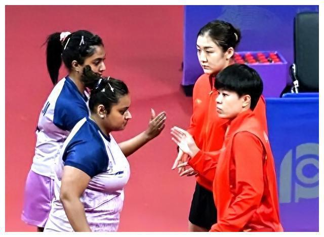
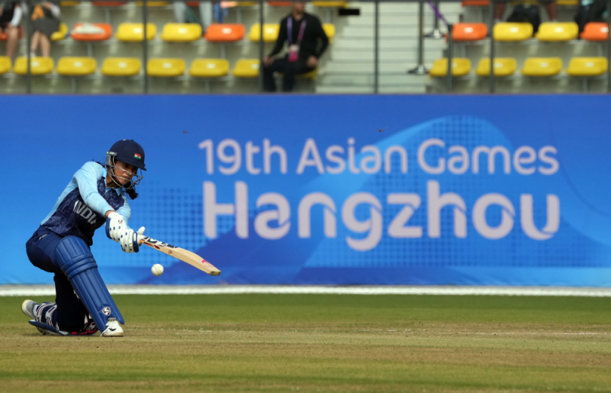
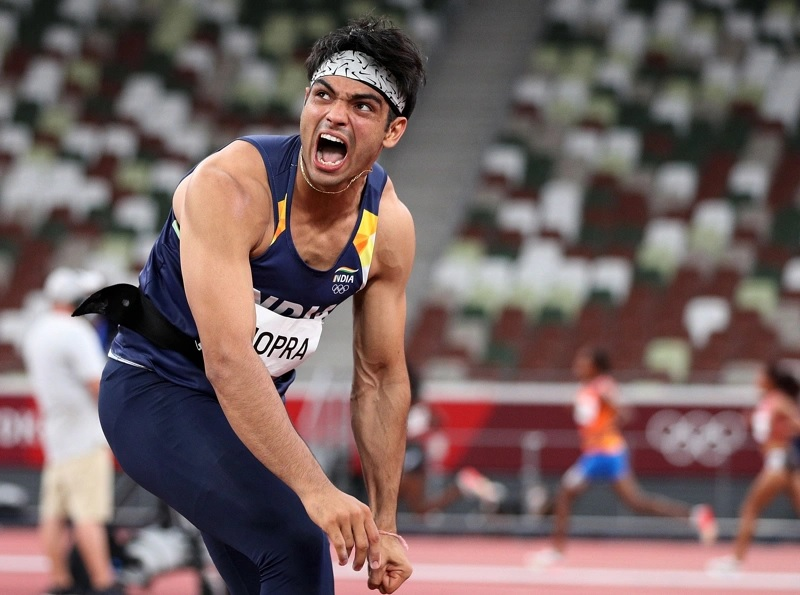
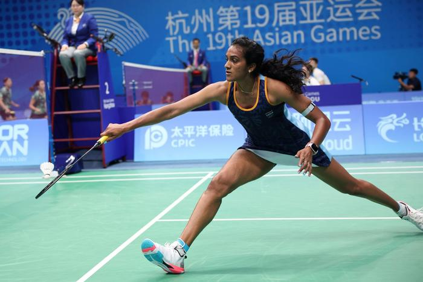
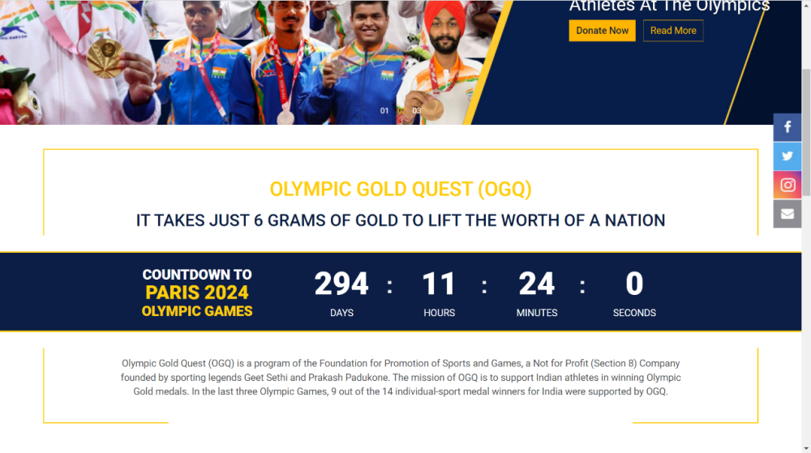
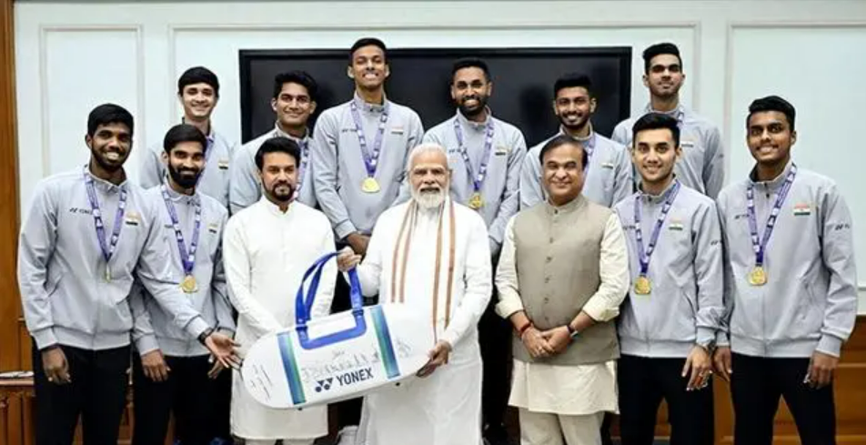
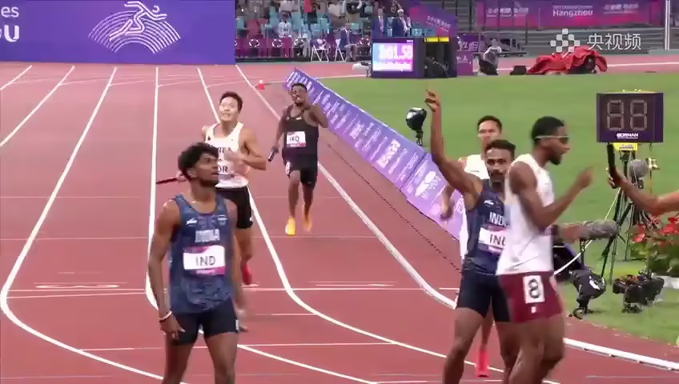

# 体谈 | 取得历史性突破的印度体育，已经成为中国队的巨大威胁

每届亚运会上，当我们习惯于中、日、韩毫无悬念地瓜分金牌榜前三把交椅，转而寻找他们之外的亚洲体育“第四极”时，印度——这个人口与我们相当的南亚邻居——似乎极少进入讨论范畴。可本届杭州亚运会，印度在倒数第二个比赛日，已经在金牌榜和奖牌榜上均稳坐第四位。甚至，中国6大传统强项，现在只有跳水和举重还没有感受到来自印度的威胁。由此，我们可以说，印度正在成为亚洲体育新崛起的第四极。

**撰文 | 于睿寅**

**编辑丨冯小**

在中国，印度给大众留下的印象如果用一个词来概括，恐怕最恰当的便是“魔幻”。杭州亚运会倒数第二个比赛日，这份“魔幻”又有了更加确凿的例子。

他们不仅在这一天，令人诧异地在羽毛球男子双打项目中，击败韩国组合斩获金牌，更有趣的是，他们凭借一场大雨，“躺赢”了印度传统优势项目板球的男子决赛。因为雨水袭来的关系，导致男子板球的决赛无法继续，最后，印度凭借板球的国际排名更高而“击败”对手，再收一枚亚运金牌。

_图说：得知结果后，印度板球男队拥抱庆祝_

印度取得板球冠军并不稀奇，可他们取得冠军的过程却令人哑然，透着一股“魔幻”的味道。可无论如何，这意味着2023年杭州的金秋，我们注定要见证印度体育史上辉煌的一笔了。

在躺赢这枚金牌后，印度体育代表团又在他们的另一个传统项目卡巴迪中击败对手。这使得印度的金牌总数在那一刻达到28枚，比排名第五的中亚新贵乌兹别克斯坦多8枚，几乎可以宣告锁定金牌榜、奖牌榜第四的交椅。

这算是印度体育连续第三年迎来的突破性狂喜，前两次分别是：2022年5月，印度男子羽毛球队首次问鼎汤姆斯杯；2021年8月，标枪选手尼拉杰·乔普拉射落东京奥运会金牌，结束了印度体育自2008年以来的奥运金牌荒……

要知道，印度男子板球队在2021年的T20板球世界杯上，赛事历史上首次输给（不限于体育意义上的）老冤家巴基斯坦队，无缘四强，是件足以让整个印度体育界蒙羞的丑事。还好，在素来以竞技体育支持者自居的纳伦德拉·莫迪担任总理的第八个年头起，印度体育开始鸿运当头，捷报频传。

对于我们中国球迷而言，最为切肤之痛的感悟，除了我们的男足、男篮与印度国家队日渐趋同地走衰，更因为在本届亚运会上，印度选手居然能在乒乓球、羽毛球等中国的传统优势项目上跟我们掰手腕，甚至把中国选手拉下马了！而更加令人侧目的是，中国6大传统强项，现在只有跳水和举重还没有感受到来自印度的威胁。

_图说：印度女子双打把中国队淘汰出局，出乎所有人意料。_

于是，像对待体育领域个别项目，乃至整体全局的“假想敌”一样，关于印度体育近些年“成功模式”的研究又被煞有见识地放到公域进行讨论。制度革新上？选材培养上？资本投入上？又或是“三十年河东，三十年河西”的玄学意义上？

但如果是摆出一套放之四海皆准的“万能话术”，我认为意义不大。这个世界人口第一（14亿）、GDP总量第五、国土面积第七的存在，任何问题都太过复杂，很难总结出一套大而化之的成功路径。不妨就个别经验由点带面，谈一谈我的思考。

_图说：印度男子、女子板球队在杭州夺金，算是捍卫了他们的传统优势项目。_

底层逆袭的体育故事？不存在的

谁在印度“玩”体育？

见证了印度商业巨头豪掷千金，买NBA球队和F1车队、打造板球足球等超级联赛的手笔，多数人都不难下结论说体育在印度是“有钱人的游戏”。

对印度的种姓制度有所耳闻但一知半解的朋友，看到更多“普通人家的孩子”参与普及化的项目，跻身奥运、亚运的夺金阵营后，难免感叹种姓上的“下沉”让印度体育有了更宽广的选材基础。

有道理吗？说对了一些，但绝大部分是想当然。

在此前许多介绍分析印度体育的文章中，我都会拿阿比纳夫·宾德拉——2008年北京奥运会男子10米气步枪金牌得主——来作为“含着金汤勺出生”的例子。宾德拉属于打不好枪，就只能回去读MBA、当CEO的幸运儿，富豪老爸甚至专门修建射击场，让他足不出户就能练枪。

也许是这个固有印象太过深入人心，所以当乔普拉时隔13年后，又为印度添上一枚奥运金牌时，他看似没那么凡尔赛的家室才显得格外令人关注。

乔普拉什么出身？他来自哈里亚纳邦，印度西北部一个面积不大的农业邦，父亲务农，母亲持家，还有两个姐妹。因为儿时过于肥胖，被父亲送去健身房锻炼，机缘巧合被标枪名宿贾维尔·乔杜里相中，才因此走上人生赢家之路的。听着像一则草根逆袭的励志故事？我再提供一个线索——乔普拉的母校叫做“达亚南德盎格鲁吠陀学校”。

_图说：东京奥运会上，为印度赢得十多年来首枚金牌的标枪名将乔普拉。_

那可能不算什么名校，但“盎格鲁”表示英国殖民时代的传统，而“吠陀”则表示与种姓和阶级挂钩的梵文经典教育。换言之，在印度能接受得起这样高阶的教育，已经足够说明其身份和社会地位了。事实上，乔普拉从族群细分上是拉其普特人，属于一种叫做贾特的副种姓，最终应该归属于刹帝利——婆罗门之下的第二高种姓。

富家公子宾德拉呢？

他属于常见于旁遮普的卡特里种姓，往大类算也是个刹帝利。换个更好理解的例子，英国首位印度裔首相里希·苏纳克，他也是出身于卡特里家庭。总结起来，时隔13年的两位印度奥运冠军，虽然看似家境不在一个等级，但就种姓而言并没有本质差异。毕竟在今日之印度，种姓是比世俗意义上的经济、职业、出身等显性因素更为根深蒂固的存在。

在本届亚运会印度体育代表团的夺金阵容中，即便是没有明确种姓归属可查的，通过其家庭出身也不难推断所属阶层。射箭比赛中夺得两金的乔蒂·苏蕾卡·文南，父亲是卡巴迪职业选手，退役后做了兽医，而她本人据记载在4岁时，就能在3个多小时内数次游泳横渡5公里宽的克里希纳河。

射击场上拿下2金1银1铜的新宠艾什瓦里·普拉塔普·辛格·托马尔，虽然和乔普拉一样也是务农家庭的拉其普特人，但稍微一查资料就发现，人家那是地主阶级。获得中国品牌赞助的羽毛球女神普萨拉·文卡塔·辛杜，父母是职业排球选手，姐姐做医生的同时又从事无挡板篮球……

_图说：辛杜是印度羽毛球队新一代的“公主”。_

种姓，把阶级限得死死的；而阶级，又决定了印度孩子自小被赋予的财力、资源、期望值，能不能支撑他们走上职业体育道路，甚至成为金字塔尖幸运的少数。虽然这似乎不仅是印度的现状，在多数仍不富庶的第三世界国家皆是如此，但至少说明带着理想甚至神话色彩的“阶级跃升”，并非助推印度体育发展更广大群体的缘由。

我们能看到的故事另一面，是4岁的印度男孩辛格48次完成马拉松，却被拒绝授予金牌、禁止参加比赛的艰辛故事。

是的，你没看错。4岁，48次马拉松。

可怜的辛格2岁时被母亲卖给街头小贩，又辗转被卖给一位体育教练。他4岁时，已经完成了令人震惊的48次马拉松比赛；5岁时，用7小时02分的成绩从普里跑到布巴内斯瓦尔，全长65公里。尽管他被誉为最年轻的马拉松运动员，但因为辛格的经历太过惨无人道，所以他的“运动生涯”被叫停。

当然，这背后是资本的逐利、身心的摧残，赛跑天才泯然众人的“伤仲永”结局也许避免了更大惨剧的发生。但比之上文那些聚光灯下的赢家，从踏上赛场开始就注定不是为自己而活的低种姓孩子，他们的故事你可能都听不到。

_图说：所谓的最年轻马拉松运动员辛格_

顶层设计or民间力量？都有贡献

在探讨别国体育事业成功时，体制问题总是国人热衷于探讨并做文章的议题，甚至将“举国体制”这一中国特色名词赋予别国模式之上，仿佛经常说得通。但要说我，世界哪个国家的体育进步能完全离开国家、高层、政策的过问和关照？如果有这些因素的深度介入便曰“举国体制”，那只能说所有国家皆在“举国”。

从务实一些的角度讨论，不妨看看印度在亚运崛起、奥运争金的过程中，官方与非官方力量各自有哪些动作。

首先不得不提的就是本世纪初创立的组织“奥运争金计划”（Olympic Gold
Quest），简称OGQ。这是一个由众多印度体育传奇人物发起的民间非盈利机构，创始人是台球选手塞提和羽毛球选手帕度柯尼，之后网球明星佩斯、国际象棋特级大师安南德等也加入其中，而如今该组织的CEO是拉斯金哈退役前是印度男子曲棍球队队长。打开该组织的官网，清晰可见距离巴黎奥运会开幕294天的倒计时，还有一句看似动员令的口号：“只需要6公斤的金子，就能提升一个国家的价值。”

_图说：“奥运争金计划”官网上，满满的荣誉感。_

OGQ的工作，简而言之就是通过自筹资金和社会捐赠，把钱花在他们认为最后希望在奥运夺金的单项上。除了冬奥、残奥和少年运动员资助项目外，OGQ一共就挑了8个大项来“押宝”——射箭、田径、羽毛球、拳击、射击、乒乓球、举重、摔跤。他们还在官方介绍中骄傲地宣称，过去3届奥运会上，印度14位站上领奖台的选手，有9位都是由OGQ资助和培养的。

都有谁呢？金牌没有，铜牌居多，拿过银牌的包括摔跤选手维贾伊·库马尔（2012年伦敦），以及上文提到的羽毛球选手辛杜（2016年里约）。这其中，辛杜因为其高曝光率，更是被OGQ作为成功的标杆对外宣传。在列出的一系列资助计划中，甚至还特意强调该组织掏钱送她的爸妈多次去现场为女儿助威，因为“这为她提供了强大的精神力量”。

虽然并未明说，但印度体育人从民间途径发起的计划，某种程度上也是对官方部门不作为的反制。但即便印度的官僚机构留给人效率低下、腐败横行的负面印象居多，但毕竟莫迪总理自己是个体育迷，而且视体育之复兴为印度影响力提升的关键抓手之一。所以，至少在明面上，印度体育官方的主管机构在莫迪任内，也并非毫无建树。

其中最让他们骄傲的，就是名叫“运动吧，印度”（Khelo India，下文简称KI）的国家体育发展计划，听着倒是颇有某写在我国热映的印度体育电影的味道。

_图说：印度电影《摔跤吧！爸爸》_

KI是在2017年，东京奥运周期内发起的，由莫迪总理亲自过问，先后两任体育部长亲自挂帅。如果说OGG的模式是押宝有望在奥运夺金的尖子选手，那KI因为有政府财政支持，得以（看似）不那么功利化地聚焦于青少年体育、校园体育、印度并不擅长的冬季项目，以及在国际受众并不算广，但自带印度传统属性的民间项目。

_图说：印度总理莫迪本人是体育迷，亲自过问了许多青少年体育项目。_

KI的成功实践，甚至还在今年被国际奥委会官网写文章大加表扬。该组织下定期举办的年度比赛，包括以印度各邦为单位参赛的U系列锦标赛，以及以各大学院校为单位参赛的，类似NCAA的大学锦标赛。在历次比赛中占据金牌榜次数最多的，正是乔普拉出身的哈里亚纳邦。此外，该组织还提供奖学金资助、体育场馆基建投资等项目。但毕竟是为金字塔筑基，还没法像OGQ那样，骄傲地把一串奥运奖牌得主的名字写上。

有效果，但能否持久，现在断言还为之尚早。但至少莫迪总理的兴致浓厚，最近还亲自启动了一个叫做“青年体育支持基金”（RFYS）的新项目，其中发展青少年足球又被放进了计划之中。莫迪兴奋地说：“把印度打造成一个多项目体育发展的国家，是我的梦想啊。”

至于为什么要再搭一套班子，而不是在原有框架内增加项目？咱也不知道，或许是印度特色。

成绩和热闹能兼得吗？看怎么定义“体育大国”了

纯从竞技体育的结果导向看，印度当然是区域性的体育大国。幅员辽阔的亚洲可分为东亚（或称东北亚）、东南亚、南亚、中亚和西亚，并分别定期举办有类似奥运会的综合性体育大赛。这其中，印度代表团在历届南亚运动会上“无敌是多么寂寞”的心情，恐怕比中国在早年的东亚运动会上更甚——再怎么鹤立鸡群，好歹日本和韩国还能稍许分几杯羹啊？

但印度在南亚体育界，真的是找不到陪玩的。很难想象，在这里地区有巴基斯坦、孟加拉国另外两个人口过亿的国家，金牌奖牌数甚至达不到印度的零头。南亚运动会迄今举办13届，印度的金牌总数（1263枚）是第二名巴基斯坦的3倍还多。最近一届，2019年在尼泊尔举办的比赛，印度拿了165枚金牌（含事后因药检因素递补的2枚）、311枚奖牌。

_图说：男子4x400米接力队在杭州夺金，印度仍是亚洲田径不容小觑的力量。_

在竞技体育资源贫瘠的南亚，印度早就“赢麻了”，和零星几个邻居的教练也颇有些“跟臭棋篓子下棋”的意味，对于他们在亚洲、世界体育版图内的提升起不到多大促进。于是，印度体育界一方面积极吸纳国内外资本，把国内一些标杆赛事做大做强，一方面又竭尽所能在国际视野中发生，积极承办大型的单项和综合性赛事——譬如2010年的新德里英联邦运动会，以及刚刚开幕、时隔十多年重回印度的板球世界杯。至于奥运申办，印度也把眼光瞄准了2036年。毕竟当下世界各国承办奥运的热情远不及往日，要是真到了奥运会“落户”印度的那一天，千万别惊讶。

印度人愿景中的“体育大国”，到底应该如何界定呢？

亚运会上已经“史无前例”（除去参赛国规模不大的前几届）地跻身金牌榜前四，且在田径、射击、摔跤、拳击、乒乓球、羽毛球等主流赛事中都有布局。另一方面，印度在两个基础项目田径和游泳上，田径在亚运会历史上夺金已破80枚，俨然是亚洲“准强队”的姿态，可游泳几乎无涉猎，“跛腿”严重。

三大球亦是在南亚称王称霸，可在亚洲赛场至多是跻身决赛圈的水准——2018年的雅加达亚运会，眼见无甚希望的印度男足甚至直接没派队参赛，而这一回在揭幕战上让中国队1-5涨了威风。

这次在杭州让我们惊出一身冷汗，也让亚洲耳目一新的印度乒乓球、羽毛球，虽然参与度广、易于推广，但在印度国内绝算不上资本的宠儿。女队的两代明星内瓦尔和辛度，以及男团决赛一度把中国队逼入绝境的男队，多数主力都出自前国手普莱勒·戈比昌德开办的学校，从最初小作坊式的经营、师傅徒弟传帮带式的传承，到之后逐渐有国际教练组合投资人的介入，才逐渐把规模做大，顶起印度羽毛球的半壁江山。但尽管如此，资本和观众趋之若鹜的，仍是那些最“热”的领域。

_图说：国王老板和女儿“掌管”萨克拉门托国王队，可印度仍是篮球运动的贫瘠之地。_

拉纳戴夫买下NBA国王队10年，连女儿阿佳丽都进了管理层，可终究没让印度球迷看到发掘出一个“印度姚明”的希望。F1的印度力量车队，如今变成了阿斯顿马丁沙特阿美高知特，满眼都是和土豪沙特国旗同款的墨绿色。

近10年中资本热捧、倾力打造的板球超级联赛（IPL）仍是全世界水平最高的赛事，而与IT行业有着天然联系的电竞虽然概念炒得火热，但印度职业选手的待遇并不佳，甚至还出现过“赔钱打比赛”的闹剧……况且所有这些，还有一个天然短板——无法为印度在奥运赛场换来一枚金牌。

莫迪宏大的印度复兴计划中“体育大国”的身份，就这样在一头热、一头冷的矛盾感中撕裂着。不过，天性易满足，甚至在部分项目中“谦虚”地喊出20年追赶中国口号的印度体育界，已经足以为这次杭州亚运会上的成功，“乐天知命”地嗨皮许久了。《三傻大闹宝莱坞》中那句颇为上头的“Aal
izz well”(一切顺利)，就挺能概括此刻的心情。

