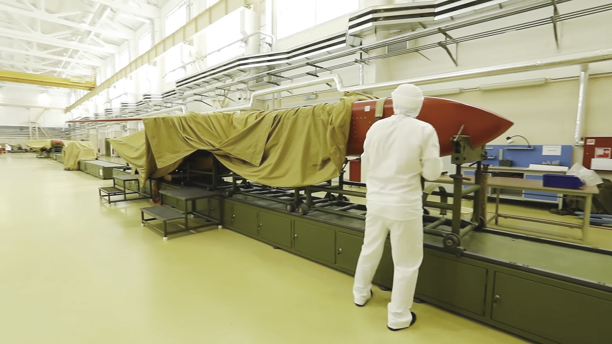
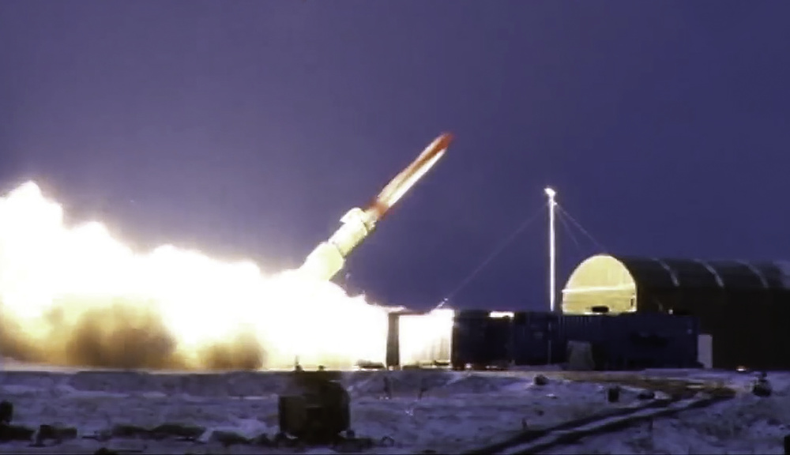
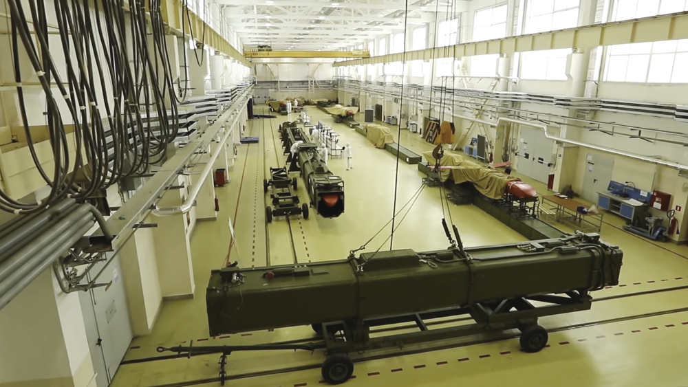

# 可打击任何美国目标？俄试射“末日武器”，美国很紧张

【环球时报特约记者 梁佳媛
柳玉鹏】编者的话：俄罗斯总统普京5日宣布，“海燕”核动力战略巡航导弹成功进行试验，其研制工作接近完成。这一表态受到国际媒体的高度关注，纷纷对“海燕”这款采用核动力装置、可携带核弹头的巡航导弹的研制进展、作战性能进行猜测。俄方表示，这款核巡航导弹可以绕过美国反导系统，打击美国本土，对北约构成重大威慑。有分析认为，该武器体现出俄罗斯在战略武器研制方面的创新意识。

 _“海燕”核巡航导弹_

**普京宣布俄成功试射“海燕”**

据俄新社6日报道，俄总统普京5日在“瓦尔代”国际辩论俱乐部第二十届年会上发表讲话称：“我们现在几乎完成了我几年前宣布的现代战略武器研发工作。‘海燕’是一款带有核动力装置的全球远程巡航导弹，最近成功进行了一次试验。同时，我们实际上已经完成‘萨尔马特’超重型导弹的试验工作，将于近期投入作战值班。我们只需要简单地在行政上完成某些程序，开始大规模生产，并将其投入战斗值班。我们将很快做到这一点。”

西方媒体广泛报道了普京的这一表态。美国有线电视新闻网当地时间5日称，普京于2018年3月宣布“海燕”导弹的研制计划，作为开发新一代洲际导弹和高超音速导弹的更广泛计划的一部分，其中包括“匕首”导弹和“先锋”高超音速滑翔飞行器。

在普京表态前，西方媒体就猜测俄罗斯将进行“海燕”导弹试射，或已于近期完成。美国《纽约时报》网站2日的文章称，卫星图像和航空数据表明，俄罗斯可能将测试一枚理论射程达到数千英里的试验性核动力巡航导弹，或最近可能已经测试了一枚。报道称，俄罗斯靠近北极的偏远地区基地及其附近的飞机和车辆的活动与2017年和2018年为测试“海燕”核动力巡航导弹（北约代号SSC-X-9“天坠”）时所做的准备工作一致。

_俄方此前发布的导弹试射画面。_

报道称，9月20日上午拍摄的卫星图像显示，俄方基地发射台周边有许多车辆，其中包括一辆卡车，其拖车似乎与该导弹的尺寸相对应，通常用来覆盖发射台的遮雨棚已移动约50英尺。当天下午，拖车已经不见。9月28日拍摄的其他卫星图像显示，发射台上的准备工作再次忙碌起来，出现了一辆类似拖车，遮雨棚再次被拉开。美媒称，其他的情报也支撑了这一判断。俄罗斯的航空通报警告飞行员避开附近空域。此外，两架专门用于收集导弹发射数据的俄罗斯飞机停靠在发射场以南100英里的机场。而且，过去两周美国侦察机也在该地区被追踪到。

不过，普京透露最新试射前，他的发言人驳斥了《纽约时报》有关俄罗斯即将测试“海燕”导弹的说法。

美国“动力”网站“战区”栏目5日的文章称，普京没有透露最新一次试射是在何时何地进行的。然而，有多种迹象表明，可能是在北冰洋新地岛的潘科沃试验场。潘科沃是俄罗斯过去进行该型导弹测试的至少两个地点之一。2017年至2018年间，俄方在那里至少进行了4次导弹测试。相关测试此前也在俄罗斯阿尔汉格尔斯克地区进行过。

**可打击任何美国目标**

西方媒体之所以高度关注这款核巡航导弹，一个重要原因在于它的工作原理独树一帜。俄媒体称，这种导弹无法被拦截。

据路透社6日报道，“海燕”是一种地面发射、低空飞行的巡航导弹，不仅能够携带核弹头，而且是核动力的。普京于2018年3月首次透露该项目的进展。传统的涡轮喷气发动机或涡轮风扇发动机受到燃料量的限制，而核动力装置使导弹的射程远得多。国际战略研究所2021年援引俄罗斯专业军事期刊的话说，“海燕”的理论射程可达2万公里，因此可以部署在俄罗斯任何地方打击美国目标。该杂志称，该导弹的理论飞行高度仅为50-100米，远低于常规动力巡航导弹，这将使防空雷达更难以探测到。美国空军国家空天情报中心2020年的一份报告称，如果俄罗斯成功将“海燕”投入使用，它将为莫斯科提供一种“具有洲际射程的独特武器”。

_“海燕”核巡航导弹的组装厂房_

非营利安全组织“核威胁倡议”表示，如果需要的话，“海燕”的核动力装置可以使其在高空停留数天。“海燕”将携带核弹头（或多个弹头）在低空环绕地球，避开导弹防御系统并躲避地形障碍，然后将弹头投掷到难以预测的位置（或多个位置）。

据俄罗斯NTV电视台6日报道，“海燕”的长度约为9米，导弹使用固体燃料发动机发射升空，然后微型核反应堆开始工作。另一个版本是：它使用核反应堆加热空气，然后进入冲压喷气发动机工作状态。空气也用于冷却小型反应堆。这就是为什么“海燕”在美国报纸上被称为“飞行的切尔诺贝利”。俄新社6日称，所有现有和未来的反导和防空系统都无法拦截这种低空飞行的隐形巡航导弹。

不过，这种导弹的核推进装置的研制一直面临巨大的技术挑战，之前疑似发生多次试验失败。《纽约时报》网站称，“核威胁倡议”组织的一份报告认为，俄罗斯在2017年至2019年间进行了
13次已知试验，但均未成功。

“海燕”和其他新的俄罗斯战略系统的发展，可能会使俄美之间关于限制双方可部署核武器数量的《新削减战略武器条约》续签的谈判复杂化。《纽约时报》表示，如果投入使用，“海燕”将被视为俄核武库的一部分。由于俄美签署的《新削减战略武器条约》将于2026年2月到期，该条约限制双方可以部署的弹头和运载工具的总数，如果没有续签新条约，“海燕”核巡航导弹可能会引发“失控的军备竞赛”。

**二次核打击利器**

对于“海燕”核巡航导弹，俄罗斯和西方专家都认为是一种二次核打击力量。“核威胁倡议”组织的报告称，该导弹是一种“二次打击战略远程武器”，目的是在西方先发制人的核打击摧毁俄罗斯目标后发射。该导弹可以携带常规弹头，但实际上可能会携带核弹头，尽管比大多数俄罗斯核武器要小。专家表示，如果在战时使用，这种导弹有可能摧毁大城市地区和军事目标。据俄罗斯news.ru网站5日报道，俄军事专家阿列克谢·列昂科夫称，配备核动力的无限射程巡航导弹“海燕”是一款让对手恐惧的报复武器。“海燕”的任务是摧毁敌方民用和军事基础设施。这款巡航导弹能够绕过所有防空和导弹防御区。他称，“海燕”可以与“波塞冬”核鱼雷配合使用，前者可瞄准陆地目标，后者可瞄准沿海岸的目标。预计，“海燕”可携带一个大约100千吨当量的核弹头。

据今日俄罗斯电视台6日报道，俄军事专家阿列克谢·苏孔金表示，“海燕”核动力导弹由于射程无限，不需要飞机或潜艇等运载工具携带，要么安装在发射井中，要么安装在移动装置上，以增强导弹的抗打击力。这款导弹将补充俄罗斯的三位一体核力量。俄军事观察员维克托·利特金表示，“萨尔马特”和“海燕”将很快投入值班。

中国军事专家张学峰认为，目前关于“海燕”的性能，外界有很多说法，不排除有夸大成分。例如有媒体称，“海燕”可能是高超音速的，飞行速度高达19.6马赫。还有媒体称，“海燕”在待机模式下可以在大气中飞行数月，导弹将在战斗区盘旋，一旦获得目标信息，“海燕”将飞向目标。从目前的技术情况来看，很难达到如此高的速度和续航时间。但毫无疑问，“海燕”是俄罗斯在战略核武器领域的一项重大创新，和“波塞冬”核鱼雷相似，它体现出俄罗斯武器发展的创新意识，这延续了苏联时代的武器发展理念。

张学峰表示，“海燕”的主要优势是通过超低空飞行，绕过美国针对在高空飞行的弹道导弹的反导系统，在防空部署薄弱的地方发起意想不到的核攻击。它比较适合对美国这样的国家进行核打击，因为美国本土对超低空目标的防护并不是那么完善，漏洞较多。但对于防空系统部署密度较大的区域，这款导弹的突防能力并不比现有的巡航导弹更强。所以这种武器是对俄军战略威慑手段的丰富，未来仍然会配合其他威慑手段使用。

