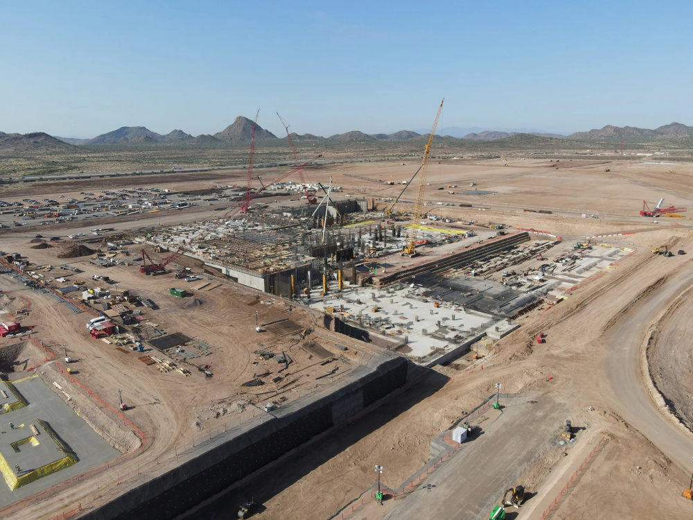
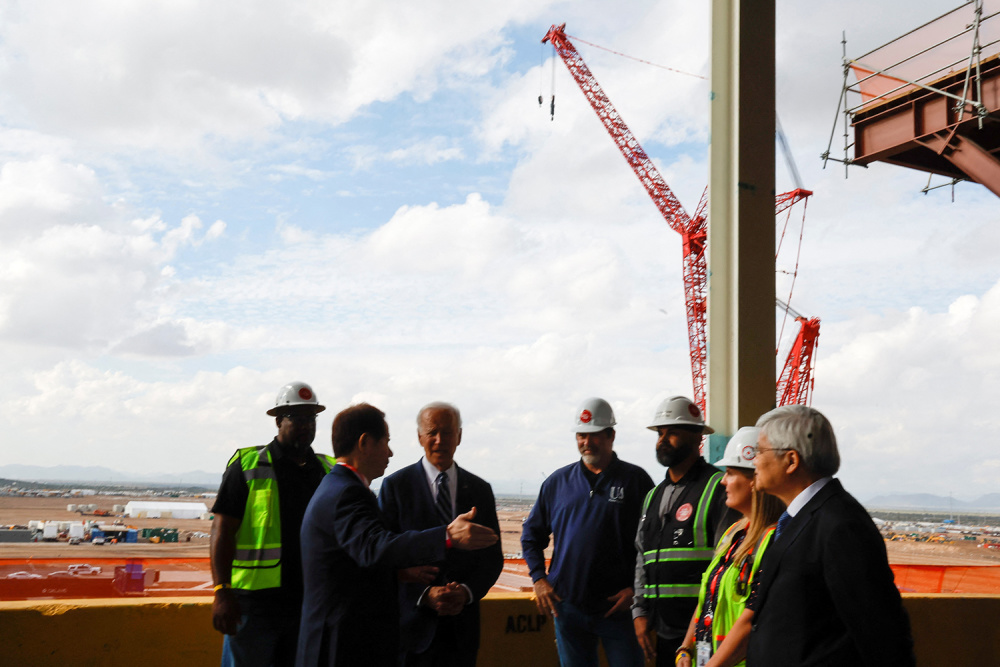

# 台积电在美建厂项目遭遇阻碍：施工和劳动力等方面遭遇“水土不服”

【文/观察者网 熊超然】距离去年12月台积电赴美国设厂所举行的设备迁入仪式已过去近一年时间，但如今来看，这一计划却远远没有想象中的那么顺利。

当地时间10月5日，英国《金融时报》发布一篇长文报道指出，台积电目前在施工和劳动力方面遭遇了“文化上的水土不服”，导致其在亚利桑那州的项目受阻。事到如今，这些艰难挑战已经威胁到这家半导体龙头企业的项目时间表，乃至其雄心壮志。

报道称，台积电一直在试图努力应对美国当地的施工和劳动力方式，但美国芯片行业分析师迪伦·帕特尔（Dylan
Patel）坦言，“台积电没有完全理解这种文化”。更麻烦的是，台积电在每个不同的新地点建厂，所遇到的挑战都会不同，对于已在日本建厂和准备在德国建厂的台积电来说，在美国所遇到的困难才刚刚开始。

 _台积电在美国亚利桑那州凤凰城所建工厂_

《金融时报》在文章开头就毫不讳言地指出，台积电掌握着目前全球最先进的芯片生产技术，并控制着全球最先进定制芯片高达90%的市场份额。然而，对于这家半导体巨头而言，其在美国亚利桑那州凤凰城耗资400亿美元建设的两座晶圆厂，却给公司自身带来了“文化冲击”，让公司及其员工都“如履薄冰”。

今年9月，台积电董事长刘德音曾称，亚利桑那州的项目是台积电首次尝试在海外建造大型工厂，“这当然是一个学习的过程”。

报道称，到目前为止，台积电只在台湾岛内的大型工厂生产最先进的芯片，这意味着，当地研发人员会立即介入并解决任何问题，供应商也紧密聚集在一起，几十年来一直参与公司晶圆厂建设的服务提供商同样会对公司的每一个“突发情况”做出回应。这种运转模式，使得台积电的盈利能力高于其他大多数公司。

然而，如今看来，台积电在美国建厂的“麻烦事”不少。

据报道，台积电目前已在亚利桑那州启动第二阶段的工程，并已取得足够再进行四个阶段的土地扩张，但此消息尚未公开并确定。然而，几名台积电供应商高管却表示，他们不相信台积电会完成全部六个阶段的建设工作。

事实上，建厂的第一阶段就充满挑战。《金融时报》称，台积电在工程发包方式上引发了许多摩擦，导致了延误，美国和台湾岛内的方式明显不同，拿台湾本土的方式到美国来，就会出现沟通不畅的情况。

而最近，台积电则一直难以找到足够多的熟练工来安装关键先进的机器。今年6月，台积电从台湾增派了500名专家赴美协助这一阶段的工作，而一些行业专家表示，美国在极紫外（EUV）光刻机方面，的确缺少专业知识，除英特尔公司在俄勒冈州的技术开发中心之外，美国还没有工厂安装过EUV。

远不止这些，一些行业高管和分析师还认为，台积电面临的真正挑战，将是如何像在台湾的工厂一样，高效地运营美国的新工厂。

特别是在劳动力方面，行业专家警告称，台积电给予台湾晶圆厂工人的灵活性，将很难通过美国劳动力复制。台湾的技术人员通常已经完成了四年的工程学院训练，但美国的工学院毕业生拥有更高薪的工作机会。据报道，台积电在亚利桑那州的两座工厂计划雇佣4500名员工，现已雇佣2200多人，但几乎一半来自台湾。

 _2022年12月6日，美国亚利桑那州，美国总统拜登参观台积电亚利桑那州工厂，并发表讲话。 图自IC Photo_

作为所谓“拜登经济学”（Bidenomics）的一部分，拜登政府一直试图通过发放数十亿美元的补贴和税收减免，将就业岗位带回美国，尤其是在半导体等高科技制造业。

2020年，台积电承诺在美国亚利桑那州凤凰城投资120亿美元建厂，目标是到2024年底在美国本土生产高端半导体。此后，台积电更是“加码”，宣布将原计划的120亿美元投资额增加两倍以上，达400亿美元，其在凤凰城建造的两座工厂，分别计划于2024年和2026年投资生产4纳米和3纳米芯片。据报道，这不仅是台积电在台湾地区以外的最大投资项目，同时也是美国历史上最大的境外直接投资之一。

然而，今年7月20日，台积电董事长刘德音在第二季度财报会议上表示，今年的销售额可能下降10%，计划中的亚利桑那州工厂将无法实现明年开始量产的目标。刘德音还称，由于美国当地熟练工人短缺，公司可能不得不从台湾地区临时调入有经验的技术人员，这将使第一家工厂开始量产的时间推迟到2025年。

此前，台积电已宣布在美国和日本建厂，此后，又传出了台积电决定将在德国德累斯顿建厂的消息。《金融时报》援引分析人士指出，台积电在每个不同的新地点建厂，所遇到的挑战都会不同。

比如，在日本建厂看起来比在美国建厂更为顺利，此前曾曝出消息称，台积电目前越来越看好在日本建立生产基地，尤其是因为当地工作文化相近，觉得日本工人更愿意加班。

分析人士表示，由于日本和德国的晶圆厂将使用比美国工厂更成熟的技术，因此建设过程和初始生产带来的挑战应该更少。“但我怀疑，德国在劳工问题上会更加困难。”贝恩策略顾问公司（Bain）的半导体专家彼得·汉伯利（Peter
Hanbury）这样认为。

《金融时报》此前也报道称，对于台积电可能在德国德累斯顿设厂，当地业界忧心劳工将面临短缺，当地的反移民声浪也不利于吸引外来人才。

在德累斯顿所在的萨克森州，该州经济厅厅长马丁·杜利希（Martin Dulig）坦言：
“我们的投资将创造5000至8000个额外的就业机会，不过，德国面临严重的技能短缺和人口老化问题。工作适龄人口将在未来10年内减少20万。”而台积电董事长刘德音此前也表示，“（德国当地）人才供应确实有些差距”。

**本文系观察者网独家稿件，未经授权，不得转载。**

