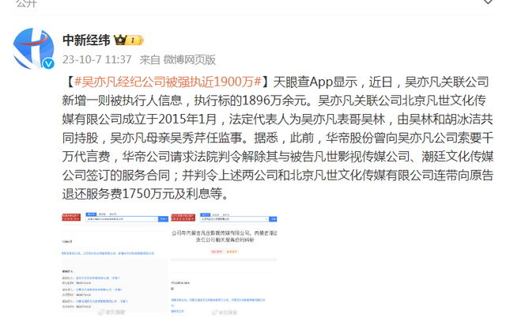
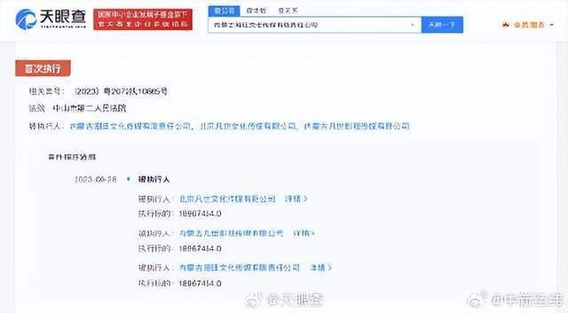
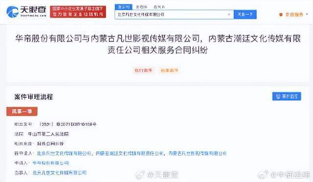

# 吴亦凡经纪公司被强执近1900万

天眼查App显示，近日，吴亦凡关联公司新增一则被执行人信息，执行标的1896万余元。吴亦凡关联公司北京凡世文化传媒有限公司成立于2015年1月，法定代表人为吴亦凡表哥吴林，由吴林和胡冰洁共同持股，吴亦凡母亲吴秀芹任监事。据悉，此前，华帝股份曾向吴亦凡公司索要千万代言费，华帝公司请求法院判令解除其与被告凡世影视传媒公司、潮廷文化传媒公司签订的服务合同；并判令上述两公司和北京凡世文化传媒有限公司连带向原告退还服务费1750万元及利息等。

来源：@中新经纬

