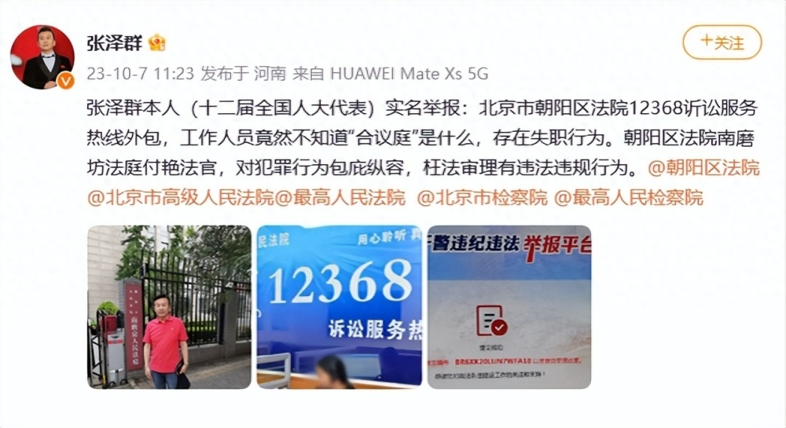
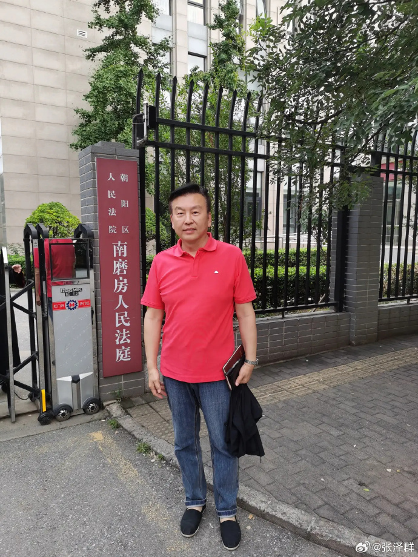
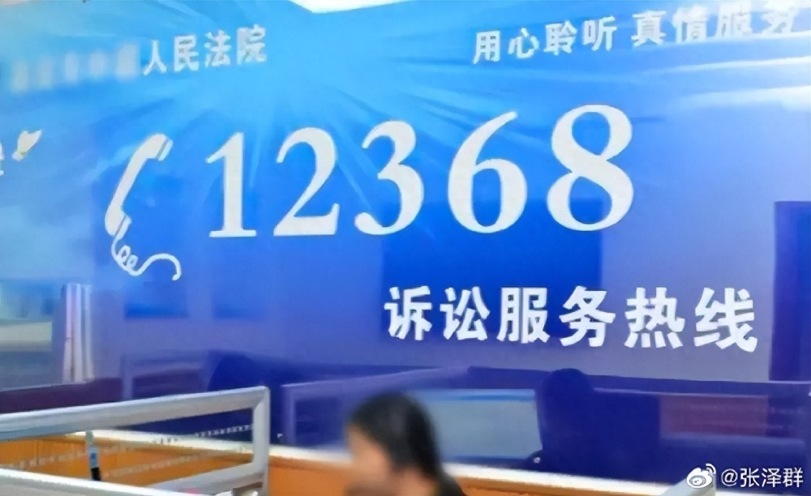
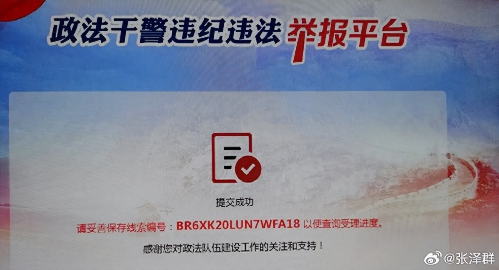
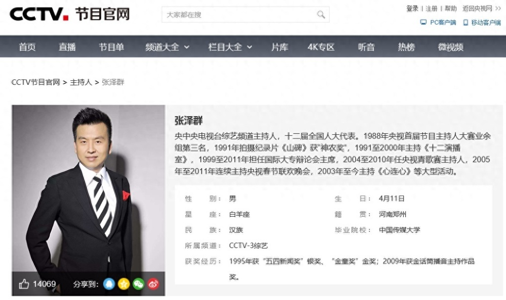

# 央视主持人张泽群实名举报北京朝阳区法院：诉讼服务热线外包失职

10月7日，知名主持人张泽群发微博称实名举报北京市朝阳区法院12368诉讼服务热线外包。

张泽群写道：“张泽群本人（十二届全国人大代表）实名举报：北京市朝阳区法院12368诉讼服务热线外包，工作人员竟然不知道“合议庭”是什么，存在失职行为。朝阳区法院南磨坊法庭付艳法官，对犯罪行为包庇纵容，枉法审理有违法违规行为。@朝阳区法院
@北京市高级人民法院@最高人民法院 @北京市检察院 @最高人民检察院 ​​”

他还晒出在法院门口的照片和相关举报平台的截图，透露显示“提交成功”。

据CCTV官网显示，张泽群是央中央电视台综艺频道主持人，十二届全国人大代表。1988年央视首届节目主持人大赛业余组第三名，1991年拍摄纪录片《山碑》获“神农奖”，1991至2000年主持《十二演播室》，1999至2011年担任国际大专辩论会主席，2004至2010年任央视青歌赛主持人，2005年至2011年连续主持央视春节联欢晚会，2003年至今主持《心连心》等大型活动。

**【来源：九派新闻综合当事人账号、CCTV官网】**

