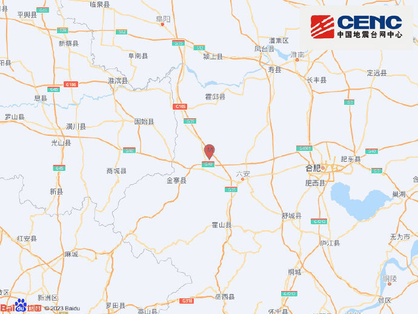

# 安徽六安市裕安区发生3.3级地震，震源深度15千米

据@中国地震台网速报，中国地震台网正式测定：10月07日21时21分在安徽六安市裕安区（北纬31.91度，东经116.23度）发生3.3级地震，震源深度15千米。

（来源：@中国地震台网）

**更多精彩资讯请在应用市场下载“极目新闻”客户端，未经授权请勿转载，欢迎提供新闻线索，一经采纳即付报酬。24小时报料热线027-86777777。**

